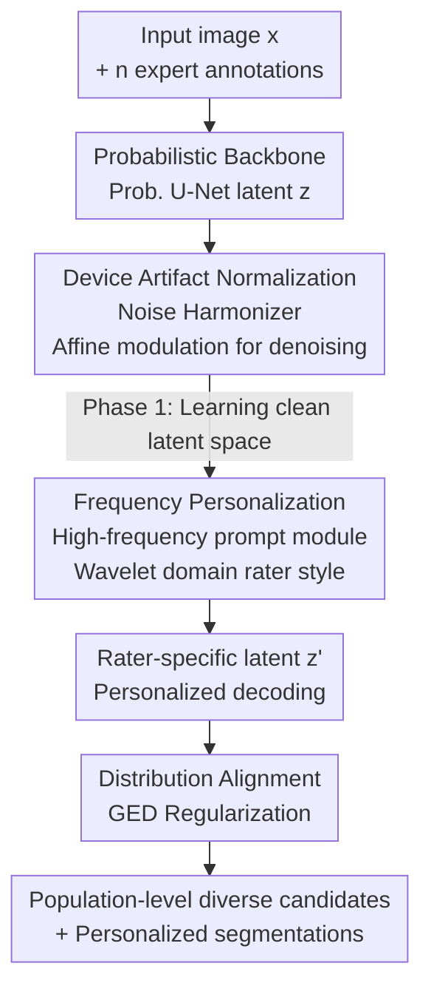

# Harmonized Feature Conditioning and Frequency-Prompt Personalization for Multi-Rater Medical Segmentation

**Conference**: CVPR 2026  
**arXiv**: [2605.08210](https://arxiv.org/abs/2605.08210)  
**Code**: GitHub (Mentioned in the original text, link not provided)  
**Area**: Medical Imaging / Probabilistic Segmentation / Multi-Rater Modeling  
**Keywords**: Multi-rater segmentation, device artifact decoupling, frequency-domain personalization, GED regularization, uncertainty calibration

## TL;DR
Addressing the issue that "different doctors draw different contours for the same lesion," this paper employs a lightweight Harmonizer network to first "remove" scanning device noise/artifacts from features. It then uses a high-frequency prompt module in the wavelet frequency domain to capture the stylistic preferences of each doctor. Finally, it employs GED regularization to align the model’s predicted distribution with the ground truth annotation distribution, achieving superior population-level diversity and personalized segmentation on LIDC-IDRI and NPC-170 (GED 0.1048 vs. D-Persona 0.1358).

## Background & Motivation
**Background**: In medical image segmentation, a single scan is often outlined by multiple experts (multi-rater). Due to inherent ambiguity in lesion boundaries and differences in expert training and judgment, these annotations are naturally inconsistent. Mainstream approaches fall into three categories: ① Label fusion (Majority Voting, STAPLE) which compresses multiple annotations into a single consensus ground truth; ② Diversity preservation (Probabilistic U-Net, PHiSeg, Diffusion models) which models $p(y\mid x)$ to generate a set of plausible candidates; ③ Personalization (D-Persona, DiffOSeg) which learns a specific prediction for each expert.

**Limitations of Prior Work**: ① Fusion methods discard the highly valuable information of "expert disagreement," forcing models toward overconfident and poorly calibrated labels; ② Existing probabilistic/personalization methods operate almost entirely in the **spatial domain**, where scanning device noise, acquisition artifacts, and varying annotation quality are entangled in the latent space. This mixes "clinically meaningful uncertainty" with "meaningless device-induced perturbations," leading to poor cross-device generalization and distorted uncertainty.

**Key Challenge**: The "ambiguity" faced by models has **two sources**: data-level noise (scanner/acquisition heterogeneity) and rater-level differences (subjective diagnostic style). Existing methods do not distinguish between these, causing device noise to be erroneously modeled as anatomical uncertainty.

**Goal**: To **explicitly decouple** these two types of ambiguity within a unified probabilistic framework: first standardizing away device artifacts, then separately modeling rater styles, and finally aligning the predicted distribution with the real annotation distribution.

**Key Insight**: The authors observe that stylistic differences between raters (boundary sharpness, texture sensitivity, lesion extent) are primarily reflected in **high-frequency components**, while device artifacts are lower-level perturbations that need to be normalized. Therefore, a natural division of labor is "denoising normalization via affine modulation followed by personalization in the high-frequency domain."

**Core Idea**: A trio of components consisting of a Noise Harmonizer (device artifact normalization), a High-frequency Prompt Module (frequency-domain personalization), and GED Regularization (distribution alignment) is used to handle "device noise" and "rater style" separately.

## Method

### Overall Architecture
The method is built on a Probabilistic U-Net backbone: given an input image $x$ and its $n$ expert annotations $\mathcal{A}=\{A^{(1)},\dots,A^{(n)}\}$, the goal is to learn the conditional distribution $p_\theta(y\mid x)=\int p_\theta(y\mid x,z)\,p_\theta(z\mid x)\,\mathrm{d}z$, where $z$ is a low-dimensional latent variable sampled via reparameterization $z=\mu+\sigma\odot\epsilon$. The encoder extracts features $f$, the prior/posterior networks provide Gaussian parameters, and the decoder consumes $(f,z)$ to produce segmentations.

Two collaborative modules are inserted into this backbone: the **Noise Harmonizer** performs data-driven affine modulation on decoder features across scales to "wash away" device artifacts, producing stable latent codes invariant to the scanner. The **Personalization Module** takes the normalized features into the wavelet frequency domain, uses high-frequency prompts to encode each doctor's style, and modulates rater-specific latent vectors $z'$. Training occurs in two phases: Phase 1 trains only the backbone and Harmonizer (learning a clean latent space), and Phase 2 freezes the backbone to train only the personalization module (learning rater styles). The entire process is guided by GED regularization to pull the predicted distribution toward the real annotation distribution.

### Key Designs

**1. Noise Harmonizer: Data-driven feature normalization using learnable artifact tokens to strip device noise from anatomical uncertainty**

The limitation is straightforward: intensity drifts, motion artifacts, and domain biases from scanners propagate through features into the latent space, causing the model to mistake "device-induced perturbations" for "anatomical ambiguity." The Harmonizer $\mathcal{H}_\phi^{(n)}$ predicts a set of affine parameters $(\gamma_l,\beta_l)$ for the decoded features $f_l$ at each layer, performing modulation as $\tilde f_l=\gamma_l\odot f_l+\beta_l$. Crucially, these parameters are derived by maintaining a learnable "artifact token bank" $t=\{t_1,\dots,t_M\}$ representing typical noise patterns. Cross-attention is performed with tokens as queries and features as keys/values $f'_l=\mathrm{Softmax}(Q_jK_j^\top/\sqrt{D_h})V_j$, followed by GAP and a two-layer MLP to output $(\gamma_l,\beta_l)$. This acts as a **conditional, input-adaptive normalization layer**: it dynamically suppresses intensity drifts and domain biases without prior knowledge of the noise distribution. **Weight sharing** across layers provides cross-scale regularization, ensuring consistent denoising behavior. Effectively, $(\gamma_l,\beta_l)$ implicitly encodes the "acquisition conditions," guiding the network to produce latent codes $z$ that are device-invariant yet expressive of structural uncertainty.

**2. High-frequency Prompt Module: Encoding rater boundary/texture styles using learnable prompts in the wavelet domain**

Once device noise is removed, how should "rater style" be modeled? The authors hypothesize that stylistic differences (edge depiction, texture sensitivity, lesion extent) are primarily hidden in **high frequencies**. The module first linearly reduces feature dimensions to $D/4$, then uses Haar Discrete Wavelet Transform (DWT) to decompose them into four sub-bands $[X_{LL},X_{LH},X_{HL},X_{HH}]$: $X_{LL}$ captures structural contours, while the three high-frequency sub-bands form $X_H$ (containing texture/edge details where expert interpretations vary most). The module prepares $N$ prompt components $P_c$ representing potential annotation preferences, modulated by learnable weights $c_i$. Adaptive weight vectors $\mathbf{w}=\mathrm{Softmax}(\mathrm{PWC}(X_H))$ are derived from $X_H$ to synthesize context-aware prompts $P=\mathrm{Conv}_{3\times3}(\sum_c \mathbf{w}(c_i(P_c)))$. These prompts interact with high-frequency features via Large Kernel Attention $X'_H=\mathrm{Conv}_{1\times1}(\mathrm{Attention}(X_H,P))$, aligning image textures with inferred expert preferences. Finally, $M_z$ samples are drawn from a fixed prior to form a "prior memory bank" $\mathbf{Z}^{\text{prior}}_{\text{bank}}$. Cross-attention is performed with local features $X_d$ as queries and the bank as keys/values, followed by IDWT to reconstruct the full spectrum and fuse into the rater-specific latent code $z'$. Because this module is extremely lightweight (only 0.07 M parameters), it can synthesize expert-specific segmentations **without retraining or duplicating the backbone**, making it naturally suitable for semi-supervised or few-shot personalization.

**3. GED Regularization: Directly encoding "where to diversify and where to converge" into the loss**

Personalization alone is insufficient—the set of candidates generated by the model must statistically "resemble" the real set of expert annotations. The authors formalize segmentation as the alignment of two conditional distributions: matching the model distribution $\mathcal{P}(y\mid x)$ to the empirical annotation distribution $\mathcal{A}(y\mid x)$ using the Generalized Energy Distance:

$$\mathcal{L}_{\text{GED}}=\frac{2}{KN}\sum_{k=1}^{K}\sum_{i=1}^{N}d(P_k,A_i)-\frac{2}{K(K-1)}\sum_{1\le k<k'\le K}d(P_k,P_{k'})$$

where $d=1-\mathrm{IoU}$, $\{P_k\}$ are $K$ samples from the model, and $\{A_i\}$ are $n$ expert annotations. The first term (fidelity) pulls the predicted distribution toward the annotation manifold, while the second term (diversity) penalizes excessive similarity between samples, preventing the model from collapsing into a single consensus mask. The beauty of this term is that it makes "diversity at high-disagreement boundaries and convergence at consensus regions" a direct optimization goal rather than relying on post-processing.

### Loss & Training
The total objective $\mathcal{L}_{\text{total}}$ consists of four parts: a segmentation reconstruction term (Dice + Cross-entropy), KL divergence regularization, a Harmonizer penalty term $\lambda_{\text{harm}}\sum_l(\|\gamma_l-1\|_2^2+\|\beta_l\|_2^2)$ (pulling affine parameters toward identity mapping to prevent over-modulation), and the GED distribution alignment term $\lambda_{\text{GED}}\mathcal{L}_{\text{GED}}$. Training is split into two phases: **Phase 1** (100 epochs, Adam, lr 1e-4, latent dim $D=6$, memory bank $M=100$) excludes the personalization head to train only the backbone + Harmonizer, learning artifact-invariant, anatomically consistent latent features; **Phase 2** (150 epochs, lr reduced to 5e-5) freezes the encoder/decoder/Harmonizer and trains only the personalization module to align frequency-domain adaptations with individual doctor styles. The full model has 30.31 M parameters (Backbone 30.11 M + Harmonizer 0.14 M + Personalization 0.07 M), running on a single RTX 3090 with inference at approx. 0.42 s/pass.

## Key Experimental Results

### Main Results

Datasets: LIDC-IDRI (Lung nodules in chest CT, up to 4 radiologists, 1,609 slices/214 patients) and NPC-170 (Multi-modal MRI for Nasopharyngeal Carcinoma, 4 oncologists labeling GTVp, 100/20/50 split).

**Distribution Fitting and Sampling Diversity (Phase 1 / Table 1)**, with sample count $K=50$:

| Dataset | Method | GED↓ | Dice_soft↑ | Dice_max↑ | Dice_match↑ |
|--------|------|------|-----------|-----------|------------|
| LIDC-IDRI | Prob. U-Net (#50) | 0.2168 | 88.80 | 88.87 | 88.81 |
| LIDC-IDRI | D-Persona (#50) | 0.1358 | 90.45 | 91.37 | 91.33 |
| LIDC-IDRI | **Ours (#50)** | **0.1048** | **91.81** | **92.28** | **91.94** |
| NPC-170 | Prob. U-Net (#50) | 0.3528 | 81.19 | 84.19 | 80.13 |
| NPC-170 | D-Persona (#50) | 0.1978 | 84.01 | 82.79 | 81.69 |
| NPC-170 | **Ours (#50)** | **0.1758** | **84.83** | 82.26 | **82.65** |

GED is significantly lower (0.1048 vs. D-Persona 0.1358 on LIDC; 0.1758 vs. 0.1978 on NPC). As $K$ increases from 10 to 50, GED decreases monotonically while Dice_soft increases, indicating the model systematically expands coverage of plausible annotations without "over-diverging."

**Personalized Segmentation (Phase 2 / Tables 2-3)**:

| Dataset | Method | GED↓ | Dice_max↑ | Dice_match↑ | Dice_mean↑ |
|--------|------|------|-----------|-------------|------------|
| LIDC-IDRI | Pionono | 0.1502 | 90.10 | 88.97 | 88.84 |
| LIDC-IDRI | D-Persona | 0.1444 | 90.38 | 89.17 | 89.17 |
| LIDC-IDRI | **Ours** | **0.1419** | **92.65** | **90.00** | **90.78** |
| NPC-170 | D-Persona | 0.2970 | 81.60 | 80.50 | 80.40 |
| NPC-170 | **Ours** | **0.2685** | **84.46** | **81.63** | **81.63** |

On LIDC, Dice_mean is approx. +1.61 pp higher than D-Persona. On the more challenging multi-modal NPC-170 dataset, the model still outperforms transformer-based TAB and probabilistic Pionono with a mean Dice of 81.63%, even amidst significant inter-rater disagreement.

### Ablation Study

The full ablation table is in the supplementary material; observations from the main text are summarized below:

| Configuration | Key Observation | Description |
|------|---------|------|
| Full (Harmonizer + Freq. Prompt + GED) | LIDC GED 0.1048 / NPC 0.1758 | Full model, best performance |
| Phase 1 Only (Harmonizer + GED, no personalization) | Already exceeds D-Persona in distribution fitting | Denoising + GED contributes major alignment gains |
| Single U-Net per rater | Peaks only on its own rater; significant drop on others | Lacks distribution coverage; requires one network per doctor |
| Prob. U-Net Baseline | GED 0.2168 / 0.3528 | Poor latent calibration; tends to generate redundant hypotheses |

### Key Findings
- **Denoising must precede personalization**: Unlike D-Persona, which conditions expert prompts on spatial features containing residual acquisition noise, this method harmonizes first and then personalizes in the frequency domain. This results in a narrow gap between Dice_max and Dice_match—indicating each personalized prediction is truly "tailored for the doctor" rather than a lucky random sample.
- **Clinically meaningful uncertainty**: Confidence increases in regions of expert consensus and decreases in ambiguous areas, concentrating uncertainty at clinically valid boundaries.
- **Extremely lightweight**: The Harmonizer and personalization module combined add only 0.21 M parameters (0.7% of the total model), yet provide cross-device stability and suit semi-supervised scenarios.
- **Multimodal challenges**: On NPC-170 (T1/T2/T1c multimodal), while Dice_max does not lead across all baselines, GED and Dice_match/mean are optimal, suggesting the advantage stems from distribution alignment rather than peak single-point performance.

## Highlights & Insights
- **Explicit decoupling of "two types of ambiguity"**: Splitting multi-rater uncertainty into "device noise" and "rater style" is the core framing. It explains why pure spatial methods fail and directly guides the modular design.
- **Frequency domain as a style carrier**: Using Haar wavelets to isolate high frequencies (textures/edges) for personalization avoids disturbing low-frequency structural contours. This "what to do in which frequency band" approach is transferable to other tasks requiring structure preservation during style adjustment.
- **Learnable artifact tokens + attention for affine parameters**: Upgrading FiLM-style modulation to conditional normalization using noise prototypes as queries is a clever denoising design reusable in other medical tasks plagued by acquisition heterogeneity.
- **GED as loss, not just a metric**: Directly optimizing "where to be diverse and where to converge" is more controllable than implicit control via latent priors.

## Limitations & Future Work
- Detailed ablation and robustness (noise/blur) experiments are in the supplementary material, making it difficult to judge individual marginal contributions from the main text.
- The assumption that "high frequency = rater style" is strong. It is uncertain if frequency personalization remains optimal for scenarios where style differences exist in large-scale structural extents (e.g., drawing much larger/smaller circles).
- Two-phase training with a frozen backbone is stable, but Phase 2 could potentially benefit from end-to-end joint fine-tuning to allow broader personalization.
- Validation is limited to two datasets (CT lung nodules, MRI NPC) with only 4 raters each; generalization to larger rater pools or shifting rater sets is unknown.

## Related Work & Insights
- **vs. D-Persona**: D-Persona uses constrained latent space + expert prompts but conditions on **spatial features**, where residual noise persists. This method uses a Harmonizer to denoise then personalizes in the **frequency domain**, separating style (sharpness, texture) from structure.
- **vs. DiffOSeg**: DiffOSeg uses two-stage diffusion (population fusion + adaptive prompts), but remains at the feature-level without explicit noise/style decoupling. This method achieves similar redundancy-free personalization with much lower parameter cost.
- **vs. Probabilistic U-Net / PHiSeg**: Traditional methods use isotropic Gaussians or hierarchical latents, which often lead to sparse/poorly calibrated priors. This method purifies the latent space via the Harmonizer and aligns it via GED for a more compact and accurate manifold.

## Rating
- Novelty: ⭐⭐⭐⭐ The framing of "decoupling two types of ambiguity + frequency personalization" is clear and innovative.
- Experimental Thoroughness: ⭐⭐⭐ Good comparison across two datasets, but core ablations in the supplement hinder independent verification of module contributions.
- Writing Quality: ⭐⭐⭐⭐ Clear motivation and modular division. Honest about limitations in multimodal performance.
- Value: ⭐⭐⭐⭐ Lightweight (+0.21 M params) for stable, personalized multi-rater segmentation; highly interpretable and integrable into existing backbones.

<!-- RELATED:START -->

## Related Papers

- [\[CVPR 2026\] Virtual Immunohistochemistry Staining with Dual-Aligned Multi-Task Feature Guidance](virtual_immunohistochemistry_staining_with_dual-aligned_multi-task_feature_guida.md)
- [\[ICLR 2026\] COMPASS: Robust Feature Conformal Prediction for Medical Segmentation Metrics](../../ICLR2026/medical_imaging/compass_robust_feature_conformal_prediction_for_medical_segmentation_metrics.md)
- [\[AAAI 2026\] CD-DPE: Dual-Prompt Expert Network Based on Convolutional Dictionary Feature Decoupling for Multi-Contrast MRI Super-Resolution](../../AAAI2026/medical_imaging/cd-dpe_dual-prompt_expert_network_based_on_convolutional_dictionary_feature_deco.md)
- [\[CVPR 2026\] PMRNet: Physics-informed Multi-scale Refinement Network for Medical Image Segmentation](pmrnet_physics-informed_multi-scale_refinement_network_for_medical_image_segment.md)
- [\[CVPR 2026\] MedFG-VQA: Low-Frequency Memory and Graph Attention for Lightweight Medical VQA](medfg-vqa_low-frequency_memory_and_graph_attention_for_lightweight_medical_vqa.md)

<!-- RELATED:END -->
