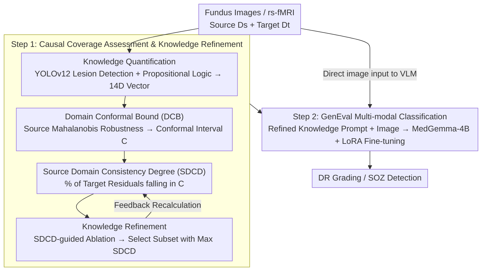

# Human Knowledge Integrated Multi-modal Learning for Single Source Domain Generalization

**Conference**: CVPR2026  
**arXiv**: [2603.12369](https://arxiv.org/abs/2603.12369)  
**Code**: [IMPACTLabASU/GenEval](https://github.com/IMPACTLabASU/GenEval)  
**Area**: Medical Imaging  
**Keywords**: Single Source Domain Generalization, Vision-Language Models, Causal Coverage, Conformal Inference, Diabetic Retinopathy, LoRA Fine-tuning, MedGemma

## TL;DR

GenEval is proposed to quantify the causal coverage gap through Domain Conformal Bounds (DCB). Refined human expert knowledge is quantified and fused with a medical VLM (MedGemma-4B) and optimized via LoRA fine-tuning for single source domain generalization, significantly outperforming baselines in DR grading and seizure focus (SOZ) detection.

## Background & Motivation

**Domain Generalization Challenge**: Medical image classification performance drops sharply during cross-domain deployment. Existing DG methods fail to consistently and significantly outperform ERM in DR grading (e.g., SPSD-ViT is only 1.3% higher than ERM-ViT with non-significant p=0.09).

**Single Source is More Challenging**: Clinical scenarios often only have a single source of data available. SDG is more difficult than MDG, and SOTA techniques perform worse.

**Lack of Causal Coverage**: Gaps in causal factors exist between different domains—for example, EyePACS contains neovascularization markers missing in Messidor, leading to models trained on Messidor failing to accurately classify EyePACS data.

**Lack of Causal Coverage Quantification Tools**: Theoretically, domain generalization requires satisfying both causal coverage and source risk minimization, but no objective method previously existed to quantify the degree of causal coverage.

**Human Knowledge is Valuable but Ambiguous**: Domain experts possess knowledge that can bridge causal gaps, but this knowledge is qualitative and ambiguous (e.g., microaneurysms vs. venous hemorrhages are easily confused), requiring quantification and refinement.

**General VLMs are not Robust**: Existing medical VLMs (CLIP, CLIP-DR) exhibit fragile performance on unseen domains and lack uncertainty guarantees.

## Method

### Overall Architecture

GenEval revolves around a core judgment: the root cause of cross-domain classification failure is the source domain's lack of causal factors required by the target domain (**Causal Coverage Gap**). Expert knowledge can bridge this gap but is too ambiguous. Thus, the method is divided into two major steps: **(1) Causal Coverage Assessment and Knowledge Refinement**: Expert knowledge is first quantified into computable lesion vectors, then DCB theory measures the causal gap between source/target domains, compressing this gap into an optimizable scalar via SDCD. SDCD is used as an index for dimension-wise ablation to filter the knowledge subset that best bridges the gap. **(2) Multi-modal VLM Classification**: Refined knowledge is written into structured clinical prompts and fed into MedGemma-4B alongside fundus images. LoRA fine-tuning completes DR grading / SOZ detection. Note that fundus images flow through two paths—into YOLO for knowledge quantification and directly as image input for the VLM.

### Key Designs

**1. Domain Conformal Bound (DCB): Encoding "Causal Factors Covered by the Source" into an Interval**

Domain generalization theory requires "causal coverage"—the source domain must contain all causal factors needed to classify the target domain. However, no objective judgment previously existed without access to acquisition protocols/metadata. DCB makes this computable: for each sample $X_i$, calculate the Mahalanobis distance between its causal factor vector $\mathcal{K}(X_i)$ and the average of other source samples as a robustness measure $\rho(\mathcal{K}(X_i), D^s)$ (Eq. 4). Conformal inference (Algorithm 1) is used to construct a prediction interval $C$ such that source sample robustness falls in $C$ with probability $\geq 1-\alpha$ (Eq. 5). Theorem 1 further guarantees that a target sample's robustness residual falls in $C$ if and only if it contains no causal factor relationships uncovered by the source. Thus, $C$ serves as a "pre-deployment safety ruler" without distribution assumptions.

**2. Source Domain Consistency Degree (SDCD): Compressing the Causal Gap into an Optimizable Scalar**

DCB provides sample-wise "in or out" status, which cannot directly compare knowledge configurations. SDCD (Algorithm 2) calculates the percentage of target samples whose residuals fall within the DCB interval as a quantified metric for the target domain's causal coverage. Its value lies in the proof of Lemma 1—SDCD is a monotonic function of robustness residuals and positively correlates with the learner's SDG performance on the target domain (observed Pearson $r=0.692, p<0.02$). This transforms "generalization success" from a post-hoc result to a pre-deployment measurable target, directly supporting downstream knowledge refinement.

**3. Knowledge Quantification and Refinement: Quantifying Expert Knowledge with YOLOv12 and Pruning Subsets via SDCD**

Expert knowledge can bridge the causal gap but is qualitative and ambiguous (e.g., misidentification of microaneurysms vs. venous bleeding). The quantification step uses YOLOv12 to detect lesions like hemorrhages, hard exudates, and cotton wool spots, organizing the IoU between detection boxes and expert labels into a 14D real-valued vector, while encoding expert rules like ICDR standards via propositional logic. The refinement step performs dimension-wise ablation on these 14 dimensions using SDCD as an index—recalculating the average SDCD after removing each dimension and retaining the subset that maximizes SDCD (final results showed removing "neovascularization" was best as it is difficult for YOLO to detect reliably, thus introducing noise). This is objectively driven by measurable SDCD, bypassing subjective arguments over "which expert knowledge is more useful."

**4. GenEval Multi-modal Classification: Prompting Refined Knowledge into MedGemma-4B**

General/medical VLMs are fragile on unseen domains, and images alone cannot bridge the causal gap. GenEval uses the specialized medical VLM MedGemma-4B as a backbone, embedding refined knowledge into structured clinical prompts (mimicking ophthalmologist diagnostic processes and ICDR standards). These are combined with fundus images as multi-modal input. LoRA ($r=16, \alpha=16, \text{dropout}=0.05$) is used to fine-tune only approximately 95M parameters (2.4% of 4B), freezing the backbone to preserve pre-trained clinical knowledge and avoid catastrophic forgetting. Causal knowledge in textual form is injected into reasoning to bridge missing causal factors, while parameter-efficient fine-tuning ensures lightweight deployment (inference ~424ms per image, ~633ms end-to-end including YOLO).

### Loss & Training

Standard Causal Language Modeling (Causal LM) loss is employed for LoRA fine-tuning, minimizing source domain risk via cross-entropy.

## Key Experimental Results

**SDG — DR Grading (12 Source-to-Target Transfers)**

| Source → Target | Best Baseline | Baseline Acc. | GenEval | K+D SDCD |
|:---|:---|:---:|:---:|:---:|
| Messidor → Aptos | SPSD-ViT | 48.3% | **56.0%** | 98.0% |
| Messidor → EyePACS | SPSD-ViT | 57.4% | **80.0%** | 94.9% |
| Messidor2 → Aptos | SPSD-ViT | 52.8% | **69.7%** | 76.3% |
| Messidor2 → EyePACS | SPSD-ViT | 72.5% | **77.8%** | 96.3% |
| EyePACS → Messidor2 | DRGen | 65.4% | **80.5%** | 99.8% |
| EyePACS → Messidor | DRGen | 54.6% | **69.5%** | 100.0% |

**Extended SDG (Fixed EyePACS Training, 6 Target Domains)**

| Method | APTOS | Messidor | IDRiD | DeepDR | FGADR | RLDL | Avg. |
|:---|:---:|:---:|:---:|:---:|:---:|:---:|:---:|
| GDRNet | 52.8 | 65.7 | 70.0 | 40.0 | 7.5 | 44.3 | 46.7 |
| DECO | 59.7 | 70.1 | 74.8 | 40.3 | 9.9 | 49.3 | 50.7 |
| **GenEval** | **73.2** | 69.5 | 70.6 | **59.2** | **56.9** | **67.6** | **66.2** |

### Ablation Study

Knowledge Refinement Ablation (SDCD Guided):

| Ablation Case | SDCD (%) | Accuracy (%) |
|:---|:---:|:---:|
| No Ablation | 59.0 | 65.0 |
| Remove Microaneurysms | 68.0 | 70.0 |
| Remove Hemorrhages/Exudates | 71.7 | 71.1 |
| Remove Venous Beading | 82.8 | 73.2 |
| Remove Neovascularization | **82.8** | **73.2** |

Removing neovascularization yielded the best results because this feature is extremely difficult for YOLO to detect accurately; noise introduction lowered the SDCD.

### Key Findings

- **SDCD positively correlates with accuracy** ($r=0.692, p<0.02$), validating the monotonicity of Lemma 1.
- **Knowledge integration significantly improves SDCD**: K+D SDCD is much higher than D-only SDCD, approaching 100% in most cases.
- **MDG also shows significant improvement**: GenEval averaged 79.21% on four-domain DR vs. 73.3% for SPSD-ViT (+5.9%).
- **VLM Comparison**: GenEval achieved a macro F1 of 75.1%, which is +28.3% higher than CLIP-DR (46.8% → 75.1%).
- **Cross-center SOZ**: GenEval averaged 90.0% F1 vs. CuPKL 88.1%, showing more stable cross-center performance.

## Highlights & Insights

- First to propose DCB theory, providing a distribution-free causal coverage quantification method that can predict if generalization is feasible before deployment.
- The SDCD-guided knowledge refinement mechanism ingeniously uses measurable metrics to select optimal knowledge subsets, avoiding ambiguities of qualitative knowledge.
- Incorporating structured expert knowledge as text prompts into the VLM to bridge domain causal gaps multi-modally is a novel approach.
- Large-scale evaluation: 8 DR datasets + 2 SOZ datasets across 12 SDG transfer directions, providing comprehensive validation.

## Limitations & Future Work

- DCB theory assumes the data generation mechanism is continuous and differentiable, which may not apply to threshold effects or abrupt changes in mixed digital-physical systems.
- YOLO knowledge extraction is a performance bottleneck: complex lesions like neovascularization cannot be reliably detected and had to be removed.
- The 14D knowledge vector depends on disease-specific expert rules; migrating to new tasks requires redefining features and logic, presenting high generalization costs.
- SDCD is unstable under low signal-to-noise ratios (correlation lost when PSNR < 15dB), potentially failing in poor image quality scenarios.
- Only validated on DR and SOZ medical tasks; wider medical imaging fields (e.g., pathology, CT) have not yet been addressed.

## Related Work & Insights

- **Medical Domain Generalization**: Methods like MMD, CDANN, SD-ViT, and SPSD-ViT that align feature distributions fail to consistently beat ERM; DRGen, DECO, and GDRNet serve as DR-specific baselines.
- **Medical VLM**: BiomedCLIP and LLaVA-Med achieve zero-shot transfer; CLIP-DR introduces ranking-aware prompts; MedGemma-4B is the specialized medical foundation model used here.
- **Conformal Inference**: A distribution-independent uncertainty quantification framework previously used for OOD detection and medical AI deployment, innovatively used here to quantify inter-domain causal gaps.

## Rating

- Novelty: ⭐⭐⭐⭐ — DCB theory and SDCD-guided knowledge refinement are original contributions; multi-modal knowledge fusion is insightful.
- Experimental Thoroughness: ⭐⭐⭐⭐⭐ — 8+2 datasets, 12 SDG transfer pairs, multiple baseline comparisons, and complete ablation/sensitivity analysis.
- Writing Quality: ⭐⭐⭐⭐ — Theoretical derivations are rigorous, though notation is dense and proofs are relegated to supplementary materials.
- Value: ⭐⭐⭐⭐ — Highly valuable for actual SDG deployment in medical imaging; DCB serves as a pre-deployment safety check tool.

<!-- RELATED:START -->

## Related Papers

- [\[CVPR 2026\] Reclaiming Lost Text Layers for Source-Free Cross-Domain Few-Shot Learning](reclaiming_lost_text_layers_for_source-free_cross-domain_few-shot_learning.md)
- [\[AAAI 2026\] Experience with Single Domain Generalization in Real World Medical Imaging Deployments](../../AAAI2026/medical_imaging/experience_with_single_domain_generalization_in_real_world_medical_imaging_deplo.md)
- [\[CVPR 2026\] DK-DDIL: Adaptive Knowledge Retention for Dynamic Domain-Incremental Learning in Medical Imaging](dk-ddil_adaptive_knowledge_retention_for_dynamic_domain-incremental_learning_in_.md)
- [\[CVPR 2026\] Tell2Adapt: A Unified Framework for Source Free Unsupervised Domain Adaptation via Vision Foundation Model](tell2adapt_a_unified_framework_for_source_free_unsupervised_domain_adaptation_vi.md)
- [\[CVPR 2026\] InvCoSS: Inversion-driven Continual Self-supervised Learning in Medical Multi-modal Image Pre-training](invcoss_inversion-driven_continual_self-supervised_learning_in_medical_multi-mod.md)

<!-- RELATED:END -->
