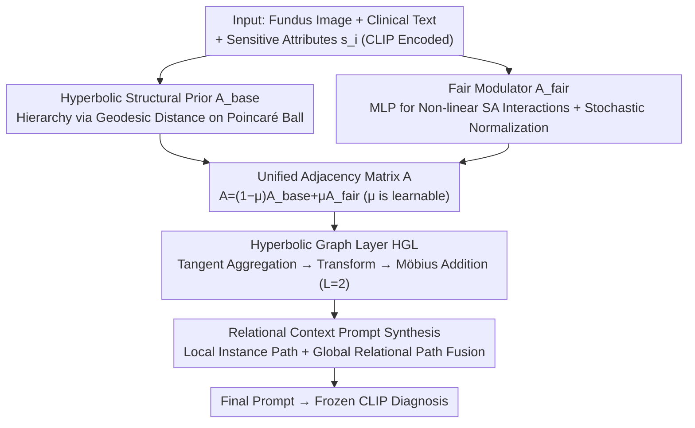

# Hyperbolic Relational Prompts for Intersectional Fairness in Medical VLMs

**Conference**: CVPR 2026  
**Paper**: [CVF Open Access](https://openaccess.thecvf.com/content/CVPR2026/html/Qian_Hyperbolic_Relational_Prompts_for_Intersectional_Fairness_in_Medical_VLMs_CVPR_2026_paper.html)  
**Code**: Not disclosed  
**Area**: Medical Imaging / Multimodal VLM / Fairness  
**Keywords**: Medical VLM, Intersectional Fairness, Hyperbolic Geometry, Relational Graph, Prompt Learning

## TL;DR
FRP transforms "prompt generation" in medical VLMs from isolated sample processing into **dynamic relational reasoning**: it employs a sample relational graph to capture fine-grained dependencies and utilizes **hyperbolic graph layers** to explicitly model the hierarchical structure of intersectional identities (e.g., race × gender). This mitigates "intersectional blindness" while achieving SOTA diagnostic AUC (FairVLMed 77.50%, Harvard-GF 85.94%).

## Background & Motivation

**Background**: Medical diagnosis demands extreme fairness, as biases in sensitive attributes (SA) like race and gender directly cause healthcare inequality. As the field shifts from vision-only models to VLMs (CLIP, MedCLIP, BiomedCLIP) capable of processing both images and clinical text, diagnostic capabilities have improved, but VLMs **inherit and amplify biases from both modalities**.

**Limitations of Prior Work**: Traditional fairness methods (e.g., FairCLIP) rely on "broad distribution alignment" for de-biasing and focus on single attributes. This leads to **intersectional blindness**—de-biasing one attribute (e.g., race) can amplify bias in another (e.g., gender), disadvantageous to subgroups like "Black Females." Meanwhile, mainstream prompt learning, though parameter-efficient, is **fairness-unaware**: it adopts an independent modeling paradigm where samples are processed in isolation, ignoring the inter-sample context necessary for fairness.

**Key Challenge**: Intersectional identities naturally possess a **hierarchical structure** (e.g., Gender → Black Female). Existing methods (1) process samples in isolation, losing fine-grained cross-sample dependencies; (2) treat multiple sensitive attributes as independent factors, failing to characterize non-linear interactions of their combinations; (3) incur high distortion when embedding hierarchical relationships in Euclidean space. These factors combined make intersectional subgroup fairness unachievable.

**Goal**: (1) Transform prompts from "static conditions" into a "dynamic, context-aware reasoning mechanism"; (2) Explicitly model the **relational and hierarchical (intersectional) structures** of sensitive attributes rather than processing them in isolation and independently.

**Key Insight**: Starting from information theory, intersectional fairness essentially requires minimizing performance variance across demographic subgroups, which necessitates the model's awareness of "fine-grained, attribute-conditioned inter-sample dependencies." The authors use a theorem (Theorem 3.1) to prove that relational models with attribute-aware adjacency matrices obtain strictly higher **fair-conditioned mutual information** $I(X;Y\mid S)$ compared to isolated models, with the gain lower-bounded by the fair-modulated adjacency matrix $A_{fair}$. This turns the intuition of "relational modeling + attribute modulation" into a quantifiable motivation.

**Core Idea**: Utilize a "relational graph + hyperbolic hierarchical modeling" to drive **Fairness-aware Relational Prompts (FRP)**, embedding fairness directly into the prompt generation process rather than post-hoc de-biasing.

## Method

### Overall Architecture
The input consists of a batch of samples (SLO fundus images + structured clinical text + task labels + sensitive attribute vectors $s_i$), and the output is a prompt synthesized dynamically for each sample, aligned with its relational and intersectional structure, fed into a frozen CLIP for glaucoma diagnosis. Workflow: CLIP encoding → **Construction of a unified adjacency matrix** (convex combination of hyperbolic structural prior $A_{base}$ + fair modulator $A_{fair}$) → **Fair information propagation via Hyperbolic Graph Layer (HGL)** → **Dual-path prompt synthesis** (local instance path + global relational context path) → Addition with static base prompts to obtain the final prompt. Note: During inference, the relational graph is **constructed using only visual features and does not require sensitive attributes**.

### Key Designs

**1. Hyperbolic Structural Prior $A_{base}$: Hierarchy via Geodesic Distance on Poincaré Ball**

Addressing the distortion of intersectional identity hierarchies in Euclidean space, FRP views each mini-batch as relational graph nodes $z_i=[z_{Ii};z_{Ti}]$ (concatenated image and text features). After mapping to the Poincaré ball, similarity is measured using hyperbolic geodesic distance $d_c(\cdot,\cdot)$, defining the base adjacency matrix: $(A_{base})_{ij}=\frac{\exp(-d_c(z_i^{\mathbb{H}},z_j^{\mathbb{H}}))}{\sum_k \exp(-d_c(z_i^{\mathbb{H}},z_k^{\mathbb{H}}))}$. Hyperbolic geometry naturally excels at low-distortion embedding of hierarchical structures (volumes expand exponentially in hyperbolic space), fitting the hierarchical nature of intersectional identities like "Gender → Black Female." However, this prior is **attribute-agnostic** and requires enrichment.

**2. Fair Modulator $A_{fair}$: Explicit Non-linear Sensitive Attribute Interaction via MLP**

To make the adjacency matrix "see" sensitive attributes and solve for the variance objective $\mathcal{L}_{fair}$, FRP uses an MLP to model weights for pairs of attributes $w_{ij}^{fair}=\sigma(\text{MLP}([s_i;s_j]))$, resulting in a symmetric weight matrix $W_{fair}$. The structural prior is then modulated via Hadamard product $A_{raw}=A_{base}\odot W_{fair}$, followed by row-stochastic normalization $A_{fair}=\text{diag}(A_{raw}\mathbb{I})^{-1}A_{raw}$. This step directly satisfies the requirements of Theorem 3.1—only by introducing attribute modulation $A_{fair}$ can "attribute-conditioned dependencies" be captured, leading to positive information gain. The final unified matrix is $A=(1-\mu)A_{base}+\mu A_{fair}$, where $\mu\in[0,1]$ is a learnable parameter that adaptively balances the "pure hierarchical prior" and "attribute modulation."

**3. Hyperbolic Graph Layer (HGL): Native Fair Information Propagation in Hyperbolic Space**

Standard GNNs aggregate hierarchical data in Euclidean space with significant distortion. FRP uses HGL to allow information flow natively on the Poincaré ball. Given initial node features $Z^{(0)}$, they are first mapped to hyperbolic space $Z^{\mathbb{H}}=\exp_0^c(Z^{(0)})$. Each layer then performs four steps: logarithmic mapping to tangent space $Z_{tan}=\log_0^c(Z^{\mathbb{H}})$ → aggregation using the unified adjacency $A$ as $H_{agg}=A\cdot Z_{tan}$ → stabilized linear transformation $H_{trans}=\text{Dropout}(\text{LayerNorm}(\text{Linear}(H_{agg})))$ → mapping back to the sphere and integration via Möbius addition $Z^{(l+1)}=Z^{(l)}\oplus_c\exp_0^c(H_{trans})$. After $L=2$ layers, features are mapped back to tangent space $Z_{final}$ and split into image $Z_{img}$ and text $Z_{text}$ branches. This step diffuses intersectional fairness info "distortion-free" along the graph.

**4. Relational Context Prompt Synthesis: Dual-path Fusion of Local and Global Context**

Finally, relational information is synthesized into adaptive prompts via a dual-path design. The local path processes instance features $z_{Ii}$ to generate $P_{img}=\text{Reshape}(W_{img}\cdot\frac{1}{B}\sum_i z_{Ii})$ to capture individual info. The global path fuses HGL outputs $Z_{img}/Z_{text}$ using Multi-head Attention, followed by residual normalization and pooling to obtain the context vector $f_{fused}$, which is projected to $P_{text}$ for global relational context. The two prompts are averaged into a dynamic component and added to the static base prompt: $C_{final}=C_{base}+(P_{img}+P_{text})/2$. This ensures VLM predictions are conditioned on both "local instance details" and "global fair relational context."

### Loss & Training
Total objective: $\min_\theta[\mathcal{L}_{task}+\lambda\mathcal{L}_{fair}]$. The task loss uses standard CLIP symmetric contrastive loss. **The fairness loss is a key innovation**: shifting from "distribution alignment," it minimizes the **variance** of task losses across intersectional subgroups ($M$ groups $G$ formed by race × gender):
$$\mathcal{L}_{fair}=\text{Var}_{G\in\mathcal{G}}(\mathcal{L}_G), \text{ where } \mathcal{L}_G=\mathbb{E}_{i\in G}[\ell_{task}(\cdot)]$$
This forces the model to achieve **performance equilibrium** across subgroups rather than just distribution similarity. Training uses SGD, batch 32, 50 epochs, cosine lr (peak 0.002), 1 epoch warmup, $\lambda=0.1$, prompt length $N_{ctx}=32$.

## Key Experimental Results

### Main Results
Evaluated on FairVLMed (10k fundus images + text, glaucoma diagnosis) and Harvard-GF (3,300 OCT, vision-only). Metrics: AUC↑, ES-AUC↑ (equity-scaled AUC), DPD↓ (Demographic Parity Difference), DEOdds↓ (Difference in Equalized Odds). Baselines include CoOp/CoCoOp/VPT/MaPLe, BiomedCLIP/MedCLIP/PubMedCLIP, and FairCLIP.

FairVLMed (Race attribute, %):

| Model | DPD ↓ | DEOdds ↓ | AUC ↑ | ES-AUC ↑ | Black AUC ↑ |
|------|------|------|------|------|------|
| CLIP | 15.35 | 15.11 | 67.84 | 61.67 | 70.78 |
| FairCLIP | 6.07 | 10.50 | 70.24 | 65.50 | 71.39 |
| MaPLe | 8.51 | 10.82 | 75.19 | 68.89 | 70.66 |
| VPT | 7.82 | 15.73 | 74.98 | 72.96 | 73.85 |
| BiomedCLIP | 12.29 | 15.37 | 71.20 | 66.88 | 66.61 |
| **FRP (Ours)** | **4.14** | **6.37** | **77.50** | **74.08** | **78.19** |

Harvard-GF (Race attribute, %):

| Model | DPD ↓ | DEOdds ↓ | AUC ↑ | ES-AUC ↑ |
|------|------|------|------|------|
| CLIP | 3.03 | 17.15 | 80.23 | 74.83 |
| MaPLe | 8.67 | 8.74 | 83.03 | 78.19 |
| BiomedCLIP | 2.36 | 9.55 | 83.12 | 79.53 |
| **FRP (Ours)** | 2.50 | **8.67** | **85.94** | **81.32** |

FRP achieves the highest AUC and best/near-best fairness metrics on both benchmarks. AUC is 2.82 points higher than BiomedCLIP, with significant Gains in Black subgroup AUC.

### Ablation Study
Component ablation on FairVLMed ($G_{hyp}$ Hyperbolic GNN, $A_{fair}$ Fair Modulator, $P_{mm}$ Multimodal Prompts, $\mathcal{L}_{fair}$ Fair Loss):

| Config | AUC ↑ | DPD(Gender) ↓ | DPD(Race) ↓ | Description |
|------|------|------|------|------|
| Baseline | 67.84 | 4.34 | 15.35 | Pure CLIP |
| w/o $A_{fair}$ | 74.90 | 6.13 | 8.20 | No modulation, fairness degrades |
| w/o $G_{hyp}$ (Euclidean GAT) | 75.61 | 4.36 | 11.47 | Significant AUC drop |
| w/o $\mathcal{L}_{fair}$ | 78.80 | 10.26 | 9.30 | AUC rises slightly, fairness collapses |
| **Full FRP** | 77.50 | **0.38** | **4.14** | Optimal precision-fairness trade-off |

### Key Findings
- **Every component is theory-grounded and essential**: Removing $\mathcal{L}_{fair}$ causes fairness metrics to collapse; removing $A_{fair}$ leads to fair degradation; replacing hyperbolic layers with Euclidean GAT drops diagnostic AUC—verifying the necessity of hyperbolic geometry for hierarchy preservation.
- **Intersectional trade-offs verified**: In FairCLIP, a gender-aligned strategy reduced gender DPD to 0.84 but caused Black patient AUC to drop from 71.39% to 69.83%. FRP improves both dimensions simultaneously, with Black subgroup AUC 8.36% higher than gender-aligned FairCLIP.
- **Robustness**: ES-AUC is stable across a wide range, though it degrades at $\lambda\ge1.0$; $N_{ctx}$ plateaus at 32.
- **Stable Training**: Performance steadily increases while fairness gaps decrease within 50 epochs.

## Highlights & Insights
- **Embedding fairness into prompt generation**: Unlike post-hoc de-biasing, FRP makes the prompt an "intrinsic dynamic fairness mechanism"—this is the core paradigm shift.
- **Hyperbolic Geometry × Intersectional Identity**: Intersectional identity is inherently hierarchical; hyperbolic space embeds tree structures with low distortion, making the use of hyperbolic geometry a geometric necessity rather than just a gimmick.
- **Fairness Loss as Subgroup Variance**: Forcing performance equilibrium across groups is more aligned with the reality of intersectional fairness than traditional distribution alignment.
- **Inference without Sensitive Attributes**: Training relies on SA modulation, but inference uses only visual features for graph construction, bypassing privacy concerns regarding SA availability at deployment.

## Limitations & Future Work
- **Limited Modalities**: Both FairVLMed and Harvard-GF are ophthalmology datasets; generalizability to chest X-rays or dermatology remains unverified.
- **Attribute Dimensions**: Intersectionality only covers race × gender; higher-order intersections (SES, age) are not included. Sample sparsity issues for the variance objective may worsen as groups $M$ increase.
- **Formulas in Supplement**: The main text lacks complete definitions for hyperbolic mappings and geodesic distances.
- **Mini-batch Dependency**: The relational graph is constructed dynamically within each batch; the impact of batch size and sampling strategies on modeling quality was not deeply analyzed.

## Related Work & Insights
- **vs FairCLIP**: FairCLIP performs single-attribute subgroup alignment, causing intersectional trade-offs. FRP uses relational graphs and hyperbolic layers to improve both attributes.
- **vs CoOp/MaPLe**: These treat samples in isolation and are fairness-unaware; FRP builds relational graphs and performs fairness-aware dynamic prompt synthesis.
- **vs Hyperbolic Embeddings/Graph Methods**: Prior works either use hyperbolic space for hierarchy or graphs for sample dependency. FRP is the first to combine "hyperbolic hierarchical modeling + PEFT prompt learning" with an information-theoretic justification for medical VLM intersectional fairness.

## Rating
- Novelty: ⭐⭐⭐⭐⭐ Integration of hyperbolic hierarchy, relational graphs, and fair prompts is unique and theoretically supported.
- Experimental Thoroughness: ⭐⭐⭐⭐ Two benchmarks + extensive ablation, but limited medical modality (ophthalmology only).
- Writing Quality: ⭐⭐⭐⭐ Clear motivation-theory-method chain, but core geometric formulas are in the supplement.
- Value: ⭐⭐⭐⭐ Addresses medical fairness; the "subgroup variance" loss and "inference without SA" are transferable designs.

<!-- RELATED:START -->

## Related Papers

- [\[CVPR 2026\] H2-Surv: Hierarchical Hyperbolic Multimodal Representation Learning for Survival Prediction](h2-surv_hierarchical_hyperbolic_multimodal_representation_learning_for_survival_.md)
- [\[CVPR 2026\] TRCoRSurg: Temporal-Relational Co-Reasoning for Surgical Video Triplet Recognition](trcorsurg_temporal-relational_co-reasoning_for_surgical_video_triplet_recognitio.md)
- [\[ICLR 2026\] HEEGNet: Hyperbolic Embeddings for EEG](../../ICLR2026/medical_imaging/heegnet_hyperbolic_embeddings_for_eeg.md)
- [\[CVPR 2026\] IVAAN: Instance-level Vision-Language Alignment via Attribute-Guided Text Prompts Generation for Nuclei Analysis](ivaan_instance-level_vision-language_alignment_via_attribute-guided_text_prompts.md)
- [\[ICML 2026\] EEG-Based Multimodal Learning via Hyperbolic Mixture-of-Curvature Experts](../../ICML2026/medical_imaging/eeg-based_multimodal_learning_via_hyperbolic_mixture-of-curvature_experts.md)

<!-- RELATED:END -->
