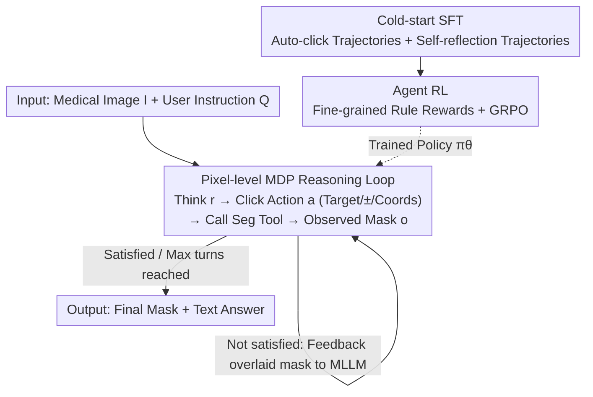

# IBISAgent: Reinforcing Pixel-Level Visual Reasoning in MLLMs for Universal Biomedical Object Referring and Segmentation

**Conference**: CVPR 2026  
**Paper**: [CVF Open Access](https://openaccess.thecvf.com/content/CVPR2026/html/Jiang_IBISAgent_Reinforcing_Pixel-Level_Visual_Reasoning_in_MLLMs_for_Universal_Biomedical_CVPR_2026_paper.html)  
**Code**: https://github.com/Yankai96/IBISAgent  
**Area**: Medical Imaging / Multimodal Agents / Pixel-level Reasoning Segmentation  
**Keywords**: Biomedical Segmentation, MLLM Agent, Multi-step Reasoning, Interactive Segmentation, Reinforcement Learning

## TL;DR
Addressing the issues where existing medical MLLM segmentation relies on joint fine-tuning of implicit `<SEG>` tokens and external pixel decoders (prone to catastrophic forgetting, poor cross-domain performance, and restricted to a single forward pass), IBISAgent reformulates segmentation as a multi-step Markov Decision Process (MDP) of "think $\rightarrow$ click action $\rightarrow$ call segmentation tool $\rightarrow$ observe mask." By training Qwen2.5-VL-7B with cold-start SFT and agentic RL (fine-grained rule rewards) without changing the architecture, it enables iterative mask refinement. It significantly outperforms closed-source and open-source SOTA on multiple in-domain and out-of-domain biomedical segmentation benchmarks (In-domain IoU 85.58 vs. 50.74 for the second best).

## Background & Motivation
**Background**: Medical MLLMs are transitioning from image-level understanding to pixel-level understanding. Mainstream pixel-level solutions follow the "embedding-as-mask" paradigm of LISA: introducing a special `<SEG>` token and projecting its hidden states to an external pixel decoder to generate masks, which requires joint fine-tuning of the MLLM and the decoder.

**Limitations of Prior Work**: ① Joint fine-tuning of external decoders increases the risk of catastrophic forgetting, making models strong in-domain but weak across domains; ② The introduction of implicit segmentation tokens disrupts the native text output space of MLLMs, weakening reasoning capabilities and failing to truly reflect the model's pixel-level understanding; ③ Almost all are single forward pass inference, lacking the multi-step interaction and iterative refinement mechanisms used by human annotators.

**Key Challenge**: Visual semantics in biomedical images are subtle and complex (faint lesion clues, minute pathological patterns), making a single forward pass often insufficient. Conversely, human experts use interactive segmentation tools through multiple steps of positive/negative clicks to approach the target. Existing MLLMs squeeze "segmentation" into one-shot token prediction, losing both linguistic reasoning space and iterative error correction capabilities.

**Goal**: To enable MLLMs to perform self-evolving segmentation like an annotator—viewing multiple times, revisiting intermediate decisions, and adjusting based on feedback—without architectural changes or implicit tokens.

**Key Insight**: Treat the segmentation model as a language-controlled plug-and-play tool. The MLLM is only responsible for generating textual click commands (coordinates + positive/negative), which are executed by the segmentation tool to produce masks and feedback, thereby decoupling pixel prediction from linguistic reasoning.

**Core Idea**: Reformulate segmentation as a multi-step MDP, allowing the MLLM to generate interleaved "reasoning + click actions" to iteratively refine masks using a segmentation tool. This pixel-level reasoning capability is activated through a two-stage training process: cold-start SFT and agentic RL with fine-grained rewards.

## Method

### Overall Architecture
Given a user query $Q$ and image $I$, IBISAgent follows a multi-step, interleaved reasoning path $P=\{(r_t,a_t,o_t)\}_{t=1}^{T}$: each step includes textual reasoning $r_t$, an action $a_t$ (click operation or final answer), and an observed mask $o_t$ generated by the tool after the action. A click in an action is defined by a triplet—Target (class name), Attribute $\in\{+1,-1\}$ (positive/negative click), and Coordinate_2d $\in[0,1]^2$ (normalized coordinates), supporting clicks on multiple targets simultaneously. The segmentation tool (MedSAM2) takes the current click $a_t$, the previous mask $M_{t-1}$ as a spatial prior, and the original image to output an updated mask $M_{t+1}$. $M_{t+1}$ is translucently overlaid back onto the original image to generate a new observation for the MLLM. This "Think-Action-Observe" loop continues until the model determines the mask is satisfactory or reaches the context/iteration limit, then outputs `<answer>`.

This capability is injected into strategy $\pi_\theta$ via two stages: first, cold-start SFT establishes a foundation for pixel understanding and self-reflection; then, agentic RL (fine-grained rule rewards + GRPO) enables the model to autonomously explore more efficient action strategies.

### Key Designs

**1. Reformulating Segmentation as a Pixel-level MDP: A Multi-step Interactive Loop**

To address the issues of "single forward pass + implicit tokens losing language space," IBISAgent transforms segmentation into a multi-step decision process. The policy generates text reasoning and click actions $r_{t+1},a_{t+1}\sim\pi_\theta(\cdot\mid I,Q,P_{<t})$ at each step, with outputs marked by three special tokens: `<think>`, `<action>`, and `<answer>`. When `<action>` is encountered, it is parsed into click prompts for the segmentation model, which, along with historical actions $a_{0:t}$, the current mask $M_t$, and the original image, is sent to the interactive segmentation model $F_{seg}$ to obtain $M_{t+1}$. Key innovations include: first, treating the segmentation tool as an external, language-controlled plug-and-play component, allowing the MLLM to keep native linguistic representations without being constrained by rigid templates like `It's <SEG>.`; second, overlaying the updated mask onto the original image as an observation, enabling the model to see $M_{t+1}$ and $I$ simultaneously in a single frame, which naturally supports iterative refinement and self-reflection (correcting errors by backtracking).

**2. Cold-start SFT: Automated Synthesis of Click and Self-reflection Trajectories**

Pure prompting cannot make MLLMs execute iterative visual operations robustly; SFT is required. The challenge is that existing biomedical segmentation data only provides final masks without step-by-step annotations, and human labeling is costly. The authors use a rule-based click simulation algorithm $F_{cs}$ to synthesize trajectories: given the current mask $M_t$ and GT mask $M_{gt}$, false positive/negative regions are calculated, and the next click is placed at the center of the error region, $a_{t+1}=F_{cs}(M_t,M_{gt})$, simulating high-quality trajectories $[M_0,a_0,M_1,a_1,\dots]$ (source: BiomedParseData with 3.4M image-mask-label pairs). Then, Gemini-2.5-Pro generates diverse Q&A based on images and GT masks, while GPT-5 synthesizes reasoning for each step based on the Q&A, next correct action, and TP/FP/FN info. To enhance robustness, self-reflection trajectories are synthesized covering two types of error correction: ① Self-correction (detecting wrong actions $\rightarrow$ backtracking $\rightarrow$ re-reasoning); ② User inconsistency correction (discarding wrong masks and re-segmenting if the instruction contradicts the initial mask). A final $D_{cold}$ of 456K samples is used for SFT with negative log-likelihood, applying loss masks to incorrect action tokens to prevent learning wrong behaviors.

**3. Agent RL: Fine-grained Rule Rewards + GRPO for Autonomous Strategy Discovery**

While SFT mimics trajectories, RL allows the model to explore optimal strategies. $D_{rl}$ provides only images, GT masks, and Q&A without trajectory labels (888K samples). Unlike sparse outcome rewards, this work designs dense rule rewards: ① Format reward $S_{format}$ (correct token order, parsable `<action>`); ② Final answer reward $S_{ans}$ (exact match for closed QA, IoU-threshold based scores for segmentation); ③ **Regionalized Click Placement Reward** $S_{click}$—the segmentation tool executes click $a_t$ to get $M_t$; $S_{click}$ scores whether positive clicks fall into FN regions and negative clicks into FP regions of $M_{gt}$, forcing valid semantic placement; ④ **Progressive Segmentation Improvement Reward** $S_{pseg}$—requires mask IoU to increase at each step $a_t$, encouraging continuous refinement over redundancy; ⑤ Trajectory length reward $S_{len}$ (penalizing sequences that are too long to promote efficiency). Total reward $S=\tfrac{1}{5}(S_{ans}+S_{format}+S_{click}+S_{pseg}+S_{len})$ is optimized via GRPO (without KL penalty).

### Loss & Training
Cold-start SFT uses standard negative log-likelihood with loss masking. The RL stage objective is GRPO:

$$L_{RL}=\mathbb{E}_{(I,Q,A)\sim D_{rl}}\Big[-\tfrac{1}{G}\sum_{i=1}^{G}\tfrac{1}{N_i}\sum_{t=1}^{T_i}\min\big(\pi_{\theta_{i,t}}A_i,\ \mathrm{clip}(\pi_{\theta_{i,t}},1-\epsilon,1+\epsilon)A_i\big)\Big]$$

where $\pi_{\theta_{i,t}}=\pi_\theta(r_{i,t},a_{i,t}\mid I,Q,P_{i,<t})/\pi_{\theta_{old}}(\cdot)$. Implementation is based on Qwen2.5-VL-7B + MedSAM2 tool, using 16x A100; SFT learning rate $1\times10^{-5}$, 10 epochs, batch size 256; RL uses the VERL framework, batch size 256, 4 rollouts per query, max 20 actions, max context 32K, learning rate $1\times10^{-6}$, 12 epochs.

## Key Experimental Results

### Main Results
Three benchmarks (In-domain + Out-of-domain + In-house held-out), compared with general/medical MLLMs (IoU / DSC / F1, %):

| Benchmark | Metric | UniBiomed | Citrus-V | MMedAgent | **IBISAgent** |
|------|------|------|------|------|------|
| In-domain $D_{test}$ | IoU | 50.74 | 30.61 | 36.13 | **85.58** |
| In-domain $D_{test}$ | DSC | 58.31 | 37.63 | 42.85 | **92.21** |
| Out-of-domain MeCOVQA-G+ | IoU | 24.88 | 46.54 | 26.54 | **80.63** |
| In-house held-out | IoU | 35.62 | 32.08 | 27.39 | **72.09** |
| In-house held-out | DSC | 41.55 | 38.63 | 34.26 | **83.78** |

Compared to medical-specific MLLMs, Ours achieves an average gain of at least 35.13% IoU, 37.58% DSC, and 29.79% F1. Even when general MLLMs are fine-tuned on the same data, IBISAgent still maintains a lead, indicating gains come from the method rather than just data.

### Ablation Study
Incremental training strategy effects (In-house held-out, IoU/DSC/F1):

| Config | SFT | Self-Reflect | RL | IoU | DSC | F1 |
|------|----|----|----|------|------|------|
| $M_{base}$ (Prompt only) | | | | 11.77 | 16.83 | 23.47 |
| $M_{cold}$ | ✓ | | | 53.42 | 62.01 | 68.61 |
| $M_{cold+reflect}$ | ✓ | ✓ | | 57.16 | 67.73 | 74.52 |
| $M_{rl}$ | | | ✓ | 62.77 | 71.29 | 77.50 |
| $M_{cold+rl}$ | ✓ | | ✓ | 68.92 | 78.08 | 85.44 |
| **IBISAgent** | ✓ | ✓ | ✓ | **72.09** | **83.78** | **91.76** |

### Key Findings
- **RL contributes most**: RL alone ($M_{rl}$) raises the base from 11.77 to 62.77 IoU, showing that exploration-exploitation + reward feedback is crucial for learning context-aware decision strategies.
- **Self-reflection trajectories are effective**: $M_{cold} \rightarrow M_{cold+reflect}$ improves in-house IoU by +3.74, validating that self-correction improves robustness in complex scenarios.
- **Fine-grained rewards are useful**: Adding $S_{click}$ and $S_{pseg}$ consistently increases IoU/DSC/F1 while decreasing average trajectory length $T_{avg}$, improving both quality and efficiency.
- **Cost of slower inference**: Multi-round refinement results in 28.70s per sample, significantly higher than single-pass methods like UniBiomed (5.82s)—a trade-off of accuracy for time inherent in agentic systems.

## Highlights & Insights
- **"Segmentation tool as a language-controlled tool" decouples reasoning and pixel prediction**: The MLLM only generates text click commands and does not use `<SEG>` tokens. This preserves the native linguistic reasoning space and allows unified connection to different segmentation tools (plug-and-play), avoiding catastrophic forgetting associated with joint fine-tuning of external decoders—a key move to bypass the LISA paradigm's issues.
- **Rule-based click simulation transforms "mask-only" data into trajectory supervision**: $F_{cs}$ places clicks at FP/FN centers, creating 450K step-by-step trajectories with zero extra manual labor, a reusable trick for process-level supervision.
- **Process-level dense rewards grounded in pixels**: Regionalized click rewards (positive in FN, negative in FP) and progressive IoU improvement rewards decompose "segmentation quality" into step-by-step signals, making it more stable than outcome-only rewards.
- **Self-reflection trajectory synthesis** explicitly teaches the model "backtracking," turning error accumulation into a correctable process, which is critical for medical images with faint or error-prone lesions.

## Limitations & Future Work
- **High inference overhead**: 28.70s per sample is 5–10x that of single-pass methods. Multi-turn interaction is a hard constraint in real-time or large-scale clinical scenarios.
- **Dependency on external tools and teacher models**: Performance is capped by MedSAM2 quality, and trajectory synthesis relies on Gemini-2.5-Pro and GPT-5, implying high replication costs and potential biases.
- **Hand-designed rewards**: Hyperparameters like IoU and length thresholds require tuning, and dense rewards might induce "reward hacking" (e.g., conservative clicking to ensure progressive improvement).
- **Generalization boundaries**: While out-of-domain and in-house data were tested, BiomedParseData significantly overlaps with many benchmarks. Real-world generalization to entirely new modalities or rare lesions remains to be fully verified.

## Related Work & Insights
- **vs. LISA family / embedding-as-mask (LISA, MedPLIB, UniBiomed)**: These rely on implicit `<SEG>` tokens + joint fine-tuning, disrupting text space and favoring single passes. IBISAgent retains native architecture and uses text clicks/tool-calling/multi-step refinement, with in-domain IoU 85.58 vs. UniBiomed 50.74.
- **vs. RL-activated single-round tools (VisionReasoner, SAM4MLLM)**: These use RL for MLLMs to output box/point prompts for SAM but only for single-round grounding; IBISAgent's multi-step MDP allows iterative correction.
- **vs. Tool-augmented medical agents (MMedAgent)**: Also uses MedSAM tools, but IBISAgent leads significantly due to more accurate grounding and multi-round mask refinement, proving the advantage lies in iterative reasoning.

## Rating
- Novelty: ⭐⭐⭐⭐ Reformulating medical segmentation as pixel-level MDP + tool-calling, decoupling reasoning from pixel prediction.
- Experimental Thoroughness: ⭐⭐⭐⭐⭐ Comprehensive benchmarks (In/Out/In-house) + VQA, with complete ablation of training strategies and rewards.
- Writing Quality: ⭐⭐⭐⭐ Clear motivation, process descriptions, and qualitative cases.
- Value: ⭐⭐⭐⭐ No architectural changes, strong cross-domain performance, and tool-agnostic; valuable for medical interactive segmentation deployment.

<!-- RELATED:START -->

## Related Papers

- [\[CVPR 2026\] From Panel to Pixel: Zoom-In Vision-Language Pretraining from Biomedical Scientific Literature](from_panel_to_pixel_zoom-in_vision-language_pretraining_from_biomedical_scientif.md)
- [\[CVPR 2026\] Dual-Level Confidence based Implicit Self-Refinement for Medical Visual Question Answering](dual-level_confidence_based_implicit_self-refinement_for_medical_visual_question.md)
- [\[CVPR 2026\] CG-Reasoner: Centroid-Guided Positional Reasoning Segmentation for Medical Imaging with a Robust Visual-Text Consistency Metric](cg-reasoner_centroid-guided_positional_reasoning_segmentation_for_medical_imagin.md)
- [\[CVPR 2026\] BackSplit: The Importance of Sub-dividing the Background in Biomedical Lesion Segmentation](backsplit_the_importance_of_sub-dividing_the_background_in_biomedical_lesion_seg.md)
- [\[CVPR 2026\] SegMoTE: Token-Level Mixture of Experts for Medical Image Segmentation](segmote_token-level_mixture_of_experts_for_medical_image_segmentation.md)

<!-- RELATED:END -->
