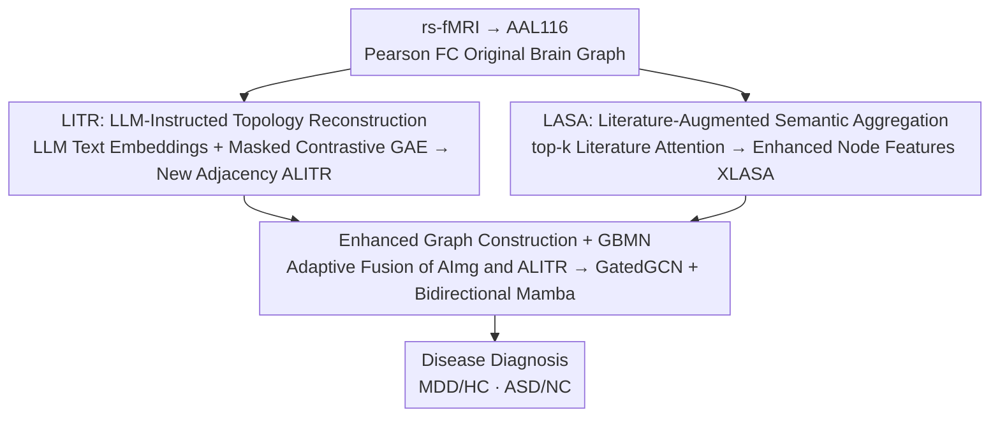

# IEBGL:An Interpretability-Enhanced Brain Graph Learning Framework with LLM-Instructed Topology and Literature-Augmented Semantics

**Conference**: CVPR 2026  
**Paper**: [CVF Open Access](https://openaccess.thecvf.com/content/CVPR2026/html/Duan_IEBGLAn_Interpretability-Enhanced_Brain_Graph_Learning_Framework_with_LLM-Instructed_Topology_and_CVPR_2026_paper.html)  
**Code**: https://github.com/CxImgLab/IEBGL  
**Area**: Medical Imaging / Brain Networks / Graph Neural Networks  
**Keywords**: Brain Graph Learning, rs-fMRI, Large Language Model, Literature Augmentation, Interpretability

## TL;DR
IEBGL injects two streams of external knowledge—"LLM reasoning" and "biomedical literature semantics"—into rs-fMRI brain graphs. Specifically, it uses LLMs to reconstruct brain connection topology and literature embeddings to enhance brain region node features. These are processed by a graph-bidirectional Mamba network for depression/autism diagnosis. While improving accuracy, it also aligns abnormal brain regions with relevant literature, providing interpretable diagnostic evidence.

## Background & Motivation

**Background**: The use of resting-state functional MRI (rs-fMRI) to construct "brain graphs" (where brain regions are nodes and functional connectivity represents edges) for diagnosing brain diseases (MDD, ASD) via Graph Neural Networks (GNNs) has become a mainstream paradigm.

**Limitations of Prior Work**: Most existing methods rely solely on imaging data. Node features are typically derived from functional connectivity (FC) vectors without biological or cognitive semantics. Adjacency matrices are built on statistical correlations between ROIs, reflecting "signal similarity" rather than true semantic relationships between brain regions. This results in limited representation power and, more critically, **poor interpretability**—clinicians cannot determine why specific connections are flagged as significant.

**Key Challenge**: The "priors" required for brain graph modeling—such as the function of specific regions or which regions co-mutate in certain diseases—are heavily documented in neuroscience literature and expert experience but cannot be learned from pure correlation data. Both node semantic priors and topological semantic priors are missing.

**Goal**: To simultaneously inject external medical knowledge into both the topological structure (edges) and node features (points) of brain graphs without additional labeling, while ensuring the injection process itself is interpretable.

**Key Insight**: LLMs have absorbed vast amounts of neuroscience knowledge and can "answer" questions about abnormal brain region behaviors and their correlations in specific diseases. Meanwhile, PubMed literature provides semantic evidence for region-disease associations. Together, these sources fill the two missing categories of priors.

**Core Idea**: LLM-Instructed Topology Reconstruction (LITR) guides the reconstruction of connection topology, and Literature-Augmented Semantic Aggregation (LASA) enhances node representations. These are fused into an "interpretability-enhanced brain graph" and fed into a graph-bidirectional Mamba network for classification.

## Method

### Overall Architecture
Each subject is represented as a brain graph $G=(V, A_{Img}, X_{Img})$, where $V$ denotes 116 brain regions according to the AAL116 atlas, $A_{Img}$ is the Pearson correlation-based FC matrix, and $X_{Img}$ is the connectivity vector for each region. IEBGL processes this original graph through two parallel external knowledge enhancement branches: LITR modifies edges (topology), and LASA modifies nodes (features). These are fused into an enhanced graph $G_{Enhanced}$ and passed to the GBMN (a dual-branch GatedGCN + bidirectional Mamba) to output diagnostic results for MDD/HC or ASD/NC.

### Key Designs

**1. LITR: Injecting "Brain Region Knowledge" into Topology via LLM**

To address the lack of semantic priors in statistical adjacency matrices, LITR reconstructs topology in two steps. The first is "Knowledge Extraction": based on clinical expert advice and NeuroQuery terminology, structured cognitive prompts $Q=\{q_1,\dots,q_m\}$ (covering anatomy, function, and pathology) are designed for each brain region. LLM (ChatGPT-4o) generates descriptions $Resp_i = \text{LLM}(v_i, Q)$, which are encoded into node features $X_{LLM}$ using a pre-trained text encoder. This forms the LLM prior graph $G_{LLM}=(V, A_{Img}, X_{LLM})$.

The second is "Topology Distillation": a Graph Autoencoder (GAE) with masked contrastive learning implicitly optimizes the connection structure. Two augmented views are created via random node masking (setting dimensions to the mean $\mu$ with probability $p$: $\tilde{x}_i = Mask_i \odot x_i + (1-Mask_i)\odot\mu$) and edge perturbation (Bernoulli mask $\tilde{A}=A\odot M/(1-\gamma)$). Both views are fed into a 2-layer GCN encoder to obtain latent representations $Z_i$. Masked nodes are re-masked (replaced with a learnable token and aggregated from neighbors) to get $\tilde{H}_i$. The decoder reconstructs the weighted adjacency $A_{LITR}=\sigma(\tilde{H}_i W \tilde{H}_i^\top)$ via a bilinear map. $A_{LITR}$ thus encodes both LLM priors and topological structure, with robustness ensured by contrastive and reconstruction objectives. LITR is pre-trained and frozen.

**2. LASA: Enhancing Node Representations with Literature Semantics**

To address the lack of cognitive semantics in node features, LASA treats disease-related literature as external long-term memory. Highly relevant papers ($M$) are selected for the target disease. Each paper's "title + abstract" is encoded into a semantic matrix $X_{DOC}\in\mathbb{R}^{M\times d_t}$ via a pre-trained BERT (Whole Word Masking).

Aggregation uses a "Literature-Augmented Node Aggregation" mechanism: imaging features $X_{Img}$ and literature matrix $X_{DOC}$ are aligned into a shared space via $F_{align}$ to generate queries $Q$ and keys $K$. Scaled dot-product attention calculates the similarity between each brain region and all literature. For each region, **only the top-k most relevant papers** are selected, resulting in a sparse similarity matrix $\alpha\in\mathbb{R}^{N\times k}$. A node-level semantic modulation matrix $W$ is introduced to form the final attention distribution $\tilde{\alpha}=\text{softmax}(\alpha\odot W)$ (with constraints $\sum_j W_{ij}=1, W_{ij}\ge0$). Aggregated features $R_T=\tilde{\alpha}\cdot K^{(k)}$ are concatenated with $Q$ and passed through a fusion MLP: $X_{LASA}=\text{MLP}_{fusion}([Q;R_T])$. This ensures each region is "annotated" by its most relevant literature, providing explicit interpretability.

**3. Enhanced Graph Construction + GBMN Diagnosis**

LITR provides semantic topology $A_{LITR}$, and LASA provides semantic nodes $X_{LASA}$. These are fused with original imaging data using learnable parameters: $A_{Fused}=\alpha A_{Img}+(1-\alpha)A_{LITR}$, where $\alpha=\sigma(\theta)$, balancing "signal correlation" and "LLM semantics." The resulting $G_{Enhanced}$ is processed by GBMN: GatedGCN captures local features, while bidirectional Mamba captures long-range dependencies via state-space models.

### Loss & Training
Two-stage training is employed. LITR is pre-trained as a GAE with $L_{LITR}=L_{rec}+\beta L_{cl}$ ($L_{rec}$ is MSE for topology; $L_{cl}$ is InfoNCE across views with $\tau=0.5, \beta=0.2$). In the main stage, LASA adds L1 sparse constraints and entropy regularization to $W$: $L_{LASA}=\lambda_1\sum_i\|W_i\|_1+\lambda_2(-\sum_i\sum_j\tilde{\alpha}_{ij}\log\tilde{\alpha}_{ij})$ ($\lambda_1=10^{-3}, \lambda_2=0.1$). Classification uses cross-entropy $L_{cls}$. Total loss: $L_{total}=L_{cls}+L_{LASA}$. Implementation: AAL116 atlas, 5-fold CV, RTX 4090, Adam (lr=0.001), 200 epochs, top-k=5.

## Key Experimental Results

### Main Results
Evaluated on REST-meta-MDD (2428 subjects, 35,133 MDD papers) and ABIDE (1035 subjects, 32,617 ASD papers) against 11 methods (GCN, GraphSAGE, BrainGNN, Graph-Mamba, SK-GNN, etc.).

| Dataset | Metric | IEBGL | Prev. SOTA | Gain |
|---------|--------|-------|------------|------|
| MDD | ACC | 79.93 | 75.42 (BrainNetTF) | +4.51 |
| MDD | AUC | 84.22 | 82.47 (BrainGNN) | +1.75 |
| MDD | F1 | 75.31 | 73.44 (BrainNetTF) | +1.87 |
| ABIDE | ACC | 81.43 | 78.46 (Graph-Mamba) | +2.97 |
| ABIDE | AUC | 83.92 | 81.48 (SK-GNN) | +2.44 |
| ABIDE | F1 | 80.22 | 78.57 (SK-GNN) | +1.65 |

IEBGL notably outperforms SK-GNN, which also utilizes literature data, highlighting the effectiveness of the dual-path enhancement.

### Ablation Study

| Configuration | MDD ACC | ABIDE ACC | Description |
|---------------|---------|-----------|-------------|
| w/o Both | 73.66 | 74.27 | No LITR/LASA, raw graph to GBMN |
| w/o LASA | 74.33 | 75.32 | No literature enhancement |
| w/o LITR | 76.88 | 76.41 | No LLM topology reconstruction |
| rpl. LASA | 77.89 | 79.28 | Mean pooling instead of top-k modulation |
| rpl. LITR | 77.44 | 80.32 | Standard GAE instead of contrastive learning |
| rpl. GBMN | 76.58 | 79.24 | Standard GIN classifier |
| IEBGL (full) | 79.93 | 81.43 | Full model |

### Key Findings
- **Dual knowledge streams are complementary**: Removing either LITR or LASA significantly degrades performance, suggesting that LLM topological priors and literature semantic priors contribute uniquely.
- **Design precision**: Replacing specific mechanisms (top-k modulation, contrastive pre-training, or Mamba backbone) leads to performance drops, validating the specialized components.
- **Actionable interpretability**: Gradient attribution identifies top-10 regions (e.g., PCUN.R, OLF.R). LASA links regions to literature: PCUN.R (Default Mode Network) corresponds to literature on self-referential processing in MDD, demonstrating biological consistency.

## Highlights & Insights
- **LLM as a "Topology Prior Generator"**: Instead of using LLMs as direct classifiers, LITR translates linguistic knowledge into graph structures via descriptions and contrastive GAEs, a more robust approach than direct prompting.
- **Endogenous interpretability**: Since node features are derived from specific literature and constrained by top-k selection (via L1/entropy regularization), the evidence for a decision is built into the model structure rather than being a post-hoc approximation.
- **Value**: The LASA module (top-k retrieval + semantic modulation) provides a template for injecting domain literature into graph nodes, applicable to any task where nodes have corresponding textual corpora (e.g., molecular graphs + pharmacology papers).

## Limitations & Future Work
- LITR is sensitive to the quality of LLM responses; hallucinations or outdated knowledge could contaminate the topological priors. ⚠️
- Literature retrieval based on keywords might include noise; the model's robustness to irrelevant literature was not extensively analyzed.
- Evaluation was limited to binary classification (MDD, ASD) and a single atlas (AAL116).
- The two-stage training process (LITR then LASA/GBMN) may be less optimal than end-to-end joint optimization.

## Related Work & Insights
- **vs. SK-GNN**: SK-GNN uses Gumbel-Softmax to select semantic segments; IEBGL's explicit dual-path (LITR + LASA) with adaptive fusion proves superior.
- **vs. Pure Imaging SOTA**: Methods like BrainGNN or Graph-Mamba focus on architectural complexity. IEBGL proves that injecting external priors provides a significant performance boost over architecture optimization alone.
- **vs. MGNN/LSAP**: These use structural/numerical priors (brain modules or heat kernels). IEBGL's semantic priors are orthogonal and could potentially be combined with such methods.

## Rating
- Novelty: ⭐⭐⭐⭐⭐ (Dual-path LLM/Literature injection is pioneering)
- Experimental Thoroughness: ⭐⭐⭐⭐ (Solid comparison and ablation, though lacks multi-atlas/multi-class tests)
- Writing Quality: ⭐⭐⭐⭐ (Clear modules and formulas, specific interpretability cases)
- Value: ⭐⭐⭐⭐ (Practical framework for knowledge-enhanced medical diagnosis)

<!-- RELATED:START -->

## Related Papers

- [\[CVPR 2026\] Bridging Brain and Semantics: A Hierarchical Framework for Semantically Enhanced fMRI-to-Video Reconstruction](bridging_brain_and_semantics_a_hierarchical_framework_for_semantically_enhanced_.md)
- [\[CVPR 2026\] Virtual Nodes Guided Dynamic Graph Neural Network for Brain Tumor Segmentation with Missing Modalities](virtual_nodes_guided_dynamic_graph_neural_network_for_brain_tumor_segmentation_w.md)
- [\[CVPR 2026\] From Panel to Pixel: Zoom-In Vision-Language Pretraining from Biomedical Scientific Literature](from_panel_to_pixel_zoom-in_vision-language_pretraining_from_biomedical_scientif.md)
- [\[ICLR 2026\] The Mind's Transformer: Computational Neuroanatomy of LLM-Brain Alignment](../../ICLR2026/medical_imaging/the_minds_transformer_computational_neuroanatomy_of_llm-brain_alignment.md)
- [\[CVPR 2026\] MedTVT-R1: A Multimodal LLM Empowering Medical Reasoning and Diagnosis](medtvt-r1_a_multimodal_llm_empowering_medical_reasoning_and_diagnosis.md)

<!-- RELATED:END -->
