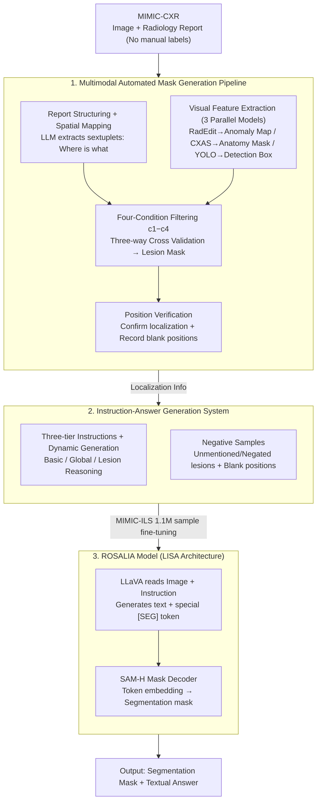

# Instruction-Guided Lesion Segmentation for Chest X-rays with Automatically Generated Large-Scale Dataset

**Conference**: CVPR 2026  
**arXiv**: [2511.15186](https://arxiv.org/abs/2511.15186)  
**Code**: [GitHub](https://github.com/checkoneee/ROSALIA)  
**Area**: Medical Imaging  
**Keywords**: Chest X-ray, Lesion Segmentation, Instruction Guidance, Automated Dataset Construction, Vision-Language Models

## TL;DR

Ours proposes the Instruction-guided Lesion Segmentation (ILS) task for chest X-rays, constructs the first large-scale automatically generated instruction-answering dataset MIMIC-ILS (1.1M samples, 192K images, 91K masks), and trains the ROSALIA model to achieve 71.2% gIoU and 91.8% null-target accuracy, significantly outperforming existing general and medical segmentation models.

## Background & Motivation

Chest X-ray (CXR) is one of the most common medical imaging examinations. Lesion localization and boundary identification are core tasks for radiologists, but this process is labor-intensive and requires high clinical expertise.

Existing CXR lesion segmentation faces two major bottlenecks:
1.  **Limited Annotation Scale**: Existing datasets (e.g., VinDr-CXR 15K images, SIIM-ACR 13K images) rely on manual expert annotation, which is scale-limited, and most provide only bounding boxes or single-type lesion masks.
2.  **High User Entry Barrier**: Existing text-guided segmentation methods require users to provide expert-level detailed descriptions (e.g., "bilateral lung infection, two infected areas..."), making them inaccessible to non-professional users.

**Key Challenge**: How to generate high-quality lesion masks and instruction-answer pairs at scale without manual annotation while supporting easy-to-use user instructions?

**Key Insight**: Utilize existing image-report paired data in MIMIC-CXR through a multimodal automated pipeline to extract spatial and textual information, generating a fully automated, large-scale ILS dataset.

## Method

### Overall Architecture

This paper addresses the challenge of scaling chest X-ray (CXR) lesion segmentation datasets to the million-level without manual annotation and training a segmentation model that understands natural language instructions. The key observation is that MIMIC-CXR already contains a large number of "image + radiology report" pairs—reports specify "what lesion is where," but this textual information has not been converted into pixel-level masks.

The pipeline is divided into two phases: first, extracting lesion masks from "image + report" using an automated pipeline (localization phase); second, synthesizing "instruction-answer" training pairs based on this localization information (data phase); and finally, fine-tuning the ROSALIA segmentation model using the synthesized data. ROSALIA follows the LISA architecture, end-to-end coupling a vision-language model (LLaVA) and a segmentation model (SAM). Users provide a one-sentence instruction, and the model outputs a mask plus a textual answer.

### Key Designs

**1. Multimodal Automated Mask Generation Pipeline: Cross-validating lesion masks under zero manual labels**

The primary pain point is dataset scale—expert manual outlining caps at tens of thousands, and text like "pneumonia in the right lower lobe" cannot be directly converted to a mask. The pipeline achieves this by cross-referencing text, visual anomalies, and detection boxes. First, an LLM structures report descriptions into sextuplets (entity, sentence index, existence, certainty, location, lesion type). Standard mapping of colloquial location terms to anatomical labels provides the "where" in text. Second, three visual models run in parallel: RadEdit (a diffusion model) generates a "pseudo-normal" CXR to produce an anomaly map $\mathcal{A}$ via differencing, answering "where looks abnormal"; CXAS provides anatomical masks $\{\mathcal{M}_i\}$; and YOLO detects lesions for candidate boxes $\{\mathcal{B}_j\}$.

$$\mathcal{A} = |\,I_{\text{orig}} - I_{\text{normal}}\,|$$

Third, the "quality gate": each candidate box must pass four filters—overlap with designated anatomy (c1), detection confidence (c2), anomaly signal ratio within the box (c3), and minimum size (c4). Finally, location verification ensures the mask aligns with the report description, while clean regions are recorded as negative samples.

**2. Instruction-Answer Generation System: Translating localization into diverse training samples**

To train a model to follow instructions, three levels of prompts are designed: Basic instructions provide both lesion type and location ("Segment the pneumonia in the right lung"); Global instructions provide only the lesion type ("Segment the opacity"); and Lesion Reasoning instructions replace specific terms with "opacity," forcing the model to infer the specific lesion type. Dynamic generation conditions ensure consistency (e.g., global instructions are only generated if the localization perfectly matches the report).

**3. ROSALIA Model Architecture: Re-framing segmentation as a VLM special token generation**

ROSALIA follows the LISA-7B approach: the VLM (LLaVA) reads the image and instruction, outputting a textual response and a special `[SEG]` token. This token's hidden embedding is fed into the SAM-H mask decoder. Training employs LoRA on the VLM (rank=128, alpha=256) and full fine-tuning of the mask decoder for 15 epochs with a 1:1 positive-to-negative sample ratio.

### Loss & Training

$$\mathcal{L} = \lambda_{txt}\mathcal{L}_{txt} + \lambda_{bce}\mathcal{L}_{bce} + \lambda_{dice}\mathcal{L}_{dice}$$

- $\mathcal{L}_{txt}$: Autoregressive cross-entropy loss (text generation), $\lambda_{txt}=0.5$
- $\mathcal{L}_{bce}$: Binary cross-entropy loss (segmentation), $\lambda_{bce}=5$
- $\mathcal{L}_{dice}$: DICE loss (segmentation, positive samples only), $\lambda_{dice}=1$

## Key Experimental Results

### Main Results

| Model | gIoU | cIoU | N-Acc. | Description |
|------|------|------|--------|------|
| LISA-7B | 8.3% | 12.8% | 0.7% | General Domain |
| LISA-13B | 8.9% | 12.2% | 0.0% | General Domain |
| Text4Seg | 6.1% | 10.3% | 20.6% | General Domain |
| BiomedParse | 23.8% | 18.5% | 0.6% | Medical Domain |
| RecLMIS | 22.4% | 19.5% | 0.0% | Medical Domain |
| **ROSALIA (Ours)** | **71.2%** | **75.6%** | **91.8%** | Trained on MIMIC-ILS |

### Results by Lesion Type

| Lesion Type | gIoU | cIoU | N-Acc. |
|---------|------|------|--------|
| Cardiomegaly | 89.0% | 89.0% | 85.8% |
| Pneumonia | 57.2% | 60.4% | 97.1% |
| Atelectasis | 60.2% | 58.7% | 91.7% |
| Opacity | 60.5% | 64.2% | 85.0% |
| Consolidation | 61.9% | 65.6% | 91.2% |
| Edema | 64.8% | 66.6% | 92.2% |
| Pleural Effusion | 60.3% | 59.6% | 90.4% |

### Ablation Study — Dataset Quality Evaluation

| Expert | Total Acceptance | Positive Acc. | Negative Acc. |
|------|---------|-------------|-------------|
| Expert A | 96.1% | 95.6% | 96.5% |
| Expert B | 97.2% | 96.0% | 98.3% |
| Expert C | 98.7% | 99.8% | 97.8% |
| Expert D | 97.6% | 96.9% | 98.2% |
| **Overall** | **96.4%** | 90.1% | 97.7% |

### Key Findings

- Existing models fail systematically in the ILS task, with gIoU below 24% and near-zero N-Acc.
- Automatically generated datasets achieved a 96.4% acceptance rate from four senior radiologists.
- Textual answer accuracy reached 94.4%, with basic instructions being the most accurate (96.8%).
- Cardiomegaly segmentation is the most successful (gIoU 89.0%) as it utilizes heart masks for annotation.

## Highlights & Insights

- The core contribution is the automated dataset pipeline, achieving expert-level quality without manual labor.
- The ILS task definition is clinically practical: it supports simple instructions and handles null targets ("No lesions found").
- Dataset scale (1.1M samples) is 10-100x larger than existing CXR segmentation datasets.
- RadEdit's use of Diffusion models for anomaly localization via "normal image generation" is highly effective.

## Limitations & Future Work

- **Background**: Positive sample acceptance (90.1%) is lower than negative (97.7%), indicating room for refinement in positive mask precision.
- **Limitations of Prior Work**: Covers only 7 major lesion types; fails to include more fine-grained CXR abnormalities.
- **Goal**: Improve lesion reasoning accuracy (currently 75.1% for opacity-to-type inference).
- **Key Challenge**: The pipeline depends on three pre-trained models; failure in any propagates to the final dataset quality.
- **Experimental Thoroughness**: Currently validated only on MIMIC-CXR; cross-institutional generalization remains untested.

## Related Work & Insights

- **vs BiomedParse**: Although medical-specific, it only supports class labels and cannot handle instruction-level input or null targets.
- **vs RecLMIS**: Requires expert-level user descriptions, creating a high barrier to entry.
- **vs LISA**: ROSALIA leverages the same architecture but jumps from 8.3% to 71.2% gIoU after training on MIMIC-ILS, proving that domain-specific data is more critical than architecture scale.

## Rating

- Novelty: ⭐⭐⭐⭐ 
- Experimental Thoroughness: ⭐⭐⭐⭐ 
- Writing Quality: ⭐⭐⭐⭐ 
- Value: ⭐⭐⭐⭐⭐ 

<!-- RELATED:START -->

## Related Papers

- [\[CVPR 2026\] Temporal Inversion for Learning Interval Change in Chest X-Rays](temporal_inversion_for_learning_interval_change_in_chest_x-rays.md)
- [\[NeurIPS 2025\] CXReasonBench: A Benchmark for Evaluating Structured Diagnostic Reasoning in Chest X-rays](../../NeurIPS2025/medical_imaging/cxreasonbench_a_benchmark_for_evaluating_structured_diagnostic_reasoning_in_ches.md)
- [\[ICCV 2025\] GEMeX: A Large-Scale, Groundable, and Explainable Medical VQA Benchmark for Chest X-ray Diagnosis](../../ICCV2025/medical_imaging/gemex_a_large-scale_groundable_and_explainable_medical_vqa_benchmark_for_chest_x.md)
- [\[CVPR 2026\] BackSplit: The Importance of Sub-dividing the Background in Biomedical Lesion Segmentation](backsplit_the_importance_of_sub-dividing_the_background_in_biomedical_lesion_seg.md)
- [\[ECCV 2024\] CheX: Interactive Localization and Region Description in Chest X-rays](../../ECCV2024/medical_imaging/chex_interactive_localization_and_region_description_in_chest_x-rays.md)

<!-- RELATED:END -->
