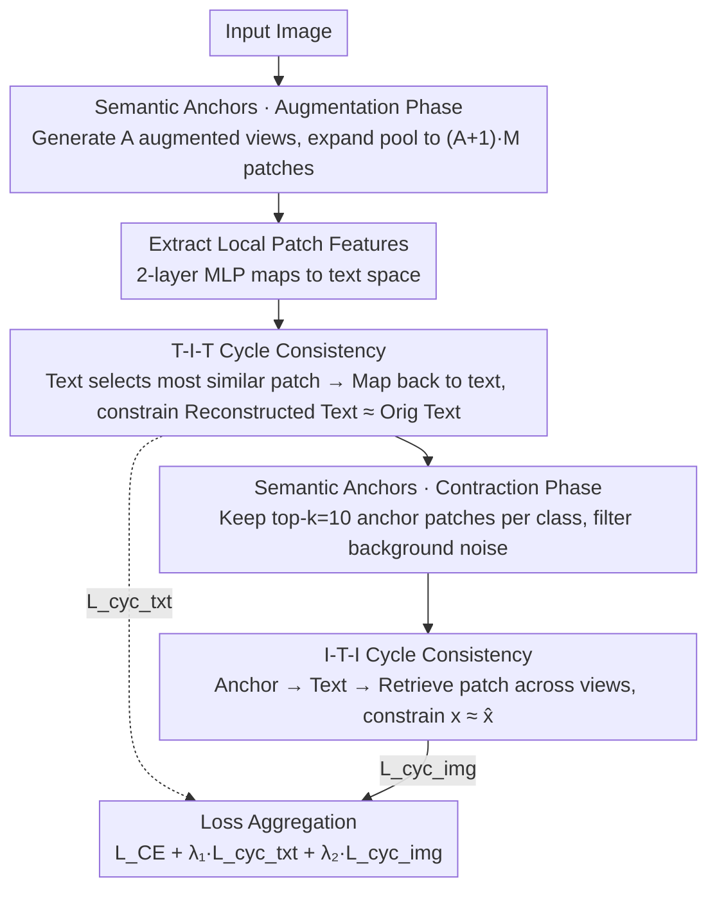

# Interpretable Cross-Domain Few-Shot Learning with Rectified Target-Domain Local Alignment

**Conference**: CVPR 2026  
**arXiv**: [2603.17655](https://arxiv.org/abs/2603.17655)  
**Code**: [CC-CDFSL](https://github.com/zyaz/CC-CDFSL)  
**Area**: Medical Imaging  
**Keywords**: Cross-Domain Few-Shot Learning, CLIP, Local Feature Alignment, Cycle Consistency, Interpretability

## TL;DR

Ours identifies and addresses the degradation of local feature alignment in CLIP during Cross-Domain Few-Shot Learning (CDFSL). The proposed CC-CDFSL framework utilizes a cycle-consistency-based approach with T-I-T and I-T-I bidirectional paths and a Semantic Anchor mechanism to rectify patch-level vision-language alignment while enhancing model interpretability.

## Background & Motivation

Vision-Language Models like CLIP provide a strong foundation for CDFSL, yet a critical problem remains: after fine-tuning on a target domain, the model struggles to focus on fine-grained visual cues (e.g., ground-glass opacities or local nodules in lung X-rays). The authors observe that while CLIP covers important regions in the source domain, the alignment degradation between local patches and text features is significantly more severe than that of global features when moving across domains.

**Key Challenge**: By measuring the global alignment score $\text{A}_g$ and local alignment score $\text{A}_l$, it was found that the drop in $\text{A}_l$ is substantially larger than $\text{A}_g$ in cross-domain tasks, confirming that domain gaps and data scarcity damage local feature alignment more severely.

This is particularly critical in downstream fields like medical diagnosis requiring fine-grained recognition—for instance, subtle texture or density changes in pneumonia appear only in a few patches, yet the model's heatmaps often only outline the body contour roughly.

## Method

### Overall Architecture

This paper addresses the degradation of local alignment after CLIP cross-domain fine-tuning: the model focuses only on body contours rather than fine-grained lesions. **Goal**: To anchor local visual features to correct text semantics without patch-level annotations via two "circular" paths. When an image is input, the **Augmentation Phase** of the Semantic Anchor (SA) expanded the patch candidate pool. The text-side cycle (T-I-T) applies a bidirectional consistency constraint on this pool. Subsequently, the **Contraction Phase** of the SA filters the most relevant anchor patches for each class, and the image-side cycle (I-T-I) applies a second constraint on these clean anchors. The two SA phases precede the two cycles, and the resulting regularization terms are added to the standard cross-entropy loss.

### Key Designs

**1. T-I-T Cycle Consistency: Forcing text features to return to themselves in patch space**

**Mechanism**: Local alignment suffers most during cross-domain shifts, and few-shot scenarios lack patch-level labels for direct supervision. T-I-T bypasses this by using cycle consistency: for each class text feature $\mathbf{T}_j$, the most similar patch $\mathbf{L}_j^* = \mathbf{L}_{\arg\max_i \mathbf{D}_{j,i}^{txt}}$ is selected, mapped back to the text space as $\mathbf{T}_j^{rec}$, and constrained to be close to the starting point $\mathbf{T}_j$:

$$\mathcal{L}_{\text{cyc\_txt}} = 1 - \frac{1}{C}\sum_{j=1}^{C}\text{sim}(\mathbf{T}_j, \mathbf{T}_j^{rec})$$

The cycle only closes if the text hits the correct semantic patch and that patch points uniquely back to the original text, providing a self-supervised signal for local alignment.

**2. Semantic Anchors: Expansion then contraction for denoising**

**Design Motivation**: Visual information contains irrelevant background noise. SA cleans the patch pool in two steps: The augmentation phase generates $A$ views, expanding the pool to $\mathbf{X}_{aug} \in \mathbb{R}^{((A+1) \cdot M) \times d}$ to provide diversity; the contraction phase keeps only the top-$k$ ($k=10$) patches most similar to the class text as semantic anchors $\mathbf{X}_{anchor}$, filtering out background noise like normal skin or empty satellite tiles.

**3. I-T-I Cycle Consistency: From anchor patches through text and back across views**

**Function**: To ensure robustness against input transformations (rotation, flipping), I-T-I reverses the cycle. For each anchor $\mathbf{x}_n$, it finds the most similar text $t_n$, then uses $t_n$ to retrieve the most similar patch $\hat{\mathbf{x}}_n$ in an **augmented view**. Forcing $\mathbf{x}_n \approx \hat{\mathbf{x}}_n$ across different views ensures the alignment is robust to geometric transformations.

### Loss & Training

$$\mathcal{L}_{total} = \mathcal{L}_{CE} + \lambda_1 \mathcal{L}_{\text{cyc\_txt}} + \lambda_2 \mathcal{L}_{\text{cyc\_img}}$$

- $\lambda_1 = 3.0$, $\lambda_2 = 2.0$ (determined via grid search on ISIC).
- $k=10$ (number of anchor patches), fixed for all experiments.
- ViT-Base/16 CLIP backbone, 100 epochs fine-tuning, single RTX 4090.
- 2-layer MLP transforms local patch features to the text feature space.

## Key Experimental Results

### Main Results

| Dataset | Task | CLIP-LoRA | CLIP-LoRA + Ours | Gain |
|--------|------|-----------|-----------------|------|
| ISIC (Skin) | 5-way 1-shot | 35.23 | 38.13 | +2.90 |
| ChestX (X-ray) | 5-way 1-shot | 21.73 | 22.21 | +0.48 |
| EuroSAT (Sat.) | 5-way 1-shot | 81.49 | 86.07 | +4.58 |
| CropDisease | 5-way 1-shot | 85.11 | 88.91 | +3.80 |
| ISIC | 5-way 5-shot | 50.68 | **54.72** | **+4.04** |
| EuroSAT | 5-way 5-shot | 92.63 | **94.35** | **+1.72** |

### Ablation Study

| Configuration | ISIC | ChestX | EuroSAT | Crop. | Average |
|------|------|--------|---------|-------|------|
| Baseline | 50.68 | 24.44 | 92.63 | 96.20 | 65.98 |
| + T-I-T | 51.13 | 25.15 | 93.79 | 96.37 | 66.61 |
| + T-I-T + SA | 54.30 | 25.35 | 94.33 | 96.95 | 67.73 |
| + I-T-I + SA | 53.81 | 25.14 | 93.83 | 97.01 | 67.45 |
| **Full (T-I-T + I-T-I + SA)** | **54.72** | **25.47** | **94.35** | **97.08** | **67.90** |

### Key Findings

- T-I-T cycles contribute more than I-T-I (+0.63 vs +1.47 avg) by focusing on semantically relevant patches.
- The SA mechanism significantly improves both cycles (avg +1.12 and +0.84).
- Cross-view retrieval > In-image retrieval > Global retrieval; view diversity is key.
- CC-CDFSL is a plug-and-play module compatible with CoOp, CLIP-Adapter, Maple, and CLIP-LoRA.
- Improvements were observed in base-to-new generalization across 11 datasets, notably in EuroSAT (+3.6%).

## Highlights & Insights

- **Novelty**: First to identify and quantify that local alignment degradation exceeds global degradation in CDFSL for CLIP.
- **Key Insight**: Introducing cycle consistency from translation tasks to VLM local alignment is an elegant self-supervised approach.
- **Mechanism**: The "expand-then-contract" design of SA balances candidate diversity and noise filtering.
- **Interpretability**: The T-I-T path reveals pathologically relevant regions and cross-class semantic relationships even if text reconstruction is not perfect.
- **Value**: Designing the method as a regularization term ensures excellent generalizability.

## Limitations & Future Work

- Limited improvement on the ChestX dataset (+0.48 / +1.03), possibly due to complex X-ray semantics.
- $\lambda_1, \lambda_2$ require tuning on the target domain; optimal hyperparameters may vary by dataset.
- Specific data augmentation strategies for view generation are not detailed.
- Validated only on ViT architectures; not yet extended to other vision encoders.
- Insufficient computational overhead analysis; increased patch similarity calculations may affect training efficiency.

## Related Work & Insights

- **Related Work**: Cycle consistency from CycleGAN (Liu et al. 2017) is creatively applied to VLM local alignment.
- FG-CLIP (Xie et al. 2025) explores insufficient fine-grained capabilities in CLIP.
- CLIP-LoRA (Zanella & Ben Ayed 2024) serves as the strongest baseline; ours achieves an average gain of +2.94 (1-shot) on top of it.

## Rating

- **Novelty**: ⭐⭐⭐⭐ Precise problem identification; novel application of cycle consistency.
- **Experimental Thoroughness**: ⭐⭐⭐⭐⭐ Highly thorough with 4 datasets, 4 PEFT methods, 2 backbones, and detailed ablations.
- **Writing Quality**: ⭐⭐⭐⭐ Rigorous logic, rich visualization, and fluent narrative.
- **Value**: ⭐⭐⭐⭐ A general plug-and-play framework significant for few-shot scenarios requiring fine-grained recognition.

<!-- RELATED:START -->

## Related Papers

- [\[CVPR 2026\] Reclaiming Lost Text Layers for Source-Free Cross-Domain Few-Shot Learning](reclaiming_lost_text_layers_for_source-free_cross-domain_few-shot_learning.md)
- [\[CVPR 2026\] Mind the Discriminability Trap in Source-Free Cross-domain Few-shot Learning](mind_the_discriminability_trap_in_source-free_cross-domain_few-shot_learning.md)
- [\[CVPR 2026\] CoFiDA-M: Concept-Aware Feature Modulation for Cross-Domain Adaptation with Image-Only Inference](cofida-m_concept-aware_feature_modulation_for_cross-domain_adaptation_with_image.md)
- [\[CVPR 2026\] Keep It Frozen: Domain-Routed Conditional Residual Modulation for Multi-Domain Vision Transformers](keep_it_frozen_domain-routed_conditional_residual_modulation_for_multi-domain_vi.md)
- [\[CVPR 2026\] Cross-domain Dual-stream Feature Disentanglement for Brain Disorder Prediction with Sparsely Labeled PET](cross-domain_dual-stream_feature_disentanglement_for_brain_disorder_prediction_w.md)

<!-- RELATED:END -->
