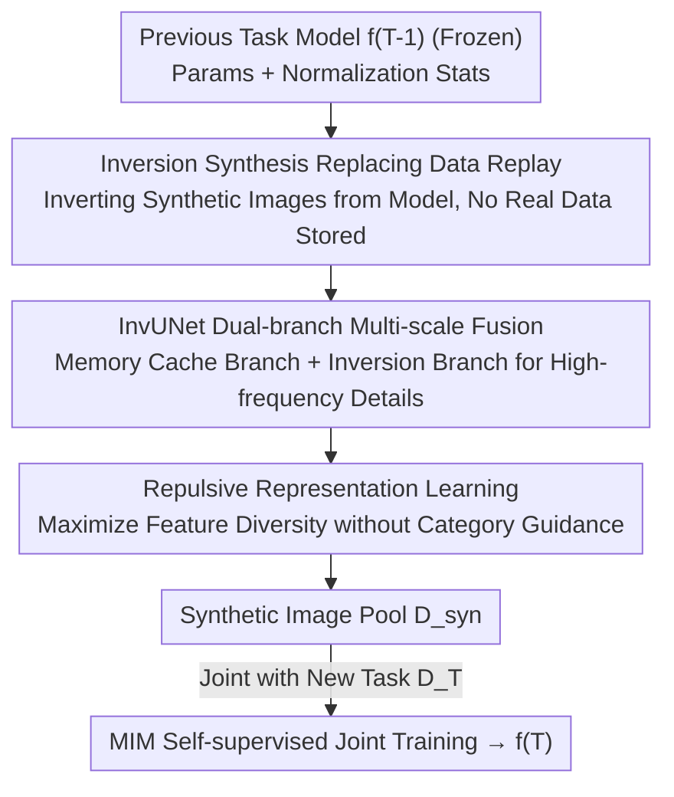

# InvCoSS: Inversion-driven Continual Self-supervised Learning in Medical Multi-modal Image Pre-training

**Conference**: CVPR 2026  
**Paper**: [CVF Open Access](https://openaccess.thecvf.com/content/CVPR2026/html/Luo_InvCoSS_Inversion-driven_Continual_Self-supervised_Learning_in_Medical_Multi-modal_Image_Pre-training_CVPR_2026_paper.html)  
**Code**: https://zihaoluoh.github.io/InvCoSS (Project Page)  
**Area**: Medical Image / Self-supervised / Continual Learning  
**Keywords**: Continual Self-supervised Learning, Model Inversion, Catastrophic Forgetting, Data-free, Medical Multi-modal Pre-training

## TL;DR
InvCoSS utilizes "model inversion" to synthesize images from self-supervised models of previous stages, replacing privacy-sensitive real data replay buffers. It performs continual self-supervised pre-training without storing any original data, matching or even exceeding the performance of data replay methods across nine medical downstream tasks while reducing storage overhead by up to $590\times$.

## Background & Motivation
**Background**: Self-supervised learning (SSL) has become the mainstream pre-training paradigm for medical image analysis. However, current models are mostly limited to a single modality (training separately for CT, X-ray, or MRI), leading to poor cross-modal generalization. Jointly training with multi-modal data is costly and restricted by privacy ethics. Consequently, "Continual Self-supervised Learning" (CSSL) has emerged—allowing models to act as continual learners, incrementally training across modalities (e.g., Report $\rightarrow$ X-ray $\rightarrow$ CT $\rightarrow$ MRI $\rightarrow$ Pathology) to avoid one-time data collection.

**Limitations of Prior Work**: The primary obstacle in continual learning is catastrophic forgetting—forgetting old knowledge when learning new modalities. Currently, the most effective and commonly used mitigation is data replay, which involves storing a portion of old task data and mixing it into new training stages (as seen in MedCoSS). However, in medical scenarios, storing real images of former patients directly violates privacy and ethical reviews, and cross-institutional data transfer is often prohibited.

**Key Challenge**: To prevent forgetting, the model must "remember" old data distributions, but for privacy, it "cannot store" any old real data. These two requirements are in direct conflict.

**Goal**: Maximize the retention of knowledge from previous stages without accessing old real data (data-free), relying solely on information derived from pre-training without introducing extra GAN/Diffusion generators or dataset distillation.

**Key Insight**: The authors are inspired by "model inversion" in supervised learning—an inversion technique that reconstructs synthetic images approximating the training distribution using only the trained model checkpoint (parameters + statistics stored in normalization layers). Since the old model itself encodes the old data distribution, the model can "output" synthetic images to serve as a replay buffer, eliminating the need to store original data.

**Core Idea**: Use "synthetic images inverted from the previous self-supervised model" to replace "stored real replay data," bringing data-free model inversion into self-supervised continual learning for the first time.

## Method

### Overall Architecture
InvCoSS replaces a critical component of the standard CSSL replay workflow: while MedCoSS requires a replay buffer $\mathcal{D}_{buff}$ containing old real data when training the current task $T$, InvCoSS freezes the model $f_{T-1}$ after each old task is completed. It then uses model inversion to generate a synthetic image pool $\mathcal{D}_{syn}$ from its parameters and normalization statistics. This synthetic pool serves as a buffer for joint Masked Image Modeling (MIM) training with new task real data $\mathcal{D}_T$ to obtain $f_T$. No old real images are retained in this pipeline; only model parameters and normalization statistics are kept.

The inversion step does not simply project low-dimensional noise into images (which would lose high-frequency details). Instead, it employs a specially designed dual-branch generator, InvUNet, and optimizes a joint target consisting of mask reconstruction, normalization statistics matching, image priors, and repulsive diversity constraints.

### Key Designs

**1. Inversion-based substitute: Using synthetic images "vomited" by the model as a data-free buffer**

Addressing the conflict between "remembering old data to prevent forgetting" and "privacy prohibiting data storage," InvCoSS stores no real images. Instead, for each old task $t$, it solves an inversion objective $x_{syn}=\arg\min_{\hat{x}}[\mathcal{L}_{task}(\hat{x};f)+\mathcal{R}(\hat{x};f)]$, optimizing noise into synthetic images that approximate the old distribution. These are gathered into a sample pool $\mathcal{B}_T=\bigcup_{t=1}^{T-1}\mathcal{D}_t^{syn}$. A crucial part of the regularization term $\mathcal{R}$ is normalization statistics matching $\mathcal{L}_{norm}$: assuming features follow a Gaussian distribution over a batch, it forces synthetic images to align their batch mean $\mu_l$ and variance $\sigma_l^2$ at each normalization layer with the running averages $E[\mu_l]$ and $E[\sigma_l^2]$ recorded during training. This extracts the appearance of old data from statistics. Training $f_T$ then uses $\mathcal{B}_T$ instead of MedCoSS's real buffer. This preserves knowledge while ensuring privacy, and storage is up to $590\times$ more efficient than storing 5% of real data.

**2. InvUNet: Dual-branch multi-scale fusion generator for recovering high-frequency loss**

Directly applying supervised inversion to SSL encounters a major issue: when low-dimensional noise vectors are projected bottom-up into high-dimensional images, high-frequency details degrade severely, resulting in blurred synthetic images. InvUNet adopts a multi-scale fusion approach inspired by U-Net, injecting noise latent variables $z$ directly into the network bottleneck to encode core semantics. It then uses two complementary branches: a lightweight "Memory Cache Branch" to generate multi-scale structural priors and a main "Inversion Branch" focused on high-fidelity, semantic-guided inversion. Skip connections between branches do more than pass features; they establish gradient paths, allowing error signals to return to the Memory Cache Branch to recover fine-grained details. This is key to migrating supervised inversion to SSL and supporting 2D/3D modalities.

**3. Repulsive Representation Learning: Preventing mode collapse without category guidance**

A second problem in self-supervised inversion is the lack of category labels, making synthetic images prone to aliasing, redundancy, and clustering (mode collapse). The authors maintain a persistent synthetic feature pool $P$ (sized to the number of samples to be generated). For a batch of synthetic images, features $h_i$ are extracted using the frozen encoder of $f_{T-1}$, and their cosine similarity with all features in the pool is minimized:

$$\mathcal{L}_{rep}(X^{syn},P;f_{T-1})=\frac{1}{B\cdot|P|}\sum_{i=1}^{B}\sum_{j=1}^{|P|}\left(\frac{h_i\cdot p_j}{\|h_i\|_2\|p_j\|_2}\right)^2.$$

This is a purely repulsive objective (pushing apart without positive pairs). While this would normally cause training collapse in standard contrastive learning, in InvCoSS, it is stabilized by complementary objectives (MIM, statistics matching), constraining synthesis to the learned distribution. This spreads features across the space to prevent collapse without divergence. t-SNE shows that with $\mathcal{L}_{rep}$, synthetic features no longer cluster but cover the space uniformly.

### Loss & Training
The inversion stage jointly optimizes randomly initialized InvUNet parameters $\theta_G$ and noise latent variables $z$ with a four-term weighted objective:

$$\mathcal{L}_{Inv}(\theta_G,z)=\mathcal{L}_{task}+\alpha_{norm}\mathcal{L}_{norm}+\alpha_{img}\mathcal{L}_{img}+\alpha_{rep}\mathcal{L}_{rep}.$$

Here, $\mathcal{L}_{task}$ uses MIM's masked reconstruction error; $\mathcal{L}_{norm}$ is normalization statistics matching; $\mathcal{L}_{img}$ is a total variation image prior to suppress high-frequency artifacts (with depth-wise differentiation for 3D volumes); and $\mathcal{L}_{rep}$ is the repulsive term. Loss weights are $\alpha_{norm}=1, \alpha_{img}=0.1, \alpha_{rep}=0.1$. Pre-training uses AdamW, batch size 512, 300 epochs per modality, and a cosine decay learning rate after warmup to $1.5\times10^{-4}$. InvUNet uses Adam with a generator learning rate of $2\times10^{-4}$ and $z$ at 0.05. The backbone is ViT/B.

## Key Experimental Results

### Main Results
Pre-trained on the multi-modal corpora used in MedCoSS (MIMIC-CXR / DeepLesion / ADNI / TCGA, etc.), evaluated across nine downstream benchmarks. The table summarizes the average across all tasks (AVG↑ higher is better, AVG↓ lower is better):

| Category | Method | AVG↑ | AVG↓ | Store Real Data |
| :--- | :--- | :--- | :--- | :--- |
| Static Baseline | Joint SSL* (Shared Decoder) | 87.65 | 29.78 | Yes (All modalities) |
| Data Replay | ER | 85.45 | 34.29 | Yes (5% buffer) |
| Data Replay | MedCoSS | 89.03 | 25.99 | Yes (5% buffer) |
| Data-free | EWC | 86.27 | 34.51 | No |
| Data-free | PackNet | 84.42 | 43.51 | No |
| Data-free | CaSSLe | 86.88 | 31.69 | No |
| **Data-free** | **Ours (InvCoSS)** | **89.17** | **25.14** | **No** |

InvCoSS significantly outperforms all data-free baselines (+2.29 AVG↑ over CaSSLe). Crucially, without storing any real data, it matches and slightly exceeds MedCoSS (89.17 vs 89.03 AVG↑), and is +3.72% higher than ER. Results on CT tasks are particularly strong: RICORD 84.52% ACC, LiTS 72.14% DSC, which are +1.19% and +0.49% higher than MedCoSS, respectively, suggesting that inverted synthetic data might characterize the original distribution better than clustered subsets from replay.

### Ablation Study
Ablation of components across six downstream tasks (AVG↑/AVG↓):

| Configuration | AVG↑ | AVG↓ | Description |
| :--- | :--- | :--- | :--- |
| $\mathcal{L}_{task}+\mathcal{L}_{norm}$ | 86.12 | 27.12 | Minimum combination for inversion imaging |
| $+\,\mathcal{L}_{img}$ | 86.75 | 24.29 | Add TV prior to suppress noise/color shift |
| $+\,\mathcal{L}_{rep}$ (Full) | **88.03** | **20.11** | Add repulsive term to prevent collapse |
| w/o Generator G (Direct pixel opt) | OOM | OOM | 3D volume parameters too large, memory overflow |

### Key Findings
- **Repulsive term provides the largest contribution**: Adding $\mathcal{L}_{rep}$ improved AVG↑ from 86.75 to 88.03, with notable gains in CT/MRI. t-SNE confirms it spreads feature coverage.
- **InvUNet is vital for 3D**: Direct optimization of image-sized tensors causes OOM on 3D modalities due to the massive parameter space; a generator is mandatory.
- **Pixel-level fidelity is not critical**: While synthetic images lack fine texture and sharpness, they preserve anatomical structures. Downstream performance remains strong, indicating core semantics/structure are more important for SSL knowledge retention than pixel fidelity.

## Highlights & Insights
- **Replacing "data storage" with "model + statistics storage"**: The essence of data-free replay is encoding old distributions into model parameters and statistics, then "decoding" via inversion. This saves $590\times$ storage and avoids privacy issues—a logic transferable to any privacy-constrained continual learning scenario.
- **Stabilizing repulsive targets with complementary losses**: While pure repulsion usually fails, using MIM and normalization statistics as semantic anchors keeps the model within the learned distribution.
- **Dual-branch + Information Bottleneck for high-frequency recovery**: Injecting noise into the bottleneck to force semantic encoding and using a cache branch to return detail gradients is a valuable generator architecture for other inversion tasks.

## Limitations & Future Work
- The text modality still relies on a real replay buffer (inversion is only for images), so it is not strictly data-free for all modalities.
- Synthetic images lack fine-grained texture, which might disadvantage downstream tasks dependent on low-level details.
- The inversion stage requires generator optimization for every old task, adding computational overhead as tasks increase; 3D inversion costs remain high.

## Related Work & Insights
- **vs MedCoSS (Data Replay CSSL)**: The training paradigm is identical, but InvCoSS substitutes real buffers with synthetic samples, providing privacy security and $590\times$ storage savings for similar or better performance.
- **vs EWC / PackNet / CaSSLe (Data-free CSSL)**: These rely on parameter regularization or isolation; InvCoSS "reproduces" old data, leading in AVG↑ (89.17 vs $\le$86.88).
- **vs Supervised Model Inversion (e.g., DeepInversion)**: Prior work was limited to classification; this is the first to bring model inversion to SSL, solving the new challenges of high-frequency degradation (InvUNet) and mode collapse (repulsive learning) without category guidance.

## Rating
- Novelty: ⭐⭐⭐⭐⭐ First introduction of data-free model inversion to medical multi-modal CSSL, solving high-priority privacy pain points.
- Experimental Thoroughness: ⭐⭐⭐⭐ 9 downstream tasks plus ablation, though lacks comparison with GAN/Diffusion synthetic replay and text is not data-free.
- Writing Quality: ⭐⭐⭐⭐ Clear motivation and component analysis with complete formulas.
- Value: ⭐⭐⭐⭐⭐ High practical value for continual pre-training under privacy constraints with extreme storage efficiency.

<!-- RELATED:START -->

<!-- RELATED:END -->

## Related Papers

- [\[CVPR 2026\] Forging a Dynamic Memory: Retrieval-Guided Continual Learning for Generalist Medical Foundation Models](forging_a_dynamic_memory_retrieval-guided_continual_learning_for_generalist_medi.md)
- [\[CVPR 2025\] Multi-modal Vision Pre-training for Medical Image Analysis (BrainMVP)](../../CVPR2025/medical_imaging/multi-modal_vision_pre-training_for_medical_image_analysis.md)
- [\[CVPR 2026\] Multimodal Causality-Driven Representation Learning for Generalizable Medical Image Segmentation](multimodal_causal-driven_representation_learning_for_generalizable_medical_image.md)
- [\[CVPR 2026\] Learning Generalizable 3D Medical Image Representations from Mask-Guided Self-Supervision](learning_generalizable_3d_medical_image_representations_from_mask-guided_self-su.md)
- [\[CVPR 2026\] Ultrasound-CLIP: Semantic-Aware Contrastive Pre-training for Ultrasound Image-Text Understanding](ultrasound-clip_semantic-aware_contrastive_pre-training_for_ultrasound_image-tex.md)

<!-- RELATED:END -->
