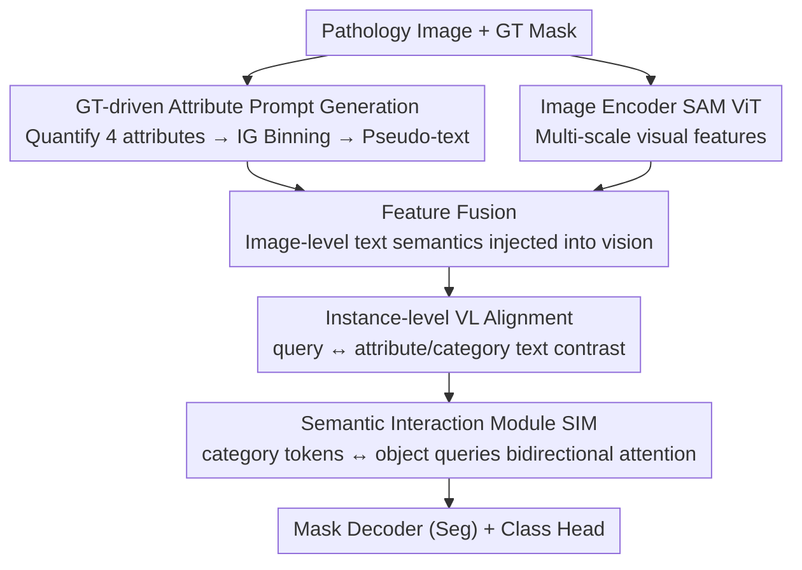

# IVAAN: Instance-level Vision-Language Alignment via Attribute-Guided Text Prompts Generation for Nuclei Analysis

**Conference**: CVPR 2026  
**Paper**: [CVF Open Access](https://openaccess.thecvf.com/content/CVPR2026/html/Jeong_IVAAN_Instance-level_Vision-Language_Alignment_via_Attribute-Guided_Text_Prompts_Generation_for_CVPR_2026_paper.html)  
**Code**: To be confirmed  
**Area**: Medical Imaging  
**Keywords**: Nuclei segmentation, pathological images, instance-level vision-language alignment, attribute-guided text, category prototypes

## TL;DR
To address class imbalance and organ/stain variations in nuclei "instance-level segmentation + classification" within pathological images, this paper proposes automatically generating attribute-guided pseudo-text prompts from ground truth masks. It performs instance-level vision-language contrastive alignment and models intra-class multi-modality using multiple learnable "category tokens" per class and a semantic interaction module, improving both segmentation and classification without manual text labels.

## Background & Motivation
**Background**: Nuclei instance segmentation and classification are fundamental tasks in computational pathology, critical for cancer diagnosis and prognosis prediction. Recent models like HoVer-Net, CellViT, and PromptNucSeg demonstrate strong **segmentation** accuracy but remain weak in **classification** capability.

**Limitations of Prior Work**: Nuclei datasets suffer from severe class imbalance and organ-specific biases—certain phenotypes only appear in specific organs, and class distributions vary significantly across images. Models supervised only by class labels are forced to **implicitly** infer morphology from **contextual cues** such as background coloring, stain intensity, and organ characteristics, rather than learning intrinsic features. Consequently, nuclei of the same class with similar morphology but originating from different organs or staining protocols are often misclassified.

**Key Challenge**: The model must be "class discriminative" while being "robust" to substantial visual variations caused by organs and staining. A pure vision paradigm with only category labels cannot satisfy both—it fails to capture variations in shape, color, and texture induced by organ/staining differences.

**Goal**: (1) Introduce instance-level semantic text supervision for every nucleus; (2) Model multiple intra-class submodes while maintaining organ-consistent category semantics.

**Key Insight**: Pathologists rely on a set of quantifiable morphological attributes (size, shape, stain intensity, boundary regularity) for diagnosis. The authors quantify and discretize these clinical metrics into human-readable attribute words (e.g., "tiny/small/large"), serving as pseudo-text labels for each nucleus—bypassing the bottleneck of "prohibitively expensive instance-level text annotation."

**Core Idea**: Use ground truth masks to automatically generate **attribute-guided instance-level text prompts** for contrastive alignment (binding nuclear features to both morphological appearance and semantic descriptions). Furthermore, utilize **multiple prototype tokens per class + a Semantic Interaction Module (SIM)** to accommodate intra-class submodes and maintain cross-organ category consistency.

## Method

### Overall Architecture
The method is built upon the Transformer-based Mask2Former and consists of three components: **① GT-driven attribute prompt generation**, **② Instance-level vision-language alignment**, and **③ Semantic Interaction Module (SIM)**. The workflow is as follows: Clinical attributes for each nucleus are quantified and discretized into intervals based on information gain, and attribute combinations are converted into pseudo-text descriptions to provide explicit morphological cues. The image encoder (SAM ViT) extracts multi-scale visual features, which are fused with text embeddings before interacting with object queries to obtain instance representations coupling vision and language. To accommodate intra-class variation, multiple "category tokens" per class are learned as local prototypes, interacting bidirectionally with object queries through the SIM (aggregating visual evidence into prototypes and redistributing global category context to instances). The enhanced queries are fed into a mask decoder for segmentation and a classification head for classification, with instance-level contrastive alignment applied between enhanced queries and corresponding text embeddings during training.

### Key Designs

**1. GT-driven attribute prompt generation: Automatically converting clinical morphological metrics into instance-level text supervision**

The extreme cost and difficulty of creating instance-level text annotations is the fundamental barrier to using VL methods for nuclear analysis. The authors resolve this by **automatically** deriving text from ground truth masks: first, 11 morphological and intensity features are extracted (shape features like equivalent diameter, eccentricity, aspect ratio, solidity, extent; normalized perimeter ratio and mean boundary gradient for membrane irregularity; hematoxylin mean/variance and core-rim intensity difference for chromatin texture), corresponding to four clinical indicators: pleomorphism, hyperchromasia, membrane irregularity, and chromatin texture. To select "cross-class discriminative and intra-class non-redundant" features, separation is calculated using Cohen's d effect size $S(m)=\text{median}_{(c_i,c_j)}|d_{ij}|$, followed by deduplication using Spearman correlation ($\rho>0.7$ considered redundant), ultimately selecting four representative attributes: size, eccentricity, color intensity, and boundary irregularity. Then, **entropy-based supervised binning** is applied: for a threshold $\theta$, the optimal split is chosen via information gain $\text{Gain}(\theta)=H_{total}-\frac{n_L}{n}H_L-\frac{n_R}{n}H_R$ (where $H=-\sum_c p(c)\log_2 p(c)$), recursing to a depth of 4 to obtain at most 5 intervals. Thresholds with $\ge60\%$ occurrence across 5-fold repetition are kept for stability. Each interval is mapped to readable words like tiny/small/medium/large/huge, forming attribute text for each nucleus. This process ensures language supervision is both data-driven and interpretable without any manual text labels.

**2. Instance-level vision-language contrastive alignment: Binding each nucleus to morphological appearance and semantic descriptions**

Image-level VLMs (PLIP, CONCH) perform global alignment, while region-level methods (GLIP, GroundingDINO) using boxes tend to conflate multiple overlapping nuclei, making neither suitable for nuclei-level alignment. This work uses Mask2Former's Hungarian matching to obtain query-instance pairs. For each matched enhanced query feature $f_{enhq}$, it is projected and $\ell_2$-normalized to obtain visual embedding $v$; text is encoded by a CLIP text encoder (finetuned for pathology) and then projected and normalized to $t$. **Two complementary types of prompts** are used: **Fixed prompts** follow the "a {class} nucleus in {organ}" template to provide category-level semantic anchors, supervising $L_{fix}=-\frac1N\sum_i\log\frac{\exp(v_i^\top T_{y_i}/\tau)}{\sum_j\exp(v_i^\top T_j/\tau)}$; **Attribute prompts** provide fine-grained morphological cues, taking the GT attribute text as the positive and other attribute texts as negatives per attribute $a$, $L^a_{attr}=-\frac1{N_a}\sum_i\log\frac{\exp(v_i^\top t^+_{i,a}/\tau_{attr})}{\sum_m\exp(v_i^\top t^m_{i,a}/\tau_{attr})}$. Total VL loss is $L_{CL}=\lambda_{fix}L_{fix}+\lambda_{attr}L_{attr}$. Thus, each nucleus is pulled toward both its category semantics and specific morphological description, ensuring category consistency across organs and mitigating implicit learning bias.

**3. Category token + Semantic Interaction Module (SIM): Using multiple prototypes per class to accommodate intra-class submodes**

Even with attribute alignment, nuclei of the same biological class still vary in shape, color, and texture across different organs/tissues, causing representations to split into multiple submodes and disrupting class embedding consistency. The authors learn $k$ tokens per class (total $(C{+}1)\times k$, including background), acting as multiple **local prototypes** rather than a single centroid to cover intra-class morphological diversity. SIM enables **bidirectional attention** between category tokens (CT) and object queries (OQ): the OQ→CT direction uses CT as the query and OQ as the key/value, obtaining "dynamic CT" that aggregates visual evidence for that class, evolving into dataset-level category prototypes. The CT→OQ direction uses dynamic CT as key/value to enhance OQ, allowing instance queries to inherit class-level semantics accumulated across the dataset. To anchor prototype semantics, the mean of each group of $k$ tokens $\bar q_c=\frac1k\sum_i q_{c,i}$ is aligned to the corresponding class text embedding: $L_{cent}=-\frac1C\sum_c\log\frac{\exp(\bar q_c^\top T_c/\tau_{CT})}{\sum_j\exp(\bar q_c^\top T_j/\tau_{CT})}$. Since $L_{cent}$ only constrains the **mean** of each group, individual tokens can still capture valid intra-class diversity around the mean—lowering intra-class variance while adapting to organ-specific distribution shifts.

### Loss & Training
Total loss $L=\lambda_{seg}L_{seg}+\lambda_{cls}L_{cls}+\lambda_{CL}L_{CL}+\lambda_{cent}L_{cent}$, where $\lambda_{seg}=5,\lambda_{cls}=2,\lambda_{CL}=1,\lambda_{cent}=2$; within VL, $\lambda_{fix}=1,\lambda_{attr}=0.3$. Backbone uses SAM ViT encoder with Mask2Former; AdamW (lr=1e-4, batch=8), 3000 steps, 200 object queries, temperatures $\tau=0.07,\tau_{CT}=0.07,\tau_{attr}=0.15$, $k=5$ tokens per class, NVIDIA A100. Additionally, **Feature Fusion** is used: image-level text listing all nuclei classes in the image (e.g., "a photo of a neoplastic nuclei. a photo of a connective nuclei.") is projected and cross-attended with multi-scale visual features to inject early category semantics before decoding.

## Key Experimental Results

### Main Results
Three-fold cross-validation on PanNuke dataset, reported in detection/classification F1 and Panoptic Quality (PQ):

| Method | Det F1 | Cls F1 | bPQ | mPQ |
|------|---------|---------|------|------|
| HoVer-Net | 0.80 | 0.50 | 0.6596 | 0.4629 |
| CellViT-H | 0.83 | 0.58 | 0.6793 | 0.4980 |
| PromptNucSeg-H | 0.84 | 0.61 | 0.6924 | 0.5123 |
| **Ours-H** | **0.87** | **0.69** | **0.6976** | **0.5459** |

Det F1 of 0.87 and Cls F1 of 0.69 are optimal; bPQ is +0.005 higher than PromptNucSeg, and mPQ is +0.034 higher. On category-level PQ (Table 3), inflammatory, connective, and dead classes saw the largest gains—the first two are often confused due to visual similarity, but attribute text cues helped distinguish them; "dead" is a minority class and saw the most significant improvement, indicating the method mitigates class imbalance.

Cross-dataset results (Ours with B/L/H backbones):

| Method | MoNuSeg AJI | MoNuSeg PQ | CPM17 AJI | CPM17 PQ |
|------|-------------|------------|-----------|----------|
| PromptNucSeg-H | 0.622 | 0.627 | 0.740 | 0.733 |
| Ours-B | 0.664 | 0.647 | 0.729 | 0.727 |
| Ours-H | **0.689** | **0.696** | **0.743** | **0.748** |

Notably, Ours-L already exceeds PromptNucSeg-H on MoNuSeg.

### Ablation Study

| Config | det-F1 | cls-F1 | PQ | AJI | Description |
|------|--------|--------|------|------|------|
| (1) baseline | 78.5 | 63.1 | 57.3 | 61.6 | No text/semantic modules |
| (2) +VL (Fixed only) | 83.8 | 67.1 | 62.3 | 65.3 | Fixed prompts regularize feature space |
| (4) +Attr+Entr | 84.5 | 67.7 | 65.4 | 66.1 | Add attribute prompts + entropy binning |
| (5) +SIM (Category tokens) | 86.7 | 69.3 | 66.4 | 67.5 | query ↔ prototype bidirectional interaction |
| (6) +FF (Feature Fusion) | 87.0 | 69.5 | 67.3 | 68.3 | Full model, best |

Note: Row 3 used equal-count quantile binning instead of entropy-optimized binning, resulting in a PQ of only 63.8, inferior to entropy binning (65.4 in Row 4).

### Key Findings
- **Components are additive without redundancy**: From baseline to full model, det-F1 78.5→87.0 and PQ 57.3→67.3. Fixed prompts regularize the space, attribute prompts add fine-grained morphology, SIM handles intra-class submodes, and feature fusion adds early semantics.
- **Attribute text specifically targets "morphologically similar confusion"**: PQ for inflammatory vs. connective improved the most. Visualization (UMAP/t-SNE) shows Ours separates them better than baseline, with text anchors located inside their respective clusters.
- **Mitigates class imbalance**: Minority classes like "dead" nuclei improved most significantly, showing semantic priors help the model avoid guessing rare classes based on context.

## Highlights & Insights
- **"GT mask as text labels" automation**: Automatically converting quantifiable morphological metrics into readable attribute words provides instance-level semantic supervision with zero manual text labeling—a paradigm applicable to other dense instance tasks lacking text annotations.
- **Entropy binning makes attribute words "data-driven and class-separable"**: Using information gain to select split points rather than fixed thresholds ensures that "tiny/large" words carry true discriminative information (verified superior to quantile binning).
- **Multi-prototypes + Bidirectional interaction elegantly solves intra-class multi-modality**: Using $k$ tokens per class while only constraining the group mean allows for cross-organ consistency and valid submode preservation, a clever solution to the contradiction between class discrimination and organ robustness.

## Limitations & Future Work
- **Static token budget $k=5$ for minority classes (e.g., "dead") is likely too large**: SIM may concentrate on a few tokens, while others drift toward noise regions because $L_{cent}$ only constrains the mean—suggesting class-adaptive budgets or pruning/re-initialization.
- Features for Connective and Inflammatory still overlap; the 5 Connective tokens cluster tightly near the text anchor, potentially under-representing boundary variations. Diversity constraints could encourage intra-class token dispersion.
- The method depends on GT masks for text generation, making it **applicable only to pixel-labeled training sets**. The sensitivity of attribute quantification (e.g., stain intensity) to stain protocol differences has not been fully pressure-tested.
- Evaluation is concentrated on PanNuke/MoNuSeg/CPM17; generalization to larger scales or more diverse staining domains remains to be verified.

## Related Work & Insights
- **vs. Pure visual nuclei analysis (HoVer-Net / CellViT / PromptNucSeg)**: These use single-category labels, assuming "organ-independent, unimodal" distributions. Ours uses attribute text + multi-prototypes to explicitly model intra-class diversity, achieving higher Cls F1 and mPQ.
- **vs. Image-level Pathology VLMs (PLIP / CONCH / PathAlign)**: These perform global image-text alignment and miss fine-grained nuclear semantics; Ours brings alignment down to the instance level.
- **vs. Region-level grounding (GLIP / OWL-ViT / GroundingDINO)**: In dense nuclei scenarios, one box often contains multiple overlapping nuclei, contaminating region embeddings; Ours aligns via matched queries to avoid box-level aliasing.

## Rating
- Novelty: ⭐⭐⭐⭐ The combination of "GT-driven attribute text + instance-level VL alignment + multi-prototype SIM" is novel and targets the lack of text labels effectively.
- Experimental Thoroughness: ⭐⭐⭐⭐⭐ Three datasets, multiple backbones, component ablations + binning comparison + feature space visualization; complete evidence chain.
- Writing Quality: ⭐⭐⭐⭐ Clear motivation and derivation with comprehensive formulas; some SIM bidirectional attention details are clearer with diagrams.
- Value: ⭐⭐⭐⭐ Concrete improvements in classification and minority classes; the framework for dense instance VL supervision is highly referenceable.

<!-- RELATED:START -->

## Related Papers

- [\[CVPR 2026\] Gastric-X: A Multimodal Multi-Phase Benchmark Dataset for Advancing Vision-Language Models in Gastric Cancer Analysis](gastric-x_a_multimodal_multi-phase_benchmark_dataset_for_advancing_vision-langua.md)
- [\[CVPR 2026\] PETAR: Localized Findings Generation with Mask-Aware Vision-Language Modeling for PET Automated Reporting](petar_localized_findings_generation_with_mask-aware_vision-language_modeling_for.md)
- [\[CVPR 2026\] SAT-RRG: LLM-Guided Self-Adaptive Training for Radiology Report Generation with Token-Level Push–Pull Optimization](sat-rrg_llm-guided_self-adaptive_training_for_radiology_report_generation_with_t.md)
- [\[AAAI 2026\] GuideGen: A Text-Guided Framework for Paired Full-Torso Anatomy and CT Volume Generation](../../AAAI2026/medical_imaging/guidegen_a_text-guided_framework_for_paired_full-torso_anatomy_and_ct_volume_gen.md)
- [\[CVPR 2026\] Hyperbolic Relational Prompts for Intersectional Fairness in Medical VLMs](hyperbolic_relational_prompts_for_intersectional_fairness_in_medical_vlms.md)

<!-- RELATED:END -->
