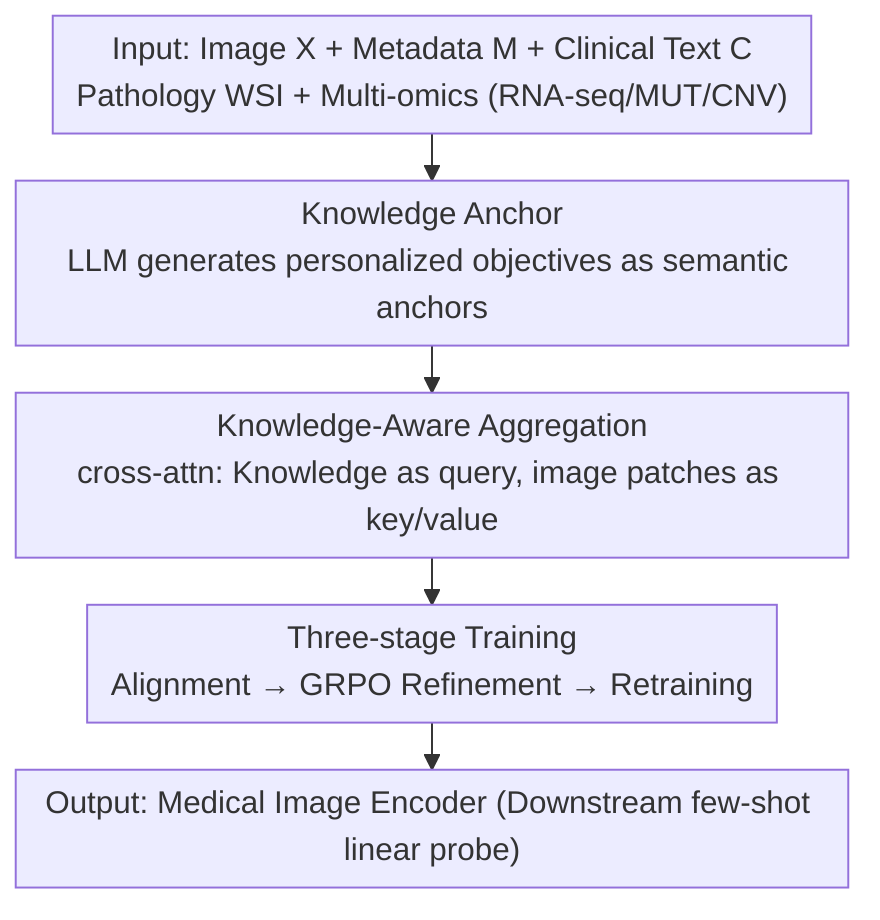

# KAMP: Knowledge-Anchored Multimodal Pretraining Framework for Medical Image Representation

**Conference**: CVPR 2026  
**Paper**: [CVF Open Access](https://openaccess.thecvf.com/content/CVPR2026/html/Huang_KAMP_Knowledge-Anchored_Multimodal_Pretraining_Framework_for_Medical_Image_Representation_CVPR_2026_paper.html)  
**Code**: To be confirmed  
**Area**: Medical Imaging / Multimodal / Representation Learning  
**Keywords**: Medical image pretraining, cross-modal alignment, LLM personalized knowledge, semantic anchor, GRPO, few-shot

## TL;DR
KAMP utilizes LLM-generated "patient-personalized diagnostic knowledge" as a semantic anchor to align medical images with multimodal biomedical signals (pathological, genomic, etc.). Through a three-stage training process (alignment → GRPO-refined generator → retraining alignment), knowledge accuracy is iteratively improved. It outperforms unimodal, bimodal, and trimodal baselines in few-shot classification for brain, bladder, and liver cancers.

## Background & Motivation
**Background**: Pathology, genomics, and medical imaging each reveal distinct biological signals (tissue structure, molecular mechanisms, and organ-level lesions). Using them jointly provides richer and more stable semantic supervision for image representation learning. However, pathology and genomics often require invasive procedures and are only available for a minority of patients, whereas medical imaging is relatively accessible—thus, pretraining image models with rich cross-modal semantics is a critical need.

**Limitations of Prior Work**: Existing medical image pretraining falls into three categories, each with inherent flaws. ① Unimodal learning (MiM / VoCo / Swin-UNETR) uses only image signals (contrastive, masked reconstruction, etc.), providing coarse supervision that only reflects macro-appearance; ② Bimodal learning (RadCLIP / HLIP) aligns images with one accompanying modality (text/pathology/genomics) but lacks mechanisms to reconcile cross-modal inconsistencies, leading contrastive objectives toward spurious correlations or semantic mismatches when paired data is scarce; ③ Trimodal learning (DRIM) aligns images, pathology, and genomics together, but more modalities introduce more noise, amplifying alignment errors and destabilizing shared semantics.

**Key Challenge**: Cross-modal biomedical signals offer stronger supervision, but "scarcity of paired data + inter-modal statistical bias and noise" makes direct multimodal alignment insufficient and prone to being misled by noise.

**Goal**: To learn semantically rich and robust medical image representations under conditions of scarce paired data and modal bias/noise.

**Key Insight**: LLMs can inject domain priors into image pretraining to "densify" supervision signals. However, existing LLM-enhanced works mostly use category-level descriptions and ignore individual patient context, causing generated descriptions to collapse into generic templates weakly related to the images. Even with patient clinical info, off-the-shelf LLMs are not calibrated to this personalized input distribution, leading to inconsistent or noisy generations. The authors' insight is to have the LLM generate personalized diagnostic knowledge based on patient clinical text and image metadata, using this text as a "semantic anchor" connecting images with other modalities.

**Core Idea**: Use LLM-derived personalized text as a semantic anchor to anchor the alignment between images and multimodal biomedical evidence, and use reinforcement learning to refine this anchor to better fit the images and cross-modal evidence.

## Method

### Overall Architecture
KAMP consists of two main components: an LLM-based "knowledge generator" and a "cross-modal aligner." The aligner has two branches: the medical image branch aggregates images and personalized knowledge into a "knowledge-aware embedding" $h$, while separately pooling to obtain a "pure image embedding" $h_{img}$; the multimodal biomedical branch fuses clinical text, pathology WSIs, and multi-omics (RNA-seq/MUT/CNV) into a multimodal embedding $z$. Training uses a symmetric contrastive loss to align both $h$ and $h_{img}$ with $z$.

The framework progresses in three stages: Stage 1 uses an off-the-shelf LLM to generate knowledge for training an initial aligner; Stage 2 freezes the aligner and uses it as a reward model to optimize a trainable LLM generator via GRPO; Stage 3 freezes the optimized generator and retrains the aligner using refined knowledge. For downstream tasks, only the pretrained image encoder is used to evaluate $h_{img}$ via linear probing.

### Key Designs

**1. Knowledge Anchor: Using LLM text to reduce cross-modal conditional entropy and stabilize alignment**

To address the pain point where direct alignment is misled by modal bias/noise, the authors justify the introduction of knowledge anchor $A$ via mutual information. Let $h$ be the knowledge-aware image representation, $z$ the multimodal biomedical representation, and $A$ the LLM-derived knowledge. From the chain rule of mutual information, $H(h\mid z,A)=H(h\mid z)-I(h;A\mid z)$; thus, the reduction in uncertainty is exactly the conditional mutual information:

$$\Delta H \triangleq H(h\mid z)-H(h\mid z,A)=I(h;A\mid z)\geq 0.$$

This suggests that given $z$, the anchor $A$ provides additional information about $h$, pushing representations toward semantically meaningful image content. Crucially, regarding noise: when $z$ contains spurious or modality-specific artifacts (e.g., batch effects in genomics, staining differences in pathology), aligning image features solely with $z$ causes the representation to absorb these "related to $z$ but semantically unreliable" signals. KAMP integrates $A$ into $h$ and then aligns $h$ with $z$, ensuring only image cues supported by both anchor $A$ and evidence $z$ are reinforced. Signals in $z$ not corroborated by $A$ struggle to dominate the representation, making alignment more stable than direct bimodal or trimodal methods.

**2. Knowledge-Aware Aggregation: Injecting personalized knowledge into image tokens via cross-attention**

Textual knowledge alone is insufficient; it must precisely "point" to relevant regions in the image. The authors designed Knowledge-Aware Aggregation: the image encoder processes 3D images into $S$ patch tokens $V_{img}\in\mathbb{R}^{S\times d}$, while the text encoder encodes $P$ observation targets into $U\in\mathbb{R}^{P\times d}$. Using cross-attention, text targets act as queries, and image patches as keys/values: $Q=UW_Q,\ K=V_{img}W_K,\ V=V_{img}W_V$. The attention weight $Y=\mathrm{softmax}(QK^\top/\sqrt{d})\in\mathbb{R}^{P\times S}$ represents the distribution of target $p$ over $S$ patches, essentially allowing the text to "soft-select" the most relevant image regions. The aggregation output is $H_{cross}=YV$, which is then averaged over the target dimension to get the knowledge-aware embedding $h=\frac{1}{P}\sum_{p}(H_{cross})_p$. The pure image embedding $h_{img}$ is obtained via direct mean pooling of $V_{img}$. Thus, LLM-derived domain priors guide aggregation toward clinically significant regions, enhancing image representation semantics.

**3. Three-stage Training: Alignment → GRPO-refined generator → Retraining alignment**

To address the issue of off-the-shelf LLMs producing noisy or uncalibrated knowledge, KAMP uses a three-stage closed loop:

- **Stage 1 (Knowledge-supervised Aligner Pretraining)**: An off-the-shelf GPT-5 generates $P$ structured observation targets (each containing "visual discovery + diagnostic conclusion") based on metadata $M$ and clinical text $C$. These are fed into the aligner, trained with a symmetric contrastive loss (calculated separately for $(h,z)$ and $(h_{img},z)$) to produce an initial aligner $\mathcal{E}_\phi$.
- **Stage 2 (GRPO-refined Generator)**: The Stage 1 aligner $\mathcal{E}_\phi$ is frozen as a reward model. A trainable knowledge generator $G_\theta$ (Qwen3-8B) is optimized using GRPO. In each round, $G$ candidate knowledges $\{T^g\}$ are sampled from the old policy $\pi_{\theta_{old}}$. The reward is the cosine similarity $r^g=s(h^g,z)$ between the aggregated embedding $h^g$ and $z$. Relative advantages $A^g=(r^g-\bar{r})/\sigma$ are calculated via group normalization. The generator's LoRA modules are updated using the GRPO objective with clipping and KL penalty:

$$\mathcal{L}_{GRPO}=-\mathbb{E}\Big[\sum_{g}\min\big(\rho^g A^g,\ \mathrm{clip}(\rho^g,1-\epsilon,1+\epsilon)A^g\big)\Big]+\beta\,\mathbb{E}\big[D_{KL}(\pi_\theta\|\pi_{ref})\big],$$

where $\rho^g=\pi_\theta(T^g\mid M,C)/\pi_{\theta_{old}}(T^g\mid M,C)$. This forces the generator to produce knowledge that is both faithful to image content and consistent with pathology/genomic evidence.
- **Stage 3 (Retraining Aligner with Refined Knowledge)**: The optimized generator is frozen to produce final knowledge $T$, and the aligner is retrained using the same Stage 1 contrastive objectives. This incorporates refined semantics, tightens alignment, and suppresses modal bias/noise.

## Key Experimental Results

### Main Results
Pretraining was conducted on four TCGA cohorts (GBM/LGG brain, BLCA bladder, LIHC liver) using image + metadata + clinical text + pathology WSI + multi-omics. Downstream evaluation used few-shot linear probing on BraTS23-MEN (meningioma 3-grade), FedBCa (bladder cancer binary), and TG-LIVT (liver cancer microvascular invasion binary), reporting macro-AUC. The table below compares KAMP with representative baselines at 3-shot and 20-shot:

| Dataset | Setting | Best Baseline | KAMP (Ours) |
|--------|------|----------|--------------|
| BraTS23-MEN | 3-shot | DRIM 60.2 | **62.5** |
| BraTS23-MEN | 20-shot | VoCo 62.1 | **70.2** |
| FedBCa | 3-shot | DRIM 75.6 | 74.3 |
| FedBCa | 20-shot | MiM 76.1 | **82.6** |
| TG-LIVT | 3-shot | DRIM 57.2 | **59.4** |
| TG-LIVT | 20-shot | DRIM 67.0 | **74.5** |

KAMP achieved the highest macro-AUC across almost all shot settings in the three datasets (except for 3-shot FedBCa, slightly lower than DRIM). The advantage is most evident at 20-shot: gains over the second best were +8.1% / +6.5% / +7.5% respectively. KAMP shows a stable upward scalability trend from 3 to 20-shot, whereas several strong baselines saturate or become unstable with more supervision. t-SNE also shows KAMP produces tighter clusters and clearer inter-class separation.

### Ablation Study
Comparison of reinforcement learning objectives on FedBCa 20-shot (macro-AUC):

| Config | macro-AUC | Description |
|------|-----------|------|
| GenPers (No RL, Stage 1 Aligner) | 79.6 | Used GPT-5 personalized knowledge, no RL refinement |
| PPO-Aligner | Gain | Used GenPers score as reward |
| DPO-Aligner | Gain | Used GenPers preferences |
| **GRPO-Aligner (Full)** | **82.6** | Group relative advantage, maximum gain |

### Key Findings
- **Personalized knowledge is crucial, not just "more text"**: Ablations with five Stage 1 text inputs show that directly feeding category labels (RawLbl) or raw clinical text (RawPers) results in performance equal to or worse than "no text" (VisOnly). Category-conditioned generated text (GenLbl) yields only marginal gains or even performance drops. Only GPT-5 personalized knowledge (GenPers) is consistently optimal—benefits stem from the "personalized semantic anchor," not the volume of text.
- **GRPO refinement provides a clear contribution**: All three RL objectives improved over GenPers (79.6), with GRPO-Aligner being the highest (82.6), indicating that group relative reward signals are most effective at calibrating knowledge to be "faithful to images and consistent with biomedical evidence."
- **Good few-shot scalability**: KAMP benefits more from increased supervision without early saturation, making it suitable for label-scarce medical scenarios.

## Highlights & Insights
- **"Semantic Anchor" rather than "Just Another Modality"**: Positioning LLM text as an anchor rather than a new alignment modality, justified by $I(h;A\mid z)$, explains why anchors stabilize alignment by filtering noise. This approach of using text as a sieve to retain multi-party corroborated signals is transferable to any noisy multimodal alignment task.
- **Closed-loop with Aligner as Reward Model**: Using the frozen aligner to score candidate knowledge as a reward in Stage 2 allows the generator and aligner to calibrate each other—a reusable paradigm where downstream alignment quality directly drives text generation.
- **Personalized > Generic Templates**: Experiments clearly prove that category-level templated descriptions are nearly useless; patient-level personalized knowledge provides the true discriminative value. This is a powerful reminder for "LLM-enhanced vision" research.

## Limitations & Future Work
- Stage 1 relies on off-the-shelf GPT-5 for knowledge generation, creating dependency on closed-source models and limiting reproducibility/cost-efficiency.
- Evaluation is limited to three cancer datasets, one of which (TG-LIVT) is a proprietary dataset; the scale is relatively small (hundreds of cases in downstream cohorts), requiring further validation on larger scales.
- Pathology and genomics are still required as pairs during pretraining; while designed for scarcity, the "multimodal biomedical branch" still necessitates these expensive modalities during training.
- The quality of personalized knowledge depends heavily on the availability and quality of patient clinical text; anchor effectiveness may be questionable when clinical text is missing or highly noisy.

## Related Work & Insights
- **vs. Unimodal Pretraining (MiM / VoCo / Swin-UNETR)**: These use only image self-supervision with coarse semantics; KAMP introduces cross-modal and LLM semantic anchors, leading in few-shot performance.
- **vs. Bimodal Alignment (RadCLIP / HLIP)**: Bimodal methods lack mechanisms to reconcile inconsistencies and are easily misled by spurious correlations; KAMP uses anchors to suppress uncorroborated signals for more stable alignment.
- **vs. Trimodal Alignment (DRIM)**: DRIM's direct stacking of pathology/genomics amplifies noise; KAMP uses LLM text as an anchor to filter signals, significantly outperforming DRIM at 20-shot (e.g., +7.5% on TG-LIVT).
- **vs. LLM-enhanced Medical Vision (BiomedCoOp / MedUnA / UniMed-CLIP)**: These mostly use category-level descriptions providing general guidance; KAMP generates personalized knowledge conditioned on patient text and metadata, reducing text-image drift.

## Rating
- Novelty: ⭐⭐⭐⭐ Combination of "LLM personalized knowledge as semantic anchor + GRPO closed-loop refinement" is novel with clear info-theoretic motivation.
- Experimental Thoroughness: ⭐⭐⭐⭐ Solid few-shot main results and ablations, though datasets are small and some ablations lack exact numerical values in charts.
- Writing Quality: ⭐⭐⭐⭐ The three-stage process and mutual information derivation are clearly explained with complete illustrations.
- Value: ⭐⭐⭐⭐ Addresses medical image pretraining under paired data scarcity; the strategy is transferable to other multimodal scientific domains.

<!-- RELATED:START -->

## Related Papers

- [\[CVPR 2026\] MedKCO: Medical Vision-Language Pretraining via Knowledge-Driven Cognitive Orchestration](medkco_medical_vision-language_pretraining_via_knowledge-driven_cognitive_orches.md)
- [\[CVPR 2026\] Multimodal Causality-Driven Representation Learning for Generalizable Medical Image Segmentation](multimodal_causal-driven_representation_learning_for_generalizable_medical_image.md)
- [\[CVPR 2026\] Momentum Memory for Knowledge Distillation in Computational Pathology](momentum_memory_for_knowledge_distillation_in_computational_pathology.md)
- [\[CVPR 2026\] H2-Surv: Hierarchical Hyperbolic Multimodal Representation Learning for Survival Prediction](h2-surv_hierarchical_hyperbolic_multimodal_representation_learning_for_survival_.md)
- [\[CVPR 2026\] GeoSemba: Reconstructing State Space Model for Cross Paradigm Representation in Medical Image Segmentation](geosemba_reconstructing_state_space_model_for_cross_paradigm_representation_in_m.md)

<!-- RELATED:END -->
