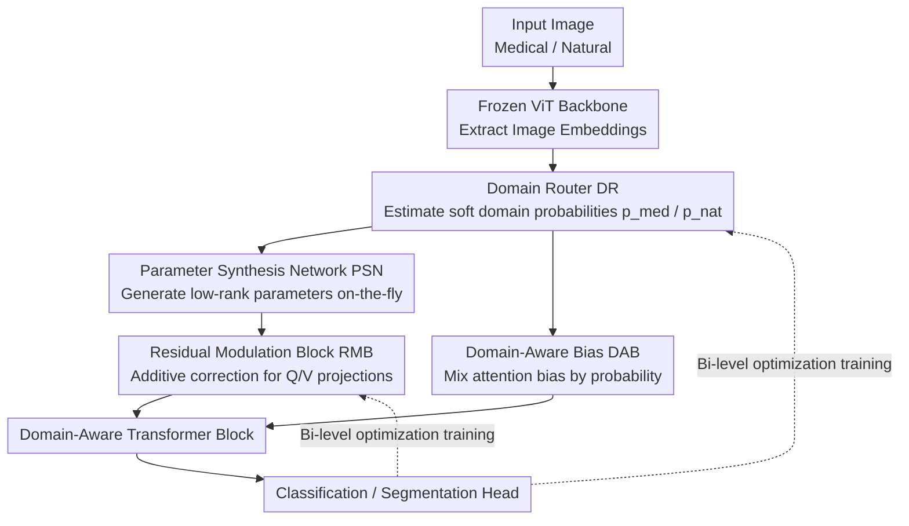

# Keep It Frozen: Domain-Routed Conditional Residual Modulation for Multi-Domain Vision Transformers

**Conference**: CVPR 2026  
**Paper**: [CVF Open Access](https://openaccess.thecvf.com/content/CVPR2026/html/Khan_Keep_It_Frozen_Domain-Routed_Conditional_Residual_Modulation_for_Multi-Domain_Vision_CVPR_2026_paper.html)  
**Area**: Multi-domain Vision Transformer / Parameter-Efficient Fine-Tuning  
**Keywords**: Frozen Backbone, Domain Routing, Residual Modulation, Hypernetwork, Bi-level Optimization

## TL;DR
A set of lightweight Residual Modulation Modules (RMB) is attached to a completely frozen ViT backbone. A Domain Router (DR) estimates the soft probability of a sample belonging to "medical/natural" domains in real-time. Subsequently, a Parameter Synthesis Network (PSN) generates low-rank correction parameters on-the-fly based on these probabilities to be injected into Q/V projections and attention biases. Combined with MAML-style bi-level optimization, this enables a single model to adapt to both medical (Ultrasound/CT/MRI) and natural images simultaneously without mutual performance degradation, using only approximately 3.5% trainable parameters.

## Background & Motivation

**Background**: To make a vision model competent in both natural and medical imaging, the conventional approach involves task-specific full fine-tuning of a pre-trained ViT. In the medical field, there are domain-specific pre-trained models like MedCLIP and BiomedCLIP, as well as Parameter-Efficient Fine-Tuning (PEFT) solutions such as LoRA, AdaptFormer, and Adapter.

**Limitations of Prior Work**: Medical images (especially fetal ultrasound) naturally contain acoustic shadows, motion blur, speckle noise, blurred boundaries, and drastic changes in pose/scale. General vision models are fragile against these modality-specific artifacts. Furthermore, heavy fine-tuning for the medical domain often **erodes the model's general capability on natural images**—modifying one domain frequently degrades performance in another. Most PEFT methods either use discrete "task" routing (AdapterFusion), learn a set of static domain-specific weights (ExPLoRA), or require weight switching, lacking a continuous, per-sample response to "how medical/natural a single image is."

**Key Challenge**: The difference between medical and natural domains is **continuous rather than purely categorical**—an image might be "70% medical and 30% natural." Applying static, domain-level adjustments to continuously varying inputs either leads to over-tuning that hurts generalization or under-tuning that loses robustness. While Test-Time Adaptation (TTA) can improve robustness, it requires repeated parameter updates during inference, violating latency, memory, and stability constraints.

**Goal**: Serve both medical and natural images with a single end-to-end model; maintain fast inference without test-time updates (update-free); satisfy tight memory/latency budgets; and remain stable across different modalities.

**Key Insight**: Since domain differences are continuous, rather than "heavy and static" domain-wide adjustments, the model should perform "**minimal, on-demand, per-sample**" corrections—only on beneficial projections and only in the required amount. The backbone remains frozen, and all adaptation is handled by minimal, input-conditioned residual modulators.

**Core Idea**: Freeze the backbone and use a chain consisting of "Domain Router estimates soft domain probabilities → Hypernetwork synthesizes low-rank parameters on-the-fly → Residual modules inject additively." This superimposes per-sample domain-aware corrections onto attention projections, paired with bi-level optimization to decouple "domain-level meta-parameters" and "task-level representations."

## Method

### Overall Architecture
DCRM-ViT receives an image (medical or natural) and first passes it through a frozen ViT backbone to obtain image embeddings. The Domain Router (DR) estimates the soft probability of the sample belonging to each domain $D(x)=[p_{medical}, p_{natural}]$ from these features. The Parameter Synthesis Network (PSN) maps the image features and domain probabilities into a set of per-sample, low-rank modulation parameters. These parameters drive the Residual Modulation Modules (RMB) inserted into each transformer block, performing additive low-rank corrections to Q/V projections and optionally adding a Domain-Aware Bias (DAB) to the attention logits. The modified features continue through the transformer blocks and finally enter the classification or segmentation heads. Throughout the chain, backbone weights remain fixed, and inference is a single forward pass without gradient updates.

### Key Designs

**1. Residual Modulation Block (RMB) + TALer: Additive Low-Rank Correction on Frozen Projections**

This directly addresses the issue that "modifying the backbone hurts generalization." Instead of changing $W_q, W_v$ themselves, a trainable branch is added in parallel to **add** corrections. The core of each RMB is a Task-Alignment Layer (TALer), consisting of a low-rank encoder, ReLU non-linearity, low-rank decoder, and a scale factor. For input feature $h\in\mathbb{R}^d$, the TALer output is:

$$h' = r \cdot \sigma(W_{DS} h + b_{DS}) \odot \big(W_{US}\,\sigma(W_{DS} h + b_{DS}) + b_{US}\big)$$

Where $W_{DS}\in\mathbb{R}^{d'\times d}$ reduces dimensionality, $W_{US}\in\mathbb{R}^{d\times d'}$ projects back, and $r$ is a scale factor (making the model sensitive to targets of different scales, such as lesions vs. fetal structures). The correction injection is performed as $Q=\tilde W_q\gamma = W_q\gamma + h'_q$ and $V=\tilde W_v\gamma = W_v\gamma + h'_v$. Only Q and V projections are modified; the **Key projection $K=W_k\gamma$ remains unchanged**. The authors intentionally keep K fixed to ensure that attention scores reflect the true correlation structure in the data. Because it is additive low-rank and the backbone is frozen, pre-trained knowledge is preserved while adding a small amount of domain-specific plasticity where needed.

**2. Domain Router (DR) + Parameter Synthesis Network (PSN): Continuous Translation of "Medical-ness" into Parameters**

To address the core challenge that "domain differences are continuous and static adjustments cannot capture them," the DR outputs soft domain probabilities rather than hard classifications. Internally, the DR includes a Domain-Aware Layer (DALer, containing contraction/expansion layers + non-linearity) and a parallel gating channel ($1\times1$ convolution $g=\mathrm{Conv}_{1\times1}(x;\theta_g)$ to extract spatial details concatenated with the original embedding). A domain classifier $D$ then provides $D(x)=[p_{medical}, p_{natural}]$ via softmax. The crucial "continuity" comes from the PSN: a fully-connected hypernetwork that takes image embedding $x$ and domain probability $D(x)$ and outputs all weights and biases $\theta_A = P(x, D(x);\theta_P)$ for the TALer. This means RMB parameters are not fixed lookups but are **synthesized on-the-fly per sample**, allowing smooth interpolation between medical and natural parameters—a "more medical" image receives a more medical-oriented correction kernel. This distinguishes it from ExPLoRA (static domain LoRA) or Supernets (discrete sub-network selection), enabling continuous cross-domain adaptation without weight switching.

**3. Domain-Aware Attention Bias (DAB): Shifting Attention by Domain with Near-Zero Overhead**

To allow attention itself to shift focus based on the domain (e.g., medical images focusing more on acoustic shadows/low-contrast boundaries), the authors add a domain-specific bias matrix to the logits:

$$\mathrm{Attention}(Q,K,V) = \mathrm{softmax}\!\Big(\frac{QK^\top}{\sqrt{d_k}} + B_d\Big)V,\quad B_d = p_{medical}B_{medical} + p_{natural}B_{natural}$$

$B_{medical}$ and $B_{natural}$ are learned bias matrices for each domain, mixed according to probabilities from the DR. This allows the same attention mechanism to shift dynamically based on "how medical the image is," capturing modality-specific contextual relationships with almost no added computation. In ablation studies, DAB acts as a "stability/refinement" component rather than the primary adaptation driver, but it provides consistent minor improvements.

**4. Bi-level (MAML-style) Optimization: Decoupling Domain Meta-parameters from Task Representations**

Fitting all tasks and domains in a single loss might lead to gradient conflict—the signal to serve ultrasound segmentation might conflict with natural classification, causing the PSN to receive contradictory signals. The authors use bi-level optimization to separate these types of learning. The inner loop performs multi-step gradient fine-tuning on RMB parameters $\phi'_T \leftarrow \phi - \alpha\nabla_\phi L_T(\theta,\phi,\omega;D_T^{task})$ for each task $T$ (where RMB parameters $\phi=P(\omega,D(x))$ are generated by the PSN). The outer loop updates DR parameters $\omega$, RMB initialization $\phi$, and inner learning rate $\alpha$ using domain feature data $D_T^{dom}$: $\omega\leftarrow\omega-\beta\nabla_\omega\mathbb{E}_T[L_T(\theta,\phi'_T,\omega;D_T^{dom})]$. The overall training loss is $L_{total}=L_{cls}+\beta L_{domain}+L_{reg}$. This way, the outer loop learns domain-level meta-knowledge on "how to generate good parameters," while the inner loop learns specific task representations, effectively isolating gradient interference.

### Loss & Training
The domain classifier, PSN, and backbone modules are co-trained with $L_{total}=L_{cls}+\beta L_{domain}+L_{reg}$. Optimization uses an episodic bi-level framework: the outer loop trains meta-parameters using domain feature samples $D_T^{dom}$, and the inner loop performs fast task adaptation using task samples $D_T^{task}$. For segmentation tasks, the encoder is frozen, and only a shallow pixel-wise decoder head + RMB + DR are trained using Dice + Cross-Entropy.

## Key Experimental Results

The backbone is ViT-B/16 (224×224, FP16, batch=128, single A100-40GB). Evaluations cover fetal medicine (Fpus23, Fetal Planes), natural/standard (CIFAR-10, Caltech101, Natural Images), fine-grained (Food101, SUN397, Stanford Cars), and ultrasound/CT/MRI segmentation.

### Main Results (Joint Fine-tuning, Acc %)

| Dataset | LoRA | CLIP | DINOv2 | DCRM-ViT |
|:---:|:---:|:---:|:---:|:---:|
| Fpus23 (Ultrasound) | 63.0 | 61.6 | 59.3 | **63.4** |
| Fetal Planes | 88.3 | 42.2 | 87.8 | **89.3** |
| CIFAR-10 | 88.1 | 88.4 | 87.9 | **89.2** |
| Caltech101 | 84.0 | 84.1 | 83.1 | **85.8** |
| Food101 | 94.5 | 93.1 | 95.1 | **95.7** |
| Stanford Cars | 90.1 | 88.7 | 90.8 | **91.5** |

In segmentation tasks (Dice ↑), the model also leads: BUS-UCLM 0.862 / BUID 0.789 / BUS-BRA 0.834 / ACDC 0.928 / MMWHS-CT 0.880 / MMWHS-MRI 0.856, averaging +3.07 over SAMUS for ultrasound and +2.23 for other modalities.

### Ablation Study (Table 6, FPUS23 Acc %)

| Configuration | Acc(%) | Notes |
|:---:|:---:|:---|
| Full | 63.4 | Full model |
| w/o RMB | 51.4 | **Dropped 12.0 pts**——RMB provides primary adaptation |
| w/o DR. | 58.2 | Dropped 5.2 pts, lost soft domain estimation |
| No PSN | 59.1 | Dropped 4.3 pts, reverted to fixed parameters |
| No Meta Learning | 58.8 | Dropped 4.6 pts, gradient interference occurred |
| w/o DAB | 60.1 | Dropped 3.3 pts, stability component |
| w/o Rescale | 61.4 | Dropped 2.0 pts, multi-scale sensitivity decreased |

### Computational Overhead (Table 7)

| Model | Total Params(M) | Trainable(M) | Throughput(img/s) | Mins/Epoch |
|:---:|:---:|:---:|:---:|:---:|
| CLIP | 123.0 | 123.0 | 205 | 3.0 |
| LoRA | 88.4 | 5.5 | 308 | 0.45 |
| DCRM-ViT | 90.3 | **3.3** | **335** | **0.3** |

Using bottleneck dimension $h=120$ for PSN results in approx. 3.0M parameters (the bulk of trainable params), but it only runs once per batch to generate shared weights, approx. 7 MFLOPs (< 0.04% of ViT-B). Trainable parameters represent only 3.5% of ViT-B.

### Key Findings
- RMB is the absolute core: localized low-rank residuals are the primary source of adaptation capacity.
- DR / PSN / Bi-level meta-learning act as "organizers": they determine how capacity is allocated; removing any causes a 4-5 pt drop.
- In zero-shot scenarios, MedCLIP/BioMedCLIP exceed CLIP on fetal data but remain lower than DCRM-ViT and perform worse than CLIP on natural datasets. DCRM-ViT achieves the highest performance on both, meeting the "no mutual damage" goal.
- Cross-domain transfer is optimal without any test-time updates.

## Highlights & Insights
- **Parameter generation based on "Continuous Domain" assumption**: Modeling "how medical an image is" as a soft probability and using a hypernetwork for on-the-fly synthesis is a clean engineering realization of the "domain is continuous" observation.
- **Modifying Q/V while keeping K frozen**: A restrained design that allows for domain adaptation in attention while preserving the true correlation structure, preventing the correction from polluting similarity calculations.
- **Bi-level optimization decouples "Meta-knowledge" and "Task Representation"**: Freezing the hypernetwork from trying to please all tasks simultaneously reduces gradient interference.
- High efficiency: 3.3M trainable parameters and negligible FLOPs increase make it clinical-deployment friendly.

## Limitations & Future Work
- **Only two domains (medical/natural)**: Whether soft routing remains stable when expanded to three or more domains (e.g., individual medical modalities) has not been verified.
- **Domain classifier requires supervision**: $L_{domain}$ relies on true domain labels during training.
- **Scope of medical data**: Primarily fetal ultrasound + cardiac CT/MRI. Generalization to pathology slides, endoscopy, or X-rays is yet to be confirmed.
- **PSN is the parameter bottleneck**: While FLOPs are small, the parameter count of the hypernetwork itself is significant (3.0M/3.3M).

## Related Work & Insights
- **vs LoRA / AdaptFormer (Static PEFT)**: DCRM-ViT uses DR→PSN for per-sample generation rather than fixed weights for all inputs.
- **vs ExPLoRA / Supernet**: DCRM-ViT maintains a frozen backbone and avoids weight switching or discrete sub-network selection, relying on continuous input-conditioned generation.
- **vs Test-Time Adaptation (TTA)**: DCRM-ViT performs a single forward pass without the latency and memory overhead of inference-time parameter updates.

## Rating
- Novelty: ⭐⭐⭐⭐ "Soft routing + Hypernetwork synthesis + Bi-level decoupling" is a well-integrated combination.
- Experimental Thoroughness: ⭐⭐⭐⭐ Covers various tasks and detailed ablations, though modal coverage is relatively narrow.
- Writing Quality: ⭐⭐⭐ Motivation and methodology are clear, though the numerous components (DR/PSN/RMB/TALer/DALer/GCU/DAB) require careful reading.
- Value: ⭐⭐⭐⭐ Highly practical for clinical deployment due to low overhead and update-free adaptation.

<!-- RELATED:START -->

## Related Papers

- [\[CVPR 2026\] CoFiDA-M: Concept-Aware Feature Modulation for Cross-Domain Adaptation with Image-Only Inference](cofida-m_concept-aware_feature_modulation_for_cross-domain_adaptation_with_image.md)
- [\[CVPR 2026\] MuViT: Multi-Resolution Vision Transformers for Learning Across Scales in Microscopy](muvit_multi-resolution_vision_transformers_for_learning_across_scales_in_microsc.md)
- [\[CVPR 2026\] Interpretable Cross-Domain Few-Shot Learning with Rectified Target-Domain Local Alignment](interpretable_cross-domain_few-shot_learning_with_rectified_target-domain_local_.md)
- [\[CVPR 2026\] Tell2Adapt: A Unified Framework for Source Free Unsupervised Domain Adaptation via Vision Foundation Model](tell2adapt_a_unified_framework_for_source_free_unsupervised_domain_adaptation_vi.md)
- [\[CVPR 2026\] EEGiT: Teaching Vision Transformers to Understand the EEG signal](eegit_teaching_vision_transformers_to_understand_the_eeg_signal.md)

<!-- RELATED:END -->
