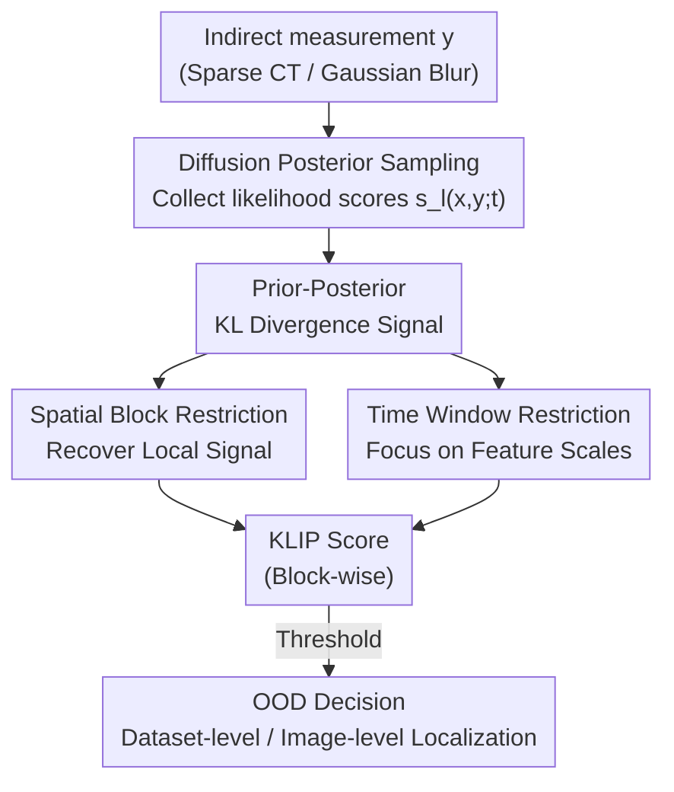

# KLIP: localized distribution shift detection via KL-divergence with diffusion priors in Inverse Problems

**Conference**: CVPR 2026  
**arXiv**: [2605.31596](https://arxiv.org/abs/2605.31596)  
**Code**: https://github.com/voilalab/KLIP (Available)  
**Area**: Medical Imaging / Diffusion Models / Inverse Problems / OOD Detection  
**Keywords**: Distribution Shift Detection, KL-Divergence, Diffusion Priors, Posterior Sampling, Localized Abnormality Localization

## TL;DR
In the process of solving inverse problems (e.g., sparse-view CT, Gaussian deblurring) using diffusion priors, the "KL divergence between the prior distribution $p(x)$ and the posterior distribution $p(x|y)$" is utilized as an OOD signal. By restricting this signal to spatial blocks and specific sampling time windows, the method detects and **localizes** subtle, local, yet diagnostically significant distribution shifts (such as tumors in healthy liver CT scans) without requiring any OOD calibration data.

## Background & Motivation
**Background**: Diffusion models serve as powerful data-driven priors for solving inverse problems (reconstructing image $x$ from indirect measurement $y$) and have been found to possess certain OOD (out-of-distribution) detection capabilities. In medical imaging, the most critical features to capture are "subtle and local" shifts—small lesions, tumors, or tears—which constitute the clinical diagnostic value of the image.

**Limitations of Prior Work**: Existing diffusion-based OOD detection methods face significant drawbacks. Conformal prediction, while statistically rigorous, requires an OOD calibration set, which is often unavailable for rare, long-tail abnormalities in open-world scenarios. Some methods require training multiple diffusion models, while others operate only on full images and cannot utilize the indirect measurements available in inverse problems. Furthermore, many methods can only distinguish "global" OOD images and fail when an image is mostly normal except for a small abnormal region.

**Key Challenge**: When an entire image is treated as a single scalar for OOD scoring, localized subtle shifts are "averaged and diluted" by the surrounding normal regions. This submerges the signal, making ID and OOD samples indistinguishable in score distributions (as shown in Figure 3(b), where whole-image KL divergence histograms overlap completely).

**Goal**: Design an OOD metric that simultaneously satisfies three criteria: (i) Requires no OOD samples or calibration data; (ii) Operates directly on indirect measurements $y$ during inverse problem inference; (iii) Detects and localizes subtle, local, but semantically meaningful distribution shifts.

**Key Insight**: The core observation is that the further the measurement $y$ "pulls" the posterior away from the prior, the more likely $x$ is to be OOD. This is formalized as the KL divergence between the prior $p(x)$ and posterior $p(x|y)$. Crucially, this KL divergence can be estimated using only the **likelihood scores** generated during the posterior sampling process, inherently requiring no OOD data. Combined with the knowledge that diffusion models generate image components of different scales at different sampling stages, restricting the KL divergence to spatial blocks and time windows allows the recovery of local signals from dilution.

**Core Idea**: Utilize "time-step + spatial-block restricted prior-posterior KL divergence" as the OOD metric. It is calibration-free, directly applicable to inverse problems, and capable of block-wise localization of anomalies.

## Method

### Overall Architecture
The KLIP setting assumes a diffusion model **trained only on ID images**, used as a prior to solve inverse problems $y=\mathcal{A}(x)+\epsilon$ (where $\mathcal{A}$ is a linear forward operator like CT projection). The solution follows standard diffusion posterior sampling—adding the prior score $\nabla_x\log p_t(x)$ and the likelihood score $\nabla_x\log p_t(y|x)$ at each step of the reverse SDE to ensure consistency with measurement $y$. The key insight of KLIP is that the **likelihood score** itself encodes "how far the measurement pulls the posterior from the prior." Thus, it can be used to estimate the prior-posterior KL divergence as an OOD signal without extra computation. The pipeline is: Indirect measurement $\to$ Posterior sampling (collecting likelihood scores $s_l(x,y;t)$ per step and sample) $\to$ Aggregating scores into KL divergence by spatial blocks and time windows $\to$ Obtaining block-wise KLIP scores $\to$ OOD determination via thresholding (image-level OOD if any block exceeds threshold; localization based on block position).

### Key Designs

**1. Prior-Posterior KL Divergence as a Calibration-Free OOD Signal**

To address the reliance on OOD calibration data, the OOD signal is defined as the KL divergence between the posterior $p(x|y)$ and the prior $p(x)$, denoted as $D_{KL}(p(x|y)\|p(x))$. The intuition is that the further the measurement $y$ pulls the posterior from the prior, the more likely $x$ is OOD. A Gaussian toy example illustrates this: with prior $p(x)=\mathcal{N}(0,\sigma_1^2)$ and forward model $y=x+\epsilon$, the divergence is $D_{KL}=\frac{\sigma_1^2 y^2}{2(\sigma_1^2+\sigma_2^2)^2}+\text{const}$, which increases quadratically with $|y|$. Measurements with larger magnitudes are less probable under the prior, and KL divergence captures the deviation of $x^\star$ relative to the prior.

The estimation of this KL divergence relies on the property that under a fixed SDE, the KL divergence between two distributions can be written as the weighted integral of the difference between their marginal scores: $D_{KL}(p\|q)=\frac{1}{2}\int_0^T \mathbb{E}_{x\sim p_t}[\|g(t)h(x,t)\|_2^2]\,dt$, where $h(x,t)=\nabla_x\log p_t(x)-\nabla_x\log q_t(x)$. By setting $p$ and $q$ as the posterior and prior respectively, the difference $h$ becomes exactly the **likelihood score** $\nabla_x\log p_t(y|x)$ via Bayesian decomposition. Since posterior sampling already approximates this term with $s_l(x_t,y;t)$, the estimation becomes:

$$D_{KL}(p(x|y)\|p(x))=\frac{1}{2}\int_0^T \mathbb{E}_{x\sim p_t(x|y)}\big[\|g(t)\,s_l(x,y;t)\|_2^2\big]\,dt.$$

Implementation-wise, multiple posterior sampling trajectories (with different random noise $z$) are run, likelihood scores $s_l$ are collected, and the expectation is approximated by the sample mean while the integral is approximated by a summation over time steps. This estimation **requires no OOD images and only an ID-trained diffusion model**.

**2. Spatial Block Restriction: Recovering Diluted Local Signals**

To solve the dilution problem where whole-image KL divergence averages out small anomalies, the method divides each likelihood score $s_l(x,y;t)\in\mathbb{R}^{D\times D}$ into $N_B$ blocks of size $D_B\times D_B$. Let $s_l(x,y;t)|_{B_i}$ be the score restricted to the $i$-th block. Since the KL divergence formula uses the squared $\ell_2$ norm over space, restricting it to blocks yields "block-wise local contributions." This approach draws an analogy to non-parametric KL estimation using histograms, where the block size $D_B$ controls the trade-off between "localization precision and variance." Figure 3(c) demonstrates that histograms for blocks with artifacts versus those without are clearly separated, whereas whole-image KL (3(b)) remains overlapped.

**3. Time Window Restriction: Multiscale Anomalies in Sampling Stages**

Spatial blocking alone is insufficient. The authors leverage the fact that diffusion models generate different scale components at different sampling stages (large $t$ for low-frequency structures, small $t$ for high-frequency details). The KL divergence integral is restricted to a time window $[t_0,t_1]$:

$$\text{KLIP}(B_i,[t_0,t_1];y)=\frac{1}{2}\int_{t_0}^{t_1}\mathbb{E}_{x\sim p_t(x|y)}\big[\|g(t)\,s_l(x,y;t)|_{B_i}\|_2^2\big]\,dt.$$

This dual restriction forms the final KLIP metric. As shown in Figure 3(d), OOD blocks exhibit a distinct "hump" near $t\approx 0.3$, while ID blocks do not. Integrating over the entire $[0,1]$ range would wash out this discriminative signal. Figure 6 shows that large local features appear in earlier time windows, while fine features appear later, explaining why the optimal $[t_0,t_1]$ depends on the scale and shape of the OOD feature.

### Loss & Training
KLIP **requires no additional training**. The diffusion model is trained using standard score-matching losses on ID images. KLIP is a pure inference-time post-processing metric. The only hyperparameters are the block size $D_B$ and the time window $[t_0,t_1]$. These are tuned using a "tuning set" (ID CT scans with synthetic star artifacts) via grid search to maximize OOD detection performance. The same parameters are then **directly transferred** to realistic tasks (liver tumor CT, face deblurring artifacts) without further tuning. The number of samples for expectation approximation is 5 for CT and 8 for faces.

## Key Experimental Results

### Main Results
Performance is measured by AUC for both **dataset-level** (whole-image OOD) and **image-level** (block-wise localization) tasks. Forward problems include 24-view sparse CT and Gaussian deblurring. Backbones include Predictor-Corrector (whole-image) and PaDIS (patch-based), with DDPM for faces. ID distributions are healthy abdominal CT (CHAOS) and CelebA faces; OOD includes synthetic stars, realistic liver tumors, scars, and cinematic character features.

| Task (Model) | OOD Type | $D_{KL}$ (No Time Restr.) | KLIP | Representative Baselines |
|--------|------|------|------|------|
| Dataset-level CT (P-C) | Star | 0.541 | **0.855**† | NLL 0.586 / DiffPath 0.688 |
| Dataset-level CT (P-C) | Tumor | 0.602 | **0.776** | NLL 0.535 / DiffPath 0.368 |
| Image-level CT (P-C) | Star | 0.837 | **0.912**† | — |
| Image-level CT (P-C) | Tumor | 0.856 | **0.878** | — |
| Image-level CT (PaDIS) | Tumor | 0.672 | **0.732** | CutPaste 0.441 / SimpleNet 0.592 |
| Image-level Deblur (DDPM) | Scar | 0.675 | **0.867** | — |
| Image-level Deblur (DDPM) | Character| 0.482 | **0.772** | — |

> † Indicates hyperparameters tuned on the star tuning set; other tasks use the same parameters without re-tuning. Note that CutPaste/SimpleNet act on **reconstructed images** rather than indirect measurements, making the OOD task inherently easier for them.

KLIP significantly outperforms diffusion baselines ($D_{KL}$, NLL, DiffPath). Tumor detection performance (Dataset-level 0.776, Image-level 0.878) far exceeds whole-image $D_{KL}$ and NLL (0.535).

### Ablation Study
Using the Predictor-Corrector model, the contributions of spatial and temporal restrictions are decomposed:

| Config | Dataset Star | Dataset Tumor | Image Star | Image Tumor |
|------|------|------|------|------|
| $D_{KL}$ (Neither) | 0.54† | 0.60 | 0.84† | 0.86 |
| + Spatial Only | 0.85† | 0.65 | 0.88† | 0.91 |
| + Temporal Only | 0.57† | 0.78 | 0.86† | 0.81 |
| KLIP (Both) | **0.86**† | 0.78 | **0.91**† | 0.88 |

Hyperparameter Sensitivity: Tuning on star yields 0.78 / 0.88 for Tumor; re-tuning on tumor improves this to 0.87 / 0.92, but star performance drops (0.86 $\to$ 0.68), indicating that optimal hyperparameters are not entirely universal across OOD types.

### Key Findings
- **Constraints are complementary**: Spatial blocking significantly helps "Dataset-level Star" (0.54 $\to$ 0.85) but is less effective for "Dataset-level Tumor" than temporal restriction (0.65 vs 0.78). KLIP provides the most stable performance by combining both.
- **Physical meaning of time windows**: OOD blocks show discriminative "humps" at specific $t$ values. Integrating over the whole range dilutes this. Large features appear early, small features appear late, consistent with the low-to-high frequency diffusion trajectory.
- **Strong generalization**: Hyperparameters transferred from whole-image models to patch-based PaDIS, and from CT to face deblurring, remain effective, proving the robustness of the metric design.

## Highlights & Insights
- **Repurposing "Byproducts" as "Signals"**: The likelihood score, a necessary component of posterior sampling, is re-interpreted as a prior-posterior KL divergence. This clever repurposing avoids the need for OOD calibration data—a significant advantage for inverse problems.
- **Dual Restriction Strategy**: Addressing the "local signal dilution" problem directly—spatial blocking prevents small regions from being averaged out, while temporal windowing concentrates discriminative power on the relevant sampling stages. Both are grounded in information theory and diffusion dynamics.
- **Transferable Design Philosophy**: The methodology of decomposing a global scalar metric into spatial blocks and temporal windows can be applied to other score-based or energy-based detection tasks, such as watermarking or adversarial localization.

## Limitations & Future Work
- **Hyperparameter Sensitivity**: The optimal block size and time window vary with the scale/shape of anomalies. Parameters tuned on synthetic data may not be perfectly optimal for all real-world tumors, necessitating more robust automated tuning strategies.
- **Inverse Crimes**: Evaluation uses the same forward model for simulation and reconstruction. Although the authors performed some mismatch robustness testing, validation on real clinical scans remains limited.
- **False Positives in Heatmaps**: Some normal regions occasionally show high activation in heatmaps; localization is not pixel-perfect.
- **Dependency on Inverse Solvers**: The method is tied to settings where an explicit forward operator and diffusion posterior sampling are used.

## Related Work & Insights
- **vs. Conformal Prediction ([4,3,20])**: These provide statistically rigorous intervals but require OOD calibration sets. KLIP is calibration-free, designed for rare, open-world anomalies.
- **vs. DiffPath / NLL ([10,33])**: These work on full images and focus on global OOD detection, failing for localized shifts. KLIP operates on indirect measurements and outperforms them in local detection.
- **vs. Industrial Anomaly Detection (CutPaste/SimpleNet)**: Those target pixel-level anomalies in consistent textures (manufacturing) using direct images. KLIP handles higher-variance ID distributions and difficult indirect measurement inputs.
- **Insight**: The "OOD = low density under prior" assumption is often invalid in generative models. By measuring the degree to which the measurement pulls the posterior from the prior, KLIP avoids the traps of density estimation.

## Rating
- Novelty: ⭐⭐⭐⭐⭐ Re-interpreting likelihood scores as prior-posterior KL divergence with dual constraints is highly novel and self-consistent.
- Experimental Thoroughness: ⭐⭐⭐⭐ Covers various inverse problems and anomaly types; however, it relies partially on synthetic data and the "inverse crime" setting.
- Writing Quality: ⭐⭐⭐⭐⭐ Logical flow from toy examples to general derivations; visualizations of the time window mechanism are intuitive.
- Value: ⭐⭐⭐⭐ Addresses a genuine need for "calibration-free, localizable" OOD detection in medical imaging.

<!-- RELATED:START -->

## Related Papers

- [\[CVPR 2026\] Solving a Nonlinear Blind Inverse Problem for Tagged MRI with Physics and Deep Generative Priors](solving_a_nonlinear_blind_inverse_problem_for_tagged_mri_with_physics_and_deep_g.md)
- [\[CVPR 2026\] The Invisible Gorilla Effect in Out-of-distribution Detection](the_invisible_gorilla_effect_in_out-of-distribution_detection.md)
- [\[ICLR 2026\] Distributional Consistency Loss: Beyond Pointwise Data Terms in Inverse Problems](../../ICLR2026/medical_imaging/distributional_consistency_loss_beyond_pointwise_data_terms_in_inverse_problems.md)
- [\[ICLR 2026\] Adaptive Domain Shift in Diffusion Models for Cross-Modality Image Translation](../../ICLR2026/medical_imaging/adaptive_domain_shift_in_diffusion_models_for_cross-modality_image_translation.md)
- [\[CVPR 2026\] PETAR: Localized Findings Generation with Mask-Aware Vision-Language Modeling for PET Automated Reporting](petar_localized_findings_generation_with_mask-aware_vision-language_modeling_for.md)

<!-- RELATED:END -->
