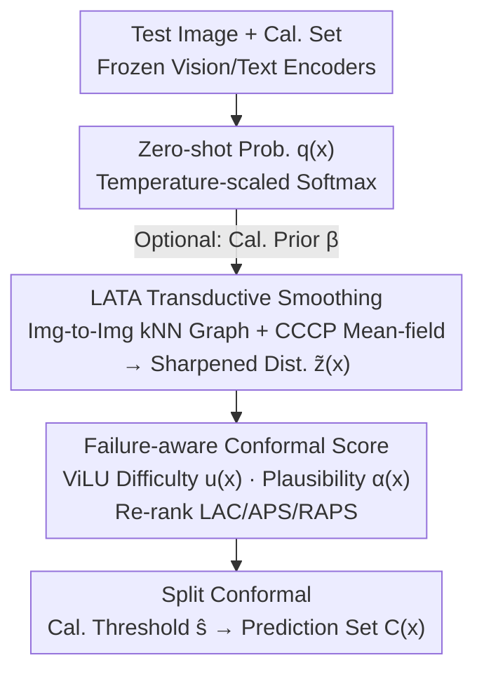

# LATA: Laplacian-Assisted Transductive Adaptation for Conformal Uncertainty in Medical VLMs

**Conference**: CVPR 2026  
**Paper**: [CVF Open Access](https://openaccess.thecvf.com/content/CVPR2026/html/Bozorgtabar_LATA_Laplacian-Assisted_Transductive_Adaptation_for_Conformal_Uncertainty_in_Medical_VLMs_CVPR_2026_paper.html)  
**Code**: None  
**Area**: Medical Images / Multimodal VLMs / Uncertainty and Conformal Prediction  
**Keywords**: Conformal Prediction, Medical VLMs, Transductive Adaptation, Graph Laplacian, Zero-Shot Uncertainty

## TL;DR
Without updating the VLM, using labels, or performing backpropagation, LATA applies a few steps of CCCP mean-field smoothing to zero-shot probabilities along an image-to-image kNN graph, and then overlays a "failure-aware" conformal non-conformity score. This reduces the prediction set size of medical VLMs and balances class-conditioned coverage while maintaining the finite-sample coverage guarantee of split conformal prediction (SCP). It consistently outperforms existing transductive baselines across three medical VLMs and nine tasks with significantly lower computational overhead.

## Background & Motivation

**Background**: Vision-Language Models (VLMs) such as CLIP, along with specialized variants in radiology, pathology, and ophthalmology, have emerged as powerful zero-shot recognizers for medical images. In safety-critical medical scenarios, model accuracy is not the sole concern; more crucially, the model must reliably express uncertainty with rigorous guarantees. Conformal Prediction (CP) can be wrapped around any black-box model to output a prediction set with a **finite-sample marginal coverage guarantee**. Its inductive variant, split conformal prediction (SCP), uses a held-out calibration set to compute a non-conformity score threshold. As long as the calibration and test samples are **exchangeable**, it guarantees that the true label is contained within the prediction set with a confidence level of $1-\alpha$ on the test set.

**Limitations of Prior Work**: Applying SCP to medical VLMs suffers from two persistent issues. First, **poor efficiency and unfairness**—the prediction sets are often excessively large (inefficient) and exhibit severe class-wise coverage imbalance, resulting in a high Class-Conditioned Coverage Gap (CCV), especially in medical scenarios with few-shot data, class imbalance, and domain shifts. Second, **wasted multimodal signals**—standard non-conformity scores like LAC, APS, and RAPS only consider class probabilities, entirely ignoring the cues in the image-text relationships within VLMs that are highly correlated with "errors" and "label plausibility."

**Key Challenge**: A natural inclination is to "train a linear probe or adapter using the calibration labels to reduce the domain gap, and then perform conformal prediction on the same split." However, this leads to "double dipping": adapting and calibrating on the same data split adjusts the non-conformity scores and introduces covariate shift between calibration and test data, thereby **breaking exchangeability and completely invalidating the finite-sample coverage guarantee**—even if accuracy or alignment seems to improve on the surface. Classic Full Conformal Prediction (FCP) can preserve validity in a transductive sense, but it requires re-fitting the model for every query and label, which is computationally prohibitive for deep VLMs.

**Goal**: Can a zero-shot medical VLM be adapted to the target distribution **while preserving the SCP guarantee**, without **training any new parameters or requiring extra labels**? Broken down, this requires: (1) the adaptation process must be **fully symmetric** with respect to both calibration and test data to preserve exchangeability; (2) the image-text structure of the VLM must be utilized to re-rank non-conformity scores; (3) the computational cost must be light enough for practical deployment.

**Key Insight**: The author's observation is that although zero-shot posterior probabilities are noisy, **visually similar images should have similar predictions**. Therefore, "adaptation" is transformed into a graph Laplacian regularization problem: smoothing the zero-shot probabilities over an image-to-image kNN graph so that they remain close to the original zero-shot predictions while varying smoothly across similar samples. Crucially, this smoothing transformation is **deterministic, symmetric, and label-blind**, treating calibration and test data identically, thus naturally preserving exchangeability.

**Core Idea**: Instead of "training an adapter," use a "few steps of mean-field smoothing (CCCP) on the graph to sharpen the zero-shot posteriors," and then overlay a "failure-aware conformal score" to re-rank non-conformity using difficulty/plausibility signals from ViLU. The entire pipeline is black-box, training-free, and label-free, yet approaches the set efficiency of label-based methods.

## Method

### Overall Architecture

The LATA pipeline is built upon frozen contrastive VLMs (the CLIP family and their medical-specialized variants). The inputs are a test image $x_j$ and a 16-shot calibration set $\mathcal{D}_{cal}$, and the output is a **calibrated prediction set** $C(x)$. The overall flow is as follows: The frozen visual/text encoders first produce the zero-shot probability $q(x)$ (optionally adjusted with a calibration prior); the calibration and test sets are merged into a **joint unlabeled pool** $\mathcal{U}=\mathcal{D}_{cal}\cup\mathcal{D}_{test}$ to construct a sparse kNN graph in the image embedding space, followed by several steps of CCCP mean-field updates to obtain the sharpened distribution $\tilde{z}(x)$; a frozen ViLU module generates the difficulty $u(x)$ and label attention $\alpha(x)$ for each image, which are integrated to construct a "failure-aware" non-conformity score $S^\star$; finally, standard SCP calibrates $S^\star$ to produce the prediction set. The entire process requires **no gradient updates, no VLM fine-tuning, and no label exposure during transduction**.

### Key Designs

**1. LATA Transductive Smoothing: Reframing "Adaptation" as a Deterministic Mean-Field Update on Graphs to Avoid Training/Labels and Preserve Exchangeability**

To adapt without violating SCP, the key constraint is that any processing of probabilities must be **fully identical** for both calibration and test data, **without relying on any labels**. LATA models this as a regularization objective: over the joint pool $\mathcal{U}$ ($N=n+m$ samples), finding a sharpened distribution $\tilde{z}_i\in\Delta^{C-1}$ for each sample such that it remains faithful to the original zero-shot $q_i$ while varying smoothly over the image-image graph:

$$\min_{\{\tilde z_i\in\Delta^{C-1}\}}\ \underbrace{\sum_{i=1}^N \mathrm{KL}(\tilde z_i\Vert q_i)}_{\text{fidelity term}}\ +\ \underbrace{\frac{\gamma}{2}\sum_{i,j} W^{\mathrm g}_{ij}\,\|\tilde z_i-\tilde z_j\|_2^2}_{\text{graph smoothing term}}$$

The graph affinity is computed via a Gaussian kernel $W^{\mathrm g}_{ij}=\exp(-\|\tilde v_i-\tilde v_j\|_2^2/\sigma^2)$ (non-zero if $i, j$ are mutual kNNs, where $\sigma$ is the median distance to neighbors, and $\tilde v$ consists of $\ell_2$-normalized image embeddings). Expanding the quadratic term of the graph smoothing splits it into a convex quadratic norm term and a concave bilinear interaction term. Following the **CCCP (Concave-Convex Procedure)**, the authors keep the convex part (the KL fidelity term + diagonal norm) as the main objective and linearize the concave interaction term around the current estimate, yielding an exceptionally simple multiplicative fixed-point update:

$$\tilde z^{(t+1)}_{ik}\ \propto\ q_{ik}\,\exp\!\Big(\gamma \sum_{j} W^{\mathrm g}_{ij}\,\tilde z^{(t)}_{jk}\Big),\qquad \sum_{k=1}^{C}\tilde z^{(t+1)}_{ik}=1$$

Starting from $\tilde z^{(0)}=Q$, running $T_{iter}\approx 5\text{--}10$ steps is sufficient, as CCCP guarantees monotonic non-increase of the objective and convergence to a stable point. The essence of this step is that it is **deterministic** (the same graph and inputs always yield the same output) and **symmetric** (calibration and test share the same joint graph and updates). Therefore, the "adaptation" introduces zero calibration-to-test shift, leaving exchangeability completely intact—which is impossible with the probe-training approach of Adapt+SCP. Intuitively, each sample's probability is "pulled" by the probabilities of its visual neighbors; similar images provide mutual evidence, sharpening the zero-shot posterior and smoothing out noise.

**2. Failure-Aware Conformal Score: Re-ranking Non-conformity via ViLU's Difficulty and Plausibility Signals to Consolidate Uncertainty Where Indicated**

Standard non-conformity scores (LAC, APS, RAPS) only take class probabilities, discarding the structural information between images and texts in VLMs. LATA introduces a frozen **ViLU (vision-language uncertainty)** module as a black box, which outputs two channels of signals for each image: the instance-level failure probability $u(x)\in[0,1]$ and the image-conditioned label attention vector $\alpha(x)\in\Delta^{C-1}$. ViLU computes a cross-attention from the image embedding $v$ to the textual class embedding library $T$, yielding $\alpha(x)$ and a contextual text summary $z_t^\alpha(x)$. A small MLP $g$ then predicts the failure probability $u(x)=\sigma(g([v,\,t_{\hat c(x)},\,z_t^\alpha(x)]))$, where $\hat c(x)$ is the predicted class. ViLU is pre-trained once on independent labeled source data using weighted binary cross-entropy and then frozen. During adaptation, **the same fixed mapping** is applied to both calibration and test data; thus, incorporating these signals into the conformal score does not violate exchangeability.

Realized on top of the LATA-sharpened $\tilde z(x)$, the failure-aware non-conformity score is defined as:

$$S^\star(x,y)\ =\ S_{\text{base}}(\tilde z(x),y)\,\big(1+\lambda\,u(x)\big)\ -\ \eta\,\alpha_y(x)$$

where $S_{\text{base}}\in\{\text{LAC, APS, RAPS}\}$ and $\lambda,\eta\ge 0$ are small scaling weights (defaulting to $\lambda=0.5,\eta=0.25$). The two terms have straightforward meanings: $u(x)$ scales up the score of **samples deemed difficult** (raising the threshold to safeguard coverage and prevent missing the true labels), while $\alpha_y(x)$ discounts labels that are **deemed plausible by the image-text attention** (lowering the score to avoid unnecessarily inflating the prediction set). This simultaneously secures coverage on hard samples and tightens sets on easy ones, improving both efficiency and class-wise balance.

**3. Optional Label-Prior Knob β: Trading a Calibration Marginal Distribution for Extra Coverage while Preserving Validity**

Medical datasets often exhibit severe class imbalance, where pure zero-shot class priors may not be suitable. LATA provides a controllable knob: injecting the calibration set's class-frequency prior $m\in\Delta^{C-1}$ (marginal after Dirichlet smoothing) as a fixed bias, **symmetrically** applied to both calibration and test data:

$$q_{ik}\ \leftarrow\ \frac{q_{ik}\,m_k^{\beta}}{\sum_{\ell=1}^{C} q_{i\ell}\,m_\ell^{\beta}}$$

This is equivalent to adding a class-dependent bias to the logits before softmax: $z_{ik}\leftarrow z_{ik}+\beta\log m_k$. When $\beta=0$, there is no prior, corresponding to the strictly label-free default variant **LATA-LF**. When $\beta>0$ (set to 0.2 in experiments), this yields the label-informed variant **LATA-LI**, which **only utilizes the calibration marginal**. Once again, symmetry is key—the prior is computed only once and applied identically to both calibration and test data. Therefore, even though a small amount of label statistical information is introduced, exchangeability still holds. This knob allows users to smoothly trade off between "strict label-freeness" and "using minimal statistical information for a tighter coverage."

### Loss & Training

LATA itself **has no trainable parameters and performs no backpropagation**. The only "optimization" is the graph regularization objective in Eq.(5), which is solved via CCCP fixed-point iteration (Eq.6) and converges deterministically. In practice, **windowed transduction** is adopted: a sliding window $\mathcal{U}_w$ of fixed size $W=256$ (comprising the union of the calibration split and the current test minibatch), with $k=15$ neighbors and $T_{iter}=8$ mean-field iterations. The graph weight $\gamma=0.35$ is selected once on a disjoint source split and reused across all datasets; the temperature $\tau=1.0$ is not tuned. The ViLU head is pre-trained on independent labeled source data and then frozen. All methods share the same frozen encoders and prompts, running comfortably on a single RTX 4090 GPU.

## Key Experimental Results

### Main Results

Evaluated on three medical VLMs (CONCH for pathology, FLAIR for ophthalmology, and CONVIRT for chest X-rays) across nine tasks (NCT-CRC, SICAPv2, SkinCancer, MESSIDOR, MMAC, FIVES, CheXpert, NIH-LT, COVID), with a 16-shot calibration set sampled according to each task's label marginal. Metrics: Average Class Accuracy (ACA), marginal coverage (Cov.), average set size (Size), and Class-Conditioned Coverage Gap (CCV). The table below shows the results averaged across tasks at $\alpha=0.10$ for three conformal scores (UT = Unsupervised Transductive track, serving as comparable baselines for LATA):

| Score | Method | ACA↑ | Cov. | Size↓ | CCV↓ |
|------|------|------|------|-------|------|
| LAC | SCP (baseline) | 50.2 | 0.890 | 3.99 | 9.96 |
| LAC | Conf-OT | 53.1 | 0.899 | 3.18 | 9.07 |
| LAC | SCA-T | 55.2 | 0.898 | 3.30 | 7.47 |
| LAC | **LATA-LF (β=0)** | **57.0** | 0.900 | **3.07** | **6.40** |
| LAC | LATA-LI (β=0.2) | 57.4 | 0.910 | 3.15 | 6.25 |
| APS | SCP (baseline) | 50.2 | 0.900 | 4.05 | 9.59 |
| APS | Conf-OT | 53.1 | 0.899 | 3.13 | 8.64 |
| APS | SCA-T | 55.2 | 0.900 | 3.35 | 7.18 |
| APS | **LATA-LF (β=0)** | **57.1** | 0.900 | **2.95** | **6.32** |
| APS | LATA-LI (β=0.2) | 57.5 | 0.910 | 3.03 | 6.25 |

Compared to SCA-T, LATA-LF reduces the set size by approximately 7–12% at $\alpha=0.10$ (APS: 3.35 $\rightarrow$ 2.95; LAC: 3.30 $\rightarrow$ 3.07) and decreases the CCV by around 10–15% (LAC: 7.47 $\rightarrow$ 6.40, APS: 7.18 $\rightarrow$ 6.32), while simultaneously improving the ACA by 1–2.5%. This indicates that the efficiency gains are not a cheap byproduct of blindly inflating the prediction sets. When LATA-LI is enabled with $\beta=0.2$, the coverage increases from 0.900 to 0.910 with only a minimal increase in set size (APS: 2.95 $\rightarrow$ 3.03), and the CCV decreases even further. Notably, LATA-LI approaches the performance of the label-based oracle FCA (APS at $\alpha=0.10$: Cov. 0.898 / Size 3.06 / CCV 6.12) **without utilizing any transductive labels**. In contrast, Adapt+SCP, which violates exchangeability, suffers from systematic under-coverage (APS: 0.858).

### Ablation Study

The table below compares different transductive solvers at $\alpha=0.10$ (including running cost). Underlined or colored values represent violations of the target error rate (under-coverage):

| Score | Method | ACA↑ | Runtime T↓ (s) | GPU↓ (GB) | Cov. | Size↓ | CCV↓ |
|------|------|------|------|------|------|-------|------|
| LAC | TIM | 53.5 | 1.12 | 0.6 | 0.888 | 3.96 | 8.08 |
| LAC | TransCLIP | 54.8 | 0.47 | 1.1 | 0.726 (under-coverage) | 2.16 | 22.31 |
| LAC | Conf-OT | 53.1 | 0.60 | – | 0.899 | 3.18 | 9.07 |
| LAC | SCA-T | 55.2 | 1.04 | 0.6 | 0.898 | 3.30 | 7.47 |
| LAC | **LATA-LF** | **57.0** | **0.05** | 0.8 | 0.900 | **3.07** | **6.40** |
| APS | TransCLIP | 54.8 | 0.40 | 1.1 | 0.733 (under-coverage) | 2.52 | 21.78 |
| APS | SCA-T | 55.2 | 1.15 | 0.6 | 0.900 | 3.35 | 7.18 |
| APS | **LATA-LF** | **57.1** | **0.06** | 0.8 | 0.900 | **2.95** | **6.32** |

Although TIM and TransCLIP can shrink the prediction sets, they suffer from **under-coverage** (TransCLIP's CCV even surges to 22), thereby violating the theoretical guarantees. In contrast, LATA's deterministic CCCP adds only about **0.05–0.06 s** of runtime and **0.8 GB** of GPU memory footprint per image, which is an order of magnitude faster than SCA-T (~1 s) while being more accurate and balanced. Furthermore, the parameter sweeps of K-shot and window size $W$ in Fig. 3 show that as $K$ increases from 4 to 16, LATA maintains stable set sizes (3.18 $\rightarrow$ 3.08) and slightly decreases the CCVs (6.45 $\rightarrow$ 6.28), consistently preserving the nominal coverage.

### Key Findings
- **CCCP Graph Smoothing Drives Efficiency and Fairness**: It concentrates uncertainty on classes that are "truly adjacent and easily confused." Qualitative analysis of the SICAPv2 Gleason grading dataset shows that the extreme classes (NC/G5) mostly yield single-element sets (63%/80% are size-1), while the easily confused middle grades (G3/G4) are concentrated in size-2 sets (60–68%). The co-occurrence heatmap is strong along the diagonal, with clinically plausible G3 $\leftrightarrow$ G4 co-occurrences being highly frequent (66%/91%), while distant pairings are heavily suppressed (NC $\leftrightarrow$ G5 $\le 2\%$). This explains the low CCV and small set sizes.
- **Failure-Aware Score Enables "Hard-Easy Bifurcation"**: $u(x)$ raises thresholds on hard samples to safeguard coverage, while $\alpha_y(x)$ tightens sets on easy samples. Their synergy simultaneously improves both ACA and Set Size rather than trading one off for another. Fig. 4(a) shows that LATA-LI achieves $\Delta\text{Acc} > 0$ and $\Delta\text{Size} < 0$ across datasets. However, the linear fit $R^2$ between the two is small, demonstrating that the efficiency gain is **not merely** a byproduct of accuracy improvement.
- **Exchangeability is Strictly Preserved**: In the sanity check of Fig. 4(b), the invalid baseline "Probe@cal + SCP@same" exhibits severe under-coverage, whereas LATA-LF (using a shared, label-free transformation) consistently aligns with the nominal $1-\alpha$ level across random seeds.

## Highlights & Insights
- **"Adaptation" Reconceptionalized as a Deterministic Graph Transformation**: Converting domain adaptation (which usually requires training an adapter) into a few steps of mean-field updates on a graph is excellent. Most elegantly, this transformation is naturally symmetric with respect to both calibration and test data, seamlessly resolving the inherent conflict between "improving efficiency" and "preserving conformal guarantees"—arguably the most beautiful aspect of the paper.
- **Extremely Lightweight Multiplicative Updates in CCCP**: Eq.(6) is simply "zero-shot probability $\times$ exponentially weighted neighbor probabilities" followed by normalization. With zero backpropagation and deterministic convergence, it takes only 0.05 s per image. This delivers posteriors-sharpening at near-zero extra cost, making it highly suitable for compute- and latency-sensitive clinical deployments.
- **Highly Transferable Designs**: (1) "Formulating any post-processing as a symmetric, fixed mapping for both calibration and test data to embed into SCP without breaking guarantees" is a universal recipe. It can be transferred to any conformal prediction setting where priors or re-ranking are desired. (2) "Using a frozen failure-prediction module to re-rank non-conformity scores" can be directly applied to non-medical VLM conformal tasks as well.
- **Design Philosophy of the $\beta$ Knob**: Framing the use of labels as a continuously adjustable symmetric bias rather than a binary hard switch is an elegant engineering choice. It provides an honest lower bound under strict label-freeness, while permitting the trade-off of marginal statistics for tighter coverage when needed.

## Limitations & Future Work
- **Dependency on an Externally Pre-trained ViLU Module**: The failure-aware score requires pre-training ViLU on independent labeled source data. When the discrepancy between the source and target domains is large, the quality of $u(x)/\alpha(x)$ might be unreliable. The paper does not fully discuss the degradation behaviors when ViLU makes incorrect predictions.
- **Approximations Introduced by Windowed Transduction**: To save computation, transduction is restricted to a sliding window of size $W=256$. Graph smoothing occurs solely within this window, causing a theoretical gap compared to full-batch transduction (indicated by the dashed line in Fig. 3). Performance might degrade in extreme long-tail settings or when classes are underrepresented within a window.
- **Assumption of Cross-Domain Hyperparameter Reusability**: The hyperparameters $\gamma=0.35$, $\lambda=0.5$, and $\eta=0.25$ are tuned once on a source split and reused across all nine tasks. While this demonstrates robustness, this fixed set might not be optimal when the target domains diverge drastically from the source split.
- **The Exchangeability Assumption Remains a Prerequisite**: All guarantees are fundamentally tied to the exchangeability of calibration and test data. In real-world clinical deployments, temporal drifts or distribution shifts across different hospitals (breaking exchangeability) will compromise SCP's coverage guarantee, which LATA cannot independently resolve.

## Related Work & Insights
- **vs Adapt+SCP / LinearProbe+SCP**: These baselines train a probe/adapter using calibration labels and perform conformal prediction on the same split. In contrast, this work uses deterministic graph smoothing for label-free adaptation. The critical difference is that the former leads to "double dipping," violating exchangeability and causing systematic under-coverage (APS: 0.858), whereas LATA strictly preserves nominal coverage—representing a fundamental methodological win.
- **vs FCA (Label Oracle)**: FCA fits a per-label adapter on calibration labels to perform full conformal adaptation, which achieves high efficiency but requires label information. LATA-LI closely approaches the FCA performance (APS: Cov. 0.910 vs. 0.898, Size 3.03 vs. 3.06, CCV 6.25 vs. 6.12) **without utilizing any transductive labels**, virtually closing the gap between label-based and label-free methods.
- **vs SCA-T / Conf-OT (Transductive Baselines)**: SCA-T utilizes entropy minimization on the joint pool, and Conf-OT uses optimal transport. While both preserve coverage, they suffer from larger prediction sets, higher CCVs, and heavy computation. LATA represents a Pareto-dominant improvement across efficiency, class-wise balance, and speed (APS Size: 2.95 vs. 3.13–3.35, CCV: 6.32 vs. 7.18–8.64, Runtime: 0.06s vs. ~1s).
- **vs TIM / TransCLIP (Transductive Adapters)**: These approaches focus on maximizing accuracy via test data, but **offer no coverage guarantees**, resulting in empirical under-coverage (TransCLIP Cov: 0.726, CCV: 22.31). This paper underscores that "accuracy improvement" and "conformal coverage guarantees" are distinct properties; transductive adaptation must be performed as a symmetric, fixed mapping to preserve conformal validity.

## Rating
- Novelty: ⭐⭐⭐⭐⭐ Reformulating transductive adaptation as a "deterministic graph transformation symmetric to calibration/test data" is highly novel, elegantly satisfying both conformal guarantees and efficiency improvements, and addressing a real-world exchangeability pitfall.
- Experimental Thoroughness: ⭐⭐⭐⭐⭐ Broadly evaluated across 3 medical VLMs, 9 tasks, 3 conformal scores, and 2 $\alpha$ levels, with extensive analyses including solver comparisons, K/W sweeps, computational complexity audits, exchangeability sanity checks, and qualitative analyses.
- Writing Quality: ⭐⭐⭐⭐ The logic is crisp and well-motivated. Formulas and figures correspond perfectly; however, certain details regarding ViLU rely slightly on literature citations, and some ablation studies reside in the supplementary materials.
- Value: ⭐⭐⭐⭐⭐ Directly addresses safety-critical medical AI reliability, presenting a black-box, training-free, label-free, and computationally lightweight deployment-ready solution with high clinical impact.

<!-- RELATED:START -->

## Related Papers

- [\[CVPR 2026\] Hyperbolic Relational Prompts for Intersectional Fairness in Medical VLMs](hyperbolic_relational_prompts_for_intersectional_fairness_in_medical_vlms.md)
- [\[ICML 2026\] CASCADE Conformal Prediction: Uncertainty-Adaptive Prediction Intervals for Two-Stage Clinical Decision Support](../../ICML2026/medical_imaging/cascade_conformal_prediction_uncertainty-adaptive_prediction_intervals_for_two-s.md)
- [\[CVPR 2026\] Delving Aleatoric Uncertainty in Medical Image Segmentation via Vision Foundation Models](delving_aleatoric_uncertainty_in_medical_image_segmentation_via_vision_foundatio.md)
- [\[CVPR 2026\] TAlignDiff: Automatic Tooth Alignment assisted by Diffusion-based Transformation Learning](taligndiff_automatic_tooth_alignment_assisted_by_diffusion-based_transformation_.md)
- [\[ICLR 2026\] COMPASS: Robust Feature Conformal Prediction for Medical Segmentation Metrics](../../ICLR2026/medical_imaging/compass_robust_feature_conformal_prediction_for_medical_segmentation_metrics.md)

<!-- RELATED:END -->
