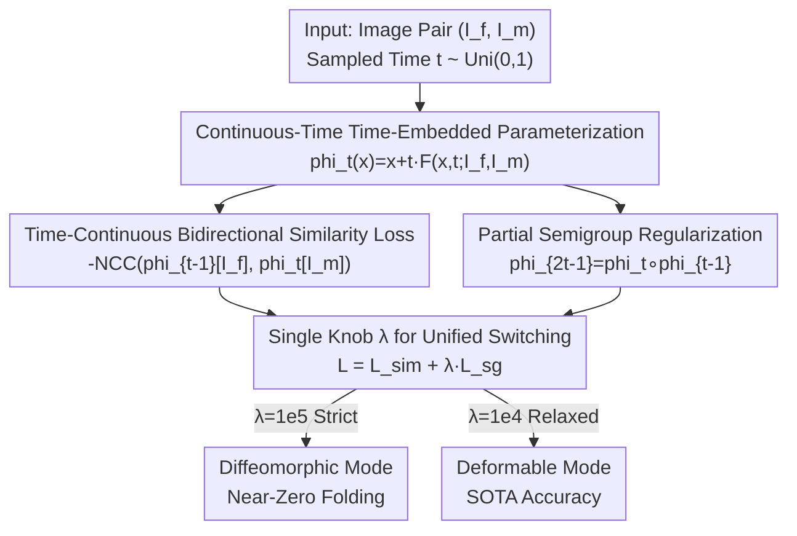

# Learning Diffeomorphism for Medical Image Registration with Time-Embedded Architectures Using Semigroup Regularization

**Conference**: CVPR 2026  
**Paper**: [CVF Open Access](https://openaccess.thecvf.com/content/CVPR2026/html/Matinkia_Learning_Diffeomorphism_for_Medical_Image_Registration_with_Time-Embedded_Architectures_Using_CVPR_2026_paper.html)  
**Code**: https://mattkia.github.io/SGDIR/ (Project Page)  
**Area**: Medical Images  
**Keywords**: Diffeomorphic Registration, Semigroup Regularization, Continuous Time, Time-Embedded Architecture, Topology Preservation

## TL;DR
SGDIR reformulates medical image diffeomorphic registration as a continuous-time problem: using time-embedded backbone networks commonly found in diffusion models (UNet / DiT) to directly predict the deformation field $\phi_t$ at any time $t$. The authors prove that enforcing only a "partial semigroup" regularization term allows the network to implicitly learn an ODE flow, thereby bypassing scaling-and-squaring integration and various manual regularizations while naturally guaranteeing invertibility, cycle consistency, and diffeomorphisms with near-zero folding.

## Background & Motivation

**Background**: Diffeomorphic image registration (DIR) aims to find a smooth, invertible, topology-preserving deformation $\phi$ to align a moving image $I_m$ to a fixed image $I_f$. In medical imaging, once the deformation exhibits "folding" or "tearing", the mapping loses its physical meaning. Modern mainstream methods parameterize a velocity field $v$ and reconstruct the deformation $\phi_1$ using scaling-and-squaring integration, accompanied by a stack of manual regularizations (Jacobian penalty, smoothing constraints, etc.) to enforce invertibility.

**Limitations of Prior Work**: This mainstream pipeline has three major bottlenecks. First, scaling-and-squaring is a numerical integration scheme, which is computationally expensive and can only be evaluated on fixed time grids. Second, properties like invertibility and cycle consistency—which ought to hold natively in medical registration—are often awkwardly forced via **additional explicit losses**, such as simultaneously predicting the forward field $\phi_1$ and the backward field $\phi_1^{-1}$ and constraining their consistency. Third, although diffusion-inspired continuous-time methods (e.g., DiffuseMorph, DiffuseReg) introduce a time dimension, they still rely on iterative sampling and auxiliary constraints without deriving diffeomorphism from first principles.

**Key Challenge**: The fundamental issue is that "diffeomorphism" is treated as an external attribute to be **maintained** through constraints, rather than an **endogenous** property of the model structure. Consequently, integration schemes and regularization terms accumulate, while invertibility remains patched rather than guaranteed.

**Goal**: To construct a continuous-time framework where diffeomorphism naturally arises from the training objective—independent of integration schemes, manual smoothing/inverse-consistency regularizations, or specific network architectures.

**Key Insight**: The authors' key observation is that the ODE flow $\{\phi_t\}$ satisfies the **semigroup property** $\phi_t \circ \phi_s = \phi_{t+s}$, which inherently implies the existence of the inverse $\phi_t^{-1}=\phi_{-t}$ and the diffeomorphic structure. Rather than explicitly integrating an ODE, one can do the reverse: **by forcing the network's output to satisfy a (partial) semigroup constraint, the network is compelled to learn the underlying ODE flow**.

**Core Idea**: Use a time-embedded network to directly predict $\phi_t$, and anchor it to an ODE flow using a single partial semigroup regularization term—swapping integration plus heuristics for semigroup consistency to achieve diffeomorphism.

## Method

### Overall Architecture
SGDIR addresses the question of "how to obtain diffeomorphism without integration." Its overall derivation is to formulate the deformation as a continuous function of time $t$, using a time-embedded backbone network $\mathbf{F}$ to directly output the deformation field at any time. During training, it jointly optimizes a "time-continuous similarity loss" and a "partial semigroup regularization term," with the weight $\lambda$ controlling the latter's strength. Once trained, the network can be queried instantly for deformations at any $t\in[-1,1]$ to warp either image toward the other.

Specifically, the deformation is parameterized as:

$$\phi_t(x;\theta) = x + t\,\mathbf{F}(x, t; I_f, I_m, \theta),\quad t\in[-1,1],$$

where $\mathbf{F}$ is a time-embedded network conditioned on both images (implemented as a time-embedded UNet or Diffusion Transformer in the experiments). This formulation naturally satisfies the ODE initial condition $\phi_0(x)=x$. The two losses are responsible for "accurate alignment" and "valid flows," respectively, with a single knob $\lambda$ switching between "strict diffeomorphic" and "flexible deformable" modes.

### Key Designs

**1. Continuous-Time Time-Embedded Parameterization: Formulating Deformation as an ODE Flow rather than an Integration Endpoint**

Mainstream methods only output the deformation at $t=1$, relying on scaling-and-squaring for step-by-step composition. SGDIR changes this to $\phi_t(x)=x+t\,\mathbf{F}(x,t;\theta)$, allowing the network to directly take time $t$ as input and output the corresponding deformation. This $t$-multiplied formulation offers two benefits: first, it forces $\phi_0(x)=x$ when $t=0$, automatically satisfying the identity initial condition of ODEs without extra constraints; second, it can be evaluated in a single forward pass at any time step without requiring iterative sampling or numerical integration. The authors emphasize that **no new architecture is invented** here—they directly borrow mature time-embedded UNet and DiT architectures from diffusion models. The paper argues that "standard backbones trained under semigroup constraints automatically become diffeomorphic," making the method architecture-agnostic and decoupled from integration schemes.

**2. Partial Semigroup Regularization: Forcing the Entire ODE Flow with a Single Constraint**

This is the core of the paper. Theoretically, an ODE flow satisfies the semigroup property $\phi_t\circ\phi_s=\phi_{t+s}$, but enforcing this constraint over all arbitrary pairs of times $(t,s)$ is practically infeasible. The authors prove that constraining a **computable partial semigroup** is sufficient:

$$\mathcal{L}^t_{\text{sg}} = \|\phi_{2t-1}-\phi_t\circ\phi_{t-1}\|_2 + \|\phi_{2t-1}-\phi_{t-1}\circ\phi_t\|_2,$$

which aligns "first moving to $t-1$ and then moving to $t$" with "directly moving to $2t-1$." The second term swaps the composition order to enforce symmetry, and the composition itself is implemented via bilinear interpolation of the deformation grid. The paper presents Theorem 1: any deformation satisfying this composition rule $\phi_{2t-1}=\phi_t\circ\phi_{t-1}$ with $\phi_0(x)=x$ is an exponential map, equivalent to a one-parameter diffeomorphic solution of an autonomous ODE. This means that as long as this partial semigroup residual is driven to zero, the network's output is mathematically "locked" into an ODE flow. Invertibility $\phi_t^{-1}=\phi_{-t}$, cycle consistency, and topology preservation are all endogenously achieved without any additional regularizations. This is the fundamental difference from existing approaches: while others treat invertibility as an external loss term, SGDIR derives it as a corollary of the semigroup constraint. ⚠️ Theorem proof details are in the Appendix, please refer to the original paper for exact steps.

**3. Time-Continuous Bidirectional Similarity Loss: One Constraint Covering Bidirectional Consistency Across All Time Steps**

Since $\phi_t$ is a continuous flow, the authors adopt a "halfway meeting" trick to define similarity: warping the moving image forward to time $t$ and the fixed image backward to time $1-t$, where the two should meet at corresponding points. Combined with the inverse identity $\phi_{1-t}^{-1}=\phi_{t-1}$, this yields the constraint $\phi_{t-1}[I_f]=\phi_t[I_m]$. Thus, the similarity loss (using Normalized Cross-Correlation, NCC) is formulated as:

$$\mathcal{L}^t_{\text{sim}} = -\mathrm{NCC}(\phi_{t-1}[I_f],\,\phi_t[I_m]),\quad \forall t\in[0,1].$$

The beauty of this design is that, unlike earlier methods (such as CycleMorph) that only explicitly predict forward and backward fields at the endpoint $t=1$ to enforce consistency, this approach automatically obtains bidirectional consistency for **all** $t\in[-1,1]$ without needing to model any inverse field separately. In other words, bidirectional symmetry is obtained "for free" from the definition of the similarity loss.

**4. A Single λ Knob: Unifying Diffeomorphic and Deformable Paradigms within One Architecture**

The total training objective is $\mathcal{L}=\mathbb{E}_{(I_f,I_m)\sim\mathcal{D},\,t\sim\mathrm{Uni}(0,1)}[\mathcal{L}^t_{\text{sim}}+\lambda\,\mathcal{L}^t_{\text{sg}}]$. Here, $\lambda$ directly controls the strength of the semigroup regularizer: when large ($\lambda=10^5$), it strictly enforces flow consistency, leading to a diffeomorphic model with near-zero folding; when small ($\lambda=10^4$), it relaxes the constraint, and the same network generalizes to a highly flexible deformable model with higher registration accuracy. This turns the trade-off of "whether to prioritize topological safety or registration accuracy" into a continuously adjustable knob rather than relying on two completely different methods—a key selling point of the "unified framework" emphasized by the authors.

### Loss & Training
During training, image pairs and time $t\sim\mathrm{Uni}(0,1)$ are uniformly sampled to minimize $\mathcal{L}^t_{\text{sim}}+\lambda\mathcal{L}^t_{\text{sg}}$. Similarity is measured via NCC, and semigroup composition is implemented using bilinear interpolation. All experiments were conducted on a single NVIDIA RTX 3090 GPU (24GB), using either a time-embedded UNet (12.8M parameters) or DiT (68.6M parameters) as the backbone.

## Key Experimental Results

Evaluations were performed across **8 2D/3D MR and CT datasets**: OASIS, CANDI, LPBA40, Mindboggle101, IXI, ACDC, and Learn2Reg LungCT / AbdomenCTCT. Evaluation metrics include Dice, TRE, HD95, SSIM, ASSD, and the percentage of voxels with negative Jacobian determinants $|J|{<}0\%$ (topology violation rate, lower is better).

### Main Results: OASIS (Brain MRI)

| Type | Method | Dice↑ | $\|J\|{<}0\%$↓ | HD95↓ | SSIM↑ |
|------|------|------|------|------|------|
| Diffeomorphic | GradICON | 84.53 | 0.0022 | 2.23 | 85.90 |
| Diffeomorphic | TransMorph-diff (Strongest Competitor) | 84.63 | 0.0091 | 2.25 | 89.91 |
| Diffeomorphic | **SGDIR DiT (λ=10⁵)** | **86.53** | **0.0** | **1.90** | **91.45** |
| Diffeomorphic | SGDIR UNet (λ=10⁵) | 86.16 | 0.0 | 1.96 | 90.71 |
| Deformable | TransMorph | 85.26 | 2.0155 | 2.39 | 91.79 |
| Deformable | HViT | 85.38 | 0.3566 | 2.13 | 92.02 |
| Deformable | **SGDIR DiT (λ=10⁴)** | **88.09** | 0.4332 | **1.73** | **93.80** |

Under the atlas-based setting, in the diffeomorphic mode, SGDIR improves the Dice score from the best competitor's 84.63 to 86.53, while driving the topology violation rate to **0.0** (completely folding-free). When relaxed to the deformable mode, the Dice score further surges to 88.09, outperforming all deformable SOTAs.

### Main Results: AbdomenCTCT (Abdomen CT, Higher Difficulty)

| Type | Method | Dice↑ | $\|J\|{<}0\%$↓ | HD95↓ | ASSD↓ |
|------|------|------|------|------|------|
| Diffeomorphic | NePhi (Strongest Competitor) | 45.32 | 0.0008 | 12.48 | 3.90 |
| Diffeomorphic | **SGDIR UNet (λ=10⁵)** | **53.64** | **0.0** | **10.07** | 2.97 |
| Diffeomorphic | SGDIR DiT (λ=10⁵) | 52.23 | 0.0001 | 10.27 | 2.89 |
| Deformable | SACB-Net | 53.38 | 0.9348 | 13.09 | 3.67 |
| Deformable | **SGDIR UNet (λ=10⁴)** | **56.57** | 0.2683 | **9.19** | 2.45 |

On Abdomen CT, diffeomorphic SGDIR increases the Dice score from 45.32 to 53.64 (**over +8 gain**), with the $|J|{<}0\%$ remaining at 0, while the deformable variant reaches 56.57. The authors summarize that on MRI, diffeomorphic SGDIR improves average Dice by +2.5% compared to the strongest diffeomorphic method, gains over +5% on AbdomenCTCT, and reduces TRE on LungCT by approximately 10% compared to the best model.

### Ablation Study: Semigroup Regularization Weight λ (OASIS / LungCT)

| λ | OASIS Dice↑ | OASIS $\|J\|{<}0\%$↓ | LungCT TRE↓ | LungCT $\|J\|{<}0\%$↓ |
|------|------|------|------|------|
| 10⁵ | 85.90 | 0.0003 | 2.37 | 0.0 |
| 10⁴ | 87.82 | 0.3982 | 2.23 | 0.0615 |
| 10³ | 84.66 | 3.1876 | 2.66 | 1.0183 |
| 10² | 81.01 | 6.7403 | 3.15 | 3.1098 |
| 10 | 80.23 | 7.0794 | 3.78 | 5.3951 |
| 0 | 79.80 | 7.8612 | 3.99 | 6.7632 |

This ablation table clearly highlights the function of the semigroup regularizer: a larger $\lambda$ reduces folding (almost zero when $\lambda=10^5$), albeit with a slight sacrifice in Dice score; $\lambda=10^4$ serves as the sweet spot for accuracy (Dice 87.82); once reduced below $10^3$, the folding rate surges and accuracy collapses. Completely removing the regularizer ($\lambda=0$) yields a high topology violation rate of 7.86% and drops the Dice score to 79.80. This demonstrates that semigroup regularization not only prevents folding, but also constrains the deformation trajectory, stabilizes optimization, and guides the model toward anatomically plausible solutions.

### Computational Efficiency

| Metric | SGDIR UNet | SGDIR DiT | HViT | TransMorph-diff |
|------|------|------|------|------|
| Parameter Count | 12.8M | 68.6M | 21.2M | 46.8M |
| Test GPU Memory | 2.82GB | 5.17GB | 5.76GB | 4.67GB |
| Test Latency / Iter. | 0.25s | 0.22s | 0.51s | 0.46s |

By eliminating the expensive integration schemes, SGDIR's inference speed is approximately **2x faster** than HViT / TransMorph with roughly half the GPU memory usage.

### Key Findings
- **Semigroup Regularization is the Engine**: Removing it ($\lambda=0$) causes the topology violation rate to jump from near-zero to 7.86% and drops the Dice score to 79.80. This proves that diffeomorphism is indeed endogenous to this constraint, rather than an inherent property of the backbone network.
- **Two Paradigms, One Architecture**: Adjusting the single knob $\lambda$ switches between "zero-folding diffeomorphic" and "hyper-SOTA deformable" modes, requiring no architectural changes or redesigning of losses.
- **Continuous Time Outperforms Discrete Sampling**: As the number of discrete time sampling points increases, Dice and $|J|{<}0\%$ consistently improve, with continuous sampling (cont) yielding the best results. This indicates that dense constraints along the time dimension help learn smoother and more invertible flows.
- **All-Time Topology Preservation**: The diffeomorphic SGDIR maintains near-zero folding across the entire interval $t\in[0,1]$, whereas the foldings of the deformable variant accumulate only near $t\approx 1$.

## Highlights & Insights
- **A Mind-Bending Reversal of Perspective**: Traditional approaches treat diffeomorphism as an external property to be maintained via auxiliary regularizations. SGDIR proves that as long as the partial semigroup constraint is satisfied, the network is forced to learn an ODE flow—making invertibility, cycle consistency, and topology preservation corollaries of the theorem rather than independent loss terms. This marks a paradigm shift from "patchwork" to "endogenous" design.
- **The "Halfway Meeting" Similarity Loss is Clever**: Warping the moving image forward to $t$ and the fixed image backward to $1-t$, while utilizing the inverse identity $\phi_{1-t}^{-1}=\phi_{t-1}$, directly yields bidirectional consistency across all time steps without explicitly modeling any inverse field. This trick can be readily transferred to other registration or optical flow tasks with continuous-time assumptions.
- **Architecture Agnosticism is a Pragmatic Selling Point**: Instead of inventing a new backbone, it reuses mature time-embedded UNet/DiTs from diffusion models. The central claim that "standard backbones trained under semigroup constraints automatically become diffeomorphic" makes the method highly integrable into existing pipelines.
- **Unification of Two Paradigms via a Single λ**: Parameterizing the trade-off between clinical "topological safety vs. registration accuracy" into a continuously adjustable knob is exceptionally engineering-friendly.

## Limitations & Future Work
- **Theoretical Strength Relies on Driving the Partial Semigroup Residual strictly to Zero**: Theorem 1 holds under the ideal limit where composition residual is zero, whereas in practical training $\mathcal{L}^t_{\text{sg}}$ is only optimized to be very small. When $\lambda$ is not large enough (e.g., $10^3$), the folding rate immediately rebounds to above 3%, indicating that "approximate diffeomorphism" is highly sensitive to the regularization weight. ⚠️ Strictly speaking, the approximation bounds are subject to the proofs in the original paper and the appendix.
- **The Deformable Mode is Not Truly Diffeomorphic**: Although the highest accuracy is achieved at $\lambda=10^4$, the $|J|{<}0\%$ is non-zero (0.40 on OASIS, 0.27 on AbdomenCTCT), sacrificing topological guarantees. Users must weigh the choice between the two modes based on the specific scenario.
- **Semigroup Composition Relies on Bilinear Interpolation**: The compound deformation is implemented via grid interpolation. Whether the interpolation error accumulates over long trajectories or large deformations and how it affects the theoretical guarantees are not thoroughly discussed.
- **High Training GPU Memory Footprint**: The peak training GPU memory for SGDIR UNet is 22.6GB, approaching the limit of a 24GB card; the semigroup term requires computing the composition $\phi_t\circ\phi_{t-1}$, which places additional overhead on GPU memory.

## Related Work & Insights
- **vs. Scaling-and-Squaring methods (e.g., SYMNet, TransMorph-diff)**: These methods parameterize a velocity field and numerically integrate it to obtain $\phi_1$, combining it with Jacobian/smoothing regularizations. SGDIR directly predicts $\phi_t$ and replaces integration and regularizers with the semigroup constraint, offering faster inference (~2x) and fewer foldings (0.0 vs. 0.0091 on OASIS).
- **vs. ODE-based Method NODEO**: NODEO integrates learned velocity dynamics explicitly using a Neural ODE. SGDIR, instead of assuming velocity ODEs, allows the ODE flow to **emerge** from semigroup consistency, bypassing ODE solvers.
- **vs. Endpoint Inverse-Consistency Methods (e.g., CycleMorph)**: These methods only predict forward and backward fields explicitly at the endpoint $t=1$ to enforce consistency. SGDIR automatically achieves bidirectional consistency across all $t\in[-1,1]$ without modeling an inverse field.
- **vs. Diffusion-Inspired Registration (e.g., DiffuseMorph, DiffuseReg)**: Both leverage denoising diffusion to learn continuous deformations but suffer from heavy overhead due to iterative sampling on fixed time grids. SGDIR adopts a similar time-embedded backbone but allows instant queries at any arbitrary $t$ without iterative sampling.

## Rating
- Novelty: ⭐⭐⭐⭐⭐ Reframing diffeomorphism from an "external regularization patch" into a "mathematical corollary of partial semigroup constraints" with theoretical theorems is highly original.
- Experimental Thoroughness: ⭐⭐⭐⭐⭐ Coverage of 8 2D/3D MR/CT datasets across both diffeomorphic and deformable tracks, along with multi-dimensional ablations on $\lambda$, discrete sampling, time steps, and computation.
- Writing Quality: ⭐⭐⭐⭐ Theories and motivations are clear, though key theorem and approximation bound details are deferred to the Appendix, requiring readers to cross-reference to fully keep up.
- Value: ⭐⭐⭐⭐⭐ Unifying diffeomorphic and deformable registration via a single knob in the same architecture—while being faster and more GPU memory-efficient—is highly practical for medical registration.

<!-- RELATED:START -->

## Related Papers

- [\[CVPR 2026\] Dynamic Stream Network for Combinatorial Explosion Problem in Deformable Medical Image Registration](dynamic_stream_network_for_combinatorial_explosion_problem_in_deformable_medical.md)
- [\[CVPR 2026\] CRFT: Consistent-Recurrent Feature Flow Transformer for Cross-Modal Image Registration](crft_consistent-recurrent_feature_flow_transformer_for_cross-modal_image_registr.md)
- [\[ICLR 2026\] Rethinking Model Calibration through Spectral Entropy Regularization in Medical Image Segmentation](../../ICLR2026/medical_imaging/rethinking_model_calibration_through_spectral_entropy_regularization_in_medical_.md)
- [\[CVPR 2026\] Multimodal Causality-Driven Representation Learning for Generalizable Medical Image Segmentation](multimodal_causal-driven_representation_learning_for_generalizable_medical_image.md)
- [\[ECCV 2024\] NePhi: Neural Deformation Fields for Approximately Diffeomorphic Medical Image Registration](../../ECCV2024/medical_imaging/textttnephi_neural_deformation_fields_for_approximately_diff.md)

<!-- RELATED:END -->
