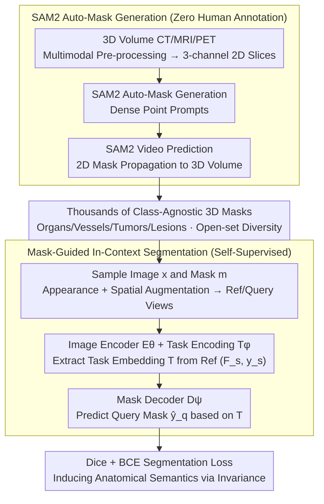

# Learning Generalizable 3D Medical Image Representations from Mask-Guided Self-Supervision

**Conference**: CVPR 2026  
**arXiv**: [2603.13660](https://arxiv.org/abs/2603.13660)  
**Code**: Available (As mentioned in the paper: Code is available)  
**Area**: Medical Imaging  
**Keywords**: Self-supervised learning, 3D medical images, mask-guided pre-training, in-context segmentation, foundation models

## TL;DR

Ours proposes MASS (MAsk-guided Self-Supervised learning), which utilizes class-agnostic masks automatically generated by SAM2 as pseudo-labels. By using in-context segmentation as a pretext task for self-supervised pre-training without any manual annotation, it learns semantically rich and highly generalizable 3D medical image representations. It achieves superior performance in few-shot segmentation and frozen encoder classification.

## Background & Motivation

**Background**: Foundation models like GPT, CLIP, and DINO have learned universal representations from large-scale unlabeled data in natural language/image domains, but a corresponding foundation model paradigm is still missing in the 3D medical imaging field.

**Limitations of Prior Work**: Existing self-supervised methods (SimCLR, MoCo) focus on global features, while reconstruction methods like MAE focus on low-level textures; neither captures the anatomical semantics and spatial precision required for medical imaging.

**Limitations of Supervised Pre-training**: Methods such as SuPreM and STU-Net rely on massive expert annotations and are restricted by predefined category systems (e.g., 25 organs + 7 tumors), making them difficult to scale to thousands of anatomical variants and pathologies in clinical practice.

**Key Challenge**: Unlike natural images, almost all voxels in medical scans have clinical significance (bone density $\rightarrow$ fracture, soft tissue texture $\rightarrow$ tumor, vascular patterns $\rightarrow$ ischemia), and spatial accuracy is critical.

**Key Challenge**: Pixel-level annotation of 3D medical images requires professional expertise and is extremely expensive, limiting the scalability of pre-training methods that use segmentation as a pretext task.

**Key Insight**: Semantic segmentation is the pretext task most aligned with clinical reasoning (clinicians reason by identifying "what" and "where" structures are), and automatically generated class-agnostic masks, despite lacking semantic labels and containing noise, are sufficient to capture anatomically and pathologically meaningful regions.

## Method

### Overall Architecture

MASS addresses the lack of "foundation models" in 3D medical imaging: contrastive learning only learns global features, MAE only learns low-level textures, and supervised pre-training is bottlenecked by expensive labels and closed-set taxonomies. Its core bet is that semantic segmentation is the pretext task closest to clinical reasoning, and the masks used for segmentation do not need semantic labels—or even high precision.

The framework consists of two stages. **Stage 1: Unlabeled mask generation.** SAM2, trained on natural images with zero medical knowledge, is used as a "free annotator." 3D volumes are converted into 3-channel inputs (via different window settings for CT or quantile normalization for MRI/PET). 2D slices are sampled uniformly along the optimal imaging axis for SAM2's automatic mask generation (dense point prompts). SAM2's video prediction capability is then used to propagate these masks back to the entire 3D volume, generating hundreds to thousands of 3D masks covering organs, vessels, tumors, and lesions per volume. **Stage 2: Mask-guided self-supervised learning.** Following the in-context segmentation (ICS) architecture, the model includes an image encoder $E_\theta$, a task encoding module $T_\phi$, and a mask decoder $D_\psi$. Each iteration samples an image $x$ and its automatic mask $m$ to create a reference pair $(x_s, y_s)$ and a query pair $(x_q, y_q)$. The reference view provides "where" (spatial) information, while appearance transformations force the model to learn "what" (semantic consistency) across different visual representations.

### Key Designs

**1. SAM2 as a "Free Annotator": Converting natural image models into 3D mask generators**

To bypass expensive pixel-level human annotation, MASS utilizes SAM2. The process involves three steps: first, 3D volumes are formatted as 3-channel 2D inputs (for CT, different windows highlight soft tissue, bone, and lung; for MRI/PET, quantile normalization is used), and 2D slices are sampled. SAM2 runs automatic mask generation (dense prompts) on each slice to obtain class-agnostic 2D masks. Then, SAM2’s video prediction propagates these 2D masks inter-slice back to the full 3D volume. This unified process works across CT, MRI, and PET without modality-specific designs, producing thousands of 3D masks per volume with zero human labor.

**2. Open-set mask diversity: Using thousands of coarse masks to cover multi-granular concepts**

The generated masks are key assets: predefined taxonomies (e.g., 25 organs) cannot represent thousands of clinical anatomical variants. MASS consumes these class-agnostic masks, ranging from organ-level to sub-anatomical regions and pathologies. This forces the model to learn a broad spectrum of composable visual primitives—texture patterns, boundary features, spatial configurations, and intensity distributions. Since it is not constrained by a closed-set taxonomy, it is more robust than fixed-category solutions in cases of taxonomy mismatch.

**3. In-context segmentation task embedding: Turning segmentation into a self-supervised signal**

With masks available, a semantic-learning task is required. To learn semantics without labels, the model must infer "what to segment" from an example. MASS uses the in-context segmentation architecture: it encodes a reference image $F_s = E_\theta(x_s)$, then uses a task encoding module to extract a task embedding $\mathcal{T} = T_\phi(F_s, y_s)$, compressing the information of "which anatomical structure to segment" into $\mathcal{T}$. Finally, the decoder predicts the query mask $\hat{y}_q = D_\psi(E_\theta(x_q), \mathcal{T})$. Every automatic mask becomes a "see-reference, segment-query" mini-task.

**4. Implicit semantic learning: Forcing semantics to emerge through invariance**

Since automatic masks lack semantic names, how does the model avoid learning texture shortcuts? MASS uses augmentations to break shortcuts: appearance augmentations (brightness, contrast, gamma, Gaussian noise) destroy intensity matching, while spatial augmentations (rotation, scaling, translation) remove position and orientation cues. When superficial cues are disrupted, the only stable feature the model can rely on is the underlying anatomical semantic identity. Semantics thus "emerge" from invariance.

### Loss & Training

- **Loss Function**: $\mathcal{L}_{Seg} = \mathcal{L}_{Dice}(\hat{y}_q, y_q) + \mathcal{L}_{BCE}(\hat{y}_q, y_q)$, jointly optimizing Dice Loss and Binary Cross Entropy.
- **Training Strategy**: Spatial transformations (rotation, scaling, translation) are applied to both image and mask to maintain correspondence; appearance transformations are applied only to the image.
- **Backbone**: Default is 3D ResUNet.
- **Pre-training Scale**: From small-scale (20-200 scans) to large-scale (5K multimodal CT/MRI/PET volumes across 12 datasets).
- **Downstream Modes**: (1) Training-free in-context segmentation (no parameter updates); (2) Task-specific fine-tuning; (3) Frozen encoder for classification.

## Key Experimental Results

### Main Results

**Table 1: Single-dataset few-shot segmentation (Dice %)**

| Method | BCV 1-shot | BCV 10-shot | AMOS MR 1-shot | AMOS MR 10-shot | SS H&N 1-shot | KiTS 30-shot |
|------|-----------|------------|----------------|----------------|--------------|-------------|
| Scratch | 27.3 | 75.2 | 32.8 | 75.9 | 51.8 | 35.7 |
| SimCLR | 44.9 | 78.4 | 35.9 | 78.0 | 53.6 | 41.5 |
| MASS-IC | **65.5** | 73.6 | **62.1** | 71.6 | **59.3** | 3.8 |
| MASS-FT | **68.8** | **83.7** | **65.9** | **84.7** | **66.9** | **64.3** |
| Full Supervision | 83.6 | — | 85.5 | — | 78.2 | 81.7 |

**Table 2: Large-scale multimodal pre-training (Dice %, 5K volume pre-training)**

| Method | BCV 1-shot | AMOS MR 1-shot | KiTS 30-shot | Pelvic 1-shot |
|------|-----------|----------------|-------------|--------------|
| SuPreM (Supervised) | 63.9 | 55.1 | 64.1 | 85.4 |
| Iris-FT (Supervised) | 83.4 | 83.6 | 78.3 | 86.9 |
| AnatoMix | 53.1 | 35.9 | 40.6 | 82.2 |
| Merlin | 50.1 | 37.9 | 51.1 | 79.3 |
| **MASS-FT** | **70.2** | **74.3** | **68.5** | **92.8** |

**Table 3: Classification performance (AUC %, Frozen Encoder)**

| Method | RSNA ICH 5% | RSNA ICH 100% | Liver Trauma 30% | Kidney Trauma 30% |
|------|------------|--------------|-----------------|-------------------|
| Scratch (Full Training) | 72.8 | 89.5 | 74.4 | 75.0 |
| SuPreM | 73.5 | 78.3 | 68.3 | 54.9 |
| Merlin | 57.3 | 65.5 | 60.1 | 58.0 |
| **MASS** | **75.4** | **81.5** | **86.7** | **82.9** |

### Ablation Study

**Mask Quality**: The average Dice of automatic masks vs. GT is only 15.2% (BCV) and 7.1% (SS H&N), with only 14%/13% of masks having a Dice > 40. However, MASS still achieves 65.5% and 59.3% in 1-shot performance, proving that weak supervision is sufficient.

**Mask Generation Comparison**:

| Mask Source | BCV 1-shot | SS H&N 1-shot |
|----------|-----------|--------------|
| TotalSegmentator | 80.7 | 13.5 (No category coverage) |
| SAM2 | 65.5 | 59.3 |
| SLIC Superpixels | 54.3 | 43.8 |

**Diversity > Quantity**: Expanding from single-organ abdominal CT (BCV, 42.7%) to whole-body CT + multimodal data reached 73.9%. Anatomical and modality diversity drives performance, while in-domain data stacking saturates quickly.

**Architecture Generalization**: ResUNet and I3DResNet152 show comparable performance (Seg 73.87 vs 72.56, Class 75.42 vs 75.98), verifying that the method is independent of specific encoder designs.

### Key Findings

1. **Anatomy vs. Pathology**: MASS-IC has strong few-shot capability for anatomical structures (organs) but limited in-context performance on highly variable tumors (KiTS at 2.7%); after fine-tuning, MASS-FT significantly outperforms baselines (64.3% vs 42.2%).
2. **20-40% Labels Match Full Supervision**: On anatomical datasets, MASS-FT achieves full supervised performance using only 10-shot (approx. 25-40% of training data).
3. **Frozen Encoder Outperforms Full Training**: On RSNA ICH 5% data, MASS with a frozen encoder (75.4%) outperforms training from scratch (72.8%); the gain is more significant on Trauma 30% data (Liver 86.7 vs 74.4, Kidney 82.9 vs 75.0).
4. **OOD Generalization**: On unseen datasets (BraTS, ACDC, Pelvic), MASS is competitive and even surpasses supervised pre-training (Pelvic 92.8 vs Iris 86.9).

## Highlights & Insights

- **Novelty**: For the first time, "class-agnostic mask-guided in-context segmentation" is established as a pretext task for 3D medical SSL, bypassing the annotation bottleneck.
- **Weak-to-Strong**: Despite the automatic masks sharing only 7-15% overlap with GT, training on thousands of "roughly correct" tasks allows the model to learn semantic concepts beyond individual mask boundaries.
- **High Data Efficiency**: Using only 5K volumes (far fewer than OpenMind's 114K), it surpasses all self-supervised baselines. BCV-only pre-training (23 scans) already approaches SuPreM's performance on ICH classification.
- **Semantic Emergence**: Without semantic labels, appearance/spatial perturbations force the model to learn the invariant factor—the essential semantic identity of anatomical structures.
- **Open-set Advantage**: Not bound by predefined categories, SAM2 masks naturally cover diverse structures at multiple granularities, performing much better than TotalSegmentator in taxonomy-mismatched scenarios (e.g., SS H&N).

## Limitations & Future Work

1. **Weak In-Context Ability for Pathology**: Zero-shot in-context segmentation for high-variance tumors (e.g., KiTS) is poor (2.7%); fine-tuning is necessary for effective handling.
2. **Untapped Synergy of Weak Masks + Expert Labels**: The study intentionally excluded labeled data and has not yet investigated the potential of combining automatic masks with small amounts of expert annotation.
3. **Reliance on SAM2 Boundary Detection**: Mask quality is limited by SAM2's domain shift performance on medical images, which may be suboptimal for structures with blurred boundaries.
4. **Lack of Vision-Language Alignment**: Not aligned with radiological reports, limiting applications in tasks like report generation.
5. **Gap with Supervised Pre-training**: When the evaluation target matches supervised labels (e.g., BCV), supervised methods (Iris 83.2) still lead MASS (70.2) by 10-15 points.

## Related Work & Insights

- **Self-Supervised Learning**: Model Genesis (restoration), MAE/SimMIM (mask reconstruction), DINO (self-distillation), SimCLR/MoCo (contrastive)—focus on general features but lack the spatial precision of segmentation.
- **Supervised Pre-training**: SuPreM (25M labels), STU-Net (TotalSegmentator)—limited by annotation scale and fixed categories.
- **Synthetic Data**: AnatoMix (synthetic CT from masks)—distribution shifts limit transfer performance.
- **Universal Segmentation**: UniverSeg, Iris (in-context but require labels), Medical SAM adapters—require labels or manual interaction during inference.
- **Mechanism of MASS**: The only self-supervised solution that is unlabeled, open-set mask-based, semantically emergent, and multimodal compatible.

## Rating

- Novelty: ⭐⭐⭐⭐⭐ — Elegantly designs a pretext task using class-agnostic automatic masks for medical SSL.
- Experimental Thoroughness: ⭐⭐⭐⭐⭐ — Covers 4 modalities, 12+ datasets, segmentation and classification tasks, and scales from 20 scans to 5K volumes.
- Writing Quality: ⭐⭐⭐⭐⭐ — Complete logical chain from motivation to experiment; the "invariance $\rightarrow$ semantic emergence" explanation is elegant and convincing.
- Value: ⭐⭐⭐⭐⭐ — Provides a highly practical and scalable path for 3D medical foundation models without requiring labels.

<!-- RELATED:START -->

## Related Papers

- [\[CVPR 2026\] Multimodal Causality-Driven Representation Learning for Generalizable Medical Image Segmentation](multimodal_causal-driven_representation_learning_for_generalizable_medical_image.md)
- [\[ICCV 2025\] An OpenMind for 3D Medical Vision Self-supervised Learning](../../ICCV2025/medical_imaging/an_openmind_for_3d_medical_vision_selfsupervised_learning.md)
- [\[CVPR 2026\] SAR2Net: Learning Spatially Anchored Representations for Retrieval-Guided Cross-Stain Alignment](sar2net_learning_spatially_anchored_representations_for_retrieval-guided_cross-s.md)
- [\[CVPR 2026\] Masked-Diffusion Autoencoders for 3D Medical Vision Representation Learning](masked-diffusion_autoencoders_for_3d_medical_vision_representation_learning.md)
- [\[CVPR 2026\] Depth Any Endoscopy: Towards Self-Supervised Generalizable Depth Estimation in Monocular Endoscopy](depth_any_endoscopy_towards_self-supervised_generalizable_depth_estimation_in_mo.md)

<!-- RELATED:END -->
