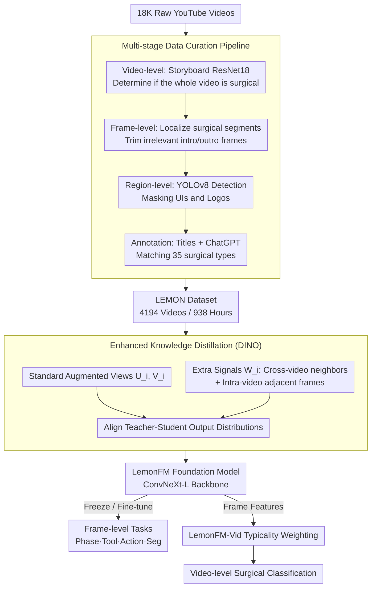

# LEMON: A Large Endoscopic MONocular Dataset and Foundation Model for Perception in Surgical Settings

**Conference**: CVPR 2026  
**arXiv**: [2503.19740](https://arxiv.org/abs/2503.19740)  
**Code**: [https://github.com/visurg-ai/LEMON](https://github.com/visurg-ai/LEMON)  
**Area**: Medical Imaging / Surgical Vision  
**Keywords**: Surgical Foundation Model, Endoscopic Dataset, Self-Supervised Learning, Knowledge Distillation, Surgical Scene Understanding

## TL;DR

Ours constructs LEMON, a large-scale endoscopic dataset containing 4194 surgical videos (938 hours), and proposes LemonFM, a self-supervised foundation model based on enhanced knowledge distillation. LemonFM outperforms existing surgical foundation models across four downstream tasks: surgical phase recognition, tool detection, action recognition, and semantic segmentation.

## Background & Motivation

Surgical vision is a core perception capability for autonomous surgical robots, requiring models to accurately understand tools, tissues, and surgical phases within the environment. However, due to medical data privacy regulations and labeling difficulties, existing public surgical datasets are extremely limited in scale—most contain fewer than 100 videos and less than 30 hours of footage, leading to poor model generalization.

Self-supervised learning (SSL) provides a new path to address label scarcity: pre-training foundation models on large-scale unlabeled data can significantly reduce dependence on annotated data. But the Key Challenge lies in the **data itself**—existing attempts either rely on private data (e.g., Endo-FM), leading to irreproducibility, or use smaller-scale public datasets (e.g., EndoViT) with limited effectiveness.

Recent works like GenSurgery and SurgeNetXL attempted to collect surgical videos from the web, but they lack a systematic data curation pipeline. The collected videos contain significant non-surgical content (e.g., conference presentations, patient interviews, equipment UI interfaces), and these noises may introduce spurious features that interfere with model learning.

The Key Insight of this paper is: **there are enough high-quality surgical videos on the internet; the key is how to systematically filter, clean, and annotate them**. The authors propose a complete multi-stage data curation pipeline to carefully filter 4194 high-quality surgical videos from 18K raw YouTube videos and train a new self-supervised foundation model based on this dataset.

## Method

### Overall Architecture

The fundamental bottleneck this work addresses is not the model but the data: web-based surgical videos are abundant but mixed with conference talks, patient interviews, and device UIs. Direct pre-training on such data causes models to learn spurious features. Consequently, the authors split the work into two parts. The first half is a multi-stage curation pipeline that filters noise from 18K raw YouTube videos, leaving 4194 clean surgical videos (938 hours) to form the LEMON dataset. The second half is the LemonFM foundation model pre-trained on LEMON—it uses DINO-style teacher-student distillation as a backbone but injects additional cross-frame and cross-patient supervisory signals ($W_i$). Pre-trained LemonFM features are used in two ways: freezing or fine-tuning the backbone for four **frame-level** downstream tasks (Phase, Tool, Action, Segmentation); for the newly proposed **video-level** surgical type classification, a LemonFM-Vid head is attached to aggregate frame-level features into video representations via "typicality" weighting.

### Key Designs

**1. Multi-stage Data Curation Pipeline: Stripping non-surgical content from web videos layer by layer**

Previous works like GenSurgery and SurgeNetXL also scraped surgical videos from the web but trained on uncleaned material. LEMON uses a four-step coarse-to-fine filtering. The first step is video-level screening: each video is sampled into a "storyboard" (thumbnail grid), and a ResNet18 classifier determines if the whole segment is surgical, removing irrelevant videos like interviews. The second step is frame-level cropping: a frame classifier localizes exactly where the surgical procedure starts and ends. The third step is region-level masking: YOLOv8 detects residual UI elements and logos in surgical frames for masking to prevent the model from using interface elements as shortcuts. Finally, ChatGPT and video titles are used to match segments to one of 35 surgical types, with manual quality control throughout. This "Video -> Frame -> Region" design converged 18K raw videos into 4194 clean videos; ablation shows the curated version improved phase recognition F1 by 4.5pp over the uncurated version.

**2. Enhanced Knowledge Distillation: Learning to ignore cross-patient and cross-frame variations**

Standard DINO only performs teacher-student distillation on different augmented views of the same image, limiting learned invariance to "different crops of the same frame." However, surgical scenes require a different invariance: the same surgery across different patients has slight organ color variations, and adjacent frames show slight tool displacements. The authors feed a set of additional supervisory signals $W_i$ alongside the standard views $U_i, V_i$. $W_i$ consists of: nearest neighbor frames from different videos of the same surgical type—retrieved via KNN in the embedding space only if the cosine distance is less than 3x the "distance between the input frame and its predecessor"; and adjacent frames within the same video. Aligning the output distributions on $U_i, V_i$ and $W_i$ forces the model to encode these variants as similar features. Ablation shows this modification improves semantic segmentation by 3.2pp over vanilla DINO.

**3. LemonFM-Vid Typicality-weighted Aggregation: Preventing noisy frames from hurting video classification**

Downstream video classification requires aggregating frame-level features into a video-level representation. However, surgical videos contain many non-typical frames (blurred motion, occluded lens), and simple averaging dilutes the signal. The authors weight each frame by its "typicality," defined as the inverse of the average cosine distance to its K-nearest neighbors. Frames that are more "regular" and similar to others receive higher weights $\omega_j$. The final video embedding is a weighted sum $v_e = \sum_j \omega_j \phi_j$, followed by an MLP. This allows the model to automatically focus on representative surgical scenes while suppressing transitional and blurred frames.

### Loss & Training

The training loss is the cross-entropy between teacher and student networks: $\mathcal{L} = -\sum_i \sum_{u \in U_i} \sum_{v \in V_i \cup W_i, u \neq v} \sum_z P_t(z|u) \log P_s(z|v)$, with output dimension $C = 2^{16}$. The student network is updated via gradient descent, while the teacher is updated via EMA. ConvNeXt-L was chosen as the backbone; ablation proved it more suitable for surgical scenes than ViT-L (+10.7pp mDice in segmentation) because the inductive bias of local connections in convolutions better preserves fine-grained details such as tool tips.

## Key Experimental Results

### Main Results

**Linear Probing (Frozen Backbone)**

| Dataset | Metric | LemonFM | Prev. SOTA (SurgeNetXL) | Gain |
|--------|------|---------|----------------------|------|
| AutoLaparo | Acc/F1 | **76.4/66.9** | 68.8/57.0 | +7.6/+9.9 |
| Cholec80 | Acc/F1 | **75.8/68.6** | 73.2/65.1 | +2.6/+3.5 |
| GraSP (Tool Det) | mAP | **76.4** | 62.7 | +13.7 |
| CholecT50 (Action) | mAP | **50.4** | 45.3 | +5.1 |

**Full Fine-tuning**

| Dataset | Metric | LemonFM | Prev. SOTA | Gain |
|--------|------|---------|---------|------|
| AutoLaparo | Acc/Jacc | **85.5/64.8** | 85.0/55.3 (SurgeNetXL/Endo-FM) | +9.5pp Jacc |
| Cholec80 | Acc/Jacc | **92.7/85.1** | 90.3/79.3 (Trans-SVNet) | +5.8pp Jacc |
| M2CAI16 | Acc/Jacc | **89.9/79.4** | 87.2/74.7 (Trans-SVNet) | +4.7pp Jacc |
| CholecSeg8k (Seg) | mDice | **81.3** | 71.0 (EndoViT) | +10.3pp |

### Ablation Study

| Configuration | AutoLaparo (Acc/F1) | CholecSeg8k (mDice) | Background |
|------|-------------------|-------------------|------|
| ImageNet-1K Pre-train | 63.6/53.0 | 64.4 | General Pre-training Baseline |
| Cholec80 Pre-train | 54.0/46.9 | 64.1 | Small-scale Surgical Data |
| LEMON Uncurated+DINO | 71.7/61.4 | 67.4 | No Data Cleaning |
| LEMON Curated+DINO | 75.3/65.9 | 68.7 | With Data Cleaning |
| LEMON Curated+Enhanced KD+ViT-L | 75.6/66.1 | 61.2 | ViT Backbone |
| LEMON Curated+Enhanced KD+ConvNeXt-L | **76.4/66.9** | **71.9** | Full Model |

### Key Findings

- The data curation pipeline contributes significantly: Curated vs. Uncurated improves F1 by 4.5pp, proving data quality is more important than quantity.
- ConvNeXt-L significantly outperforms ViT-L (Segmentation +10.7pp), as the local inductive bias of convolutions is more effective for fine-grained structures in surgical scenes.
- Discriminative SSL (DINO) is significantly better than generative SSL (MAE), with a larger gap during linear probing.
- LemonFM fine-tuned with 50% labeled data still surpasses all other foundation models using 100% data, demonstrating extreme data efficiency.
- The standard deviation in 5-fold cross-validation is small (e.g., 72.7±3.3 for segmentation), indicating good model stability.

## Highlights & Insights

- **Sophisticated Data Curation Pipeline**: The three-layer filtering (Video -> Frame -> Region) combining automation with human QC provides a blueprint for cleaning large-scale web data. Using storyboards for video-level classification is particularly efficient.
- **Neighbor Selection Strategy for Enhanced Distillation**: Using "Cosine Distance < 3x Adjacent Frame Distance" as a threshold for cross-video neighbors ensures visual similarity while avoiding over-matching. This adaptive design is transferable to other video SSL tasks.
- **50% Data Surpassing SOTA** is the most compelling result—proving that improved pre-training quality can significantly reduce downstream labeling requirements, which is vital for the medical domain where labeling is expensive.

## Limitations & Future Work

- Data sources are limited to public YouTube videos; while cleaned, the quality may not match standardized data collected in hospitals.
- Currently only covers 35 types of minimally invasive surgery; open surgery and other forms are not included.
- Currently a pure image-based foundation model; video temporal information is not fully utilized (though experiments show image models + TCN are already strong and faster).
- Surgical type classification mAP is only 57.8%; types with adjacent anatomical locations (e.g., Myomectomy vs. Hysterectomy) remain difficult to distinguish.

## Related Work & Insights

- **vs. Endo-FM**: Uses private data for pre-training, which is not reproducible; LemonFM data is fully public and achieves stronger performance.
- **vs. SurgeNetXL**: Also collects web data but lacks cleaning, showing a significant gap in linear probing (GraSP: 62.7 vs 76.4 mAP).
- **vs. EndoViT**: An MAE-based generative approach, which is far inferior to discriminative methods in segmentation tasks (71.0 vs 81.3 mDice).

## Rating

- Novelty: ⭐⭐⭐⭐ Enhanced distillation is innovative, though the core framework is DINO-based; primary contribution is the dataset construction.
- Experimental Thoroughness: ⭐⭐⭐⭐⭐ 4 tasks across 6 datasets, including linear probing, full fine-tuning, ablation, cross-validation, and low-data experiments.
- Writing Quality: ⭐⭐⭐⭐⭐ Clear structure with detailed descriptions of the curation pipeline and intuitive diagrams.
- Value: ⭐⭐⭐⭐⭐ Largest public surgical dataset + SOTA foundation model + open-source code, highly valuable to the surgical vision community.

<!-- RELATED:START -->

## Related Papers

- [\[CVPR 2026\] Benchmarking Endoscopic Surgical Image Restoration and Beyond](benchmarking_endoscopic_surgical_image_restoration_and_beyond.md)
- [\[CVPR 2026\] OralGPT-Omni: A Versatile Dental Multimodal Large Language Model](oralgpt-omni_a_versatile_dental_multimodal_large_language_model.md)
- [\[CVPR 2026\] MedMO: Grounding and Understanding Multimodal Large Language Model for Medical Images](medmo_grounding_and_understanding_multimodal_large_language_model_for_medical_im.md)
- [\[CVPR 2026\] Instruction-Guided Lesion Segmentation for Chest X-rays with Automatically Generated Large-Scale Dataset](instruction-guided_lesion_segmentation_for_chest_x-rays_with_automatically_gener.md)
- [\[CVPR 2025\] Surg-R1: A Hierarchical Reasoning Foundation Model for Scalable and Interpretable Surgical Decision Support](../../CVPR2025/medical_imaging/surg-r1_a_hierarchical_reasoning_foundation_model_for_scalable_and_interpretable.md)

<!-- RELATED:END -->
