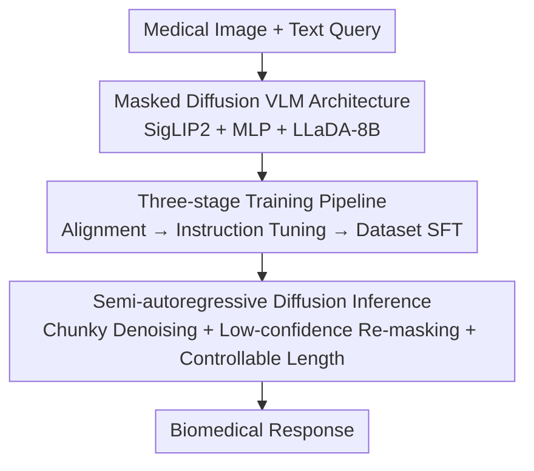

# LLaDA-MedV: Exploring Large Language Diffusion Models for Biomedical Image Understanding

**Conference**: CVPR 2026  
**Paper**: [CVF Open Access](https://openaccess.thecvf.com/content/CVPR2026/html/Dong_LLaDA-MedV_Exploring_Large_Language_Diffusion_Models_for_Biomedical_Image_Understanding_CVPR_2026_paper.html)  
**Code**: https://github.com/LLM-VLM-GSL/LLaDA-MedV  
**Area**: Medical Imaging / Biomedical Multimodal  
**Keywords**: Masked Diffusion Models, Biomedical VLM, Visual Instruction Tuning, Medical VQA, Controllable Response Length

## TL;DR
The general-domain masked diffusion language model LLaDA is introduced to the biomedical image understanding field for the first time via visual instruction tuning, resulting in the first diffusion-based biomedical VLM. It outperforms LLaVA-Med in open-ended medical dialogues, sets new SOTA records on the closed-set subsets of three VQA benchmarks, and enables explicit control over response length for more detailed answer generation.

## Background & Motivation
**Background**: Biomedical VLMs have advanced significantly but are almost entirely dominated by Autoregressive Models (ARM, e.g., LLaVA-Med, BiomedGPT), which excel at text generation based on visual understanding. Meanwhile, in the general domain, Masked Diffusion Models (MDM, specifically LLaDA scaled to 8B) have demonstrated scalability for language generation competitive with LLaMA3-class ARMs.

**Limitations of Prior Work**: (1) Most diffusion-based language models remain text-only, with multimodal—especially biomedical multimodal—applications being largely unexplored; (2) ARMs are **unreliable at controlling response length** in biomedical scenarios. LLaVA-Med often ends prematurely by predicting the EOS token too early, resulting in short, low-information answers; even adding a system prompt like "at least 200 words" is largely ineffective.

**Key Challenge**: While diffusion language models show advantages in the general domain, it remains unanswered whether and how they can be migrated to biomedical image understanding due to the vast data and conceptual gap between general and biomedical domains.

**Goal**: To answer three key questions: How can the success of general-domain diffusion language models be transferred to biomedical image understanding? Why is the diffusion paradigm promising for biomedical vision-language modeling? What design principles are required to develop an effective biomedical diffusion VLM?

**Key Insight**: Reuse the modular visual instruction tuning paradigm (language backbone + vision encoder + projector) used in LLaVA, but replace the language backbone with the masked diffusion model LLaDA to see if it balances quality and controllability in medical imaging.

**Core Idea**: Develop the first biomedical diffusion VLM (LLaDA-MedV) using a "masked diffusion language backbone + visual instruction tuning" and systematically analyze the key design factors in both training and inference.

## Method

### Overall Architecture
LLaDA-MedV follows the modular architecture of LLaVA: a vision encoder $g(\cdot)$ (SigLIP2) extracts image features, a projector $h(\cdot)$ (two-layer MLP + GELU) maps them into the language embedding space, and the features are concatenated with text prompts before being fed into a **masked diffusion language backbone** (LLaDA-8B-Instruct). Unlike ARMs, the backbone does not generate tokens autoregressively. Instead, it starts from a fully masked sequence and uses a mask predictor $p_\theta$ to iteratively denoise and reconstruct the answer. The overall pipeline is sequential: "Architecture setup → Three-stage training → Semi-autoregressive inference."

### Key Designs

**1. Masked Diffusion VLM Architecture: Replacing the language backbone with masked diffusion to "reconstruct the answer at masked positions"**

While ARMs generate tokens unidirectionally, the LLaDA backbone follows a masked diffusion approach: the forward process replaces tokens with an absorbing mask state $\mathbf{M}$ with probability $t$ (where $q_{t|0}(x^i_t|x^i_0)$ keeps the original with $1-t$ and changes to $\mathbf{M}$ with $t$). The reverse process begins with a fully masked sequence and uses a Transformer (with bidirectional attention) to predict and refine masked content in parallel. During training, the original LLaDA mask prediction objective is extended to be **conditioned on the user prompt and visual features**: $\mathcal{L}^1_\theta=-\mathbb{E}[\tfrac{1}{t}\sum_{j=1}^{L_{r_0}}\mathbf{1}[r^j_t=\mathbf{M}]\log p_\theta(r^j_0|X_v,u_0,r_t)]$. Loss is only calculated for masked positions in the answer, allowing $p_\theta$ to recover them based on the prompt and image. Bidirectional attention and parallel denoising are the foundations for "controllable length."

**2. Three-stage Training Pipeline: Alignment → E2E Instruction Tuning → Dataset SFT, with proper initialization**

Training a VLM from scratch is costly, so the authors use three progressive stages: **Stage 1 Biomedical Semantic Alignment**—freeze the vision tower and language backbone, training only the lightweight MLP projector (using 600k aligned image-text pairs) to align visual features with biomedical concepts; **Stage 2 End-to-End Visual Instruction Tuning**—unfreeze the language backbone and projector (vision tower remains frozen), using 60k multi-turn inline-mention dialogues to teach the model medical visual understanding and coherent response; **Stage 3 Dataset-specific SFT**—fine-tune on the training sets of VQA-RAD/SLAKE/PathVQA for single-turn dialogue, enabling the model to provide free-form answers for both closed and open questions. A significant finding: **the initialization strategy of LLaDA-V should not be blindly followed**, as its weights can impair medical image understanding and cause repetitive outputs.

**3. Semi-autoregressive Diffusion Inference: Chunky denoising + low-confidence re-masking, with "explicit response length control"**

Inference simulates reverse diffusion dynamics: beginning with a fully masked answer, $p_\theta$ progressively reconstructs it while utilizing re-masking. Two key strategies: **Low-confidence re-masking**—at each step, only tokens with the lowest confidence (determined by $p_\theta$ values) are re-masked, preserving high-confidence content; **Semi-autoregressive generation**—the response of length $L$ is divided into $L/B$ blocks (block length $B$), generated block-by-block from left to right, with $Z\cdot B/L$ sampling steps per block. Because the sequence starts from a "fixed-length full mask" and is filled step-by-step, the model naturally allows for **explicit output length control**—a feature ARMs lack. While LLaVA-Med averages ~36 words per answer and cannot be forced higher via prompts, LLaDA-MedV consistently produces longer, more informative answers (e.g., explaining how PET and CT are combined rather than just stating "It is a PET-CT").

### Loss & Training
The core objective is the conditional masked prediction loss $\mathcal{L}^1_\theta$ (see Design 1). The language backbone is LLaDA-8B-Instruct, the vision tower is SigLIP2, and the projector is a two-layer MLP. Data volumes: Stage 1 (600k image-text pairs), Stage 2 (60k multi-turn dialogues), Stage 3 (three VQA training sets). For open-ended dialogue evaluation, parameters are $L=256, B=64, Z=256$. Downstream VQA uses $L=B=Z=64$ for efficiency. Training was conducted on 4×A100-80G.

## Key Experimental Results

### Main Results

Open-ended Biomedical Dialogue (using GPT-4.1-mini as the judge, scoring relative to GPT-4 gold answers, higher is better):

| Model | Overall | Note |
|------|---------|------|
| LLaMA | 27.824 | General ARM Baseline |
| LLaVA | 34.653 | General VLM |
| LLaVA-Med | 44.750 | Mainstream Medical ARM VLM |
| MedVLM-R1 | 50.154 | Medical VLM with reasoning steps |
| LLaDA-V | 50.738 | General Domain Diffusion VLM |
| **LLaDA-MedV (Ours)** | **52.605** | +7.855% vs. LLaVA-Med, +1.867% vs. LLaDA-V |

Downstream VQA (token-recall for open-set, accuracy for closed-set):

| Model | VQA-RAD Closed | SLAKE Closed | PathVQA Closed |
|------|------|------|------|
| LLaVA-Med | 84.19 | 85.34 | 91.21 |
| M2I2 | 83.50 | 91.10 | 88.00 |
| **LLaDA-MedV (Ours)** | **84.93** | **92.31** | **95.15** |

The model sets **new SOTA records for the closed-set subsets** across all three benchmarks, though it is less competitive on open-set subsets (e.g., VQA-RAD Open 45.60, PathVQA Open 31.96).

### Ablation Study

Response length / Sampling steps analysis (OE dialogue, 193 questions):

| Configuration | Words/Q (W/Q) | Sampling Steps Z | Overall |
|------|------|------|------|
| LLaVA-Med | 36.332 | — | 44.750 |
| LLaVA-Med200 (prompt ≥200 words) | 40.922 | — | 44.582 |
| LLaDA-MedV (Z=256) | 166.585 | 256 | **52.605** |
| LLaDA-MedV (Z=128) | 170.399 | 128 | 44.276 |
| LLaDA-MedV (Z=64) | 172.839 | 64 | 28.523 |
| LLaDA-MedV (Z=16) | 192.09 | 16 | 13.525 |

> W/Q = Average words per answer, T/Q = Response time per question (sec), T/W = Time per word, Z = Inference sampling steps.

### Key Findings
- **Controllable length is a structural advantage of the diffusion paradigm**: LLaVA-Med averages only 36 words and fails to exceed ~40 words even with prompts; LLaDA-MedV stably outputs ~166 words with higher detail, directly translating to higher auto-evaluation scores.
- **Sampling steps Z is a critical hyperparameter**: With $L=256, B=64$, dropping Z from 256 to 16 causes the Overall score to crash from 52.6 to 13.5. Insufficient steps lead to incomplete denoising and severe degradation in output quality and diversity, especially for long sequences.
- **Closed-set strength vs. Open-set weakness**: LLaDA lacks post-training (no RL/preference alignment), making it difficult to model open-set questions as "classification over a predefined set." The SOTA results on closed sets but lower recall on open sets is a direct cost of insufficient backbone post-training.
- **Initialization and domain fine-tuning are both vital**: Using LLaDA-V initialization directly triggers repetitive output and harms medical understanding; proper initialization combined with domain SFT is necessary for stability.

## Highlights & Insights
- **The "First" at the paradigm level**: This is the first time a masked diffusion language model has been applied to a biomedical VLM, proving that the diffusion paradigm can handle tasks requiring visual grounding, opening a new path in a field dominated by ARMs.
- **"Controllable Response Length" is a free benefit of the diffusion structure**: Starting from a fixed-length full mask and filling it iteratively naturally supports length control. This is particularly useful in clinical scenarios requiring detailed answers (e.g., providing potential causes, categories, and recommendations).
- **Honest trade-off analysis**: The authors clearly identify the weakness in open-set VQA as a result of lack of post-training in the backbone and point to RLHF as a future direction, providing valuable insights for future research.
- **The sampling step-quality curve**: Provides a practical parameter guide for deployment, showing that while fewer steps save time, they significantly degrade quality, especially for long sequences.

## Limitations & Future Work
- **Disadvantage in open-set VQA**: The backbone (LLaDA) lacks RL/preference post-training, making it difficult to perform classification-style answering on predefined sets, leading to lower recall than ARM baselines.
- **Dependency on GPT-4.1-mini for evaluation**: Since GPT-4-0314 was unavailable, a different judge model was used. Although all baselines were re-tested for fairness, AI judges are not perfect evaluators.
- **Strong coupling between sampling steps and quality**: High-quality results require many steps (Z=256), increasing inference costs. Fewer steps cause a sharp drop in quality, forcing a speed-quality trade-off during deployment.
- **Future Work**: Use RLHF and other post-training techniques to improve instruction following and answer formatting capabilities to boost open-set performance.

## Related Work & Insights
- **vs. LLaVA-Med (Autoregressive Medical VLM)**: Both use visual instruction tuning, but the backbone here is masked diffusion. The advantages are longer/more detailed responses, controllable length, and higher scores in dialogue and closed VQA; the disadvantage is lower open-set VQA recall.
- **vs. LLaDA-V (General Domain Diffusion VLM)**: This work adapts it to the biomedical domain via three-stage SFT, improving open-ended dialogue by +1.867%, and identifies initialization pitfalls.
- **vs. MedVLM-R1 (Medical VLM with reasoning steps)**: This work outperforms it without explicit reasoning labels, simply through the generation capability of the diffusion denoising paradigm.
- **vs. BiomedGPT (ARM trained from scratch)**: This work is more computationally efficient by reusing a pre-trained backbone and instruction tuning, while adding length controllability that ARMs lack.

## Rating
- Novelty: ⭐⭐⭐⭐⭐ First biomedical masked diffusion VLM, creating a new paradigm.
- Experimental Thoroughness: ⭐⭐⭐⭐ Systematic dialogue and VQA analysis, though open-set weaknesses remain and the judge model has limitations.
- Writing Quality: ⭐⭐⭐⭐ Question-driven, honest, with clear formulas and flows.
- Value: ⭐⭐⭐⭐ Provides the first reproducible baseline and design insights for diffusion biomedical VLMs, with open-source models and code.

<!-- RELATED:START -->

## Related Papers

- [\[CVPR 2026\] MLLM-HWSI: A Multimodal Large Language Model for Hierarchical Whole Slide Image Understanding](mllm-hwsi_a_multimodal_large_language_model_for_hierarchical_whole_slide_image_u.md)
- [\[CVPR 2026\] MedMO: Grounding and Understanding Multimodal Large Language Model for Medical Images](medmo_grounding_and_understanding_multimodal_large_language_model_for_medical_im.md)
- [\[CVPR 2026\] From Panel to Pixel: Zoom-In Vision-Language Pretraining from Biomedical Scientific Literature](from_panel_to_pixel_zoom-in_vision-language_pretraining_from_biomedical_scientif.md)
- [\[CVPR 2026\] OralGPT-Omni: A Versatile Dental Multimodal Large Language Model](oralgpt-omni_a_versatile_dental_multimodal_large_language_model.md)
- [\[CVPR 2026\] fMRI-LM: Towards a Universal Foundation Model for Language-Aligned fMRI Understanding](fmri-lm_towards_a_universal_foundation_model_for_language-aligned_fmri_understan.md)

<!-- RELATED:END -->
