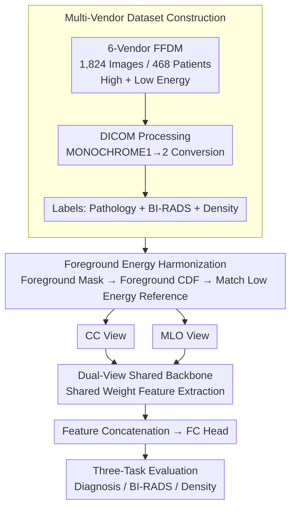

# LUMINA: A Multi-Vendor Mammography Benchmark with Energy Harmonization Protocol

**Conference**: CVPR 2026  
**arXiv**: [2603.14644](https://arxiv.org/abs/2603.14644)  
**Code**: [Yes](https://github.com/NUBagciLab/LUMINA)  
**Area**: Medical Imaging  
**Keywords**: Mammography, Multi-vendor datasets, Energy harmonization, Histogram matching, benchmark

## TL;DR

The authors propose the LUMINA multi-vendor Full-Field Digital Mammography (FFDM) dataset (468 patients, 1,824 images) along with an energy harmonization preprocessing method based on foreground pixel histogram matching. They systematically evaluate CNN and Transformer models across three tasks: diagnosis, BI-RADS classification, and density estimation.

## Background & Motivation

**Background**: Existing public mammography datasets (e.g., CBIS-DDSM, INbreast) have significant deficiencies in scale, clinical annotation, and vendor diversity. CBIS-DDSM is based on outdated Screen-Film Mammography (SFM) scans, while INbreast includes only 115 patients.  
**Limitations of Prior Work**: Multi-vendor acquisition systems introduce significant domain shifts in image appearance and intensity distributions due to differing energy settings (high/low energy) and proprietary processing pipelines, leading to poor model generalization in cross-vendor scenarios.  
**Goal**: The motivations of this work are to: (1) construct an FFDM benchmark focusing on vendor diversity and energy metadata; (2) propose a model-agnostic foreground histogram harmonization method to eliminate vendor/energy shifts.

## Method

### Overall Architecture

LUMINA serves as both a dataset and a methodology. It addresses the gaps of "small scale, sparse annotations, and single-vendor" in current public mammography datasets while providing a preprocessing method to mitigate vendor/energy domain shifts. The workflow consists of three stages: **multi-vendor dataset construction** (1,824 FFDM images from 6 vendors with pathology-confirmed malignancy, BI-RADS scores, and density labels), **foreground energy harmonization** (aligning all images to a low-energy reference distribution), and **dual-view shared backbone evaluation** (sharing weights for CC and MLO views) to conduct benchmark assessments across diagnosis, BI-RADS classification, and density prediction tasks.

### Key Designs

**1. Multi-Vendor Dataset Construction: Filling Diversity Gaps with Vendor and Energy Metadata**

Existing benchmarks like CBIS-DDSM (outdated film) and INbreast (small sample size) are insufficient for evaluating cross-vendor generalization. LUMINA collects data from six vendors: IMS, Metaltronica, FUJIFILM, Siemens, Carestream, and GE. It comprises 468 patients (250 benign, 218 malignant) with 12-14 bit depth DICOM files. Annotations include pathology results, BI-RADS grades (0-6), and breast density (A-D). FUJIFILM’s MONOCHROME1 images are standardized to MONOCHROME2. This vendor diversity and energy metadata make LUMINA a suitable foundation for studying domain shifts.

**2. Foreground Histogram Harmonization: CDF Matching Restricted to Breast Regions**

Standard histogram matching is often distorted by the large areas of zero-valued black background in FFDM images. The key innovation in LUMINA is matching only the foreground: a foreground mask is defined as $M_s = \{(x,y) \mid \mathbf{I}_s(x,y) > 0\}$. Foreground histograms $H_s(k), H_r(k)$ and normalized CDFs $\bar{C}_s(p), \bar{C}_r(q)$ are calculated for the source and reference images, respectively. Intensity transformation is performed via the mapping $\mathcal{T}(p) = \arg\min_q |\bar{C}_s(p) - \bar{C}_r(q)|$. The reference distribution is derived from a low-energy FFDM subset using 12-bit bins to preserve detail. This approach prevents background pixels from "diluting" the matching statistics, ensuring stable foreground alignment.

**3. Dual-View Shared Backbone: Preventing Overfitting on Small Data**

The CC (Craniocaudal) and MLO (Mediolateral Oblique) views provide complementary information. However, using independent weights for each view on small datasets risks overfitting and doubles the parameter count. LUMINA processes both views through a backbone with shared weights. This reduces the parameters by 48% (4.34M vs 8.34M) compared to independent backbones while achieving comparable or superior performance, making it highly efficient for a dataset of 468 patients.

### Loss & Training

- Standard Cross-Entropy loss for classification.
- AdamW Optimizer: $\text{lr}=1 \times 10^{-3}$ for CNNs, $\text{lr}=1 \times 10^{-5}$ for Swin-T.
- 100 epochs, learning rate decay of 0.1 every 30 epochs, weight decay of $1 \times 10^{-5}$.
- 5-fold cross-validation, selecting the model with the best validation AUC.
- Data augmentation: Horizontal flipping and resizing only; grayscale images replicated across three channels.
- PyTorch + CUDA deterministic flags used for reproducibility.
- Training Environment: 8 × NVIDIA A6000 GPUs.

## Key Experimental Results

### Main Results

| Dataset/Task | Metric | Ours | Prev. SOTA | Notes |
|------------|------|----------|-------------|------|
| Diagnosis (Two-view, 512²) | AUC | **93.54%** (EfficientNet-B0) | — | Optimal with dual-view + high res |
| Diagnosis (Single, 512²) | AUC | 92.13% (EfficientNet-B0) | — | Second best with single view |
| BI-RADS Binary (224²) | AUC | **92.80%** (EfficientNet-B0) | — | Low vs. High risk classification |
| BI-RADS Three-class (224²) | AUC | 83.27% (EfficientNet-B0) | — | Low/Medium/High risk |
| Density Prediction (224²) | Macro-AUC | **89.43%** (Swin-T) | — | Transformers better for density |

### Ablation Study

| Configuration | Key Metric (AUC) | Notes |
|------|---------------|------|
| Shared Backbone EfficientNet-B0 (224²) | 92.99% | 4.34M Parameters |
| Independent Backbone EfficientNet-B0 (224²) | 93.54% | 8.34M Parameters; performance parity with 2x params |
| Original Images (No Harmonization) | Baseline | Lower AUC across all tasks |
| Foreground Harmonization | +Gain | Consistent gain in ACC/AUC/F1; more focused Grad-CAM |

### Key Findings

- Dual-view models consistently outperform single-view models, confirming the value of CC+MLO complementary information.
- EfficientNet-B0 is optimal for Diagnosis and BI-RADS tasks (only 4M parameters), while Swin-T performs best for Density Prediction.
- Higher input resolution (512²) generally improves performance, though 224² remains competitive with significantly lower computational overhead.
- Histogram harmonization not only improves metrics but also enhances Grad-CAM attention, forcing the model to focus more on lesion areas.
- Low-energy images benefit most from harmonization (since high-energy images dominate the data distribution).

## Highlights & Insights

- **Value of Foreground Masking**: A simple but effective idea—excluding background pixels before histogram matching. This design is crucial in mammography where FFDM images contain vast black regions.
- **Model-Agnostic Preprocessing**: The harmonization method can be applied as a lightweight preprocessing step to any backbone, making it highly suitable for practical deployment.
- **Systematic Benchmarking**: The combination of complete annotations (Pathology + BI-RADS + Density) and vendor/energy metadata is unique among existing public datasets.
- **Clinical Insights**: EfficientNet-B0 wins the diagnosis task with minimal parameters, while Swin-T is better suited for density prediction due to global attention, revealing the relationship between task type and model selection.

## Limitations & Future Work

- The dataset scale is still relatively small (468 patients) compared to large-scale datasets like EMBED (500k images).
- Data is sourced from a single institution in Turkey, limiting patient population diversity.
- The reference distribution for harmonization is a selected subset of low-energy FFDM, lacking an adaptive reference selection mechanism.
- Advanced domain adaptation methods (e.g., adversarial training, frequency-domain alignment) were not explored.
- Direct experimental comparisons with existing multi-vendor methods (e.g., ComBat, HarmoFL) are missing.
- Four-view models performed worse than dual-view models, likely due to overfitting on the small dataset with increased parameters.

## Related Work & Insights

- ComBat uses empirical Bayes to correct batch effects but operates in feature space rather than pixel space.
- HarmoFL reduces cross-site variation in federated learning via frequency-domain amplitude normalization.
- This work complements VinDr-Mammo (5,000 patients, single vendor) and RSNA (1,970 patients)—though smaller, LUMINA offers greater vendor diversity.
- The pixel-space approach is more intuitive and requires no training, serving as a complement to feature-space methods.
- **Insight**: For multi-center medical imaging research, lightweight pixel-space preprocessing may be more practical than complex domain adaptation methods.
- Potential synergy exists with MIL-PF (also CVPR 2026)—using LUMINA for harmonization followed by a frozen encoder + MIL classifier.

## Rating

- **Novelty**: ⭐⭐⭐ Solid dataset contribution, but the method (foreground histogram matching) is technically straightforward.
- **Experimental Thoroughness**: ⭐⭐⭐⭐ Covers three tasks, multiple models, multiple resolutions, ablation studies, visualization, and energy analysis.
- **Writing Quality**: ⭐⭐⭐⭐ Detailed tables and figures, transparent experimental settings, and persuasive dataset comparisons.
- **Value**: ⭐⭐⭐⭐ The multi-vendor benchmark is a direct contribution to the community, made available across OSF, Kaggle, and GitHub.

<!-- RELATED:START -->

## Related Papers

- [\[CVPR 2026\] OmniBrainBench: A Comprehensive Multimodal Benchmark for Brain Imaging Analysis Across Multi-stage Clinical Tasks](omnibrainbench_a_comprehensive_multimodal_benchmark_for_brain_imaging_analysis_a.md)
- [\[CVPR 2026\] Gastric-X: A Multimodal Multi-Phase Benchmark Dataset for Advancing Vision-Language Models in Gastric Cancer Analysis](gastric-x_a_multimodal_multi-phase_benchmark_dataset_for_advancing_vision-langua.md)
- [\[ECCV 2024\] Energy-induced Explicit Quantification for Multi-modality MRI Fusion](../../ECCV2024/medical_imaging/energy-induced_explicit_quantification_for_multi-modality_mri_fusion.md)
- [\[NeurIPS 2025\] Pancakes: Consistent Multi-Protocol Image Segmentation Across Biomedical Domains](../../NeurIPS2025/medical_imaging/pancakes_consistent_multi-protocol_image_segmentation_across_biomedical_domains.md)
- [\[CVPR 2026\] SurgCoT: Advancing Spatiotemporal Reasoning in Surgical Videos through a Chain-of-Thought Benchmark](surgcot_advancing_spatiotemporal_reasoning_in_surgical_videos_through_a_chain-of.md)

<!-- RELATED:END -->
