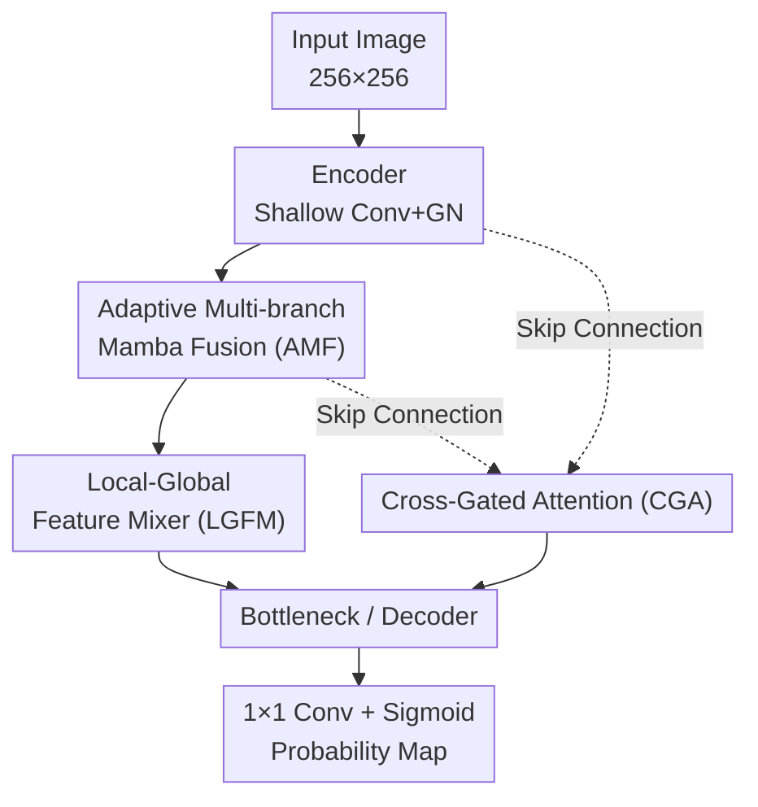

# MambaLiteUNet: Cross-Gated Adaptive Feature Fusion for Robust Skin Lesion Segmentation

**Conference**: CVPR 2026  
**arXiv**: [2604.20286](https://arxiv.org/abs/2604.20286)  
**Code**: https://github.com/maklachur/MambaLiteUNet (Available)  
**Area**: Medical Imaging  
**Keywords**: Skin lesion segmentation, Vision Mamba, Lightweight U-Net, Cross-gated attention, Adaptive feature fusion

## TL;DR
This work integrates Vision Mamba state-space modeling into a lightweight U-Net with only 0.494M parameters. By utilizing three specialized modules—Adaptive Multi-branch Mamba Fusion (AMF), Local-Global Feature Mixer (LGFM), and Cross-Gated Attention (CGA)—it enhances multi-scale fusion, local texture/global context interaction, and skip-connection refinement. The model achieves an average of 87.12% IoU and 93.09% Dice across four skin lesion segmentation benchmarks (ISIC2017/2018, HAM10000, PH2), outperforming numerous SOTA methods while using 93.6% fewer parameters and 97.6% fewer GFLOPs than U-Net.

## Background & Motivation
**Background**: Skin lesion segmentation is a fundamental task for computer-aided early screening of skin cancer. Encoder-decoder convolutional networks like U-Net have long been the mainstream choice due to their proficiency in capturing local textures and supporting dense prediction. Recently, Transformers introduced self-attention to supplement global context modeling, while State Space Models (SSM, particularly the Mamba family) have emerged as a promising alternative, modeling long-range dependencies with linear complexity to balance efficiency and global receptive fields.

**Limitations of Prior Work**: Existing lightweight segmentation models often sacrifice the capability to **characterize fine lesion boundaries and textures** to minimize parameters and computation. However, subtle irregularities in boundaries are critical indicators of malignancy in early melanoma. Convolutional models struggle with long-range dependencies, failing on irregular boundaries, fragmented regions, or low-contrast lesions. Conversely, the quadratic complexity of Transformers hinders deployment in resource-constrained scenarios like mobile or point-of-care devices. Specifically, current Mamba-based segmentation models mostly rely on **static feature fusion and conventional skip connections**, which limit multi-scale representation learning and weaken boundary refinement in difficult regions.

**Key Challenge**: The trade-off between accuracy and efficiency—models are either lightweight but produce blurry boundaries, or accurate but computationally heavy. Additionally, fixed fusion strategies in existing Mamba methods fail to optimize the use of "long-range context."

**Goal**: The paper addresses three sub-problems: (1) how to dynamically fuse features across multiple scales rather than using static concatenation; (2) how to simultaneously preserve local texture details and global context within a single module; and (3) how to ensure skip connections transmit only "useful foreground information" while filtering out background noise.

**Key Insight**: The authors argue that Mamba's linear long-range modeling capability should be embedded at every critical interaction point of the U-Net (deep stages, skip connections) rather than just stacking Mamba layers. Furthermore, fusion, mixing, and skip connections should all utilize **learnable gating** to adaptively determine information flow.

**Core Idea**: Three lightweight gated modules (AMF / LGFM / CGA) powered by a Mamba block core are used to transform U-Net's feature fusion, local-global mixing, and skip connections, improving lesion representation and boundary characterization without significantly increasing computational costs.

## Method

### Overall Architecture
MambaLiteUNet follows a classic five-stage U-Net encoder-decoder structure with a bottleneck layer, using channel capacities of $\{16,32,48,64,96,128\}$. Shallow stages utilize standard Convolution + Group Normalization to stabilize low-level textures, with max pooling for downsampling. **Deep stages introduce AMF and LGFM** for enhanced feature learning. Each skip connection is refined by CGA before fusing with decoder features. The final layer uses a $1\times1$ convolution and sigmoid to output the lesion probability map. The shared core of these modules is a **Mamba block** derived from VMamba: for a layer-normalized token $K\in\mathbb{R}^{B\times N\times C}$ ($N=H\times W$), one path computes a gating map $G=\mathrm{SiLU}(K W_g)$, while the other path passes through projection, SiLU, $3\times3$ Depthwise Convolution, and SS2D (four-way scanning + independent S6 blocks to aggregate global context). These are combined via element-wise multiplication $Y=G\odot H$, achieving a Transformer-like receptive field in linear time.

### Key Designs

**1. Adaptive Multi-branch Mamba Fusion (AMF): Replacing Static Concatenation with Parallel Grouping + Two-stage Gating**

To address the limitations of static fusion in prior Mamba methods, AMF splits the input $X\in\mathbb{R}^{B\times C\times H\times W}$ into **four groups** $\{X_k\}_{k=1}^4$ ($C/4$ channels each). Each group passes through an independent Mamba block to capture long-range dependencies, with a **learnable scalar-scaled residual** to preserve low-level information: $Z_k=\mathrm{Mamba}_k(X_k)+\alpha X_k$, where $\alpha$ is initialized to 0, allowing the network to gradually determine the residual's contribution during training. After concatenating into $Z_{\mathrm{cat}}\in\mathbb{R}^{B\times C\times H\times W}$, a **two-stage gating** mechanism is applied: a spatial (S) stage computes $S=\sigma(\mathrm{PW}(\mathrm{DW}_{3\times3}(Z_{\mathrm{cat}})))$ for per-branch gating $Z_k^S=S_k\odot Z_k$, followed by a transformation (T) stage using depthwise and pointwise convolutions with residual refinement to obtain $T$. Finally, $F_{\mathrm{int}}=T+X$ is passed to the LGFM. This "parallel grouping + dual gating" allows the model to learn channel-wise importance at a low cost.

**2. Local-Global Feature Mixer (LGFM): Parallel Dual-Path for Textures and Context**

Refining lesion boundaries requires both local textures and long-range context, but these often belong to separate modules (CNN vs. Attention). LGFM integrates both: one path uses $3\times3$ depthwise convolution for local patterns $F_\ell$, while the other uses 8-head Multi-Head Self-Attention (ensuring $C$ is divisible by 8) to process tokens $N=H\times W$ into $F_g$. These are concatenated and fused via projection:

$$F_{\ell g}=\mathrm{DW}_{3\times3}\big(\mathrm{GELU}(\mathrm{LN}(\mathrm{Conv}_{1\times1}([F_\ell,F_g])))\big)$$

This dual-path design simultaneously preserves lesion textures and long-range features, which is critical for precise boundary characterization.

**3. Cross-Gated Attention (CGA): Mutual Gating for Skip Connections to Filter Background**

Conventional skip connections pass encoder features to the decoder directly, often carrying background noise that weakens boundary consistency. CGA splits encoder features $x$ and decoder features $g$ into four pairs $\{x_i,g_i\}$. Each undergoes a Mamba block to obtain $h_i^{(x)}, h_i^{(g)}$ and $3\times3$ depthwise convolutions for $g'_i, x'_i$. They then perform **pairwise cross-gating**—weighting themselves using the other's sigmoid response:

$$\mathrm{cross}_i=h_i^{(x)}\odot\sigma(g'_i)+h_i^{(g)}\odot\sigma(x'_i)$$

The pairs are concatenated into $Z_{\mathrm{cat}}$ to generate an attention mask $\psi=\sigma(\mathrm{Conv}_{3\times3}(\mathrm{ReLU}(\mathrm{BN}(Z_{\mathrm{cat}}))))$, which is applied to the encoder features $x_{\mathrm{att}}=\psi\odot x$. This bidirectional mechanism uses decoder semantics to gate encoder details and vice versa, suppressing background noise while emphasizing lesion structures.

### Loss & Training
The objective function is a combination of Binary Cross-Entropy and Dice loss: $L_{\mathrm{Total}}=L_{\mathrm{BCE}}+L_{\mathrm{Dice}}$. All images are normalized, resized to $256\times256$, and augmented. Training is conducted on an RTX 3090 Ti using the AdamW optimizer with an initial learning rate of 0.001 reduced via cosine annealing to 0.00001 over 300 epochs with a batch size of 8. Evaluation metrics include IoU, DSC, Accuracy, Sensitivity, Specificity, and HD95.

## Key Experimental Results

### Main Results
Average performance across four benchmarks (Table 3, all baselines reproduced with official implementations and identical splits):

| Model | Category | Avg IoU | Avg DSC | Params (M) | GFLOPs |
|--------|------|---------|---------|---------|--------|
| U-Net | CNN | 79.40 | 88.48 | 7.773 | 13.758 |
| EGE-UNet | CNN | 84.41 | 91.51 | 0.053 | 0.072 |
| VM-UNet2 | Mamba | 84.03 | 91.30 | 22.771 | 4.400 |
| LightM-UNet | Mamba | 83.90 | 91.21 | 0.403 | 0.391 |
| LB-UNet | CNN | 85.02 | 91.87 | 0.038 | 0.098 |
| ULVM-UNet | Mamba | 84.89 | 91.80 | 0.049 | 0.060 |
| **MambaLiteUNet (Ours)** | Mamba | **87.12** | **93.09** | 0.494 | 0.326 |

On individual datasets: ISIC2017 achieved 85.55% IoU / 92.21% DSC; ISIC2018 achieved 83.60% / 91.07%; HAM10000 achieved 90.77% / 95.16%; and PH2 reached 88.54% / 93.92%. Compared to LB-UNet, the average gain is +2.10 IoU / +1.22 DSC. Relative to U-Net, parameters and GFLOPs are reduced by 93.6% and 97.6%, respectively.

**Domain Generalization (Table 5)**: Trained only on NV and tested on six unseen lesion types, the model achieved 77.61% IoU / 87.23% DSC, ranking first in four categories with particularly stable performance on MEL (93.90% DSC).

### Ablation Study
Incremental module addition (ISIC2018, Table 7):

| Configuration | Params (M) | GFLOPs | ISIC2018 IoU | DSC |
|------|---------|--------|--------------|-----|
| No Modules | 0.425 | 0.938 | 80.59 | 89.25 |
| Only AMF | 0.226 | 0.830 | 82.57 | 90.45 |
| Only LGFM | 0.180 | 0.794 | 82.25 | 90.26 |
| Only CGA | 0.593 | 0.478 | 82.61 | 90.48 |
| AMF + LGFM | 0.326 | 0.238 | 82.90 | 90.65 |
| **Full Model** | 0.494 | 0.326 | **83.60** | **91.07** |

Branch number ablation (ISIC2018): 1/2/4/8/16 branches corresponded to IoUs of 81.74 / 82.50 / **83.60** / 82.38 / 81.24. **Four branches represent the "sweet spot"**; further increases led to performance drops and doubled parameters.

### Key Findings
- CGA alone improved ISIC2018 IoU from 80.59 to 82.61, highlighting the impact of skip-connection refinement on boundary quality.
- Scaling branches is not always beneficial: increasing from 4 to 8 or 16 branches reduced IoU while increasing parameters from 0.494M to 0.949M, suggesting that excessive multi-branching introduces harmful redundancy.
- Qualitative analysis shows the model succeeds in capturing fine boundaries missed by others in low-contrast, hair-occluded, or irregularly shaped regions.

## Highlights & Insights
- **Learnable Residual Scaling with $\alpha=0$**: Initializing the AMF branch residual scale to zero prevents interference with the main path during early training, allowing the model to incorporate low-level information gradually—a robust trick for any "main path + residual" fusion.
- **Bidirectional Cross-Gating (CGA)**: Rather than simply passing encoder features, CGA uses encoder details and decoder semantics to gate each other. This symmetric approach is more effective at suppressing background noise and reinforcing foreground lesion structures than unidirectional attention gates.
- **Shared Core Design**: Using the same Mamba block across three modules ensures unified long-range modeling while controlling parameter count, reflecting a "reuse rather than stack" philosophy for lightweight design.

## Limitations & Future Work
- The model was verified only at $256\times256$ resolution for binary (lesion vs. background) segmentation; its efficacy for higher resolutions or multi-class tasks remains untested.
- While GFLOPs are low, the Mamba/SS2D kernels require specialized operator support, and real-world latency on mobile or edge devices was not benchmarked.
- Domain generalization was limited to six unseen classes within HAM10000; cross-dataset and cross-modality (e.g., ultrasound) results are relegated to supplementary materials.
- Future work: Exploring input-adaptive branch counts and extending the architecture to 3D or video sequences.

## Related Work & Insights
- **vs. U-Net / EGE-UNet (Lightweight CNNs)**: CNN-based models lack long-range dependency modeling. Ours improves IoU by +7.72 over U-Net and +2.71 over EGE-UNet, albeit with an order of magnitude more parameters than the ultra-small EGE-UNet (0.053M), trading a 0.5M scale for superior accuracy.
- **vs. VM-UNet / LightM-UNet (Mamba-based)**: Most Mamba models use fixed fusion and standard skip connections. Ours replaces these with dynamic gating (AMF/CGA), leading in accuracy while being 40 times smaller than VM-UNet2 (22.7M).
- **vs. ULVM-UNet / LB-UNet (Extreme Lightweight)**: These models use even fewer parameters (0.04–0.05M) but struggle with boundary recovery. Ours gains +2.1 IoU on average by slightly increasing the parameter budget to 0.494M, positioning it as an "accuracy-first" lightweight solution.

## Rating
- Novelty: ⭐⭐⭐⭐ The combination of three gated modules for adaptive fusion and skip connections is effective; CGA's bidirectional gating is particularly noteworthy.
- Experimental Thoroughness: ⭐⭐⭐⭐⭐ Comprehensive evaluation across four benchmarks and domain generalization, with rigorous ablation and multiple trials.
- Writing Quality: ⭐⭐⭐⭐ Clear descriptions and formulas, though the pipeline diagram is high-level.
- Value: ⭐⭐⭐⭐ Practical for resource-constrained clinical deployment where high boundary accuracy is required.

<!-- RELATED:START -->

## Related Papers

- [\[ICLR 2026\] COMPASS: Robust Feature Conformal Prediction for Medical Segmentation Metrics](../../ICLR2026/medical_imaging/compass_robust_feature_conformal_prediction_for_medical_segmentation_metrics.md)
- [\[CVPR 2026\] BackSplit: The Importance of Sub-dividing the Background in Biomedical Lesion Segmentation](backsplit_the_importance_of_sub-dividing_the_background_in_biomedical_lesion_seg.md)
- [\[CVPR 2026\] Building Robust Vision Encoders for Cross-Dataset Evaluation in Immunofluorescent Microscopy](building_robust_vision_encoders_for_cross-dataset_evaluation_in_immunofluorescen.md)
- [\[CVPR 2026\] CRFT: Consistent-Recurrent Feature Flow Transformer for Cross-Modal Image Registration](crft_consistent-recurrent_feature_flow_transformer_for_cross-modal_image_registr.md)
- [\[CVPR 2026\] Instruction-Guided Lesion Segmentation for Chest X-rays with Automatically Generated Large-Scale Dataset](instruction-guided_lesion_segmentation_for_chest_x-rays_with_automatically_gener.md)

<!-- RELATED:END -->
