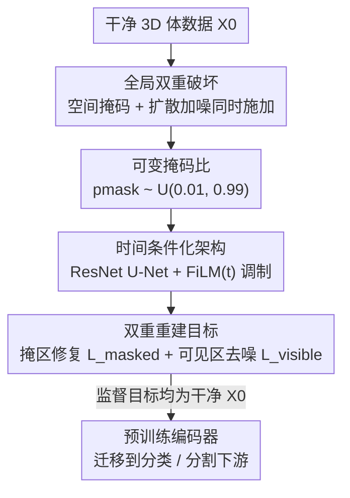

# Masked-Diffusion Autoencoders for 3D Medical Vision Representation Learning

**Conference**: CVPR 2026  
**Paper**: [CVF Open Access](https://openaccess.thecvf.com/content/CVPR2026/html/Tu_Masked-Diffusion_Autoencoders_for_3D_Medical_Vision_Representation_Learning_CVPR_2026_paper.html)  
**Code**: Project Page https://jiachentu.github.io/MDAE/ (Subject to original text)  
**Area**: Medical Imaging / Self-Supervised Representation Learning  
**Keywords**: 3D Medical Imaging, Self-Supervised Learning, Masked Autoencoding, Diffusion Denoising, Representation Learning

## TL;DR
MDAE applies dual corruptions—spatial masking and diffusion noise—simultaneously to 3D brain MRI volumes. This allows a time-conditioned network to concurrently learn to reconstruct masked regions (capturing holistic anatomical structures) and denoise visible regions (capturing fine-grained tissue textures). It achieves an average AUROC of 73.6% in-domain and 78.6% cross-modality across 16 clinical benchmarks for self-supervised pre-training.

## Background & Motivation
**Background**: 3D medical image annotation is expensive, prompting self-supervised learning (SSL) to become a mainstream solution. Existing SSL follows two main paths: invariance/contrastive-based methods (e.g., SimCLR, VoCo) that learn representations by aligning augmented views, and Masked Image Modeling (MAE and its medical variants) that reconstruct masked regions using high masking ratios.

**Limitations of Prior Work**: Both paths have inherent flaws. Contrastive methods rely on augmentations, but common augmentations in medical imaging can destroy diagnostic information—color jittering disrupts meaningful intensity relationships, Gaussian blur can erase lesions, and aggressive cropping may lose small but critical anatomical structures. For MAE, to prevent trivial interpolation from neighbors, a high masking ratio (e.g., 75%) is required, which prevents the model from perceiving fine-grained textures. Medical diagnosis, however, necessitates the **simultaneous** encoding of organ-level geometry and voxel-level texture.

**Key Challenge**: A trade-off exists between holistic structure and fine texture—higher masking ratios force global reasoning at the expense of visible texture exposure. This contradiction has remained unresolved in prior medical SSL. Furthermore, "semantic encoders" and "generative models" have long been viewed as incompatible paradigms.

**Goal**: To establish a discriminative SSL framework for 3D medical imaging that enables the **simultaneous** learning of global anatomical structures and fine-grained textures.

**Key Insight**: Recent work in 2D natural images (e.g., RAE, REPA) has shown that semantic and generative objectives can be mutually beneficial, yet this paradigm remains unexplored in 3D medical imaging. The authors hypothesize that superimposing spatial masking (structure-oriented) and diffusion denoising (texture-oriented) can elicit complementary learning signals.

**Core Idea**: Replace single corruption with "Global Dual Corruption" (simultaneously applying masking and diffusion noise). Within a unified time-conditioned objective, the model learns structure (inpainting masked regions) and texture (denoising visible regions) concurrently.

## Method

### Overall Architecture
The input to MDAE is a clean 3D volume $X_0 \in \mathbb{R}^{D \times H \times W}$, and the output is the predicted clean volume $\hat{X}$. The training objective is to recover $X_0$ from a "doubly corrupted" input. The pipeline consists of: first applying both spatial masking and diffusion noise to the volume to obtain the dual-corrupted input $\tilde{X}_t^M$; feeding this into a ResNet U-Net modulated by the diffusion timestep $t$. The network performs denoising on visible regions and inpainting on masked regions, with both objectives supervised by the clean volume $X_0$ and combined linearly into a total loss. After pre-training, only the encoder is retained and transferred to downstream classification/segmentation tasks.

### Key Designs

**1. Global Dual Corruption: Simultaneous Masking and Diffusion Noise for Complementary Signals**

MAE alone relies on masking, which favors holistic structure but loses texture; diffusion denoising alone is proficient at details but is mostly used for synthesis/reconstruction in medical contexts rather than discriminative representation learning. MDAE **superimposes** both: diffusion noise is first added to the entire volume in a VE (variance-exploding) manner $\tilde{X}_t = X_0 + \sigma_t Z$ ($\sigma_t = t \cdot \sigma_{\max}$, $Z \sim \mathcal{N}(0, I)$), followed by zeroing out specific regions using blocky masks to obtain $\tilde{X}_t^M = M_v \odot \tilde{X}_t$ ($M_v$ is the visibility mask). Masking utilizes $16^3$ voxel patches, where each block is independently masked with probability $p_{\text{mask}}$, ensuring spatial continuity of masked regions and forcing the network to perform volumetric reasoning rather than local interpolation. Since visible regions are noisy and masked regions are empty, two complementary tasks—denoising and inpainting—arise naturally. Moreover, because visible regions are also corrupted by noise, reconstruction is non-trivial even at low masking ratios, which is key to overcoming the "high masking ratio" constraint of MAE.

**2. Variable Masking Ratio: Multi-scale Coverage of Texture and Structure**

Standard MAE must fix a high masking ratio (75%); otherwise, the model trivially copies from adjacent blocks. In MDAE, because diffusion noise provides a safety net, a variable masking ratio $p_{\text{mask}} \sim U(p_{\min}, p_{\max})$ can be employed (with $p_{\min}=0.01$ and $p_{\max}=0.99$ used in the paper; ⚠️ subject to original text). At low masking ratios, more context is visible, allowing the model to learn low-level textural details. At high ratios, global reasoning is required for the model to capture holistic anatomical structures. These two scales are unified into a single pre-training objective, with ablations showing that variable masking outperforms any fixed ratio.

**3. Time-Conditioned Architecture: Adaptive Strategy Switching based on Corruption Intensity**

Unlike MAE which processes $g_\theta(\tilde{X}^M)$ directly, MDAE defines the network as $\hat{X} = g_\theta(\tilde{X}_t^M, t)$, explicitly feeding the diffusion timestep $t$ into the network. $t$ is mapped to a 256-dimensional embedding via sinusoidal positional encoding and an MLP, then injected at each stage of the encoder/decoder via FiLM modulation: $h_{\text{out}} = h_{\text{in}} \odot (\gamma(t_{\text{emb}}) + 1) + \beta(t_{\text{emb}})$, where $\gamma$ and $\beta$ are learned scaling/shifting parameters. This informs the network of the current noise level, enabling a dynamic balance between "spatial inpainting" and "intensity denoising" and ensuring robust representations across the entire corruption spectrum.

**4. Dual Reconstruction Objective: A Unified Loss Interpolating MAE and DSM**

The total objective is a weighted sum of two losses targeting different spatial regions:
$$\mathcal{L}_{\text{MDAE}}(\theta) = \lambda_{\text{masked}} \cdot \mathcal{L}_{\text{masked}}(\theta) + \lambda_{\text{visible}} \cdot \mathcal{L}_{\text{visible}}(\theta)$$
The masked region loss $\mathcal{L}_{\text{masked}}$ is computed only on masked voxels $\Omega_M$ as $\|M \odot (g_\theta(\tilde{X}_t^M, t) - X_0)\|_2^2$ (normalized by $|\Omega_M|$), forcing the network to infer global anatomy from noisy visible contexts. The visible region loss $\mathcal{L}_{\text{visible}}$ is computed on visible voxels $\Omega_V$, incorporating noise-level weighting $w(\sigma_t)$ to keep the contribution of different noise levels constant, effectively learning the score function via Tweedie’s formula. Since both targets are the clean volume $X_0$ (rather than the noisy $\tilde{X}_t$), the network must learn spatial inpainting and intensity denoising simultaneously. This unified objective degrades elegantly: as $\sigma_{\max} \to 0$, the visible loss vanishes, reverting to MAE; as $p_{\text{mask}} \to 0$, the masked loss vanishes, reverting to DSM (denoising score matching). The paper empirically sets $\lambda_{\text{masked}} = \lambda_{\text{visible}} = 1.0$.

### Loss & Training
Pre-training was conducted on 114,570 3D brain MRI volumes from OpenMind (derived from 34,191 subjects), pre-processed to $160^3$ voxels. Corruption and reconstruction were applied per channel for multi-channel inputs. Downstream classification utilized mean-pooling of encoded features with a linear head or fine-tuning, while segmentation used the nnUNet framework with encoder weights initialized from pre-trained values.

## Key Experimental Results

### Main Results
Evaluations spanned 16 clinical benchmarks across three scenarios: In-domain (T1/T2 seen during pre-training), Cross-modality generalization (rare or unseen FLAIR, T1-Gd, ASL, SWI), and Multi-modal integration (classification + segmentation).

| Scenario | Metric | MDAE | Best Baseline | Gain |
| :--- | :--- | :--- | :--- | :--- |
| In-domain 6 tasks (T1/T2) | Avg AUROC | 73.6% | MAE 69.5% | +4.1% |
| In-domain 6 tasks | Avg AP | 71.6% | — | — |
| Cross-modality 6 tasks (OOD) | Avg AUROC | 78.6% | MAE 70.0% | +8.6% |
| Cross-modality 6 tasks | Avg AUROC | 78.6% | BrainIAC 67.9% | +10.7% |
| BraTS23 Tumor Classification | AUROC | 96.3%/96.6% | — | — |
| BraTS18 Tumor Grading | AUROC | 92.1% | — | +2.0% |
| UCSF-PDGM Segmentation | Dice/NSD | 85.2%/88.1% | All Baselines | Leading |
| BraTS18 Segmentation | Dice/NSD | 81.4%/75.3% | All Baselines | Leading |

In cross-modality scenarios, even generic vision models like DinoV2 (without medical pre-training) achieved a 72.1% average AUROC (comparable to domain-specific SSL). MDAE outperformed it by 6.5%, indicating that "medical-specific dual-corruption pre-training" provides significant additional value—this is where the most notable improvements occur.

### Ablation Study
Ablations were performed on a 10% subset of OpenMind for 100 epochs, evaluated using BraTS18 LGG-vs-HGG classification AUROC.

| Configuration | Key Metric | Description |
| :--- | :--- | :--- |
| Dual Corruption (50% Mask + 75% Noise) | AUROC 0.658 | Optimal synergy point |
| High Mask Only (Near MAE) | Lower | Lacks texture |
| Diffusion Noise Only (Near DSM) | Lower | Lacks global structure |
| Fixed Mask Ratio | Lower than Variable | Cannot cover both scales |
| Variable Mask Ratio | Optimal | Confirmed by full experiments |

### Key Findings
- **Synergy between Masking and Diffusion is Core**: Parameter landscape scans show that AUROC peaks (approx. 0.658) at intermediate levels (e.g., 50% mask, 75% noise). Any single corruption performs worse, proving they are complementary.
- **Variable Masking > Fixed Masking**: Since noise makes even low masking ratios non-trivial, the model can cover both texture (low ratio) and structure (high ratio) scales within one objective.
- **Gains concentrated in Cross-modality Generalization**: The structure-texture representations learned via dual corruption are more robust to rare sequences unseen during pre-training, with +8.6% improvement on OOD, far exceeding the +4.1% in-domain gain.

## Highlights & Insights
- **"Superimposed Corruptions" vs. "Concatenated Objectives"**: Many multi-objective SSL methods parallelize independent losses. MDAE intelligently uses noise to alter the difficulty of the masking task itself, enabling effective signals at low masking ratios and mechanistically breaking MAE's high masking ratio constraint.
- **Unified Objective Provably Degrades to MAE / DSM**: The theoretical interpolation between $\sigma_{\max} \to 0$ (MAE) and $p_{\text{mask}} \to 0$ (DSM) makes the framework theoretically clean.
- **Time-Conditioning as a Bridge for Diffusion in SSL**: Injecting $t$ via FiLM allows a single network to handle the entire corruption spectrum. This design is transferable to other self-supervised tasks with multi-intensity corruptions (e.g., video or point cloud pre-training with variable noise/occlusion).

## Limitations & Future Work
- Validation was limited to brain MRI; generalizability to CT, pathology, or other organs remains unknown. The validity of continuous field assumptions for non-brain anatomy requires further testing.
- Hyperparameters such as VE noise, $16^3$ block size, $\lambda=1.0$, and $p_{\min}/p_{\max}$ are largely empirical; their optimality across datasets is uncertain (⚠️ subject to original text).
- Dual corruption and time-conditioning increase pre-training computational costs. Due to compute limits, full fine-tuning comparisons against foundation models on multi-modal data were not completed.
- Performance on certain molecular marker tasks (e.g., MGMT methylation) remains low (AUROC 58-60%), suggesting that such weak-signal tasks are far from solved.

## Related Work & Insights
- **vs. MAE**: MAE uses single masking corruption, requires high masking ratios, and favors structure while losing texture. MDAE superimposes diffusion noise, allowing variable masking ratios to learn both structure and texture, yielding +4.1% AUROC in-domain.
- **vs. Denoising Score Matching (DSM)**: DSM focuses on denoising and detail but lacks global structural reasoning and is primarily used for synthesis/reconstruction in medical imaging. MDAE embeds denoising into a masked autoencoding framework for discriminative representation learning.
- **vs. Contrastive/Invariance Methods (SimCLR, VoCo)**: These rely on augmentations that often destroy medical diagnostic intensities. MDAE follows a reconstruction path independent of semantic augmentations.
- **vs. 2D Semantic-Generative Synergy (RAE, REPA, STELLAR)**: Those works proved synergy in 2D natural images. MDAE is the first to bring this paradigm to 3D medical imaging, designed for its non-object-centric and data-scarce characteristics.

## Rating
- Novelty: ⭐⭐⭐⭐⭐ Superimposing masking and diffusion into a unified objective that provably degrades to MAE/DSM is a clean and original SSL paradigm.
- Experimental Thoroughness: ⭐⭐⭐⭐⭐ 16 benchmarks, three scenarios, five-axis ablation, and parameter landscape scans provide solid evidence.
- Writing Quality: ⭐⭐⭐⭐ Formulas and limit analyses are clear, though some key hyperparameters and chart details require referring to the appendix.
- Value: ⭐⭐⭐⭐ A strong practical baseline for 3D medical SSL with clear cross-modality advantages; however, validation is brain-specific and performance on weak-signal tasks remains limited.

<!-- RELATED:START -->

## Related Papers

- [\[ICLR 2026\] MedGMAE: Gaussian Masked Autoencoders for Medical Volumetric Representation Learning](../../ICLR2026/medical_imaging/medgmae_gaussian_masked_autoencoders_for_medical_volumetric_representation_learn.md)
- [\[CVPR 2026\] Learning Generalizable 3D Medical Image Representations from Mask-Guided Self-Supervision](learning_generalizable_3d_medical_image_representations_from_mask-guided_self-su.md)
- [\[CVPR 2026\] Focus-to-Perceive Representation Learning: A Cognition-Inspired Hierarchical Framework for Endoscopic Video Analysis](focus-to-perceive_representation_learning_a_cognition-inspired_hierarchical_fram.md)
- [\[ICCV 2025\] An OpenMind for 3D Medical Vision Self-supervised Learning](../../ICCV2025/medical_imaging/an_openmind_for_3d_medical_vision_selfsupervised_learning.md)
- [\[CVPR 2026\] Sketch2CT: Multimodal Diffusion for Structure-Aware 3D Medical Volume Generation](sketch2ct_multimodal_diffusion_for_structure-aware_3d_medical_volume_generation.md)

<!-- RELATED:END -->
