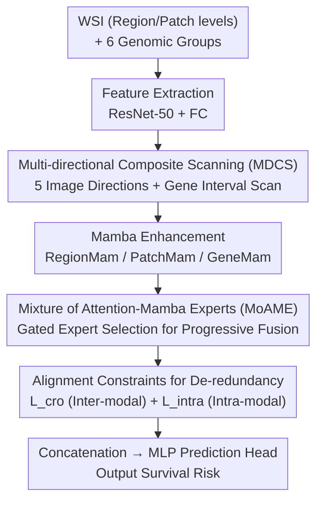

# MDCS-MoAME: Multi-directional Composite Scanning with Mixture of Attention and Mamba Experts for Cancer Survival Prediction

**Conference**: CVPR 2026  
**Paper**: [CVF Open Access](https://openaccess.thecvf.com/content/CVPR2026/html/Qu_MDCS-MoAME_Multi-directional_Composite_Scanning_with_Mixture_of_Attention_and_Mamba_CVPR_2026_paper.html)  
**Code**: To be confirmed  
**Area**: Medical Image / Computational Pathology / Multimodal Survival Prediction  
**Keywords**: Whole Slide Images, Genomes, Survival Prediction, Mamba, Mixture of Experts, Multi-directional Scanning

## TL;DR
Addressing "gigapixel WSI + sparse genomes" for cancer survival prediction, MDCS-MoAME proposes a composite scanning strategy (five directions for images, interval scanning for genes) using Mamba to capture long-range dependencies. It employs a "Mixture of Attention and Mamba Experts" to dynamically select experts for cross-modal fusion based on modality pairs, incorporating alignment constraints to reduce redundancy. This approach achieved an average c-index of 0.7383 across five TCGA datasets, establishing a new SOTA.

## Background & Motivation
**Background**: Cancer survival prediction relies on integrating histopathology WSI (morphology) and genomics (molecular mechanisms). Research has shifted from single-modality to multimodal fusion—from set pooling in DeepSets to gene-guided co-attention in MCAT, and recently to optimal transport/biological pathways in MOTCAT/SurvPath and Mamba-based long-range modeling in PAM/SurvMamba.

**Limitations of Prior Work**: The authors identify four specific shortcomings: ① Inherited hierarchical structures of WSIs (region-level tissue context and patch-level cellular details) are often underutilized. ② Existing Mamba methods employ only **horizontal** scanning, resulting in a restricted receptive field that fails to model multi-directional dependencies (e.g., vertically adjacent patches are distant in a horizontal sequence). ③ Coarse grouping of genes into six sets leads to functional overlaps (e.g., genes in the PI3K-Akt pathway are scattered), failing to capture subtle inter-group relationships. ④ Large inter-modal heterogeneity causes simple or rigid fusion designs to introduce redundancy, limiting feature representation.

**Key Challenge**: WSIs are dense modalities with super-high resolution and strong spatial structure, whereas genomes are sparse, discrete, and functionally entangled. Due to this **heterogeneity**, a single attention mechanism or a single selective scan struggles to simultaneously model intra-modal long-range dependencies and complex inter-modal associations.

**Goal**: ① Design a scanning mechanism to fully excavate the **intra-modal** intrinsic information of WSIs and genomes; ② Design a fusion module to flexibly model complex **inter-modal** associations; ③ Suppress feature redundancy within and between modalities.

**Key Insight**: Leveraging Mamba (linear complexity for long sequences) and MoE (demand-based expert selection), the authors argue that "changing the scanning direction changes the receptive field," while "changing the expert changes the fusion mechanism."

**Core Idea**: Use Multi-directional Composite Scanning (MDCS) to expand Mamba's receptive field for intra-modal information, use Mixture of Attention and Mamba Experts (MoAME) to dynamically select fusion methods based on modality pairs for inter-modal associations, and apply alignment constraints to reduce redundancy.

## Method

### Overall Architecture
Input consists of a patient's WSI $I$ and genome $G$. Output is the survival risk (estimated survival function $f_{\text{sur}}(T\le t)$). The workflow consists of four steps: first, feature extraction (WSIs are partitioned at region/patch levels with ResNet-50; genes are grouped into six sets with FC layers); second, the MDSFE module performs multi-directional composite scanning + Mamba enhancement to obtain intra-modal enhanced representations $I_r, I_p, G_g$; third, the EDIMI module utilizes MoAME experts for progressive cross-modal interaction, producing $I_{r\&g}, I_{p\&g}, G_{g\&r}, G_{g\&p}$; finally, alignment constraints reduce redundancy before features are concatenated and fed into an MLP prediction head.

### Key Designs

**1. MDCS: Expanding Mamba’s Receptive Field from Unidirectional to Omnidirectional**

Existing Mamba-based pathology methods rely only on horizontal scanning, causing vertically or diagonally adjacent patches to be distant in the sequence, thus losing those dependencies. MDCS applies **five** scanning directions at both region and patch levels for WSIs: horizontal (ho), vertical (ve), left-oblique (lo), right-oblique (ro), and loop-back (lb), defined as $\hat{I}_r^j = \{x_{r,\phi_{r,j}(i)}\}_{i=1}^M$, where $\phi_{r,j}$ records the index rearrangement relative to horizontal scanning. Patch-level scanning occurs first within region levels and then across regions to integrate coarse (region) and fine (patch) granularities. For sparse genomes, besides forward (fw) scanning, an **interval (iv) scan** is introduced: scanning with an interval $\Delta$ and wrapping around pulls functionally related but scattered genes closer in the sequence to uncover potential long-distance associations (zero-padding to $\hat K$ if $K$ is not divisible by $\Delta$). After Mamba2 encoding, sequences are rearranged back to horizontal order using $\phi^{-1}_{r,j}$, aggregated via summation, and distilled through PPEG + attention pooling to obtain intra-modal representations $I_r, I_p, G_g\in\mathbb{R}^{1\times E}$ (GeneMam bypasses PPEG).

**2. MoAME: Dynamically Selecting Fusion Strategies per Modality Pair**

Given modal heterogeneity, a single attention or Mamba block is insufficient for full interaction. MoAME employs three complementary experts: CroAttFusion (A, cross-attention for comprehensive complementary associations), CroMamFusion (M, cross-Mamba for linear-complexity associations), and StackedMamFusion (S, two-layer cross-Mamba + randomly initialized features $\mathcal{B}$ for distilling the most relevant information). A gating network calculates $\text{logit}=\text{argmax}\big(\text{Softmax}(\text{logits}')/\tau\big)$ for each input pair $(F_1, F_2)$ to select an expert ($\tau$ controls smoothness). This "hard selection" makes fusion flexible without being excessive, avoiding the redundancy seen in MoME due to over-fusion or misuse of attention.

**3. EDIMI Progressive Cross-modal Interaction: Bridging the Modality Gap Stepwise**

The EDIMI module first uses MoAME for interactions between $(I_r, G_g)$ and $(I_p, G_g)$ to obtain $I_{r\&g}, I_{p\&g}$. Subsequently, it performs interactions between $(G_g, I_{r\&g})$ and $(G_g, I_{p\&g})$ to obtain $G_{g\&r}, G_{g\&p}$. This progressive fusion (image-guided gene, then gene-guided fusion results) bridges the modality gap more deeply than a single-step hard fusion.

**4. Alignment Constraints for De-redundancy: Suppressing Repetitive Inter- and Intra-modal Info**

Multiple fusion modules in MoAME can still introduce redundancy. The authors use L1 distance for alignment: inter-modal $\mathcal{L}_{\text{cro}}=\mathcal{L}_r+\mathcal{L}_p+\mathcal{L}_g$, where $\mathcal{L}_r=\|I_{r\&g}-I_r\|_1$, pulling fused representations toward corresponding intra-modal representations (to prevent dual optimization from degrading shared information, $I_r, I_p, G_g$ are detached from the computation graph for unidirectional optimization). For intra-modal redundancy between region/patch levels, a **negative** L1 distance is used to amplify the difference: $\mathcal{L}_{\text{intra}}=-\|I_r-I_p\|_1$. The final representations are concatenated for MLP prediction with the total loss $\mathcal{L}_{\text{total}}=\mathcal{L}_{\text{sur}}+\alpha\mathcal{L}_{\text{cro}}+\beta\mathcal{L}_{\text{intra}}$.

### Loss & Training
Five-fold cross-validation with c-index as the metric. WSIs were tiled at 10× magnification; regions were $4096\times4096$ and patches were $512\times512$ (Note: Figure 1 mentions $256\times256$; ⚠️ refer to original text). ResNet-50 was used for feature extraction. Adam optimizer, lr 1e-3, weight decay 1e-5, batch size 1, interval $\Delta=5$, 30 epochs per fold. $\alpha$ was set per dataset as [4e-1, 5e-4, 3e-1, 1e-4, 5e-4], and $\beta=1e\text{-}3$. GPU used was GTX 4090.

## Key Experimental Results

### Main Results
Evaluation on five TCGA datasets: BLCA (373), BRCA (956), GBMLGG (569), LUAD (453), and UCEC (480). All methods were reproduced under unified settings.

| Method | Modality | Avg c-index |
|--------|------|------|
| SurvPath | P+G | 0.7147 |
| PIBD | P+G | 0.7149 |
| CMTA | P+G | 0.7013 |
| MoME | P+G | 0.6693 |
| SurvMamba | P+G | 0.6985 |
| PAM | P | 0.6442 |
| **MDCS-MoAME** | **P+G** | **0.7383** |

Relative avg c-index gains: +6.48%~+11.61% vs. genomic methods; +11.12%~+16.88% vs. pathology methods; +3.30%~+10.31% vs. multimodal methods; +14.61% vs. PAM and +5.70% vs. SurvMamba.

### Ablation Study
Main module ablation on LUAD / UCEC:

| Configuration | LUAD c-index | UCEC c-index | Explanation |
|------|---------|---------|------|
| Full MDCS-MoAME | 0.7079 | 0.7263 | All modules |
| w/o MDSFE (Replace with vanilla Mamba) | 0.6695 | 0.6752 | Largest drop (-5.42% / -7.03%) |
| w/o EDIMI | 0.6894 | 0.6929 | Cross-modal interaction failure |
| w/o $\mathcal{L}_{\text{cro}}$ | 0.6864 | 0.7143 | LUAD -3.13% |
| w/o $\mathcal{L}_{\text{intra}}$ | 0.6955 | 0.6981 | UCEC -4.04% |

### Key Findings
- **MDSFE (Multi-directional Composite Scanning) provides the largest contribution**: Reverting to vanilla unidirectional Mamba resulted in drops of 5.42%/7.03% on LUAD/UCEC, proving the necessity of multi-directional scanning for intra-modal dependencies.
- **Scanning directions are complementary**: Using only linear (ho+ve), oblique (lo+ro), or loop-back (lb) yielded limited results; however, combining linear and oblique scanning significantly improved performance. On genomes, interval scanning outperformed forward scanning by modeling non-contiguous functional associations.
- **Alignment constraints effective for de-redundancy**: $\mathcal{L}_{\text{cro}}$ and $\mathcal{L}_{\text{intra}}$ each contributed approximately 1.7%~4% in gains, validating the strategy of "suppressing inter-modal redundancy while amplifying intra-modal differences."

## Highlights & Insights
- **Receptive field expansion via scanning directions**: In Mamba's linear complexity context, adding multiple scanning directions incurs negligible incremental cost while expanding the unidirectional receptive field to omnidirectional coverage. This is a low-cost trick portable to any Mamba-based vision backbone.
- **Genomic interval scanning utilizes "sequence adjacency" as "functional adjacency"**: By using skip-rearrangements, genes that are functionally related but scattered across different groups are brought together in the sequence. This leverages Mamba's locality bias to serve long-range genomic associations.
- **MoAME selects among three fusion intensities via hard gating**: Categorizing experts into Attention (comprehensive), Cross-Mamba (efficiently complementary), and Stacked-Distillation (focusing on key info) allows for specialized processing. This "operator selection per input pair" design is superior to piling up fusions and can be applied to other heterogeneous multimodal tasks.

## Limitations & Future Work
- Validated only on five TCGA cohorts and the c-index metric; external cohort generalization and clinical utility remain unknown.
- The combination of five-direction scanning + three experts + multi-alignment constraints results in a complex architecture with many hyperparameters ($\Delta$, dataset-specific $\alpha$, $\tau$, etc.) requiring fine-tuning.
- Hard selection via argmax in gating was used; the balance of expert utilization and potential "expert collapse" was not discussed.
- Discrepancies exist between the text and figures regarding region/patch tiling sizes ($4096/512$ vs $256$); implementation should follow the source code.

## Related Work & Insights
- **vs PAM**: PAM uses local-aware scanning and bidirectional Mamba but remains essentially unidirectional; MDCS-MoAME's five-direction scanning improves average c-index by 14.61%.
- **vs SurvMamba**: Both follow hierarchical Mamba interaction, but MDCS-MoAME achieves +5.70% through multi-directional perception.
- **vs MoME**: MoME uses multimodal experts for maximization/indirect/gene-driven fusion, but over-fusion introduces redundancy; MoAME uses Attention+Mamba experts and alignment to mitigate this, leading by 10.31%.
- **vs SurvPath / PIBD**: These were the strongest previous multimodal baselines (0.7147/0.7149); MDCS-MoAME outperforms them by a wide margin due to intra-modal scanning enhancement and de-redundancy designs.

## Rating
- Novelty: ⭐⭐⭐⭐ The combination of multi-directional composite scanning, interval gene scanning, and Attention-Mamba MoE is a novel and self-consistent design in survival prediction.
- Experimental Thoroughness: ⭐⭐⭐⭐ Comparison across 5 datasets and 17+ methods with multi-dimensional ablation; however, limited to TCGA and single metrics.
- Writing Quality: ⭐⭐⭐⭐ Clear methodology and equations, though minor inconsistencies exist in tiling size labels.
- Value: ⭐⭐⭐⭐ Establishes a new SOTA in WSI+Genomic survival prediction with portable scanning tricks; however, the structure and tuning costs are high.

<!-- RELATED:START -->

## Related Papers

- [\[CVPR 2026\] Turning Pre-Trained Vision Transformers into End-to-End Histopathology Whole Slide Image Models for Survival Prediction](turning_pre-trained_vision_transformers_into_end-to-end_histopathology_whole_sli.md)
- [\[CVPR 2026\] H2-Surv: Hierarchical Hyperbolic Multimodal Representation Learning for Survival Prediction](h2-surv_hierarchical_hyperbolic_multimodal_representation_learning_for_survival_.md)
- [\[NeurIPS 2025\] Dual Mixture-of-Experts Framework for Discrete-Time Survival Analysis](../../NeurIPS2025/medical_imaging/dual_mixture-of-experts_framework_for_discrete-time_survival_analysis.md)
- [\[CVPR 2026\] MUST: Modality-Specific Representation-Aware Transformer for Diffusion-Enhanced Survival Prediction with Missing Modality](must_modality-specific_representation-aware_transformer_for_diffusion-enhanced_s.md)
- [\[CVPR 2026\] SegMoTE: Token-Level Mixture of Experts for Medical Image Segmentation](segmote_token-level_mixture_of_experts_for_medical_image_segmentation.md)

<!-- RELATED:END -->
