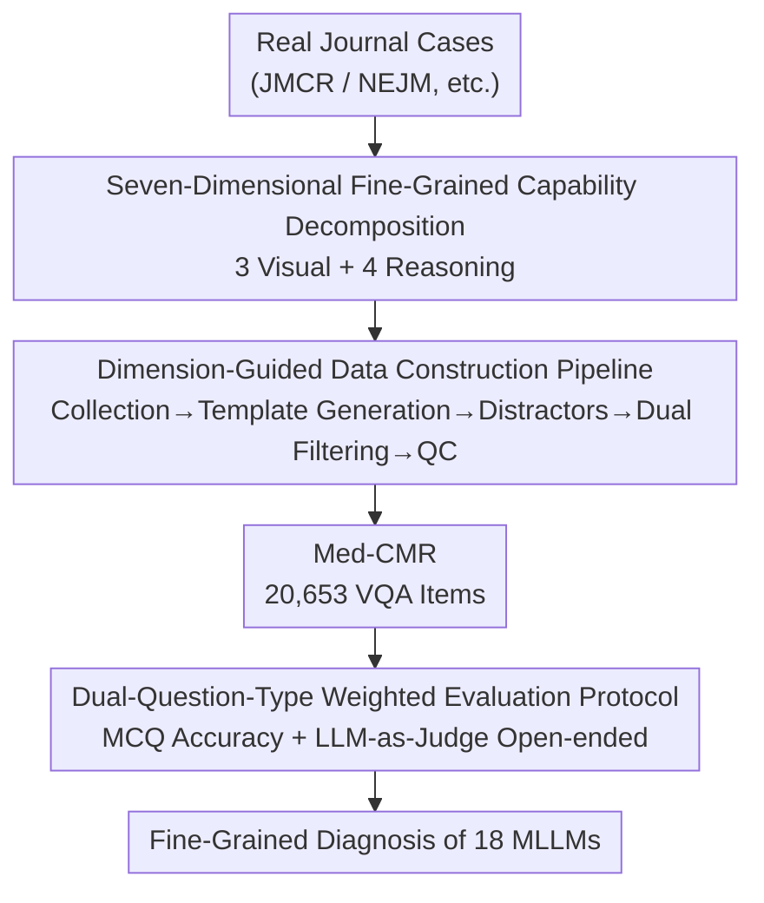

# Med-CMR: A Fine-Grained Benchmark Integrating Visual Evidence and Clinical Logic for Medical Complex Multimodal Reasoning

**Conference**: CVPR 2026  
**Paper**: [CVF Open Access](https://openaccess.thecvf.com/content/CVPR2026/html/Gong_Med-CMR_A_Fine-Grained_Benchmark_Integrating_Visual_Evidence_and_Clinical_Logic_CVPR_2026_paper.html)  
**Code**: https://github.com/LsmnBmnc/Med-CMR  
**Area**: Medical Images / Multimodal VLM / Evaluation Benchmark  
**Keywords**: Medical Multimodal Reasoning, VQA Benchmark, Capability Decoupling, LLM-as-Judge, Long-Tail Generalization

## TL;DR
Med-CMR decomposes "medical multimodal complex reasoning" into 7 categories of tasks across 3 visual dimensions and 4 reasoning dimensions. Using 20,653 VQA items (covering 11 body systems and 12 imaging modalities) doubly audited by human experts and models, it evaluates 18 mainstream MLLMs. The findings show that GPT-5 leads with a 57.81% MCQ accuracy, long-tail generalization is universally recognized as the hardest task, and medically fine-tuned models do not consistently outperform general large models.

## Background & Motivation
**Background**: MLLMs are transitioning from demonstrations to clinical workflows. However, existing medical multimodal benchmarks (such as VQA-RAD, Path-VQA, PMC-VQA, OmniMedVQA, and GMAI-MMBench) mostly stop at "perception-level VQA"—asking models to describe an image or retrieve an obvious fact from a short context.

**Limitations of Prior Work**: This setup hides the truly difficult scenarios in clinical decision-making—subtle low-contrast lesions, cross-modal comparisons, temporal evolution, causal chains linking symptoms/imaging/outcomes, and rare long-tail distributions in textbooks. Consequently, existing benchmarks provide almost no visibility into "complex medical reasoning capabilities" and often only provide a generic overall score, failing to reveal whether a model "cannot see clearly" or "cannot reason properly."

**Key Challenge**: In clinical practice, "perception" and "reasoning" are coupled—physicians must integrate evidence across time and modalities to make diagnoses under conditions of uncertainty and incomplete information. Mixing these two aspects into a single evaluation score makes it impossible to locate the actual shortcomings of the models.

**Goal**: The authors argue that a qualified complex medical reasoning benchmark must possess three components simultaneously: (1) systematic capability decoupling (separating visual understanding from downstream reasoning, and further subdividing them into clinically meaningful sub-dimensions); (2) clinically aligned and deliberately challenging tasks (focusing on real cases and targeting difficult setups such as temporal prediction, causal reasoning, long-tail generalization, and multi-source integration); (3) broad coverage across organs/modalities/diseases + expert verification to ensure authenticity and interpretability.

**Core Idea**: Build Med-CMR using "fine-grained capability decomposition + real-case data pipeline + dual-question-type weighted evaluation" to transform medical multimodal reasoning evaluation from a single score into a stress test capable of dimension-by-dimension diagnostics.

## Method

### Overall Architecture
Med-CMR is not a model but an evaluation benchmark. The overall framework can be viewed as two main tracks: one is the **conceptual skeleton of capability decomposition** (decomposing medical complexity into 7 dimensions), which guides the other **data construction pipeline** (collecting from real journal cases $\to$ template-based question generation $\to$ distractor generation by multiple models $\to$ dual filtering by humans and models $\to$ multi-party quality control $\to$ forming 20,653 VQA items). Finally, a **dual-question-type evaluation protocol** (MCQ for factual accuracy, and open-ended questions evaluated via weighted LLM-as-Judge for reasoning quality) is deployed to evaluate 18 MLLMs.

The diagram below describes the data construction pipeline (node names correspond to the key designs below, ordered chronologically from top to bottom):

### Key Designs

**1. Seven-Dimensional Fine-Grained Capability Decomposition: Decomposing "Medical Multimodal Reasoning" into Independently Diagnostic Sub-capabilities**

Addressing the limitation that "existing benchmarks only provide a generic overall score and cannot identify where the model gets stuck," the authors start from the coupled nature of "perception-reasoning" in clinical practice to decompose medical complexity into two groups with a total of 7 main dimensions. On the visual side, there are 3 dimensions: **Subtle Object Detection (SOD)** — identifying tiny/low-contrast objects; **Fine-grained Detail Discrimination (FDD)** — distinguishing findings that are visually similar but have different clinical implications; **Spatial Understanding (SU)** — aligning multimodal information and maintaining spatial consistency. On the reasoning side, there are 4 dimensions: **Temporal Prediction (TP)** — inferring disease progression and prognosis; **Causal Reasoning (CR)** — linking symptoms, findings, and outcomes into multi-step causal chains; **Long-Tail Generalization (LTG)** — making decisions on rare cases with very few samples; **Multi-Source Integration (MSI)** — extracting key diagnostic clues from multiple co-existing abnormalities in a complex case. Each dimension corresponds to a specially designed task, allowing the model's strengths and weaknesses to be specifically located as either "unable to see clearly" or "unable to reason properly." These 7 dimensions serve as both the evaluation criteria and the skeleton for subsequent data collection and question design.

**2. Dimension-Guided Data Construction Pipeline: Using Real Cases + Multi-Model Generated Distractors + Dual Filtering to Press Out "Realistic and Difficult" Questions**

To address the issue that "automatically generated VQAs are often mediocre and can be guessed correctly solely relying on text," the authors designed a multi-stage pipeline. **Collection**: Images are retrieved from real case reports and research articles in authoritative biomedical journals such as JMCR and NEJM, along with manually annotated captions and metadata. 7 categories of questions are constructed based on the 7 dimensions. **Question Generation**: Annotators with medical backgrounds design 10–20 templates for each category (forcing strong visual dependency, corresponding to specific complexity dimensions, and encouraging multi-step diagnostic inference), which are then assisted by GPT-5-mini: selecting appropriate templates for each image and extracting correct answers from captions to ensure questions are correct, diverse, and focused on the targeted reasoning types. **Distractor Annotation** uses a human-in-the-loop approach: GPT-5-Mini, Qwen3-VL-Plus, and Claude-Sonnet-4 each generate 4 candidates (totaling 12), and then 3 annotators with medical backgrounds select 4 final distractors. These distractors must meet the criteria of being sufficiently difficult, definitely incorrect and non-overlapping semantically with the correct answer, dependent on visual information, and clinically plausible. **Dual Filtering**: Prior to question generation, medical staff manually filter out images with insufficient captions or mismatch with the target dimension; after generation, Lingshu-7B, Qwen2.5-VL-7B, and Llava-Med-v1.5-Mistral-7B are used to screen—**questions that all three models answer correctly are discarded directly**, ensuring appropriate difficulty for MLLMs. **Quality Control (QC)**: General practitioners are introduced specifically to screen LLM-generated content, ultimately removing 8% of questionable content from the original synthetic set. Two annotators perform joint manual verification, independent auditors verify consistency, questions without consensus are removed, four annotators confirm that each question has a unique and unambiguous answer, and finally, practicing physicians review the overall medical accuracy. This process results in 20,653 questions, covering 11 body systems and 12 imaging modalities.

**3. Dual-Question-Type Weighted Evaluation Protocol: MCQ for Factual Accuracy, LLM-as-Judge for Reasoning Process**

To address the limitation that "assessing only multiple-choice selection correctness fails to evaluate reasoning and generation quality," Med-CMR provides both MCQs (16,655 questions, 5 options each) and open-ended questions (3,998 questions). MCQs are scored directly based on accuracy; open-ended questions are scored by an external, standard-aligned LLM along 4 complementary dimensions—Consistency (clear expression and internal self-consistency), Coherence (causal linking between reasoning steps), Visual accuracy (accuracy in identifying and describing visual features in images), and Ground-truth correctness (agreement between the final answer and the reference answer). The final open-ended question score is a weighted sum:

$$S = \frac{\sum_{i\in\{\text{cons, coh, vis, gt}\}} w_i\, s_i}{\sum_{i\in\{\text{cons, coh, vis, gt}\}} w_i}$$

The weights are set to $w_{\text{cons}}=1,\ w_{\text{coh}}=1,\ w_{\text{vis}}=4,\ w_{\text{gt}}=4$—deliberately penalizing "speaking fluently and self-consistently" by putting 4 times the weight on visual accuracy and ground-truth correctness since "seeing the evidence correctly and converging to the correct answer" is the true bottleneck. DeepSeek-V3.2-Exp is used as an independent evaluator to reduce bias toward the models being tested. All open-ended question scores are normalized to 0–100 for easy comparison. Section 4.3 validates human-AI alignment on 200 samples: the Spearman correlation between human and LLM rankings is $>0.8$ for Consistency and Visual Accuracy, and $>0.78$ for Coherence and Ground-truth correctness, with the maximum win ratio difference between dimensions being only 0.0449, indicating that this automated scoring serves as a reliable alternative to expert grading.

## Key Experimental Results

### Main Results (MCQ Accuracy by Dimension % + Open-ended Total Score)
SOD/FDD/SU are visual dimensions, while TP/CR/LTG/MSI are reasoning dimensions; "MCQ All" is the overall MCQ score, and "Open All" is the weighted overall open-ended score.

| Model | Type | SOD | FDD | SU | TP | CR | LTG | MSI | MCQ All | Open All |
|------|------|-----|-----|----|----|----|-----|-----|---------|---------|
| GPT-5 | Closed-source | 66.08 | 71.45 | 62.06 | 58.33 | 60.30 | 55.19 | 69.00 | **57.81** | **48.70** |
| Gemini-2.5-Pro | Closed-source | 58.75 | 68.07 | 56.70 | 52.08 | 53.54 | 46.42 | 64.42 | 49.87 | 45.98 |
| Qwen3-VL-235B-A22B | Open-source >100B | 57.48 | 66.95 | 55.99 | 55.06 | 53.33 | 45.86 | 63.07 | 49.34 | 42.62 |
| InternVL3.5-241B-A28B | Open-source >100B | 55.91 | 65.68 | 52.47 | 54.17 | 48.80 | 42.73 | 56.33 | 46.17 | 47.88 |
| Qwen2.5-VL-72B | Open-source 10–100B | 52.10 | 61.32 | 47.39 | 51.19 | 46.36 | 38.46 | 54.18 | 42.17 | 40.73 |
| Lingshu-7B (Medical) | Open-source 1–10B | 32.84 | 47.12 | 31.17 | 38.99 | 31.53 | 23.86 | 39.62 | 27.26 | 40.91 |
| Medgemma-4B (Medical) | Open-source 1–10B | 16.13 | 17.72 | 13.12 | 14.58 | 17.64 | 14.00 | 23.45 | 14.90 | 32.10 |

Key Readings: GPT-5 ranks first in every MCQ sub-item, leading the best open-source model by 8.47 points in overall MCQ score; however, its margin of advantage over open-source models narrows to just 0.82 points on the overall open-ended score. Long-tail generalization (LTG) is universally recognized as the hardest task—with the highest score at only 55.19%, and all open-source models falling below 46%. Fine-grained Detail Discrimination (FDD) and Multi-Source Integration (MSI) are relatively the easiest.

### Ablation Study / Analysis: Medical Fine-Tuning Conversely Drags Down MCQ Performance
The authors conduct pairwise comparisons between medically fine-tuned models and their base counterparts (Figure 4b/4c) and perform error attribution for 100 GPT-5 error cases.

| Configuration | Phenomenon | Explanation |
|------|------|------|
| Base $\to$ Medical Fine-tuned (MCQ) | Consistent decline | Sign/Wilcoxon test $p < 0.001$, medical fine-tuning systematically degrades MCQ accuracy |
| Base $\to$ Medical Fine-tuned (Open-ended) | Narrowed gap or even outperforming | $p \approx 0.45$ (not significant), some medical models perform better on open-ended questions |
| 500 MCQs "originally biased toward general models" reformulated as open-ended | Lingshu-32B outperforms its base, but Medgemma-27B still declines | Confirms that medical fine-tuning yields richer medical semantics but sacrifices general multimodal reasoning |
| GPT-5 error attribution (100 cases, 5 classes) | Primarily perception, reasoning, and medical knowledge; very few question misunderstandings or formatting issues | Perception errors are concentrated in visually intensive dimensions, while reasoning errors are concentrated in dimensions requiring integration across views, time, and context |

### Key Findings
- **Long-tail generalization is the dominant failure mode**: Rare cases contain very few samples. Even the strongest GPT-5 achieves only 55.19%, revealing that the robustness of current MLLMs on rare/atypical cases remains a critical weakness.
- **Scale improves perception but not visual reasoning**: On MCQs, larger models are more accurate (the correlation coefficient $r$ between model size and performance across most dimensions is around 0.77–0.85); however, in open-ended questions, the scale dividend is concentrated in the linguistic aspects (improved coherence/consistency), while improvements in visual grounding and factual correctness are weak (visual accuracy correlation is only $r \approx 0.59$), indicating that progress in open-ended reasoning cannot rely solely on scaling parameters.
- **Medical fine-tuning is a double-edged sword**: While it causes models to generate answers more aligned with medical semantics (benefiting open-ended tasks), it degrades general multimodal reasoning. On MCQs, it relies more on pattern matching from "a few salient features $\to$ typical diagnosis" and overlooks subtle visual clues, which renders it inferior to general-purpose models on tasks requiring fine-grained perception and complex reasoning. Medgemma-27B is an exception where performance across all open-ended dimensions systematically degraded.
- **Three major error types for GPT-5**: Perception errors (focusing on overall appearance while missing key details, often in SOD/MSI/FDD/SU), reasoning errors (failure to link evidence across views, time, or clinical contexts, common in SU/MSI/TP/CR), and insufficient medical knowledge (common in TP/CR/LTG, requiring understanding of disease mechanisms and rare diseases).

## Highlights & Insights
- **"Decomposing the overall score into 7 dimensions" is the most valuable design to emulate**: It shifts the benchmark from evaluating "who is stronger" to "where are the strengths and weaknesses," which is far more useful for guiding future model improvements than a flat, single-score leaderboard—perception and reasoning errors are attributed separately, directly pointing to specific improvements like "visual encoders lacking multi-scale/cross-frame consistency" and "reasoning drifting towards local information."
- **Giving 4 times the weight to visual accuracy and ground-truth correctness in open-ended scoring is clever**: It deliberately penalizes the superficial scores of "fluent speech" and solidifies the evaluation focus on "interpreting evidence correctly and arriving at correct conclusions," preventing models from inflating their scores simply through linguistic fluency.
- **The filtering strategy of discarding questions answered correctly by all three models** is simple but highly effective. It eliminates trivial questions and establishes a difficulty floor for MLLMs; this trick is highly transferable to any benchmark designed to be challenging.
- **The counterintuitive finding that "medical fine-tuning is not necessarily better" is valuable**: It reminds the community that domain fine-tuning might gain domain-specific semantics at the cost of general multimodal reasoning. Developing medical MLLMs cannot rely solely on domain data.

## Limitations & Future Work
- **Data sources are biased toward journal case reports** (JMCR/NEJM, etc.). These cases are often typical or publishable, which may not sufficiently cover noisy images, incomplete records, and ambiguous boundaries encountered in real-world clinical practices.
- **Distractors and parts of the questions are LLM-assisted**, and despite multi-party manual QC (which removed 8% of questionable content), synthetic artifacts and potential biases cannot be entirely eliminated.
- **Open-ended evaluation relies on a single LLM (DeepSeek-V3.2-Exp)**. Although it aligns well with human judgment ($\rho > 0.78$), the evaluator's own limitations in visual understanding might affect scoring. ⚠️ Due to differences in difficulty and answer budgets across dimensions, direct comparison of scores across different dimensions should be done with caution.
- **It is purely an evaluation benchmark and lacks training sets or solutions**: While it precisely identifies bottlenecks such as long-tail generalization, cross-evidence integration, and fine-grained perception, solving these issues is left to future work.

## Related Work & Insights
- **vs PMC-VQA / OmniMedVQA / GMAI-MMBench**: These benchmarks pursue scale and broad coverage (OmniMedVQA with 128k questions, GMAI-MMBench with 21k questions), but their question types stop at perception-level VQA, are automatically annotated, and lack fine-grained capability assessments. Med-CMR has a comparable volume (20.7k questions) yet achieves wide coverage, challenging tasks, and fine-grained evaluation simultaneously using a hybrid "automated + human" annotation.
- **vs MedXpertQA-MM / HIE-Reasoning**: While these have begun addressing complex reasoning (with challenging tasks), the former lacks fine-grained evaluation, and the latter has narrow coverage (only 133 images). Med-CMR further decomposes reasoning complexity into 7 dimensions and couples it with a dual-question-type protocol.
- **vs General MLLM Evaluation**: The unique contribution of Med-CMR is explicitly decoupling and evaluating "visual evidence" and "clinical logic." This paradigm of "capability decomposition + weighted LLM-as-Judge" is highly transferable to other vertical benchmarks highlighting multi-step reasoning and evidence grounding (such as law, finance, and engineering diagrams).

## Rating
- **Novelty**: ⭐⭐⭐⭐ The first benchmark to decompose medical multimodal reasoning into a 7-dimensional fine-grained evaluation. The combination of capability decomposition and weighted evaluation is innovative, though individual techniques are mostly mature components assembled together.
- **Experimental Thoroughness**: ⭐⭐⭐⭐⭐ Evaluates 18 MLLMs with multiple analyses including scale correlation, medical fine-tuning pairwise analysis, error attribution, and human-machine alignment, providing extremely comprehensive coverage.
- **Writing Quality**: ⭐⭐⭐⭐ Clear logic where motivation, design, and findings are well-aligned. Some pipeline details require referring to the supplementary materials.
- **Value**: ⭐⭐⭐⭐⭐ Provides a stress test and reliable yardstick for Medical MLLMs with dimension-by-dimension diagnostics. Identifying shortfalls in long-tail generalization and visual reasoning provides strong guidance for subsequent research.

<!-- RELATED:START -->

## Related Papers

- [\[CVPR 2026\] X-PCR: A Benchmark for Cross-modality Progressive Clinical Reasoning in Ophthalmic Diagnosis](x-pcr_a_benchmark_for_cross-modality_progressive_clinical_reasoning_in_ophthalmi.md)
- [\[ICLR 2026\] MedLesionVQA: A Multimodal Benchmark Emulating Clinical Visual Diagnosis for Body Surface Health](../../ICLR2026/medical_imaging/medlesionvqa_a_multimodal_benchmark_emulating_clinical_visual_diagnosis_for_body.md)
- [\[CVPR 2026\] CMR-RD: Long-Tailed Adaptive VLM for Explainable CMR Diagnosis](cmr-rd_long-tailed_adaptive_vlm_for_explainable_cmr_diagnosis.md)
- [\[ICLR 2026\] CARE: Towards Clinical Accountability in Multi-Modal Medical Reasoning with an Evidence-Grounded Agentic Framework](../../ICLR2026/medical_imaging/care_towards_clinical_accountability_in_multi-modal_medical_reasoning_with_an_ev.md)
- [\[CVPR 2026\] OmniBrainBench: A Comprehensive Multimodal Benchmark for Brain Imaging Analysis Across Multi-stage Clinical Tasks](omnibrainbench_a_comprehensive_multimodal_benchmark_for_brain_imaging_analysis_a.md)

<!-- RELATED:END -->
