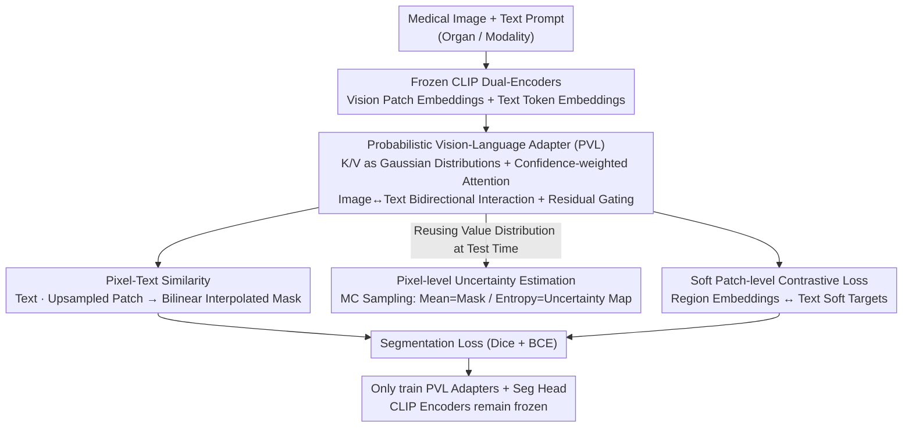

# MedCLIPSeg: Probabilistic Vision-Language Adaptation for Data-Efficient and Generalizable Medical Image Segmentation

**Conference**: CVPR2026  
**arXiv**: [2602.20423](https://arxiv.org/abs/2602.20423)  
**Code**: [HealthX-Lab/MedCLIPSeg](https://github.com/HealthX-Lab/MedCLIPSeg)  
**Area**: Medical Imaging  
**Keywords**: Medical Image Segmentation, CLIP Adaptation, Probabilistic Attention, Uncertainty Modeling, Cross-modal Fusion, Data-efficient

## TL;DR

Building on frozen CLIP encoders, this work achieves bidirectional image-text interaction and prediction uncertainty modeling through Probabilistic Vision-Language (PVL) adaptation. Combined with a soft patch-level contrastive loss, it balances data efficiency, domain generalization, and interpretability across 16 medical segmentation datasets.

## Background & Motivation

Medical image segmentation is long constrained by three core bottlenecks: scarcity of annotated data (extremely high cost for expert labeling), ambiguous anatomical boundaries (low soft-tissue contrast), and domain shift across different devices or institutions. While vision-language pre-trained models like CLIP provide powerful cross-modal representations, existing works either utilize image-level CLIP features for coarse alignment or lack explicit modeling of segmentation prediction uncertainty. This leads to sharp performance degradation under low-data regimes and insufficient robustness in cross-domain scenarios.

The authors identify three critical gaps: (1) most existing CLIP adaptation schemes perform unidirectional text $\to$ image guidance, lacking bidirectional interaction; (2) standard deterministic attention cannot express differences in confidence across various patch features; (3) global contrastive losses are too coarse to encourage fine-grained patch-level semantic alignment. MedCLIPSeg addresses these problems simultaneously from these perspectives.

## Method

### Overall Architecture

MedCLIPSeg aims to solve the classic challenges of medical segmentation—data scarcity, boundary ambiguity, and domain shift—by refining the use of CLIP's cross-modal priors. The framework is built on frozen CLIP dual-encoders (defaulting to a UniMedCLIP backbone): input medical images generate patch-level embeddings via the vision encoder, while text descriptions (containing organ location, imaging modality, etc.) generate token-level embeddings via the text encoder. Learnable **Probabilistic Vision-Language (PVL) adapters** are inserted into multiple intermediate layers of CLIP for bidirectional fusion. Instead of a conventional decoder, segmentation utilizes CLIP’s native image-text similarity: the fused text [EOS] embedding is dot-producted with upsampled vision patches, followed by bilinear interpolation to produce the mask. Simultaneously, the probability distributions learned by the adapters are reused during inference for Monte Carlo sampling to generate a pixel-wise uncertainty map. The training loss consists of a segmentation loss and a soft patch-level contrastive loss, while only the PVL adapters and a lightweight segmentation head are trained; the encoders remain frozen throughout.

### Key Designs

**1. Probabilistic Vision-Language (PVL) Adapter: Modeling Key/Value as Distributions for Fusion and Uncertainty**

Existing CLIP adaptations are mostly unidirectional text $\to$ image guidance using deterministic attention, which cannot express the reliability of patch features. PVL models the Key and Value of each token as Gaussian distributions instead of deterministic vectors: learnable projections predict the mean and log-variance (converted to variance via softplus), resulting in $\text{Key} \sim \mathcal{N}(\mu_K, \sigma_K^2)$ and $\text{Value} \sim \mathcal{N}(\mu_V, \sigma_V^2)$. High variance represents semantic uncertainty, while low variance represents high confidence. The attention score incorporates not just the Query-Key mean similarity $S_\mu$, but also a confidence penalty term $\beta S_\sigma$ derived from the Key variance (i.e., $A = \text{softmax}(S_\mu - \beta S_\sigma)$, where $\beta=2.35$ corresponds to the Gaussian FWHM). Thus, high-variance, unreliable tokens are suppressed and automatically down-weighted before the softmax (degenerating to standard attention when $\beta=0$). PVL operates bidirectionally—vision patches query text tokens (text $\to$ image) and text tokens query vision patches (image $\to$ text)—integrated via a learnable residual gate $g$ to fuse adapted features with original CLIP features ($Y = g\odot O + (1-g)\odot X$). Modeling uncertainty within the attention stage allows the model to suppress noise and ambiguous features during fusion, which is particularly effective for blurred boundaries and artifacts common in medical images.

**2. Pixel-level Uncertainty Estimation: Reusing Value Distributions for a "Free" Reliability Map**

Deterministic models provide only a final segmentation, but clinical scenarios require knowing which areas are trustworthy. MedCLIPSeg reuses the PVL Value distribution: efficiency is maintained during training via the reparameterization trick with a single sample, while multiple random forward passes (30 times in experiments) are performed during testing. The mean serves as the final mask, and the predictive entropy is calculated as a pixel-wise uncertainty map. Here, variance captures aleatoric uncertainty from the data, while MC sampling captures epistemic uncertainty from the model. This map visually highlights segmentation ambiguities, with uncertainty hotspots consistently aligning with anatomical boundaries and difficult regions across both internal and external domains, serving as an automatic quality control signal for deployment.

**3. Soft Patch-level Contrastive Loss: Refining Alignment from Image-level to Patch-level with Soft Targets**

Global image-text contrastive losses align at the image level, which is too coarse to encourage fine-grained semantic differentiation. MedCLIPSeg performs contrastive learning at the patch level: vision patch embeddings are first average-pooled into stable region representations to preserve local semantics while reducing token noise, then subjected to bidirectional contrast with text embeddings. Crucially, soft targets replace hard positive/negative samples—since text prompts within a batch are often similar (describing similar anatomy), the similarity between text descriptions is passed through a softmax (temperature $\tau=0.2$) to serve as a soft supervision target $G$. This teaches the model the continuous semantic relationship of "which descriptions this region resembles most" rather than simple binary matching, leading to better generalization under limited labels.

## Key Experimental Results

### Data Efficiency Evaluation (Average DSC/NSD using 10%/25%/50%/100% training data)

| Method | 10% DSC | 10% NSD | 50% DSC | 50% NSD | 100% DSC | 100% NSD |
|:---|:---:|:---:|:---:|:---:|:---:|:---:|
| UNet | 60.95 | 64.43 | 71.61 | 75.14 | 78.49 | 82.07 |
| nnU-Net | 73.45 | 77.37 | 78.86 | 82.68 | 81.40 | 85.08 |
| CLIPSeg | 74.66 | 77.75 | 79.63 | 82.58 | 84.87 | 87.74 |
| CAT-Seg | 78.76 | 81.50 | 83.32 | 85.61 | 85.90 | 88.31 |
| VLSM-Adapter | 74.47 | 77.50 | 80.83 | 83.77 | 83.85 | 86.72 |
| MaPLe + Decoder | 74.81 | 77.90 | 82.81 | 85.80 | 84.94 | 87.91 |
| **MedCLIPSeg** | **81.10** | **83.94** | **87.18** | **89.95** | **88.66** | **91.35** |

MedCLIPSeg significantly outperforms all baselines across all data ratios. Notably, with only 10% data, it achieves 81.10 DSC, surpassing the runner-up CAT-Seg (78.76) by 2.34 points; at 100% data, it reaches 88.66 DSC, leading CAT-Seg by 2.76 points.

### Ablation Study (DSC for ID/OOD/Harmonic Mean)

| Ablation Item | ID | OOD | HM |
|:---|:---:|:---:|:---:|
| **MedCLIPSeg (Full)** | **89.11** | **79.02** | **83.76** |
| w/o PVL Adapter | 81.23 (−7.88) | 55.23 (−23.79) | 65.75 (−18.01) |
| Deterministic Version (w/o Probabilistic) | 87.68 (−1.43) | 63.12 (−15.90) | 73.40 (−10.36) |
| w/o Visual Adaptation | 81.50 (−7.61) | 64.40 (−14.62) | 71.95 (−11.81) |
| w/o Bidirectional Interaction | 88.71 (−0.40) | 77.71 (−1.31) | 82.85 (−0.91) |
| w/o Soft Contrastive Loss | 87.24 (−1.87) | 77.08 (−1.94) | 81.84 (−1.92) |
| w/ Hard Target Contrast | 88.34 (−0.77) | 77.64 (−1.38) | 82.65 (−1.11) |

Two key findings: (1) The PVL adapter is the core component, moving which drops OOD by 23.79 points; (2) Probabilistic modeling is vital for domain generalization—the deterministic version only drops 1.43 points ID, but crashes by 15.90 points OOD.

## Key Findings

- **Probabilistic modeling contributes significantly more to OOD than ID**: Deterministic MedCLIPSeg drops only 1.43 in ID but 15.90 in OOD, indicating the primary value of uncertainty modeling is allowing the model to automatically reduce reliance on unreliable features when facing distribution shifts.
- **Visual adaptation is more critical than text adaptation**: Removing visual adaptation drops 7.61/14.62 (ID/OOD), while removing text adaptation only drops 0.28/2.62, suggesting cross-modal enhancement on the visual side is the bottleneck for segmentation.
- **Sensitivity to text prompt design**: Contradictory descriptions cause HM to drop from 83.76 to 65.79; insufficient descriptions drop it to 56.82; and over-description drops it to 78.48. This indicates that prompt quality significantly impacts performance.
- **Backbone Selection**: UniMedCLIP > BiomedCLIP (82.48) > Original CLIP (81.07) > PubMedCLIP (79.28). Medical-domain pre-trained CLIP models clearly outperform general-purpose CLIP.
- **Hierarchical Intervention Depth**: The PVL adapter performs best when introduced around the 10th layer; too shallow lacks semantic depth, while too deep affects high-level abstraction.

## Highlights & Insights

1. **Elegant Use of Probabilistic Attention**: Modeling Key/Value as distributions instead of vectors elegantly unifies cross-modal fusion and uncertainty estimation. This concept is highly generalizable to other dense prediction tasks.
2. **Frozen Encoders + Lightweight Adapters**: Completely freezing CLIP encoders and only training PVL adapters and the decoder is parameter-efficient, preserves pre-trained knowledge, and is friendly for practical deployment.
3. **Thorough Domain Generalization Experiments**: 16 datasets across 5 imaging modalities (CT, MRI, Ultrasound, Endoscopy, Dermoscopy) and 6 organs provide strong empirical evidence for both in-domain and out-of-domain scenarios.
4. **Clinical Value of Uncertainty Maps**: Uncertainty is highly correlated with segmentation quality, serving as an automatic quality control signal to alert clinicians to review unreliable segmentation regions.
5. **Generalization Gain from Soft Contrastive Loss**: The improvement from hard to soft targets (HM +1.11) is achieved at almost zero cost, demonstrating the value of fine-grained contrastive learning.

## Limitations & Future Work

- Text prompts currently require manual design (organ location, modality, etc.); automated prompt generation could further lower the barrier to use.
- Monte Carlo sampling increases inference time; practical deployment requires a trade-off between the number of samples and efficiency.
- Currently processes 2D slices without extension to native 3D volumetric data segmentation.
- Domain generalization experiments involve some overlap in modalities between training and testing; generalization to completely unseen modalities (e.g., OCT) remains unverified.
- Probabilistic modeling introduces additional hyperparameters ($\beta$, sample count), and optimal settings may vary across datasets.

## Related Work & Insights

- **CLIPSeg / DenseCLIP / ZegCLIP**: These methods directly use CLIP features for segmentation but lack probabilistic modeling and fine-grained contrastive loss. MedCLIPSeg leads significantly in all settings, especially in low-data/cross-domain scenarios.
- **VLSM-Adapter**: Also performs CLIP adaptation but features only unidirectional (text $\to$ vision) interaction and deterministic attention. MedCLIPSeg’s bidirectional probabilistic adaptation significantly outperforms it (HM higher by ~3.5 points).
- **CAT-Seg**: A strong baseline using cost aggregation for segmentation but lacks uncertainty modeling, showing weaker domain generalization than MedCLIPSeg.
- **CausalCLIPSeg**: Introduces causal inference for generalization but exhibits unstable performance in OOD scenarios (HM 57.54), far below MedCLIPSeg’s 80.80.
- **nnU-Net**: The gold standard for pure vision methods but shows a clear gap in low-data regimes (10% DSC 73.45 vs 81.10).

## Rating

- Novelty: ⭐⭐⭐⭐ (Probabilistic cross-modal attention is a creative design, though the overall framework is a natural extension of CLIP adaptation)
- Experimental Thoroughness: ⭐⭐⭐⭐⭐ (16 datasets, 5 modalities, detailed ablations; very comprehensive)
- Writing Quality: ⭐⭐⭐⭐ (Clear, structured, and feature-rich tables/figures)
- Value: ⭐⭐⭐⭐ (The gain from probabilistic modeling for domain generalization is impressive and shows potential for clinical deployment)

<!-- RELATED:START -->

## Related Papers

- [\[CVPR 2026\] Decoupling Vision and Language: Codebook Anchored Visual Adaptation](decoupling_vision_and_language_codebook_anchored_visual_adaptation.md)
- [\[CVPR 2026\] CHIPS: Efficient CLIP Adaptation via Curvature-aware Hybrid Influence-based Data Selection](chips_efficient_clip_adaptation_via_curvature-aware_hybrid_influence-based_data_.md)
- [\[CVPR 2026\] Simple-ViLMedSAM: Simple Text Prompts Meet Vision-Language Models for Medical Image Segmentation](simple-vilmedsam_simple_text_prompts_meet_vision-language_models_for_medical_ima.md)
- [\[AAAI 2026\] DeNAS-ViT: Data Efficient NAS-Optimized Vision Transformer for Ultrasound Image Segmentation](../../AAAI2026/medical_imaging/denas-vit_data_efficient_nas-optimized_vision_transformer_for_ultrasound_image_s.md)
- [\[CVPR 2026\] Multimodal Causality-Driven Representation Learning for Generalizable Medical Image Segmentation](multimodal_causal-driven_representation_learning_for_generalizable_medical_image.md)

<!-- RELATED:END -->
