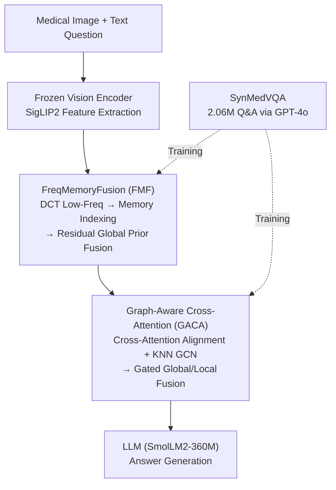

# MedFG-VQA: Low-Frequency Memory and Graph Attention for Lightweight Medical VQA

**Conference**: CVPR 2026  
**Paper**: [CVF Open Access](https://openaccess.thecvf.com/content/CVPR2026/html/Gu_MedFG-VQA_Low-Frequency_Memory_and_Graph_Attention_for_Lightweight_Medical_VQA_CVPR_2026_paper.html)  
**Code**: https://github.com/NUST-Machine-Intelligence-Laboratory/MedFG  
**Area**: Medical Imaging / Multimodal VLM  
**Keywords**: Medical VQA, Lightweight, Frequency Domain Memory Bank, Graph Attention, Synthetic Data

## TL;DR
MedFG-VQA equips a 795M small model with two lightweight modules—"DCT Low-Frequency Memory Bank" and "Graph-Enhanced Cross-Modal Attention"—and utilizes 2.06 million synthetic medical VQA records generated by GPT-4o. This approach achieves higher accuracy in medical visual question answering with a footprint significantly smaller than mainstream VLMs.

## Background & Motivation
**Background**: Medical Visual Question Answering (Med-VQA) aligns medical imagery with natural language questions, serving as a critical direction for clinical decision support. Current dominant approaches connect large vision encoders to Large Language Models (e.g., LLaVA-Med, Qwen3-VL), relying on massive parameters and pre-training data for performance.

**Limitations of Prior Work**: This paradigm faces two major hurdles in medical contexts. First, **scarcity of annotated data**—public Med-VQA datasets are too small to train large VLMs effectively. Second, **strict deployment constraints**—clinical environments impose strong limits on model size and computational power, whereas existing large models' diagnostic capabilities collapse significantly in lightweight configurations.

**Key Challenge**: Medical VQA requires both **global structural information** (overall lesion morphology, anatomical trends) and **local fine-grained alignment** (precise matching between specific regions and text descriptions). Lightweight models have limited capacity; stacking general modules fails to address both needs. Furthermore, data scarcity disproportionately affects small models, as they are more sensitive to high-quality domain data.

**Goal**: To enhance global structural modeling and local cross-modal alignment simultaneously within a small model budget (<1B), while addressing the lack of training data.

**Key Insight**: The authors observe that the **low-frequency components of an image primarily encode global semantics and structural information**, which can be isolated and enhanced using frequency domain decomposition (DCT). Meanwhile, local structural relationships can be explicitly modeled between image patches using graph convolutions.

**Core Idea**: Inject global structural priors using a "learnable low-frequency memory bank," complement local topology with "graph-aware cross-attention," and feed the small model with 2.06 million Med-VQA data points synthesized by GPT-4o.

## Method

### Overall Architecture
The input to MedFG-VQA is a medical image and a textual question; the output is the answer. The pipeline involves: a frozen vision encoder (SigLIP2) extracting image features, followed by **FreqMemoryFusion (FMF)** to retrieve global low-frequency priors in the frequency domain for enhancement, and then **Graph-Aware Cross-Attention (GACA)** for cross-modal alignment with text features and local graph structure supplementation. The fused multimodal features are sent to an LLM (SmolLM2-360M) to generate answers. Both modules are randomly initialized and lightweight; the visual backbone remains frozen. Training data comes from the self-constructed **SynMedVQA** (synthesized by GPT-4o).

### Key Designs

**1. FreqMemoryFusion (FMF): Global Structural Priors via Frequency Memory Bank**

The limitation is that lightweight visual backbones struggle to stably capture global structures of lesions. FMF applies the **Discrete Cosine Transform (DCT)** to image features $X \in \mathbb{R}^{B\times M\times D}$ to decompose them into low-frequency $F_{low}$ and high-frequency $F_{high}$ components. Since low frequencies dominate global semantics, they are used as query signals to retrieve top-k entries $M_k$ and weights $S_k$ from a **learnable memory bank** $M\in\mathbb{R}^{N\times D/2}$ via cosine similarity. Residual weighted fusion is applied: $F_{low}^{fused}=\lambda F_{low}+(1-\lambda)(\mathrm{Softmax}(S_k)\cdot M_k)$ (fixed at $\lambda=0.7$). The fused low-frequency and original high-frequency components are concatenated and transformed back to the spatial domain via IDCT to obtain $X_{rec}$. Finally, features are injected via a gated residual: $X_{out}=X+\alpha\cdot f_\theta([X,X_{rec}])$. Memory vectors are orthogonally initialized. To prevent memory collapse, a **diversity loss** is added: $L_{div}=\frac{1}{N(N-1)}\sum_{i\neq j}(m_i^\top m_j)^2$.

**2. Graph-Aware Cross-Attention (GACA): Global Semantics and Local Topology**

Standard cross-attention handles global alignment but ignores local spatial relationships between image patches, which are vital for medical diagnosis. GACA treats image features as queries and text features as keys/values. Multi-head cross-attention yields semantically enhanced visual representations $I_{attn}$ (global alignment). Simultaneously, a **KNN graph** is dynamically constructed based on $I_{attn}$, with adjacency matrix $A_{ij}=1$ if $j\in\mathrm{KNN}(i,k)$. After symmetric normalization to get $\tilde A$, a graph convolution $I_{enh}=\sigma(f_\theta(\tilde A I_{attn}))$ aggregates local neighborhood information. The two paths are balanced via **gated residuals**: $I_{fused}=G\odot I_{enh}+(1-G)\odot I_{attn}$, where $G=\sigma(f_\theta([I_{attn},I_{enh}]))$.

**3. SynMedVQA: Addressing Data Scarcity at the Source**

Authors integrated 11 public medical imaging datasets (9 modalities, 10 organs, 206k images) and used GPT-4o as a semantic engine. Prompts set the model as a senior imaging expert, generating Q&A pairs customized to clinical/radiological characteristics. Four categories are covered (imaging features, anatomy, pathology, clinical significance). Both open-ended and multiple-choice questions were generated (including 25% "none of the above" choices to enhance robustness). A **three-step quality control** followed: rule-based filtering, Qwen2.5-VL + manual spot checks, and consistency verification. SynMedVQA contains **2,059,020** Q&A pairs.

### Loss & Training
The total loss is a linear combination of text generation cross-entropy and memory diversity loss: $L_{total}=L_{text}+\lambda L_{div}$ ($\lambda=0.5$). The SigLIP2 backbone is frozen, and vision tokens are compressed via Modal Projection (MP). SmolLM2-360M-Instruct is used as the LLM. Learning rates: LLM 5e-5, MP 0.003, FMF/GACA 0.0015. Optimized with AdamW for 2 epochs on 8×4090 GPUs.

## Key Experimental Results

### Main Results
On the SynMedVQA benchmark, MedFG-VQA (795M) achieved an average accuracy of 0.6441, outperforming the 4B Qwen3-VL by approximately 9.5%.

| Method | Parameters | Avg. Accuracy | Note |
|--------|------|------|----------|
| InternVL3.5 | 1B | 0.4846 | — |
| MiniCPM-V 4.0 | 4B | 0.4964 | — |
| Qwen3-VL | 4B | 0.5492 | Second Best |
| Gemma3 | 4B | 0.4590 | — |
| LLaVA-Med | 7B | 0.4834 | — |
| **MedFG-VQA (Ours)** | **795M** | **0.6441** | Smallest, Most Accurate |

On public benchmarks (SLAKE / VQA-RAD / PathVQA), the model achieved the highest accuracy for open-ended questions (e.g., SLAKE-Open 0.9595), while closed-ended performance was slightly lower than some larger models due to their larger pre-training corpora.

### Ablation Study

| Configuration | Accuracy | Description |
|------|---------|------|
| Full Model (FMF+GACA) | 0.6441 | — |
| Only FMF | 0.6270 | W/o GACA |
| Only GACA | 0.6242 | W/o FMF |
| W/o Both | 0.4170 | Significant degradation |
| Memory Size 16 / 64 / 128 | 0.4313 / 0.6441 / 0.2771 | 64 is optimal |
| Transform: None / FFT / DCT | 0.6058 / 0.5585 / 0.6441 | DCT is best |

### Key Findings
- **Synergy**: Removing both FMF and GACA drops accuracy to 0.417, whereas using both reaches 0.6441, indicating that global structural modeling and local alignment are both essential.
- **Memory Sensitivity**: Increasing size from 64 to 128 caused a crash to 0.2771, suggesting excessive capacity introduces redundancy or noise.
- **DCT vs. FFT**: DCT significantly outperformed FFT. FFT actually performed worse than using no transform, highlighting the importance of how low-frequency priors are extracted.

## Highlights & Insights
- **Frequency Domain Memory Bank**: Externalizing "global structural priors" into a learnable, searchable shared memory allows capacity-constrained models to avoid "rote memorization" within their parameters.
- **Gated Dual-Path Fusion**: Using gated mechanisms (e.g., $\alpha$ in FMF, $G$ in GACA) allows the model to adaptively weight original vs. enhanced features, which is particularly stable for lightweight models.
- **Synthetic Data Strategy**: 2.06 million quality-controlled GPT-4o entries prove that high-quality synthesis can enable a 795M model to outperform a 7B model in domain-specific tasks.

## Limitations & Future Work
- Performance on closed-ended questions still lags behind certain large models due to the gap in general knowledge from massive pre-training.
- Relies heavily on GPT-4o for synthesis; while QC was performed, clinical accuracy and potential hallucinations remain concerns.
- Sensitivity to hyperparameters like memory size (128 collapse) suggests a need for more robust auto-scaling mechanisms.

## Related Work & Insights
- **vs. LLaVA-Med**: LLaVA-Med fine-tunes a 7B VLM on GPT-4 data. This work adopts a lightweight 795M route with specialized frequency/graph modules, outperforming it on open-ended tasks with an order of magnitude fewer parameters.
- **vs. General sVLMs**: General small models focus on broad benchmarks. This work demonstrates that small models are highly dependent on domain-specific data and structural priors.

## Rating
- Novelty: ⭐⭐⭐⭐ 
- Experimental Thoroughness: ⭐⭐⭐⭐ 
- Writing Quality: ⭐⭐⭐⭐ 
- Value: ⭐⭐⭐⭐ 

<!-- RELATED:START -->

## Related Papers

- [\[CVPR 2025\] DiN: Diffusion Model for Robust Medical VQA with Semantic Noisy Labels](../../CVPR2025/medical_imaging/din_diffusion_model_for_robust_medical_vqa_with_semantic_noisy_labels.md)
- [\[AAAI 2026\] Refine and Align: Confidence Calibration through Multi-Agent Interaction in VQA](../../AAAI2026/medical_imaging/refine_and_align_confidence_calibration_through_multi-agent_interaction_in_vqa.md)
- [\[CVPR 2026\] Forging a Dynamic Memory: Retrieval-Guided Continual Learning for Generalist Medical Foundation Models](forging_a_dynamic_memory_retrieval-guided_continual_learning_for_generalist_medi.md)
- [\[CVPR 2026\] Momentum Memory for Knowledge Distillation in Computational Pathology](momentum_memory_for_knowledge_distillation_in_computational_pathology.md)
- [\[ICCV 2025\] GEMeX: A Large-Scale, Groundable, and Explainable Medical VQA Benchmark for Chest X-ray Diagnosis](../../ICCV2025/medical_imaging/gemex_a_large-scale_groundable_and_explainable_medical_vqa_benchmark_for_chest_x.md)

<!-- RELATED:END -->
