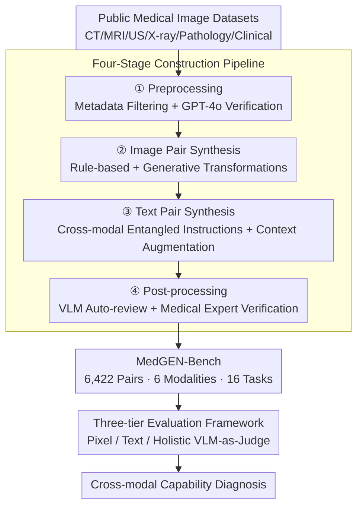

# MedGEN-Bench: Contextually Entangled Benchmark for Open-Ended Multimodal Medical Generation

**Conference**: CVPR 2026  
**arXiv**: [2511.13135](https://arxiv.org/abs/2511.13135)  
**Code**: Pending (Open-source promised in paper)  
**Area**: Medical Imaging  
**Keywords**: Multimodal medical generation, benchmark, VLM evaluation, image-text entanglement, open-ended generation

## TL;DR

MedGEN-Bench is proposed as the first comprehensive benchmark for open-ended multimodal medical generation. It comprises 6,422 expert-verified image-text pairs across 6 imaging modalities and 16 clinical tasks, supported by a three-tier evaluation framework. The study reveals that composite frameworks outperform unified models in cross-modal consistency.

## Background & Motivation

Existing medical vision benchmarks (VQA-RAD, SLAKE, PMC-VQA, etc.) suffer from three fundamental flaws: (1) **Query-image decoupling**—questions are often generic templates lacking deep correlation with image content, reducing VQA to simple classification; (2) **Closed-set shortcuts**—multiple-choice formats allow models to rank answers without complex clinical reasoning; (3) **Text-only output**—neglecting image generation capabilities (e.g., lesion localization, regional editing) essential in clinical practice. These points signify a severe disconnect from real clinical workflows. This work aims to build a comprehensive benchmark that simultaneously evaluates textual diagnosis generation and clinically relevant image synthesis.

## Method

### Overall Architecture

MedGEN-Bench is constructed through a four-stage pipeline: (1) **Preprocessing**—two-stage filtering (metadata coarse filtering + GPT-4o semantic verification) to select task-relevant medical images; (2) **Image pair synthesis**—rule-based transformations (classical image processing) and generative transformations (diffusion models, etc.) to produce input-output image pairs; (3) **Text pair synthesis**—Qwen3-VL extracts semantic information, and GPT-4o performs context-based augmentation to generate instruction-answer pairs; (4) **Post-processing**—automatic VLM review + manual verification by medical experts.

The final benchmark includes 6,422 expert-verified image-text pairs (11,744 high-quality images), covering CT, MRI, Ultrasound, X-ray, Pathology, and Clinical Photos. These are organized into three task formats: VQA, Image Editing, and Contextual Multimodal Generation. The constructed benchmark is then graded by a three-tier evaluation framework to diagnose the cross-modal capabilities of models.

### Key Designs

**1. Cross-modal Entangled Instructions: Pinning Textual Semantics to Pixel Evidence**

The problem with traditional medical VQA is the loose coupling between generic templates and image content, which allows models to guess correctly through pattern matching—a "closed-set shortcut" the benchmark seeks to eliminate. MedGEN-Bench deliberately crafts each instruction to contain detailed, image-specific visual cues. Models must truly understand the image and root textual semantics in specific pixels to answer, forcing deep cross-modal reasoning rather than shallow clichés.

**2. Contextual Augmentation: Refinement for Accuracy and Diversity**

Instructions directly derived from templates tend to be monotonous and easily memorized by models. MedGEN-Bench first uses Qwen3-VL to extract structured semantics $\boldsymbol{\mathcal{M}}$ from image pairs, which are filled into task templates to obtain raw instruction pairs $\boldsymbol{\mathcal{I}}_{\text{raw}}$. Then, GPT-4o executes a refinement function $\boldsymbol{\psi}$—combining input/output images, metadata, and raw instructions to perform synonym replacement, syntactic restructuring, and domain terminology injection. This maintains semantic accuracy while injecting linguistic diversity. Ablations show this step increases the average text-to-image semantic similarity from 0.273 to 0.372 (+36.3%), indicating better instruction-image alignment.

**3. Three-tier Evaluation Framework: Cross-validation Across Pixel, Text, and Holistic Scales**

Single metrics can hide systemic flaws (e.g., high PSNR but clinically incorrect). MedGEN-Bench decomposes evaluation into three complementary layers: the Pixel Tier uses SSIM, PSNR, and LPIPS for structural/perceptual similarity; the Text Tier uses PubMedBERT-based BERTScore for semantic similarity; the Holistic Tier utilizes VLM-as-a-Judge (Analyze-then-Judge, 1–10 scale) to score across five dimensions: consistency, visual-text alignment, content accuracy, relevance, and modality coherence, using both reference-based and reference-free modes.

### Loss & Training

As a benchmark paper, this work does not involve model training. During evaluation, cross-metric results are binarized using predefined thresholds to report accuracy (via sample proportions). Quality assurance procedures include:
- **Automatic Review**: GPT-4o evaluates consistency between generated samples and ground truth.
- **Expert Review**: Medical experts evaluate question validity, answer accuracy, and multimodal relevance.
- **Image Labeling**: Subversive text labels are added to input/output images to assist VLM review.

## Key Experimental Results

### Main Results

| Task/Model | Holistic w.GT | Holistic w/o GT | Text (BERTScore) | Note |
|-----------|--------------|-----------------|-----------------|------|
| **Multimodal Gen** | | | | |
| Qwen3-VL & Imagen-4.0-fast | 30.11 | **75.32** | 51.14 | Composite framework is best |
| Gemini-2.5-flash-image (Unified) | 23.58 | 49.78 | 46.86 | High image quality, weak text |
| Ming-UniVision (Unified) | 8.54 | 11.48 | 24.93 | Severe cross-modal disconnect |
| **Image Editing** | | | | |
| Qwen3-VL & Gpt-image-1-mini | **72.59** | **87.62** | — | Best for editing |
| Gemini-2.5-flash (Unified) | 71.28 | 84.22 | — | Best unified model |
| **VQA** | | | | |
| Qwen3-VL | **53.10** | **98.27** | 29.83 | Leading general VLM |
| HuaTuoGPT-Vision (Medical) | 36.03 | 75.82 | **53.67** | Strong text, weak holistic |

### Ablation Study

| Configuration | Key Metric | Note |
|------|---------|------|
| Raw Template Instructions | Avg. Similarity 0.273 | Baseline |
| Contextual Augmented Instructions | Avg. Similarity 0.372 | +36.3%, Pass Rate 86.9% |
| Peak Distribution | 0.25 → 0.40 | Significant right-shift in semantic alignment |

### Key Findings

- **Composite Framework > Unified Model**: Composite frameworks outperform unified models in cross-modal consistency through task decomposition and modular collaboration.
- **Local Metrics Mask Systemic Flaws**: Ming-UniVision shows high PSNR/LPIPS but extremely low holistic scores, proving pixel quality $\neq$ clinical correctness.
- **Limitations of Dedicated Medical Models**: HuaTuoGPT-Vision has strong text capabilities (BERTScore 53.67) but lags in holistic evaluation, exposing cross-modal decoupling.
- **Contextual Augmentation is Crucial**: Query-image entanglement directly improves generation quality, validating the benchmark's design philosophy.

## Highlights & Insights

- **Paradigm Shift**: Extends medical AI evaluation from "understanding-centric" to "understanding + generation," aligning better with clinical workflows.
- **Three-tier Evaluation**: The combination of pixel-level, semantic-level, and holistic evaluation reveals true model capabilities more effectively than single metrics.
- **Explanatory Insights**: The finding of "cross-modal disconnection" in unified models—where pixel fidelity is high but semantic consistency is poor—offers critical insights for future model design.

## Limitations & Future Work

- Evaluation relies on GPT-4o as a Judge, which may introduce bias (the circular problem of VLMs evaluating VLMs).
- Image generation data transformed by generative models may contain unnatural artifacts.
- The scale of 6,422 pairs is relatively small for covering 6 modalities and 16 tasks (approx. 230 pairs per sub-task).
- Does not include 3D volumetric imaging (e.g., full CT/MRI sequences), restricted to 2D slices.
- Expert verification has limited scalability, making continuous large-scale updates difficult.
- All data comes from public datasets, potentially creating a distribution shift from real clinical data.
- Does not evaluate capabilities in temporal follow-up scenarios (e.g., comparing two consecutive exams).

## Related Work & Insights

- While CheXGenBench and MedEBench attempted generation tasks, they were limited to specific modalities (X-ray); this is the first with full modality coverage.
- DrVD-Bench focuses on reasoning consistency, while SMMILE focuses on few-shot learning—both remain at the understanding level.
- Multimodal ICL in SMMILE and multimodal generation in this work represent two distinct developmental directions.
- Insight: The next step for medical multimodal AI is not just better "perception" but "generation" of clinically meaningful images and reports.
- The finding that composite frameworks outperform unified models challenges the development path of large unified models like Gemini or GPT.

## Rating

- Novelty: ⭐⭐⭐⭐ First systematic medical multimodal generation benchmark filling a major gap.
- Experimental Thoroughness: ⭐⭐⭐⭐ Evaluated 10 composite + 3 unified + 5 VLM setups, wide coverage.
- Writing Quality: ⭐⭐⭐⭐ Clear motivation and persuasive pilot study.
- Value: ⭐⭐⭐⭐⭐ Foundational significance for medical multimodal generation with a reusable framework.

<!-- RELATED:START -->

## Related Papers

- [\[CVPR 2026\] Sketch2CT: Multimodal Diffusion for Structure-Aware 3D Medical Volume Generation](sketch2ct_multimodal_diffusion_for_structure-aware_3d_medical_volume_generation.md)
- [\[CVPR 2026\] MR-RAG: Multimodal Relevance-Aware Retrieval-Augmented Generation for Medical Visual Question Answering](mr-rag_multimodal_relevance-aware_retrieval-augmented_generation_for_medical_vis.md)
- [\[CVPR 2026\] OmniBrainBench: A Comprehensive Multimodal Benchmark for Brain Imaging Analysis Across Multi-stage Clinical Tasks](omnibrainbench_a_comprehensive_multimodal_benchmark_for_brain_imaging_analysis_a.md)
- [\[CVPR 2026\] Gastric-X: A Multimodal Multi-Phase Benchmark Dataset for Advancing Vision-Language Models in Gastric Cancer Analysis](gastric-x_a_multimodal_multi-phase_benchmark_dataset_for_advancing_vision-langua.md)
- [\[ICML 2026\] SynerMedGen: Synergizing Medical Multimodal Understanding with Generation via Task Alignment](../../ICML2026/medical_imaging/synermedgen_synergizing_medical_multimodal_understanding_with_generation_via_tas.md)

<!-- RELATED:END -->
