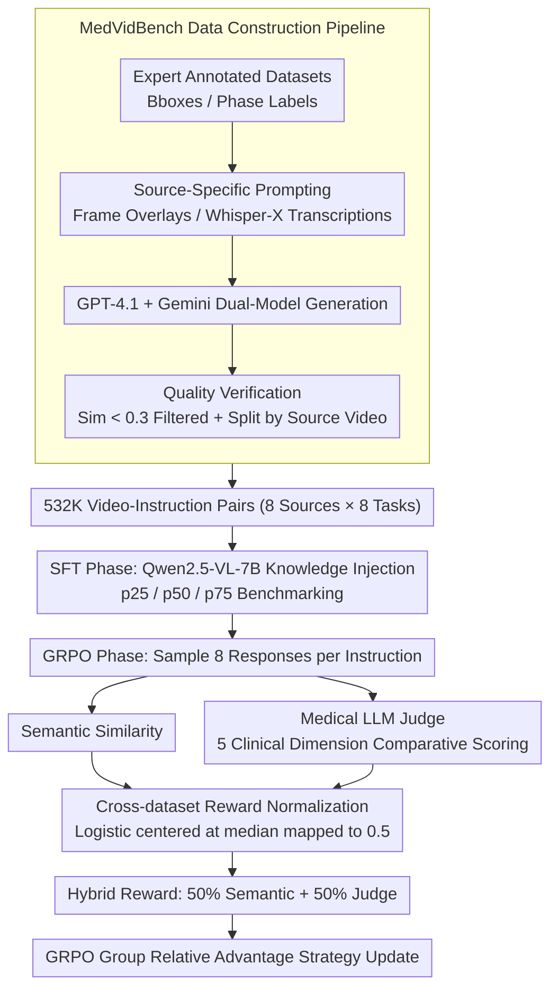

# MedGRPO: Multi-Task Reinforcement Learning for Heterogeneous Medical Video Understanding

**Conference**: CVPR 2026  
**arXiv**: [2512.06581](https://arxiv.org/abs/2512.06581)  
**Code**: [https://uii-america.github.io/MedGRPO/](https://uii-america.github.io/MedGRPO/)  
**Area**: Medical Imaging / Video Understanding  
**Keywords**: Medical video understanding, Reinforcement Learning, Cross-dataset reward normalization, VLM fine-tuning, Multi-task learning

## TL;DR

MedGRPO proposes two key innovations to address the training collapse issue in multi-dataset reinforcement learning for medical videos: cross-dataset reward normalization (mapping median performance across different datasets to the same reward value via a logistic function) and Medical LLM Judge (comparative scoring across five clinical dimensions). Based on Qwen2.5-VL-7B, it outperforms GPT-4.1 and Gemini-2.5-Flash on MedVidBench (532K video-instruction pairs).

## Background & Motivation

1. **Background**: Large vision-language models have achieved significant progress in general video understanding, but their performance degrades substantially in medical video tasks. Medical video understanding requires precise interpretation of surgical actions, domain-specific terminology (e.g., distinguishing "grasper" from "tool"), surgical safety assessment, and multi-stage temporal reasoning.

2. **Limitations of Prior Work**:
    - **Lack of instruction-following training data**: Existing medical video datasets (CholecT50, EgoSurgery, etc.) possess rich annotations but lack QA dialogue formats.
    - **Standard RL training collapse on heterogeneous datasets**: Dataset difficulty varies significantly (e.g., median mIoU $\approx 0.5$ in CoPESD spatial-temporal localization vs. $\approx 0.12$ in EgoSurgery). Standard GRPO's raw rewards cause models to overfit simple datasets and abandon difficult ones.
    - **General semantic similarity metrics fail to capture clinical nuances**: "The tool grasps tissue" vs. "The grasper dissects the cystic duct" share a cosine similarity $\approx 0.82$, despite entirely different clinical implications.

3. **Key Challenge**: How to conduct balanced multi-task reinforcement learning across heterogeneous medical video datasets with vast difficulty gaps?

4. **Key Insight**: Median fairness—ensuring median performance receives the same normalized reward across all dataset-task pairs to eliminate bias in gradient updates.

5. **Core Idea**: Utilize logistic reward normalization for fair cross-dataset optimization and a Medical LLM Judge instead of general semantic similarity to capture fine-grained clinical details.

## Method

### Overall Architecture

The core problem MedGRPO addresses is the collapse of standard GRPO when training on medical video datasets of varying difficulty (ranging from median mIoU $\approx 0.5$ to $\approx 0.12$). The mechanism involves injecting domain knowledge via supervised learning first, then applying an RL phase that "scores every dataset fairly" to uplift all tasks simultaneously.

The process consists of two stages. In the SFT stage, Qwen2.5-VL-7B is fine-tuned on the self-constructed MedVidBench to inject surgical terminology and workflow knowledge, while simultaneously calculating percentile statistics ($p_{25}, p_{50}, p_{75}$) for each dataset-task pair to provide baseline metrics for reward normalization. In the GRPO stage, 8 responses are sampled per instruction. Each response is evaluated via semantic similarity and a Medical LLM Judge; both metrics undergo cross-dataset normalization before being mixed 50/50 into the final reward. Strategy updates are performed using GRPO's group relative advantage estimation. The input pipeline uses adaptive sampling (0.1–3 FPS) of medical video frames, and the output covers 8 tasks including text descriptions and spatial-temporal localization.

### Key Designs

**1. MedVidBench Data Construction & Quality Assurance Pipeline: Transforming Scattered Expert Annotations into Large-Scale RL QA**

Existing medical video datasets (CholecT50, EgoSurgery, etc.) feature rich expert annotations like bounding boxes and phase labels, but they do not follow instruction-following dialogue formats. Manual rewriting is prohibitively expensive. This pipeline automates the conversion in three steps: **Source-specific prompting** (e.g., for CholecT50, bounding boxes and labels are overlaid on frames for VLM interpretation; for AVOS, Whisper-X extracts transcriptions for metadata); then, **dual-model generation** using GPT-4.1 and Gemini-2.5-Flash to avoid systematic model bias; and finally, **quality verification** filtering pairs with similarity $< 0.3$ and splitting data 0.85/0.15 by source video (not individual samples) to prevent leakage. This results in 532K samples across 8 sources and 8 tasks, covering video, segment, and frame levels.

**2. Cross-Dataset Reward Normalization: Equalizing Gradient Influence Across Datasets**

Without normalization, simple datasets naturally yield higher raw rewards, dominating gradient updates and causing the model to neglect difficult tasks. Experiments showed system collapse: CVS dropped from 0.894 to 0.020, STG from 0.177 to 0.010, and training entropy became unstable. The solution is applying a logistic transformation centered on the median for each dataset-task pair $(d,t)$:

$$r_{norm}^{(d,t)}(x) = \frac{1}{1 + \exp\!\left(-k \cdot \dfrac{x - p_{50}^{(d,t)}}{IQR^{(d,t)}}\right)}$$

where $p_{50}$ is the median, $IQR = p_{75} - p_{25}$ is the interquartile range, and $k=3.0$. Percentiles are derived from SFT baseline predictions. This design ensures: median fairness (normalized reward is always 0.5 at $x=p_{50}$); differentiability with non-zero gradients; and robustness against outliers compared to min-max scaling.

**3. Medical LLM Judge: Using Clinical Dimensions to Capture Missing Semantic Details**

General semantic similarity metrics can miss critical clinical nuances. MedGRPO introduces GPT-4.1 as a judge, utilizing **comparative prompting** ("How close is the generated description to the reference") rather than absolute scoring to prevent score inflation. The judge evaluates along five clinical dimensions: medical terminology precision, instrument and anatomy identification, specificity vs. ambiguity, surgical workflow context, and action accuracy. The final reward is a hybrid: 50% normalized semantic similarity + 50% normalized LLM judge scores.

### Loss & Training

The GRPO objective employs asymmetric clipping ($\epsilon_{low}=0.2$, $\epsilon_{high}=0.3$) to favor larger positive updates while constraining negative ones. The standard KL penalty is removed. SFT: 3 epochs at LR $5 \times 10^{-7}$. GRPO: 5000 steps at LR $5 \times 10^{-7}$ with group size $G=8$. Localization tasks use a multiplicative composite reward for format enforcement. Training was conducted on 8×H100 GPUs.

## Key Experimental Results

### Main Results

| Model | CVS acc | STG mIoU | TAG@0.3 | TAG@0.5 | VS llm | RC llm |
|------|---------|----------|---------|---------|--------|--------|
| GPT-4.1 | 0.018 | 0.014 | 0.096 | 0.005 | 2.490 | 2.080 |
| Gemini-2.5-Flash | 0.101 | 0.047 | 0.045 | 0.021 | 2.352 | 1.912 |
| Qwen2.5VL-7B (off-shelf) | 0.105 | 0.020 | 0.006 | 0.068 | 2.452 | 2.090 |
| Qwen2.5VL-7B SFT | 0.894 | 0.177 | 0.142 | 0.091 | 3.596 | 2.757 |
| **Ours** | **0.896** | **0.202** | **0.216** | **0.156** | **4.184** | **3.442** |

### Ablation Study

| Configuration | CVS | STG | TAG@0.3 | VS llm | RC llm |
|------|-----|-----|---------|--------|--------|
| A: Full MedGRPO | 0.896 | 0.202 | 0.216 | 4.184 | 3.442 |
| B: w/o Reward Normalization | 0.020 | 0.010 | 0.004 | 1.061 | 3.469 |
| C: TAG+STG only | 0.914 | 0.193 | 0.202 | 3.776 | 3.425 |
| D: VS+RC with LLM judge | 0.894 | 0.183 | 0.149 | 3.824 | 3.235 |
| E: VS+RC w/o LLM judge | 0.894 | 0.183 | 0.140 | 3.733 | 2.984 |

### Key Findings

- **Reward normalization is critical**: Removing it leads to total metric collapse (Row B), with CVS plummeting from 0.896 to 0.020.
- **Multi-task synergy is significant**: Including description tasks (VS+RC) improved localization performance: STG +4.7%, TAG@0.3 +6.9% (Row A vs C).
- **LLM Judge provides measurable gains**: VS with LLM judge outperformed the version without by 0.091 (3.824 vs 3.733); RC improved by 0.251 (3.235 vs 2.984).
- **SFT significantly outperforms closed-source models**: Qwen2.5VL-7B SFT displays a 50x gap in CVS compared to GPT-4.1 (0.894 vs 0.018).
- **Cross-model generalization**: Consistent gains were observed when applying the pipeline to Qwen3-VL-4B (STG +0.043, TAG@0.3 +0.039).
- **2026 models remain limited**: GPT-5.4 scores only 0.004 on STG, underscoring the need for domain-specific adaptation.

## Highlights & Insights

- **Versatility of logistic reward normalization**: The median fairness principle applies to any multi-dataset/multi-task RL environment. The use of IQR for scaling offers superior robustness against outliers compared to min-max.
- **Comparative vs. Absolute scoring**: Prompting LLMs for comparative closeness to a reference effectively mitigates score inflation, a strategy viable for other LLM-as-judge applications.
- **Data-driven domain adaptation is essential**: Even the latest general models like GPT-5.4 fail at medical video localization, proving that domain-specific data and fine-tuning are still indispensable.

## Limitations & Future Work

- **High LLM Judge cost**: Dependency on GPT-4.1 for evaluation limits training throughput and scalability.
- **Stasis of percentile statistics**: Using static $p_{25}, p_{50}, p_{75}$ from the SFT phase may not account for distribution shifts during RL.
- **Limited GRPO task coverage**: Core accuracy tasks like CVS and NAP were not directly included in the RL loop.
- **Short RL cycle**: 5000 steps of GRPO may be insufficient for full convergence.
- **Coverage bias in dual-model verification**: Shared blind spots between GPT-4.1 and Gemini-2.5-Flash might result in undetected errors.
- **Lack of open-source judge exploration**: Reducing reliance on proprietary models would lower costs and improve reproducibility.

## Related Work & Insights

- **vs SurgLLM/SurgLaVi**: Prior methods often lack cross-surgical generalization; MedVidBench facilitates cross-domain training over 8 sources.
- **vs VideoChat-R1.5**: Standard video RL models fail medical tasks (CVS=0.000), highlighting the necessity for domain-specific reward designs.
- **vs DAPO**: MedGRPO adopts DAPO's asymmetric clipping but introduces the crucial cross-dataset reward normalization component.

## Rating

- Novelty: ⭐⭐⭐⭐
- Experimental Thoroughness: ⭐⭐⭐⭐⭐
- Writing Quality: ⭐⭐⭐⭐
- Value: ⭐⭐⭐⭐⭐

<!-- RELATED:START -->

## Related Papers

- [\[CVPR 2026\] OmniFM: Toward Modality-Robust and Task-Agnostic Federated Learning for Heterogeneous Medical Imaging](omnifm_toward_modality-robust_and_task-agnostic_federated_learning_for_heterogen.md)
- [\[CVPR 2026\] OralGPT-Plus: Learning to Use Visual Tools via Reinforcement Learning for Panoramic X-ray Analysis](oralgpt-plus_learning_to_use_visual_tools_via_reinforcement_learning_for_panoram.md)
- [\[CVPR 2026\] CURE: Curriculum-guided Multi-task Training for Reliable Anatomy Grounded Report Generation](cure_curriculum-guided_multi-task_training_for_reliable_anatomy_grounded_report_.md)
- [\[CVPR 2026\] A Supervised Multi-task Framework for Joint cryo-ET Restoration Enabled by Generative Physical Simulation](a_supervised_multi-task_framework_for_joint_cryo-et_restoration_enabled_by_gener.md)
- [\[ICML 2026\] SynerMedGen: Synergizing Medical Multimodal Understanding with Generation via Task Alignment](../../ICML2026/medical_imaging/synermedgen_synergizing_medical_multimodal_understanding_with_generation_via_tas.md)

<!-- RELATED:END -->
