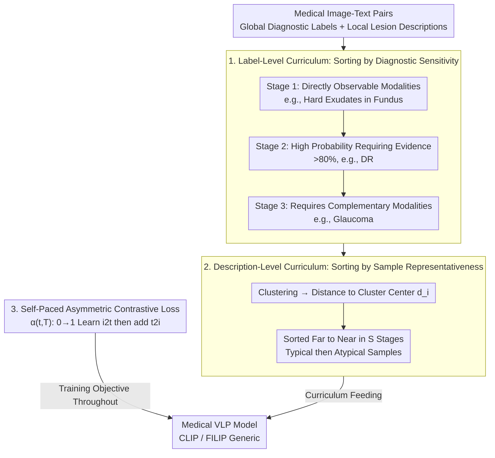

# MedKCO: Medical Vision-Language Pretraining via Knowledge-Driven Cognitive Orchestration

**Conference**: CVPR 2026  
**arXiv**: [2603.09101](https://arxiv.org/abs/2603.09101)  
**Code**: [Available](https://github.com/Mr-Talon/Mr-Talon/MedKCO)  
**Area**: Medical Imaging  
**Keywords**: Vision-Language Pretraining, Curriculum Learning, Contrastive Learning, Cognitive Orchestration, Medical Imaging

## TL;DR

MedKCO is proposed as a knowledge-driven cognitive orchestration strategy for medical vision-language pretraining. By utilizing a hierarchical curriculum (label-level sorting by diagnostic sensitivity and description-level sorting by sample representativeness) along with a self-paced asymmetric contrastive loss, the model learns progressively from simple to complex concepts. It significantly outperforms baselines in zero-shot and downstream tasks across three medical modalities.

## Background & Motivation

Medical vision-language pretraining (VLP, such as medical variants of CLIP like MedCLIP, FLAIR, KeepFIT, etc.) aims to align medical images with textual descriptions but faces unique challenges: (1) Diagnostic difficulty varies significantly across diseases—"hard exudates" are directly visible on fundus images, while "glaucoma" requires deeper domain knowledge; (2) Sample representativeness varies within the same disease—typical samples have clear features, while atypical samples are obscured by individual variations and comorbidities; (3) Medical images exhibit extremely high inter-class similarity (images of different diseases look very similar), whereas textual descriptions clearly distinguish them.

Existing methods mix data of all difficulty levels randomly during training, forcing the model to learn simple and complex concepts simultaneously before establishing basic foundations. This contradicts the progressive nature of human cognition. Inspired by the "Zone of Proximal Development" theory, this paper designs a pretraining orchestration that proceeds from easy to difficult.

## Method

### Overall Architecture

MedKCO is a model-agnostic pretraining strategy applicable to any medical VLP framework (validated on CLIP and FILIP in the paper). It improves pretraining from two dimensions: (1) **Data Sequence**—designing a hierarchical curriculum to control the order of data presentation from simple to complex; (2) **Loss Function**—designing a self-paced asymmetric contrastive loss to progressively adjust the difficulty of contrastive learning. The data sequence consists of two levels: label-level curriculum (global diagnostic labels) to establish overall diagnostic capability, followed by description-level curriculum (detailed descriptions of local lesions) to refine local representations. The self-paced asymmetric contrastive loss serves as the training objective throughout.

### Key Designs

**1. Label-Level Curriculum: Ordering Diseases by Diagnostic Sensitivity**

The visibility of different diseases within the same modality varies greatly—hard exudates are immediately apparent in fundus images, while glaucoma requires domain knowledge or even other modalities for confirmation. Mixing them randomly forces the model to tackle the hardest problems before basic concepts are formed. MedKCO categorizes label-level data into three increasing stages based on modality-specific diagnostic sensitivity: Stage 1 includes structural features directly observable (e.g., hard exudates in CFP); Stage 2 targets high-probability diagnoses requiring multiple pieces of evidence and expert interpretation (>80%, e.g., Diabetic Retinopathy in CFP); Stage 3 involves diseases where the current modality cannot provide definitive evidence and requires complementary modalities for reliable identification (e.g., Glaucoma in CFP). Difficulty levels are defined via collaboration between doctors and LLMs, then reviewed by senior physicians to ensure the curriculum reflects domain knowledge rather than model speculation.

**2. Description-Level Curriculum: Learning Typical then Atypical Samples**

After acquiring global diagnostic capabilities, the model must learn local lesion representations, though sample representativeness varies. The core hypothesis is that samples further from the class center are less influenced by individual variation and comorbidities, thus exhibiting more typical disease features. Specifically, a pretrained model extracts image features $r_i^v$ and text features $r_i^t$. Clustering is performed via text-label similarity $c = \arg\max(r_i^t \boldsymbol{l}^T)$, and the normalized distance of each sample to its cluster center is calculated as $d_i = \|r_i^v - u_c\|_2 / d_{\max}$. Samples are divided into $S$ stages from largest to smallest distance—representative samples with clear features are fed first, followed by atypical samples with blurred features near the center. This "far is typical" sorting is counter-intuitive but reasonable in the medical domain.

**3. Self-Paced Asymmetric Contrastive Loss: Learning Identifiable Directions Early**

Standard symmetric contrastive loss $\mathcal{L}_i = \frac{1}{2}(\mathcal{L}_i^{i2t} + \mathcal{L}_i^{t2i})$ often fails on medical images because early in pretraining, the vision encoder maps different diseases to similar representations (high inter-class similarity), making the text-to-image direction extremely noisy. MedKCO modifies the loss to $\mathcal{L}_i = \frac{1}{2}(\mathcal{L}_i^{i2t} + \alpha(t,T)\mathcal{L}_i^{t2i})$, where $\alpha(t,T)$ grows linearly from 0 to 1 as training progresses. This allows the model to learn the easier image-to-text alignment (where text embeddings are dispersed and discriminable) early on, before gradually introducing the harder text-to-image alignment. This directly incorporates the "visually compact, textually dispersed" asymmetry into the training curve.

### Loss & Training

- Vision-language contrastive loss controlled by temperature parameter $\sigma$.
- Self-paced asymmetric weight: $\alpha(t,T)$ defaults to linear scheduling (cosine and exponential were also tested).
- Projection head dimensions: 512 for CLIP, 256 for FILIP.
- Maximum text token length: 256.
- Warm-up cosine scheduler (first epoch).
- Number of description-level curriculum stages $S=2$.
- Trained on a single RTX A6000.

## Key Experimental Results

### Main Results

| Dataset | Metric | MedKCO (CLIP) | CLIP Baseline | Gain |
|--------|------|--------------|---------|------|
| ODIR200×3 (CFP, OOD) | ACC | **0.863** | 0.772 | +9.1% |
| REFUGE (CFP) | ACC | **0.947** | 0.897 | +5.0% |
| FIVES (CFP) | AUC | **0.729** | 0.676 | +5.3% |
| OCTID (OCT) | ACC | **0.778** | 0.709 | +6.9% |
| OCTDL (OCT, OOD) | ACC | **0.388** | 0.306 | +8.2% |
| CheXpert5×200 (CXR) | ACC | **0.526** | 0.384 | +14.2% |
| COVIDx (CXR, OOD) | ACC | **0.564** | 0.463 | +10.1% |
| **9 Dataset Avg** | — | **0.693** | 0.616 | +7.7% |

| Task | Framework | MedKCO | Best CL Baseline | Gain |
|------|---------|--------|-----------|------|
| Zero-shot Classification (CLIP) | AVG | 0.693 | 0.600 (CL-log) | +9.3% |
| Zero-shot Classification (FILIP) | AVG | 0.640 | 0.552 (CL-log) | +8.8% |
| Report Generation (CLIP) | AVG | **0.198** | 0.188 (CLIP) | +5.3% |
| Image-Text Retrieval (CLIP) | AVG R@10 | **11.9** | 10.2 (CL-log) | +16.7% |

### Ablation Study

| Configuration | Key Metric (AVG ACC) | Description |
|------|-------------------|------|
| Full MedKCO | 0.693 | Optimal performance |
| W/O Label-level curriculum | Decrease | Loss of diagnostic sensitivity orchestration |
| W/O Description-level curriculum | Decrease | Loss of sample representativeness sorting |
| Symmetric loss (fixed $\alpha=1$) | Decrease | Noise interference from early t2i |
| Linear vs Cosine vs Exp | Linear optimal | Simple linear scheduling is effective |
| Stages S=1/2/3/4 | S=2 optimal | Performance drops if too few or too many |

### Key Findings

- MedKCO achieves the best results across all OOD datasets, proving that cognitive orchestration significantly enhances robustness under distribution shifts.
- Existing curriculum learning methods (CL-log, CL-logit) adjust difficulty based on model feedback, which is unstable in medical VLP; MedKCO relies on external domain knowledge, making it more reliable.
- t-SNE visualizations show that as the curriculum progresses, MedKCO’s feature space becomes increasingly structured and separable.
- Report generation experiments demonstrate that MedKCO not only improves zero-shot capability but also provides better initialization weights for downstream transfer.

## Highlights & Insights

- **Cognitive Science × Medical AI**: A novel application of the "Zone of Proximal Development" theory—defining learning difficulty using domain knowledge rather than model feedback.
- **Insight into Asymmetric Contrastive Loss**: Identifies the "visually compact, textually dispersed" asymmetry of medical images and addresses it with a simple progressive weighting scheme.
- **Model Agnostic**: As a pretraining strategy, it can be seamlessly applied to different frameworks such as CLIP and FILIP.
- **Sample Representativeness Metric**: The "far from center = more typical" assumption is counter-intuitive yet reasonable in the medical field, where typical cases possess prominent features located at the periphery of the feature space.

## Limitations & Future Work

- The three-stage division of diagnostic sensitivity requires the involvement of domain experts, making it difficult to fully automate.
- Description-level curriculum depends on the quality of pretrained model features; poor initial features affect clustering and distance calculations.
- Validated only on three modalities (CFP, OCT, CXR), excluding CT, MRI, pathology, etc.
- While linear scheduling is effective, it may not be optimal for all scenarios.
- The number of curriculum stages $S$ requires manual tuning based on dataset characteristics.

## Related Work & Insights

- Srinivasan et al. organize curricula by text granularity (object → instance), and Chen et al. by visual task difficulty—both are related but do not consider the difficulty structure unique to medicine.
- Difference from medical VLPs like KeepFIT and FLAIR: Focuses on "how to organize the training process" rather than "how to design the model architecture."
- Insight: The presentation order of pretraining data is itself an optimizable hyperparameter, especially in the medical domain where data heterogeneity is strong.

## Rating

- Novelty: ⭐⭐⭐⭐ Unique combination of cognitive orchestration and asymmetric contrastive loss.
- Experimental Thoroughness: ⭐⭐⭐⭐ Extensive comparison across 3 modalities, 9 datasets, and multiple tasks (zero-shot, retrieval, generation).
- Writing Quality: ⭐⭐⭐⭐ Clear motivation diagrams and complete algorithm pseudocode.
- Value: ⭐⭐⭐⭐ Model-agnostic strategy with broad applicability to the medical VLP community.

<!-- RELATED:START -->

## Related Papers

- [\[CVPR 2026\] From Panel to Pixel: Zoom-In Vision-Language Pretraining from Biomedical Scientific Literature](from_panel_to_pixel_zoom-in_vision-language_pretraining_from_biomedical_scientif.md)
- [\[CVPR 2026\] KAMP: Knowledge-Anchored Multimodal Pretraining Framework for Medical Image Representation](kamp_knowledge-anchored_multimodal_pretraining_framework_for_medical_image_repre.md)
- [\[CVPR 2026\] Modeling the Brain's Grammar: ROI-Guided fMRI Pretraining for Transferable and Interpretable Vision Decoding](modeling_the_brains_grammar_roi-guided_fmri_pretraining_for_transferable_and_int.md)
- [\[CVPR 2026\] Simple-ViLMedSAM: Simple Text Prompts Meet Vision-Language Models for Medical Image Segmentation](simple-vilmedsam_simple_text_prompts_meet_vision-language_models_for_medical_ima.md)
- [\[ICCV 2025\] Vector Contrastive Learning for Pixel-wise Pretraining in Medical Vision](../../ICCV2025/medical_imaging/vector_contrastive_learning_for_pixel-wise_pretraining_in_medical_vision.md)

<!-- RELATED:END -->
