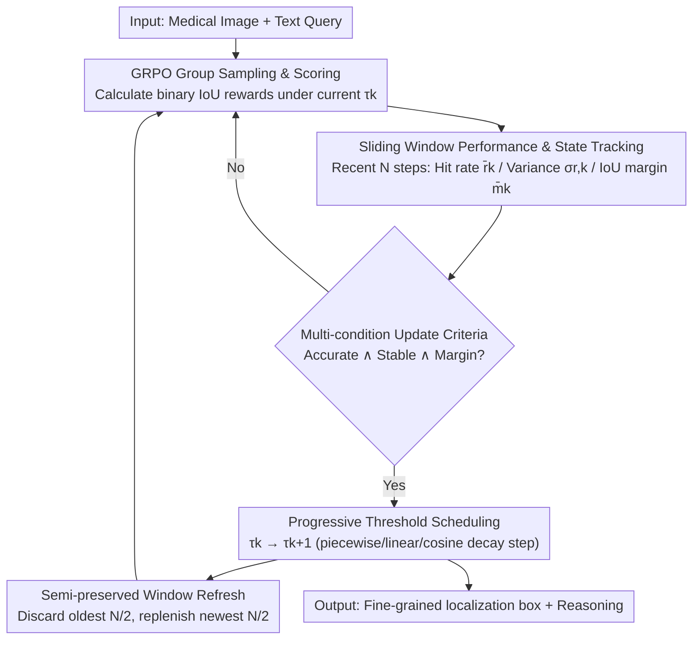

# MedLoc-R1: Performance-Aware Curriculum Reward Scheduling for GRPO-Based Medical Visual Grounding

**Conference**: CVPR 2026  
**Paper**: [CVF Open Access](https://openaccess.thecvf.com/content/CVPR2026/html/Yang_MedLoc-R1_Performance-Aware_Curriculum_Reward_Scheduling_for_GRPO-Based_Medical_Visual_Grounding_CVPR_2026_paper.html)  
**Code**: https://github.com/MembrAI/MedLoc-R1  
**Area**: Medical Imaging / Reinforcement Learning / Visual Grounding  
**Keywords**: Medical visual grounding, GRPO, reward sparsity, curriculum learning, IoU threshold scheduling

## TL;DR
Addressing the sparse reward challenge when applying GRPO directly to medical visual grounding—where "fixed IoU threshold rewards $\rightarrow$ early all-zero rewards $\rightarrow$ gradient vanishing"—this paper proposes MedLoc-R1. It utilizes a sliding window performance tracker and multi-condition update criteria to progressively tighten the IoU reward threshold from loose (dense rewards) to strict (fine-grained alignment) based on model capability, stably improving accuracy and training stability across three medical grounding benchmarks without adding auxiliary networks.

## Background & Motivation
**Background**: Medical visual grounding (bounding box localization of lesions based on textual descriptions in medical images) is foundational for fine-grained multimodal reasoning and interpretable clinical decision-making. Recent works (Visual-RFT, VLM-R1, Med-R1, etc.) have migrated RL post-training methods like GRPO—which do not require a value network—to visual grounding, using binary rewards based on "whether the IoU between the predicted and ground-truth boxes exceeds a fixed threshold $\tau$" to fine-tune Large Vision-Language Models (LVLMs).

**Limitations of Prior Work**: Medical images differ significantly from natural images, characterized by low signal-to-noise ratios, blurred boundaries, small lesions, and extreme class imbalance. Under these conditions, it is nearly impossible for a model to predict boxes with $\text{IoU} \ge 0.5$ at the start, resulting in **zero rewards for all candidates** in a sample group. GRPO estimates the advantage $A_i$ based on relative differences within a group; when rewards are all zero, both mean and variance collapse to zero, the advantage becomes constant zero, and policy gradients vanish. This "stalling" of training is a classic sparse reward problem in RL.

**Key Challenge**: There is a fundamental mismatch between fixed thresholds and the dynamic nature of policy learning. Strict early thresholds lead to reward sparsity and gradient vanishing, while persistently loose thresholds fail to enforce fine-grained localization. Traditional curriculum learning, which relies on "sample reordering or progressive data exposure," is inapplicable here because task difficulty is determined by **reward design** rather than the input distribution.

**Goal**: To construct a "progressive and performance-aware" reward curriculum where the threshold is not blindly raised according to a preset schedule (e.g., V-Triune, which follows training percentage), but rather when the model is "ready."

**Key Insight**: Apply the "easy-to-hard" principle of curriculum learning to reward shaping, where the reward threshold acts as a difficulty knob. The threshold can be safely increased as long as the model's performance under the current difficulty is quantified as stable, sufficiently high, and possessing surplus capability.

**Core Idea**: Utilize a sliding window to continuously track three statistics: recent hit rate, reward variance, and IoU margin. A composite criterion—requiring the model to be "accurate, stable, and having surplus capability"—triggers the IoU threshold increase. This enables a smooth transition from "dense rewards-coarse localization" to "sparse rewards-fine alignment" without auxiliary networks or extra gradient paths.

## Method

### Overall Architecture
MedLoc-R1 wraps a "self-adaptive threshold curriculum" around the standard GRPO training loop. Given a medical image $I$ and text query $q$, the model $\pi_\theta$ outputs the reasoning process and a bounding box $\hat b \in \mathbb{R}^4$. The reward remains a binary signal based on whether the IoU exceeds the current threshold $\tau_k$. Critically, $\tau_k$ is no longer fixed: at each step, statistics from the recent $N$ steps are used to evaluate model performance. Once the conditions for high average reward, stability, and sufficient IoU margin are met simultaneously, the threshold is raised; otherwise, the current difficulty is maintained. This scheduling acts only on a single scalar (the threshold), leaving the GRPO policy update path unchanged and incurring zero extra parameters or computational overhead.

### Key Designs

**1. Sliding Window Performance and State Tracking: Characterizing Model Progress via Three Interpretable Statistics**

Single-step rewards are insufficient to judge whether to increase difficulty, as they may be influenced by chance or sample difficulty. MedLoc-R1 maintains a sliding window $W_k$ of length $N$ at each step $k$, collecting IoU values and rewards for $G$ candidates across the last $N$ steps to derive three indicators. First, the **window mean reward** $\bar r_k$, which equals the recent hit rate given binary rewards: $\bar r_k = \frac{1}{N} \sum_{t \in W_k} \frac{1}{G} \sum_{i=1}^{G} \mathbb{I}[\mathrm{IoU}(\hat b_i^{(t)}, b^{*(t)}) \ge \tau_k]$. A high $\bar r_k$ suggests the current difficulty is no longer challenging. Second, the **reward standard deviation** $\sigma_{r, k}$ characterizes consistency; a large $\sigma_{r, k}$ implies erratic performance, where a difficulty increase might be misguided by accidental reward spikes. Third, the **IoU margin** $\bar m_k = \frac{1}{N} \sum_{t \in W_k} \frac{1}{G} \sum_i \mathrm{IoU}(\hat b_i^{(t)}, b^{*(t)}) - \tau_k$ measures how much the average IoU exceeds the threshold. This provides more granularity than binary rewards, distinguishing between "marginal passing" and "surplus capability," thus preventing the model from stagnating at the threshold boundary. Together, these provide an interpretable criterion: "Accurate ($\bar r_k$), stable ($\sigma_{r, k}$), and having margin ($\bar m_k$)."

**2. Multi-condition Curriculum Update Criteria and Progressive Threshold Scheduling**

The composite update condition is defined as $\mathcal{C}_k := (\bar r_k \ge P_{\tau_k}) \wedge (\sigma_{r, k} \le S_{\tau_k}) \wedge (\bar m_k \ge \Delta)$. A stage is considered "converged" only when the mean reward is above $P_{\tau_k}$, variance is below $S_{\tau_k}$, and the IoU margin is at least $\Delta$. These thresholds are themselves adaptive: as the difficulty $\tau_k$ increases, $P_{\tau_k}$ is relaxed to allow progress under stricter settings, and $S_{\tau_k}$ is gradually expanded to tolerate higher variance, while $\Delta$ (e.g., 0.10) remains constant to ensure a stable margin. Upon meeting $\mathcal{C}_k$, the threshold is updated via $\tau_{k+1} = \min(\tau_k + \delta(\tau_k), \tau_{\text{target}})$. The step size $\delta(\tau_k)$ can follow three forms: **piecewise decay** (larger steps early, smaller steps late), or **linear** and **cosine decay** which require only one initial parameter $\delta_0$. All three strategies facilitate rapid early progress and fine-grained late refinement, with linear/cosine showing competitive results with significantly less tuning. This "performance-aware" approach fundamentally differs from fixed schedules like V-Triune, avoiding instability caused by premature difficulty increases.

**3. Semi-preserved Window Refresh: Updating Statistics Without Complete Loss of History**

When the threshold changes, reward distributions sampled under the old threshold might "pollute" the judgment for the new stage. MedLoc-R1 employs a **semi-preserved refresh**: discarding the oldest half of samples in $W_k$ and replenishing them with new data sampled under the new threshold to form $W_{k+1}$. This allows for rapid adaptation to the new reward distribution while retaining enough historical information to remain robust against instantaneous fluctuations. Experiments show that this semi-preserved approach is more stable across continuous multi-stage scheduling than "full replacement" or "quarter replacement." Importantly, this refresh only affects statistical calculation and does not disrupt the policy update path, ensuring training continuity.

### Loss & Training
The underlying optimization follows standard GRPO: within-group normalized advantage $A_i = \frac{r_i - \mathrm{mean}(\mathbf{r})}{\mathrm{std}(\mathbf{r})}$, with a clipped PPO objective and KL regularization: $$\mathcal{J}_{\mathrm{GRPO}}(\theta) = \frac{1}{G} \sum_i \min[\rho_i A_i, \mathrm{clip}(\rho_i, 1-\epsilon, 1+\epsilon) A_i] - \beta \mathrm{KL}[\pi_\theta \| \pi_{\text{ref}}]$$. Implementation is based on Qwen2.5-VL (3B primary, also 7B/32B), with group size $G=8$, temperature 0.9, $\beta=0.4$, AdamW optimizer, and 1e-6 learning rate on 4 $\times$ H800. Piecewise decay defaults to $\tau_0=0.3 \to \tau_{\text{target}}=0.8$, with steps $\delta^{(1)}=0.15, \delta^{(2)}=0.10, \delta^{(3)}=0.05$. Sliding window length $N=30$.

## Key Experimental Results

### Main Results
Evaluated on three medical grounding benchmarks: HAM10000 (Dermoscopy), HEEL (X-ray), and TN3K (Ultrasound). Metrics include A@0.5 / A@0.8 (accuracy at specified IoU thresholds) and pseudo-mAP (mean accuracy across 10 thresholds from 0.5 to 0.95).

| Dataset | Metric | MedLoc-R1-3B | SFT-3B | VLM-R1-3B (Fixed) | V-Triune-3B | Raw-IoU-3B |
|--------|------|------|------|------|------|------|
| HAM10000 | A@0.5 | **94.46** | 90.31 | 64.65 | 88.92 | 92.86 |
| HAM10000 | A@0.8 | **76.02** | 74.22 | 18.57 | 64.35 | 69.25 |
| HEEL | A@0.8 | **47.35** | 45.18 | 4.17 | 25.05 | 11.49 |
| HEEL | mAP | **59.01** | 56.25 | 21.41 | 38.61 | 35.29 |
| TN3K | A@0.5 | **66.18** | 62.39 | 43.01 | 43.50 | 57.17 |
| TN3K | mAP | **37.96** | 36.11 | 20.78 | 21.85 | 29.28 |

Improvements are particularly significant at stricter thresholds (A@0.8): compared to the fixed-threshold VLM-R1, HEEL A@0.8 increases by +43.18; compared to V-Triune, TN3K mAP increases by +16.11. The method scales effectively, with 7B and 32B models showing further gains (e.g., HEEL A@0.8: 3B 47.35 $\rightarrow$ 7B 57.83 $\rightarrow$ 32B 57.96).

### Ablation Study
Conducted on HAM10000, reporting A@0.5.

| Configuration | A@0.5 | Description |
|------|-------|------|
| Full (All three conditions) | **94.96** | Full update criteria |
| w/o Reward check ($\bar r_k \ge P_{\tau_k}$) | 82.33 | Largest drop (-12.63) |
| w/o IoU margin check ($\bar m_k \ge \Delta$) | 90.86 | ~4 point drop |
| w/o Stability check ($\sigma_{r, k} \le S_{\tau_k}$) | 89.72 | ~5 point drop |
| Only Reward Check | 88.32 | Single condition inferior to multi-condition |

Scheduling strategy ablation (A@0.5): Adaptive (dynamic $\delta_k, P_k, S_k$) 94.96 > Fixed-Conservative 87.92 > Fixed-Moderate 83.92 > Fixed-Aggressive 71.54. Aggressive fixed schedules result in a drop of over 20 points.

### Key Findings
- **Reward check is most critical**: Removing it leads to premature difficulty increases under noisy signals, dropping A@0.5 by 12.63. Margin and stability checks filter out uncertain or highly volatile learning phases.
- **"Performance-aware" outperforms "Progress-aware"**: Any fixed or aggressive preset schedule lags significantly behind the adaptive schedule, confirming that aligning thresholds with model readiness is key to stabilizing GRPO.
- **Simple decay is sufficient**: Linear/cosine decays require only one $\delta_0$ and perform similarly to the multi-parameter piecewise decay, indicating the method is robust to step-size tuning.
- **Interpretability byproduct**: Qualitative comparisons show MedLoc-R1 reasoning captures diagnostic clues (e.g., "calcaneal feature curvature," "nodule echo"), whereas fixed-threshold baselines often provide verbose descriptions lacking diagnostic evidence.

## Highlights & Insights
- **Shifting Curriculum Learning from "Data" to "Rewards"**: Unlike traditional reordering of samples, this work identifies the reward threshold as the effective difficulty knob. This simplifies the approach and explains why progress-based schedules (like V-Triune) fail when difficulty is not aligned with performance.
- **Zero Extra Parameters/Gradient Paths**: The mechanism acts on a scalar threshold and window statistics without modifying the GRPO core, making it easily integrable into existing pipelines with negligible overhead.
- **Interpretable and Controllable Criteria**: The "Accurate/Stable/Margin" criteria correspond to hit rate, variance, and IoU margin—intuitive metrics that facilitate training state diagnosis and cross-task reuse.

## Limitations & Future Work
- **Threshold Hyperparameters**: $P_{\tau_k}$, $S_{\tau_k}$, $\Delta$, and step sizes still require initial settings or predefined decay forms, particularly for the piecewise strategy.
- **Binary vs. Continuous Rewards**: While the timing of the threshold increase is optimized, the reward within a stage remains binary. Combining threshold curricula with continuous signals (e.g., Raw-IoU) is a potential research direction.
- **Metrics Constraints**: The model outputs boxes without confidence scores, precluding standard AP; the pseudo-mAP used here requires cautious comparison across different works.

## Related Work & Insights
- **vs. VLM-R1 (Fixed Threshold GRPO)**: VLM-R1 uses a static $\tau_{\text{fixed}}=0.5$, causing early sparse rewards/gradient vanishing and late-stage performance caps. MedLoc-R1 improves HEEL A@0.8 by +43.18 through adaptive sliding thresholds.
- **vs. V-Triune (Progress-based Schedule)**: V-Triune uses preset thresholds for early/mid/late stages but ignores whether the model has actually learned. MedLoc-R1's composite criteria prevent premature difficulty spikes, outperforming it on TN3K mAP by +16.11.
- **vs. Raw-IoU (Continuous Rewards)**: Raw-IoU uses continuous IoU as rewards but suffers from low contrast in early predictions. MedLoc-R1's "gradually tightening discrete boundaries" creates stronger contrast for GRPO updates.

## Rating
- Novelty: ⭐⭐⭐⭐ Repurposing curriculum learning for reward threshold scheduling with composite criteria is clever and effective.
- Experimental Thoroughness: ⭐⭐⭐⭐ Solid results across three modalities, three seeds with significance tests, and extensive ablations.
- Writing Quality: ⭐⭐⭐⭐ Clear problem formulation regarding reward sparsity and straightforward motivation.
- Value: ⭐⭐⭐⭐ A plug-and-play, zero-overhead solution for stabilize GRPO in medical tasks; highly practical.

<!-- RELATED:START -->

## Related Papers

- [\[CVPR 2026\] MedTVT-R1: A Multimodal LLM Empowering Medical Reasoning and Diagnosis](medtvt-r1_a_multimodal_llm_empowering_medical_reasoning_and_diagnosis.md)
- [\[CVPR 2026\] Better than Average: Spatially-Aware Aggregation of Segmentation Uncertainty Improves Downstream Performance](better_than_average_spatially-aware_aggregation_of_segmentation_uncertainty_impr.md)
- [\[CVPR 2026\] MedMO: Grounding and Understanding Multimodal Large Language Model for Medical Images](medmo_grounding_and_understanding_multimodal_large_language_model_for_medical_im.md)
- [\[CVPR 2026\] MR-RAG: Multimodal Relevance-Aware Retrieval-Augmented Generation for Medical Visual Question Answering](mr-rag_multimodal_relevance-aware_retrieval-augmented_generation_for_medical_vis.md)
- [\[CVPR 2026\] CURE: Curriculum-guided Multi-task Training for Reliable Anatomy Grounded Report Generation](cure_curriculum-guided_multi-task_training_for_reliable_anatomy_grounded_report_.md)

<!-- RELATED:END -->
