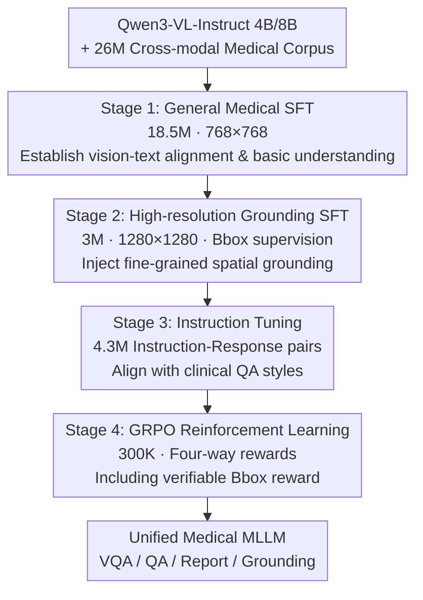

# MedMO: Grounding and Understanding Multimodal Large Language Model for Medical Images

**Conference**: CVPR 2026  
**Paper**: [CVF Open Access](https://openaccess.thecvf.com/content/CVPR2026/html/Deria_MedMO_Grounding_and_Understanding_Multimodal_Large_Language_Model_for_Medical_CVPR_2026_paper.html)  
**Code**: https://github.com/genmilab/MedMO (Available)  
**Area**: Medical Imaging / Multimodal VLM  
**Keywords**: Medical Multimodal Large Language Models, Visual Grounding, Multi-stage Post-training, Bounding Box Reward, Verifiable Reward Reinforcement Learning

## TL;DR
MedMO utilizes Qwen3-VL as its base model and undergoes a four-stage post-training process using 26M+ cross-modal medical data: "General Medical SFT → High-resolution Grounding SFT → Instruction Tuning → GRPO Reinforcement Learning with Bounding Box Rewards." This approach unifies medical image understanding (VQA / QA / Report Generation) and fine-grained spatial localization (Bbox grounding) into an open-source VLM, outperforming existing open-source medical MLLMs across multiple clinical tasks.

## Background & Motivation
**Background**: General Multimodal Large Language Models (MLLMs) have reached near-human levels in image description, VQA, and multimodal reasoning. However, their application in the medical field is limited as medical imaging requires specialized domain interpretation and robust grounding of clinical text knowledge. General-purpose models often produce uncertain or hallucinated outputs. Existing works such as LLaVA-Med, HuatuoGPT-Vision, GMAI-VL, Lingshu, and Fleming-VL have advanced along the "domain data + post-training" trajectory.

**Limitations of Prior Work**: The authors identify three persistent issues: ① Most medical MLLMs rely on data distilled from closed-source proprietary models, which is large-scale but lacks accurate domain grounding, especially in fine-grained clinical reasoning; ② Distillation pipelines often use only generative outputs and lack structural supervision, amplifying hallucinations and inconsistencies; ③ Existing models mostly focus on single tasks or narrow modal subsets (e.g., only radiology or only pathology), lacking unified generalization across modalities.

**Key Challenge**: Medical scenarios require both "understanding" (comprehension / reasoning / reporting) and "accurate pointing" (localizing lesions or cells with bounding boxes at the pixel level). Existing methods often sacrifice grounding for cross-modal coverage or vice versa, making it difficult to excel at both within a single model.

**Goal**: To develop an **open-source, cross-modal medical MLLM capable of both understanding and spatial grounding**, accompanied by reproducible data and training recipes.

**Key Insight**: Instead of relying on closed-source distilled data, the authors construct a large-scale, multimodal corpus with structured supervision (especially bbox annotations). They utilize progressive multi-stage post-training to sequentially inject capabilities for "alignment → grounding → instruction following → reinforcement." During the RL stage, a **verifiable, spatially grounded bounding box reward** is introduced to directly optimize localization.

**Core Idea**: Unify cross-modal alignment, fine-grained grounding, and clinical instruction following through four-stage progressive post-training, explicitly incorporating "accurate pointing" into RL objectives using a verifiable Bbox reward composed of GIoU + L1.

## Method

### Overall Architecture
MedMO starts from Qwen3-VL-Instruct (4B / 8B). Its architecture includes a visual encoder $E_v$, a vision-language adapter $A$ that fuses multi-layer ViT features using DeepStack to project them into the language space, and a language decoder $D$. The post-training is divided into four serial stages, with resolution and data scale evolving progressively: first, **General Medical SFT** using 18.5M large-scale instruction data to establish basic understanding (768×768); second, **High-resolution Grounding SFT** using 3M expert-annotated data with bboxes to inject spatial grounding (1280×1280); third, **Instruction Tuning** with 4.3M instruction-response pairs to align with clinical QA styles; and finally, **GRPO Reinforcement Learning with four-way rewards** using 300K samples, where localization is reinforced by verifiable bounding box rewards. The SFT stages consistently use the next-token prediction objective $L_{\text{SFT}}=-\sum_{i=1}^m\log p_\theta(y_i\mid v,x,y_{<i})$.

### Key Designs

**1. Four-stage Progressive Post-training: Layered Injection of "Alignment → Grounding → Instruction → Reinforcement"**

To address the pain point that "existing models either lack grounding or cross-modal coverage," MedMO stacks capabilities progressively across four stages, each with clear objectives, data scales, and resolutions. Stage 1 utilizes the public MedTrinity dataset (18.5M, including image captions $D_{\text{caption}}$, medical VQA $D_{\text{vqa}}$, and general multimodal $D_{\text{general-mm}}$; total $D_{\text{stage1}}=D_{\text{caption}}\cup D_{\text{vqa}}\cup D_{\text{general-mm}}$) to establish cross-modal global alignment. Stage 2 shifts to high-quality expert-annotated data with bboxes $D_{\text{hq}}$ (chest X-rays, wrist X-rays, cell microscopy, CT), expanding the visual encoder to predict local features and box coordinates, introducing localization while maintaining global alignment. Stage 3 uses 4.3M instruction data covering descriptions, diagnostic QA, report summarization, and retrieval reasoning to improve task generalization and factual consistency. Stage 4 introduces RL. This layered injection from "coarse to fine" and "understanding to grounding to instruction following" allows a single model to possess both understanding and localization capabilities without compromise.

**2. GRPO Reinforcement Learning + Four-way Rewards: Integrating Clinical Preferences and Grounding into Policy Optimization**

Stage 4 uses GRPO for preference learning: for every input $(v, x)$, $G$ responses are sampled from the old policy. Optimization is performed based on normalized advantages $\hat{A}_{i,t}=\frac{R_i-\text{mean}(\{R_i\})}{\text{std}(\{R_i\})}$, alongside clip-higher and token-level losses (referencing DAPO) to optimize the importance ratio $r_{i,t}(\theta)=\frac{\pi_\theta(o_{i,t}|q,o_{i,<t})}{\pi_{\theta_{\text{old}}}(o_{i,t}|q,o_{i,<t})}$, with a KL term $L_{\text{KL}}=\mathbb{E}[D_{\text{KL}}(\pi_\theta\|\pi_{\text{ref}})]$ to constrain deviation from the reference model. The reward is a combination of four components: label accuracy, bounding box reward, tag count, and soft-overlong punishment. The former ensures correct answers, while the latter two constrain output format and length. The bounding box reward is the verifiable, spatially grounded signal emphasized in this work to directly optimize localization.

**3. Verifiable Bounding Box Reward: Converting "Accurate Pointing" into an Optimizable Scalar via GIoU + L1 + Hungarian Matching**

Addressing the issue where generative outputs lack structural supervision leading to inaccurate localization, the authors designed a verifiable Bbox reward to directly optimize grounding quality. Given a set of ground truth boxes $G=\{g_j\}$ and predicted boxes $P=\{p_i\}$ (XYXY format), a resolution-independent normalized L1 is first calculated: $L1_{ij}=\frac{|x_1^p-x_1^g|+|y_1^p-y_1^g|+|x_2^p-x_2^g|+|y_2^p-y_2^g|}{2\sqrt{H^2+W^2}}$ (normalized by the image diagonal to remain resolution-invariant). Hungarian matching is then applied to find a one-to-one assignment $M$ based on the cost $C_{ij}=w_{L1}^m L1_{ij}+w_G^m(1-\text{GIoU}_{ij})$ ($w_{L1}^m=5, w_G^m=2$). For each matched pair, a pairwise quality is defined as $s_{ij}=\frac{w_{L1}(1-\text{clip}_{[0,1]}(L1_{ij}))+w_G(\frac{\text{GIoU}_{ij}+1}{2})}{w_{L1}+w_G}$ ($w_{L1}=5, w_G=2$). The total reward is the coverage-normalized sum minus penalties for missed detections (FN) and false alarms (FP): $B=\frac{1}{G}\sum_{(i,j)\in M}s_{ij}$, $\text{Pen}=\frac{\lambda_{\text{FN}}(G-|M|)+\lambda_{\text{FP}}(P-|M|)}{\max(1,G)}$, resulting in $R_{\text{bbox}}=\text{clip}_{[0,1]}(B-\text{Pen})^2$. ⚠️ Some coefficients and formulas are derived from dense OCR tasks; refer to the original text for exact details. This reward incentivizes accurate placement (GIoU + L1) while penalizing incorrect counts (FP/FN), converting spatial localization into a verifiable, tunable scalar signal.

### Loss & Training
The SFT stage uses the standard next-token prediction loss $L_{\text{SFT}}$; the RL stage utilizes the GRPO objective $J(\theta)$ with KL constraints. Training was conducted on 64× AMD Instinct MI210 (64GB) for 25 days, with the four stages taking approximately 225h / 155h / 110h / 98h respectively. The framework is based on TRL. Stage 1: BS=10, LR=1e-5, cosine scheduler, grad accum=2; Stage 2: BS=2, LR=8e-6, cosine scheduler, grad accum=8; Stage 3: BS=10, LR=5e-6, grad accum=2. The data comprises 45 datasets with 26M+ samples covering modalities including radiology, pathology, ophthalmology, dermatology, and surgery. A custom Cell benchmark (derived from DeepCell, Bacteria, etc.) was established to evaluate detection capabilities.

## Key Experimental Results

### Main Results
On medical VQA and text QA benchmarks, MedMO-8B achieves the best open-source performance, approaching the specialized medical SOTA Fleming-VL:

| Model | VQA Avg | Text QA Avg | MMMU-Med | VQA-RAD | MedQA |
|------|----------|--------------|----------|---------|-------|
| Fleming-VL-8B | **61.4** | 45.7 | 63.3 | 56.4 | 53.7 |
| Qwen3VL-8B (Base) | 39.5 | 53.6 | 61.4 | 31.2 | 66.1 |
| MedMO-4B | 45.3 | 55.1 | 54.6 | 35.0 | 78.5 |
| MedMO-8B | 60.8 | **61.3** | **64.6** | **64.7** | **84.3** |

The VQA average of MedMO-8B (60.8) is only 0.6 points behind the medical SOTA Fleming-VL (61.4), while achieving the best results on MMMU-Med and VQA-RAD. The Text QA average of 61.3 surpasses Qwen3VL-8B (53.6) by approximately 7.7 points, with particularly significant gains on reasoning-intensive benchmarks like MMLU-Med, MedQA, and MedMCQA.

### Ablation Study (Report Generation and Grounding)
Gains of MedMO relative to the base model and baselines across different tasks (summarized from Figure 1 and Table 2):

| Task / Benchmark | Metric | Gain | Description |
|-------------|------|------|------|
| Bacteria (Cell Seg) | IoU | +43.8 | Largest jump due to high-res microscopy + fine-grained grounding supervision |
| MIMIC-CXR (Report Gen) | CIDEr | 140.0 | Surpasses Fleming-VL-8B (132.5) |
| MIMIC-CXR | ROUGE-L | 31.7% | Strong semantic metrics; ⚠️ Fleming-VL is higher at 35.7% |
| VQA-RAD | Acc | +8.3 | Relative to base model |
| MedQA | Acc | +18.2 | Relative to base; largest gain in text reasoning |

### Key Findings
- **Grounding capability shows the most significant improvement**: IoU on Bacteria surged by +43.8 (relative to base +40.4, relative to Fleming-VL +37.0), primarily due to stage 2 high-resolution microscopy data and stage 4 verifiable Bbox rewards, highlighting the decisive role of structured spatial supervision.
- **Understanding and grounding can coexist in one model**: MedMO-8B consistently leads open-source competitors across VQA, QA, report generation, and grounding tasks, validating that the four-stage progressive post-training is "unified without bias."
- **Mixed results in report generation**: CIDEr of 140.0 exceeds Fleming-VL, but ROUGE-L (31.7%) is lower than Fleming-VL (35.7%), indicating room for improvement in n-gram overlap semantic metrics. ⚠️ Above values are from dense OCR; refer to the original for specific details.

## Highlights & Insights
- **Verifiable Bounding Box Reward**: By compressing "box accuracy" into a $[0,1]$ scalar reward via GIoU + L1 + Hungarian matching + FP/FN penalties, RL can directly optimize spatial grounding. This is the core trick for strengthening "pointing" capabilities and can be migrated to any grounding task requiring box-level supervision.
- **Resolution Upgrades by Stage**: Escalate from 768×768 (alignment) to 1280×1280 (grounding). Feeding fine-grained grounding with higher resolution is a simple but highly effective strategy for small targets like cells or lesions.
- **Large-scale Reproducible Recipe**: 26M+ data, 45 datasets, and full disclosure of four-stage durations/hyperparameters, along with a custom Cell detection benchmark, provides a transparent training recipe and evaluation platform for the medical AI community.

## Limitations & Future Work
- **High Training Cost**: Running on 64× MI210 for 25 days makes the entire four-stage pipeline difficult for standard teams to replicate.
- **Non-comprehensive Lead in Report Generation**: n-gram semantic metrics like ROUGE-L still lag behind Fleming-VL, leaving room for further improvement in clinical factual consistency.
- **Dependency on Data Quality/Coverage**: Cross-modal generalization is built on 45 datasets; performance on long-tail modalities or rare diseases has not been fully evaluated.
- **Future Directions**: Adaptive scheduling of data ratios across stages, extending Bbox rewards to finer supervision like segmentation/keypoints, and developing more lightweight training pipelines.

## Related Work & Insights
- **vs. Early Medical MLLMs (LLaVA-Med / HuatuoGPT-Vision)**: These rely on PubMed/high-quality data for alignment but have weak grounding and narrow modal coverage. MedMO explicitly strengthens spatial grounding via four-stage post-training and Bbox rewards.
- **vs. Fleming-VL / Lingshu (Medical SOTA)**: These are strong in selected tasks but narrow in overall capability. MedMO achieves a more balanced, unified coverage across VQA / QA / Reports / Grounding, with VQA nearly matching SOTA while grounding significantly leads.
- **vs. Detection-targeted Methods (Grounding-DINO)**: These are pure detection paradigms. MedMO integrates box grounding natively into the VLM generative output (JSON coordinates), allowing "understanding + localization" to occur within a single dialogue.

## Rating
- Novelty: ⭐⭐⭐⭐ Verifiable Bbox reward + four-stage unified grounding/understanding is a novel engineering combination, though individual components follow existing paradigms.
- Experimental Thoroughness: ⭐⭐⭐⭐⭐ 45 datasets, across four task categories, 4B/8B sizes, and a custom Cell benchmark provide broad evaluation coverage.
- Writing Quality: ⭐⭐⭐⭐ Stages, data, and rewards are clearly explained; formulas are somewhat dense; some OCR noise in tables requires cross-referencing.
- Value: ⭐⭐⭐⭐⭐ An open-source, reproducible, cross-modal unified grounding medical MLLM provides high reference value for the medical AI community.

<!-- RELATED:START -->

## Related Papers

- [\[CVPR 2026\] MLLM-HWSI: A Multimodal Large Language Model for Hierarchical Whole Slide Image Understanding](mllm-hwsi_a_multimodal_large_language_model_for_hierarchical_whole_slide_image_u.md)
- [\[CVPR 2026\] OralGPT-Omni: A Versatile Dental Multimodal Large Language Model](oralgpt-omni_a_versatile_dental_multimodal_large_language_model.md)
- [\[CVPR 2026\] LLaDA-MedV: Exploring Large Language Diffusion Models for Biomedical Image Understanding](llada-medv_exploring_large_language_diffusion_models_for_biomedical_image_unders.md)
- [\[CVPR 2026\] fMRI-LM: Towards a Universal Foundation Model for Language-Aligned fMRI Understanding](fmri-lm_towards_a_universal_foundation_model_for_language-aligned_fmri_understan.md)
- [\[CVPR 2026\] LEMON: A Large Endoscopic MONocular Dataset and Foundation Model for Perception in Surgical Settings](lemon_a_large_endoscopic_monocular_dataset_and_foundation_model_for_perception_in.md)

<!-- RELATED:END -->
