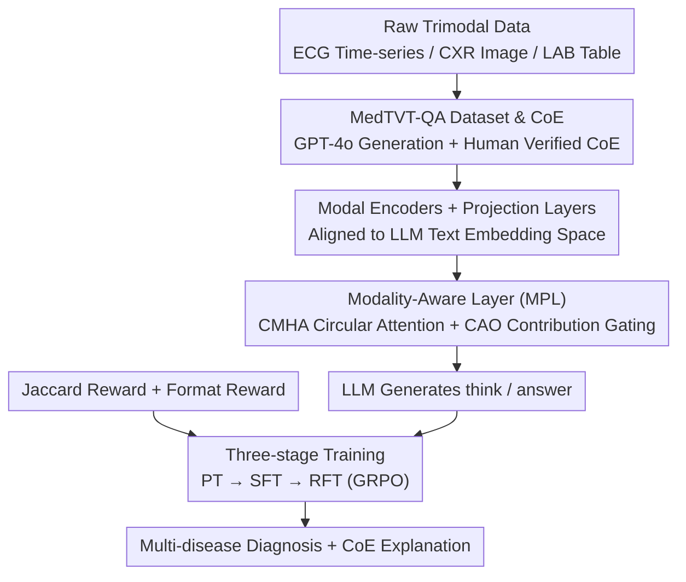

# MedTVT-R1: A Multimodal LLM Empowering Medical Reasoning and Diagnosis

**Conference**: CVPR 2026  
**Related Papers**: [CVF Open Access](https://openaccess.thecvf.com/content/CVPR2026/html/Zhang_MedTVT-R1_A_Multimodal_LLM_Empowering_Medical_Reasoning_and_Diagnosis_CVPR_2026_paper.html)  
**Code**: https://github.com/keke-nice/MedTVT-R1 (Existing)  
**Area**: Medical Imaging / Multimodal VLM  
**Keywords**: Multimodal medical diagnosis, ECG-CXR-LAB trimodal, modality-aware layer, GRPO, chain-of-evidence reasoning

## TL;DR
MedTVT-R1 unifies three types of heterogeneous data from the same patient—ECG (time-series), chest X-ray (CXR, image), and lab results (LAB, table)—into a single MLLM. By utilizing a "modality-aware layer + chain-of-evidence instruction data + GRPO reinforcement fine-tuning," it achieves interpretable multi-disease diagnosis, outperforming both general and medical-specific MLLMs in clinical utility (F1, AUC) and long-text diagnosis generation.

## Background & Motivation
**Background**: Current medical AI diagnosis mostly relies on individual modalities—textual case analysis, radiological image interpretation, or ECG rhythm analysis—each operating in isolation. Even when some works attempt multimodality, they often focus on binary determination of a specific disease.

**Limitations of Prior Work**: Single-modality perception of physiological states is too limited to provide a holistic understanding of complex diseases (e.g., diabetes simultaneously manifests in ECG heart rate variability, CXR pulmonary complications, and glucose/lipid levels in lab reports). Existing multimodal methods often provide only simple conclusions, lacking interpretable long-text diagnostic reasoning, which hinders clinical deployment. Furthermore, existing multimodal medical datasets (like QoQ-Med) are pieced together from heterogeneous sources without patient-level trimodal alignment for a single visit.

**Key Challenge**: Evidences for complex diseases are naturally scattered across multiple modalities and corroborate each other, but there is a lack of a framework and accompanying data capable of "aligning three modalities and performing disease-level reasoning."

**Goal**: (1) Construct a set of patient-level aligned trimodal instruction data; (2) Design an MLLM capable of adaptively weighting the contribution of each modality; (3) Enable the model to output interpretable diagnoses with evidence rather than black-box labels.

**Key Insight**: The authors observe that different modalities contribute unequally to the diagnosis of different diseases (ECG is more critical for coronary heart disease, while LAB is more critical for diabetes). Thus, they advocate for explicitly modeling "cross-modal dependency + modality contribution weights" and directly incorporating the set overlap of multi-disease diagnoses into the training objective via reinforcement learning with verifiable rewards.

**Core Idea**: Transforming multi-disease diagnosis into an interpretable and reinforcement-optimized reasoning task using "trimodal alignment data + modality-aware layer + GRPO with Jaccard reward."

## Method

### Overall Architecture
The input to MedTVT-R1 consists of a patient's ECG signal $X_E$, CXR image $X_C$, LAB table $X_L$, and a natural language question. The output is a diagnostic text containing a `<think>` chain-of-evidence and an `<answer>` disease set. The pipeline consists of four components: first, the MedTVT-QA instruction data (including evidence chain supervision) is constructed via GPT-4o + human verification; then, raw data from the three modalities are aligned to the LLM text space through dedicated encoders and projection layers; a Modality-Aware Layer (MPL) is inserted to perform cross-modal interaction and contribution weighting; finally, the LLM generates the diagnosis. Training follows a three-stage progression: PT → SFT → RFT, with RFT driven by GRPO using Jaccard rewards.

### Key Designs

**1. MedTVT-QA Dataset & Chain of Evidence (CoE): Completing Supervision for Patient-level Trimodal Alignment**

Existing medical multimodal data either lack modalities or are not aligned to the same visit, preventing models from learning cross-modal corroboration. The authors filtered ECG, LAB, and CXR data from the MIMIC-IV series for the same patient within the same visit period. After Symile alignment, 8,706 trimodal samples were obtained (8,331 for training / 375 for testing). Disease labels were taken from MIMIC-IV-ECG-EXT-ICD, focusing on seven common categories: coronary heart disease, acute renal failure, hypertension, atrial fibrillation, pneumonia, diabetes, and sepsis. Data construction was two-layered: first, "physiological-level" Q&A was generated for each modality (prompting GPT-4o with Role/Task/Guidance/Format; 50 LAB metrics were grouped into 7 categories by physiological meaning). Second, "disease-level" diagnostic Q&A was generated by fusion, mandating a **Chain of Evidence** (CoE) in `<think>`—requiring the model to find confirmatory evidence across the three modalities to support each diagnosis. All generated content was reviewed by professionals to ensure reliability. This two-layer structure allows the model to first understand single-modality physiology and then learn cross-modal reasoning.

**2. Modality-Aware Layer (MPL): Explicit Modeling of Cross-modal Dependency and Adaptive Weighting**

Directly concatenating three modalities projected into a shared dimension $d$ and feeding them into the LLM loses the dependency structure and fails to reflect that "different diseases rely on different modalities." MPL consists of two operators. The first is Circular Multi-Head Attention (CMHA): ECG, CXR, and LAB features take turns acting as Query/Key/Value to compute multi-head attention. After one cycle, they are fused via average pooling with residual connections: $M_{E/C/L}=Z_{E/C/L}+\text{AvgPool}(\text{CMHA}(Z_E,Z_C,Z_L))$. The second is the Contribution-Aware Operator (CAO): concatenated trimodal features pass through a learnable transformation $h$ and Sigmoid to obtain per-modality gating weights, followed by element-wise multiplication: $T_{E},T_C,T_L=\sigma(h[M_E{:}M_C{:}M_L])\otimes(M_E,M_C,M_L)$. This adaptively amplifies critical modalities based on the diagnostic context. The final $T_E/T_C/T_L$ replace the `<ecg>/<cxr>/<lab>` placeholders in the prompt. Ablations show significant drops when either CMHA or CAO is removed.

**3. Three-stage Progressive Training (PT→SFT→RFT): From Physiological Understanding to Disease Reasoning**

Direct RL is difficult to converge because the model does not yet understand the physiological meaning of the modalities. Training is split into three phases: **PT** trains the projection layers and LLM LoRA using physiological-level Q&A (no MPL here as cross-modal interaction is not involved), aiming to maximize target token likelihood. **SFT** introduces MPL and trains it alongside LoRA using disease-level Q&A with CoE to learn multi-disease reasoning via cross-modal fusion. **RFT** utilizes GRPO post-training under the RLVR framework to further release data potential and strengthen reasoning. These stages correspond to the progression of "single-modality physiology → cross-modal fusion → reasoning reinforcement."

**4. Jaccard-Reward Driven GRPO: Optimizing Multi-disease Set Overlap as Verifiable Reward**

Multi-disease diagnosis is essentially predicting a set of diseases. Traditional per-label accuracy fails to capture overlap at the set level. The authors designed a verifiable reward $R=R_F+R_J$ for GRPO: $R_F$ is a format reward enforcing the `<think>/<answer>` specification; $R_J$ is the new Jaccard reward. Regular expressions extract the predicted set $L_C$ and ground truth set $L_G$ from `<answer>`, quantifying overlap as $R_J=\frac{|L_C\cap L_G|}{|L_C\cup L_G|}$ (0 if the union is empty). GRPO requires no additional critic; it samples $G=8$ candidates per question, computes relative advantage via group-relative reward normalization, and constrains policy deviation with a KL term $-\beta\,\text{KL}[\pi_\theta\|\pi_{\text{ref}}]$. This directly optimizes the model to make the predicted disease set as close to the truth as possible.

### Loss & Training
PT/SFT use standard next-token prediction negative log-likelihood, with SFT including trimodal tokens fused by MPL. RFT maximizes $\mathbb{E}_{A\sim \pi_\theta}[R(Q,A)]-\beta\,\text{KL}[\pi_\theta(A|Q)\|\pi_{\text{ref}}(A|Q)]$. Implementation: LLM uses LLaMA 3.2-1B + LoRA (rank 8); Encoders are ECGFM-KED (ECG), ViT-B/16 (CXR), and Symile (LAB); Projection layers use Dense blocks from MuMu-LLaMA ($d=2048$). PT/SFT run for 20 epochs; RFT for 500 iterations with group size $G=8$ on 8×A800 80G.

## Key Experimental Results

### Main Results
Evaluation spans two sets of metrics: NLG for diagnostic text quality (BLEU/METEOR/ROUGE/BERTScore) and CE for multi-label clinical utility (Precision/Recall/F1/AUC). Below are the main results for disease-level diagnostic reasoning (excerpt).

| Method | Type | METEOR | ROUGE | F1 | AUC |
|------|------|--------|-------|------|------|
| Qwen2.5-VL-3B-Instruct | Gen. MLLM | 0.2031 | 0.1331 | 0.1995 | 0.5000 |
| LLaVA-Med | Med. Spec. | 0.2358 | 0.1637 | 0.2075 | 0.5318 |
| HuatuoGPT-Vision | Med. Spec. | 0.2017 | 0.1389 | 0.2072 | 0.5038 |
| **Ours (MedTVT-R1)** | Ours | **0.3536** | **0.2295** | **0.5190** | **0.6554** |

F1 jumped from ~0.20 to 0.519, and AUC from ~0.50 to 0.655. The authors attribute this significant gain to the fact that baselines cannot natively handle three modalities and must convert ECG to images and LAB to text for "fair comparison," which is inherently disadvantageous. This underscores the value of native trimodal alignment. Ours also leads in physiological-level understanding (long-text generation ≥300 words).

### Ablation Study
| Configuration | METEOR | ROUGE | Recall | F1 | Description |
|------|--------|-------|--------|------|------|
| Full MedTVT-R1 | 0.3536 | 0.2295 | 0.5908 | 0.5190 | All components |
| w/o PT | 0.3280 | 0.2043 | 0.5208 | 0.4672 | No physio pre-training |
| w/o RFT | 0.3499 | 0.2261 | 0.5783 | 0.4992 | No GRPO refinement |
| MPL: w/o CMHA | 0.3455 | 0.2013 | 0.5733 | 0.4977 | CAO only |
| MPL: w/o CAO | 0.3378 | 0.2145 | 0.5826 | 0.4867 | CMHA only |

Modality ablation (Table 3, drop relative to full trimodal): The full model achieves Micro-F1 0.519 / Macro-F1 0.457 / Jaccard 0.389. Removing any modality causes degradation; removing CXR dropped Jaccard by 17.7%, while removing ECG caused a 17.2% drop. Single modalities (ECG/CXR/LAB only) performed worst.

### Key Findings
- **Trimodal fusion is the primary source of Gain**: Single modality is worst, bimodal is mid, and trimodal is optimal, validating the synergistic value of modal complementarity and corroboration.
- **PT is more critical than RFT**: Removing PT dropped F1 from 0.519 to 0.467 (-0.052), whereas removing RFT dropped it to 0.499 (-0.020), indicating that establishing physiological-level representations is the foundation.
- **CMHA and CAO are both indispensable**: Removing either leads to performance loss. CMHA has a greater impact on ROUGE, while CAO has a greater impact on F1.
- **ECG has the highest weight for cardiac diseases**: Removing ECG caused the largest drop in METEOR/ROUGE, consistent with the strong association between cardiac activity and multiple conditions.

## Highlights & Insights
- **Reformulating multi-disease diagnosis as set overlap optimization**: The Jaccard reward directly aligns the "predicted set vs. ground truth set," which fits co-occurrence scenarios better than per-label CE.
- **Chain of Evidence supervision makes black-box diagnosis auditable**: Mandating the search for confirmatory evidence in `<think>` provides readable clinical reasoning, crucial for medical deployment.
- **Symmetric cross-modal attention with circular QKV**: CMHA lets the three modalities take turns as Q/K/V, avoiding manual master-slave modality definitions.
- **Freezing heavy components, tuning lightweight ones**: 1B LLM + LoRA + lightweight projection/MPL makes training feasible on 8×A800.

## Limitations & Future Work
- **Small data scale**: Only 8,706 trimodal samples and 375 tests, all from the single MIMIC-IV source; cross-institution/population generalization is unverified.
- **Limited disease coverage**: Only seven common categories are addressed; rare diseases and long-tail co-occurrences are not included.
- **Reliance on GPT-4o for data**: CoE generated by GPT-4o may introduce LLM priors or hallucinations.
- **Potential improvements**: Incorporating larger-scale real clinical multimodality, adding temporal dimensions (disease progression), or extending Jaccard rewards with severity/priority weighting.

## Related Work & Insights
- **vs. QoQ-Med**: QoQ-Med also fuses time-series/imaging/text but uses pieced-together heterogeneous datasets without patient-level alignment. MedTVT-R1 emphasizes same-visit alignment + CoE.
- **vs. DrVD-Bench**: The latter focuses on visual reasoning without ECG or structured LAB data.
- **vs. DeepSeek-R1 / GRPO family**: This work is the first to apply GRPO + verifiable rewards to multi-disease diagnosis involving text, images, time-series, and tables, contributing the Jaccard reward for set prediction.

## Rating
- **Novelty**: ⭐⭐⭐⭐ The combination of trimodal patient-level alignment + CoE + Jaccard-GRPO is new in medical MLLMs, though components like MPL and GRPO are adaptations of existing ideas.
- **Experimental Thoroughness**: ⭐⭐⭐⭐ Main results + multi-angle ablations are complete, but limited by a single data source and small scale.
- **Writing Quality**: ⭐⭐⭐⭐ Logic from motivation to training is clear; illustrations are comprehensive.
- **Value**: ⭐⭐⭐⭐ Provides a complete paradigm and open-source data/code for interpretable trimodal diagnosis.

<!-- RELATED:START -->

## Related Papers

- [\[CVPR 2026\] Clinically-Grounded Counterfactual Reasoning for Medical Video Diagnosis](clinically-grounded_counterfactual_reasoning_for_medical_video_diagnosis.md)
- [\[CVPR 2026\] OctoMed: Data Recipes for State-of-the-Art Multimodal Medical Reasoning](octomed_data_recipes_for_state-of-the-art_multimodal_medical_reasoning.md)
- [\[CVPR 2026\] MedLoc-R1: Performance-Aware Curriculum Reward Scheduling for GRPO-Based Medical Visual Grounding](medloc-r1_performance-aware_curriculum_reward_scheduling_for_grpo-based_medical_.md)
- [\[CVPR 2026\] X-PCR: A Benchmark for Cross-modality Progressive Clinical Reasoning in Ophthalmic Diagnosis](x-pcr_a_benchmark_for_cross-modality_progressive_clinical_reasoning_in_ophthalmi.md)
- [\[CVPR 2026\] EMAD: Evidence-Centric Grounded Multimodal Diagnosis for Alzheimer's Disease](emad_evidence-centric_grounded_multimodal_diagnosis_for_alzheimers_disease.md)

<!-- RELATED:END -->
