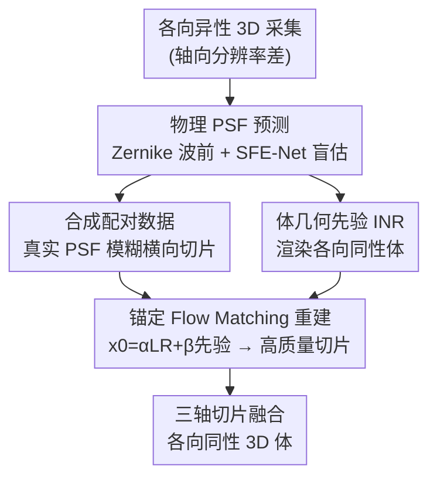

# MicroFM: Physics-guided Flow Matching for Isotropic Microscopy Reconstruction

**Conference**: CVPR 2026  
**Paper**: [CVF Open Access](https://openaccess.thecvf.com/content/CVPR2026/html/Zhan_MicroFM_Physics-guided_Flow_Matching_for_Isotropic_Microscopy_Reconstruction_CVPR_2026_paper.html)  
**Code**: None  
**Area**: Medical Imaging  
**Keywords**: Fluorescence microscopic imaging, Isotropic reconstruction, Flow Matching, Physical PSF, Implicit neural representation

## TL;DR
MicroFM uses physical PSF to synthesize realistic degraded training data, employs implicit neural representation to provide volumetric geometric priors, and utilizes a Flow Matching network anchored on low-quality inputs for isotropic reconstruction in fluorescence microscopy, achieving comprehensive state-of-the-art (SOTA) results across four microscopy systems.

## Background & Motivation
**Background**: 3D fluorescence microscopy enables the visualization of sub-cellular structures, cellular interactions, and tissue morphologies. However, constrained by the diffraction limit, the point spread function (PSF) of the optical system is highly anisotropic in the axial (z) direction, where the axial resolution is typically 2 to 3 times poorer than the lateral (xy) resolution. Remedying this axial resolution bottleneck via hardware modifications (such as beam shaping, multi-view imaging, or PSF engineering) is complex, expensive, prone to sidelobe artifacts, and introduces phototoxicity. Consequently, computational reconstruction—particularly deep learning—has emerged as a widely scalable mainstream approach.

**Limitations of Prior Work**: Current deep learning pipelines suffer from two major drawbacks. First, **the synthesized training data does not match real-world imaging**: most methods (e.g., CARE, SSAI-3D) use static Gaussian kernels to simulate axial blur. However, real PSFs exhibit anisotropy, aberrations, depth-dependent variations, and sample-induced distortions. As a result, networks learn to "de-Gaussian-blur" rather than "invert the true imaging process", leading to poor generalization on real axial slices. Second, there is a **lack of explicit volumetric geometric constraints**: many methods process 2D slices individually, neglecting inter-slice continuity and 3D geometry, which often leads to reconstructing cylindrical structures into spherical shapes. Approaches relying on quasi-3D inputs or "axial-lateral similarity" provide only weak regularization, which frequently fails in highly directional or anisotropic tissues.

**Key Challenge**: Unpaired GANs (such as CycleGAN, UTOM, and Neuroclear) relax the pairing requirement using cycle-consistency or saliency constraints, but they are prone to hallucinations and morphological distortions. While diffusion models yield high quality, they are computationally intensive. The fundamental conflict lies in either unrealistic degradation models (data-side mismatch) or a lack of 3D geometric constraints (structure-side distortion), coupled with generative methods struggling to balance fidelity and sampling efficiency.

**Goal**: (1) Align synthetic degradation with the physical imaging of target microscopes; (2) Inject cross-slice volumetric geometric priors into slice-by-slice reconstruction; (3) Develop a fast, stable, and hallucination-suppressed generative framework for isotropic restoration.

**Key Insight**: This work decouples the problem into a two-stage process: "physics-consistent degradation modeling + geometry-aware reconstruction". For the first time, **Flow Matching** is introduced to isotropic microscopy reconstruction. The key observation is that by starting optimal transport trajectories from "low-quality observations + volumetric geometric priors" rather than pure noise, the network can learn resolution enhancement near the real data distribution, naturally suppressing hallucinations.

**Core Idea**: Replace mismatched Gaussian kernels with "instrument-matched physical PSF-synthesized paired data" and replace unconstrained slice-by-slice generation with an "implicit volumetric geometric prior + observation-anchored Flow Matching" framework.

## Method

### Overall Architecture
MicroFM represents a two-stage physics-guided framework. **Stage 1 (Physical PSF Prediction)**: A physical-consistent PSF is generated on the pupil plane via Zernike wavefront formulation to synthesize low-resolution images. An SFE-Net is trained on these images to perform blind estimation of the PSF. Subsequently, the SFE-Net is applied to real anisotropic axial slices to estimate spatial-varying PSFs matching the target microscope. These estimated PSFs are then used to blur lateral high-resolution slices, constructing paired training data aligned with real degradation. **Stage 2 (Isotropic Restoration)**: A continuous implicit neural representation (INR) is trained to render the anisotropic acquisitions into an isotropic volume, serving as a geometric prior for each slice. Next, the "degraded input slice ⊕ INR prior" is fused into the starting point $x_0$ of the flow. A Flow Matching reconstruction network gradually transports $x_0$ toward the high-quality target slice. Finally, the reconstructions from all axial orientations are fused to output the isotropic 3D volume.

### Key Designs

**1. Instrument-Matched Physical PSF Synthesis: Replacing Mismatched Gaussian Kernels with Realistic PSF-Paired Data**

To address the primary limitation where synthetic models rely on Gaussian kernels that do not match real imaging conditions, the authors construct realistic degradations using physical optics. First, on the normalized pupil $(\rho,\theta)$, the wavefront phase is represented with 25 Zernike modes (including piston, tilt, defocus, astigmatism, coma, spherical, and higher-order aberrations): $\phi(\rho,\theta)=\sum_{n=0}^{24} a_n Z_n(\rho,\theta)$, where coefficients $a$ are randomly sampled. Under the Fraunhofer approximation, the aberrated complex pupil is formulated as $P(\rho,\theta)=A(\rho)e^{i\phi(\rho,\theta)}$, which produces the incoherent PSF $h(x,y)=|\mathcal{F}\{P\}|^2$ via Fourier propagation. By convolving the high-resolution image $S$ with $h$, introducing Poisson shot noise and Gaussian readout noise, and downsampling according to the axial sampling rate of the microscope, realistic low-resolution images are obtained:

$$I_{LR}\sim D\big(\mathrm{Poisson}(S*h)+\eta\big),\quad \eta\sim\mathcal{N}(0,\sigma^2)$$

SFE-Net is trained on these physically generated $LR \leftrightarrow HR$ pairs to blindly estimate the PSF. During inference, SFE-Net is applied to real axial slices from the target microscope, outputting a distinct PSF for each slice—corresponding to **spatially-varying instrument responses**. Finally, 7 PSFs are randomly sampled from the estimated PSFs of each axial slice to blur the lateral slices, yielding 7 degraded images that expose the model to the full spectrum of axial degradation. Compared to static Gaussian kernels, this physical pairing significantly narrows the domain gap between simulation and real-world imaging by explicitly capturing position dependency, optical aberrations, and sample-induced distortions.

**2. Continuous Implicit Volumetric Geometric Prior: Restoring 3D Constraints Lost in Slice-by-Slice Processing via INR**

To address the second limitation where 1D/2D slice-by-slice reconstruction discards geometry and distorts cylindrical structures into spheres, the authors utilize an implicit neural representation (INR) to learn a continuous field $f_\theta:\mathbb{R}^3\to\mathbb{R}$ representing the volumetric geometry. Given the anisotropic acquisition $G\in\mathbb{R}^{Z_{low}\times Y\times X}$, the network renders an isotropic volume $\hat V(y,x,z)=f_\theta(\gamma(y,x,z))$ using fixed positional encoding $\gamma$. During training, the degradation operator is defined as downsampling along z followed by convolution with the predicted physical PSF: $A(\cdot)=p*D_z(\cdot)$. The mean squared error between simulated observations and target acquisitions is minimized over a random sub-volume $\Omega$:

$$L_{INR}=\mathbb{E}_\Omega\big\|A(\hat V|_\Omega)-G|_\Omega\big\|_2^2$$

During inference, for any lateral slice index $Z_s$, $n$ synthetic slices are aggregated from its symmetric neighborhood. These are Gaussian-weighted to construct an explicit slice prior: $\hat M_s(y,x)=\sum_{k=1}^n w_k\, f_\theta(\gamma(y,x,z_s+\Delta_k))$, where the weights are $w_k=\exp(-(k-\mu)^2/2\sigma^2)/\sum_j\exp(-(j-\mu)^2/2\sigma^2)$ (with $\mu=(n+1)/2$, and $n=6$ in the paper). The YZ and XZ planes are constructed similarly by fixing $x$ or $y$. This process provides each slice with cross-plane continuity and topological clues, successfully recovering the volumetric constraints lost during independent 2D operations.

**3. Anchored Flow Matching Reconstruction: Suppressing Hallucinations and Reducing Sampling Steps by Starting from "Observation + Prior"**

To overcome the conflict where generative methods are either slow or prone to hallucinations due to starting from pure noise, the authors frame the resolution recovery as a deterministic probability flow. Crucially, the starting point of the flow is a convex mixture of the low-quality observation and the volumetric geometric prior rather than pure noise: $x_0=\alpha x_2+\beta \hat M$ (where $\alpha+\beta=1$, and $\beta=0.5$ in the paper). This step directly injects continuity and topological information across XY, YZ, and XZ directions into the starting point, enabling the network to learn resolution enhancement close to the real data distribution and thereby dampening hallucinations.

For a target high-quality slice $x_1$, the ideal velocity is defined as $v^\star(x_t)=x_1-x_0$, with the interpolation path set as $x_t=t x_1+(1-t)x_0$. The network is trained to approximate this with a conditional velocity field $v_\theta[x_t,t\,|\,x_0]$. To enable few-step sampling, the authors implement Consistency Flow Matching by introducing endpoint consistency $f(t,x_t)=x_t+(s(t)-t)v_\theta(x_t,t)$ and enforcing $f(t,x_t)\approx f(r,x_r)$ (where $r=\min\{t+\delta,1\}$ across piecewise linear paths). The loss function is formulated as:

$$L_{cons}=\|f(t,x_t)-f(r,x_r)\|_2^2+\lambda_{vel}\,\mathbf{1}[t<b]\,\mathbf{1}[d_t>\tau]\,\|v_t-v_r\|_2^2$$

where $b$ is the endpoint of the current segment, $d_t$ is the distance from $t$ to the segment boundary, and $\tau$ is a small threshold. The indicator functions restrict the velocity consistency term to operate strictly within segments and disable it near segment boundaries to prevent trivial zero-length updates. Intuitively, this enforces that integrating via Euler steps from different starting points within the same segment yields the same segment endpoint, **straightening the ODE trajectories** to achieve 2-step sampling and limit discretization error accumulation. This is the root cause of MicroFM's fast and stable recovery.

### Loss & Training
The INR is pre-trained using $L_{INR}$ (Eq. 6), while the reconstruction network is trained using $L_{cons}$ (Eq. 12). The backbone uses NCSN++ with 2.48M parameters, supporting 2-step sampling during both training and inference. Optimization is performed using Adam with a starting learning rate of $5\times10^{-4}$ and $\beta_1=0.9$. The prior weight is set to $\beta=0.5$. Training is conducted on 512×512 patches with a batch size of 12 for 200k iterations on a single H100 GPU.

## Key Experimental Results

### Main Results
Experiments were conducted on four different fluorescence microscopy systems/datasets: CS-fMOST dense neuron clusters, confocal Thy1-GFP mouse brain, two-photon mouse kidney, and widefield mouse liver. Baselines include 3 self-supervised methods (Self-Net, SSAI-3D, Neuroclear) and 3 unsupervised methods (CycleGAN, UTOM, CycleDiffusion). Full-reference metrics are used for lateral XY evaluations, while no-reference metrics are utilized for axial XZ/YZ evaluations.

| Dataset | Metric | Ours | Prev. SOTA | Gain |
|---|---|---|---|---|
| Dense neuron clusters | PSNR↑ | **40.186** | 30.745 (SSAI-3D) | +9.4 dB |
| Dense neuron clusters | SSIM↑ / LPIPS↓ | **0.964 / 0.075** | 0.889 / 0.168 | Significant margin |
| Thy1-GFP brain | PSNR↑ | **47.363** | 33.098 (Self-Net) | +14 dB |
| Mouse kidney | PSNR↑ / SSIM↑ | **30.555 / 0.854**| 20.721 / 0.734 | Stable on strong anisotropic tissues |
| Mouse liver | PSNR↑ / SSIM↑ | **33.005 / 0.946**| 21.606 / 0.759 | +11 dB |

MicroFM consistently outperforms other methods across full-reference fidelity metrics (PSNR, SSIM, VIF, LPIPS) and registers stable leads in axial no-reference metrics (NIQE, PIQE, NRQM). Although some baselines occasionally achieve higher scores on individual perceptual metrics (e.g., NRQM on Liver, or LPIPS on Kidney), this is accompanied by degraded full-reference lateral fidelity or unstable axial reconstruction. This manifests the common trade-off where prior methods sharpen lateral views at the expense of axial distortion, whereas MicroFM preserves fidelity on both fronts.

### Ablation Study
Ablation experiments were conducted on the dense neuron clusters dataset (Table 3):

| Configuration | PSNR | SSIM | Explanation |
|---|---|---|---|
| Base model | 29.847 | 0.742 | All three key components removed |
| w/o flow from low quality images | 32.614 | 0.889 | Generated starting from noise instead of observations |
| w/o physical PSFs | 31.392 | 0.836 | Replaced with Gaussian kernels |
| w/o volumetric prior | 33.490 | 0.926 | INR-based volumetric prior removed |
| **MicroFM (Full)** | **40.186** | **0.964** | Complete model |

Sensitivity analysis on the prior weight $\beta$ (Table 4): When $\beta=0$, PSNR is 33.490. It peaks at $\beta=0.5$ with PSNR 40.186, SSIM 0.964, VIF 0.378, and LPIPS 0.075. Over-regularization occurs when $\beta=1.0$, dropping PSNR to 31.758 and SSIM to 0.908. Hence, $\beta=0.5$ is adopted throughout.

### Key Findings
- **Starting from anchored observations provides the largest gain**: Shifting the flow's starting point from pure noise to the low-quality image increases the PSNR from 32.614 to 40.186 and SSIM from 0.889 to 0.964. This indicates that anchoring the starting point suppresses hallucinations and elevates reconstruction fidelity.
- **Physical PSFs are critical**: Reverting to Gaussian kernels drops the PSNR by ~22% and SSIM by ~13%, demonstrating that degradation mismatch acts as a hard bottleneck in axial reconstruction.
- **Moderating the volumetric prior weight is essential**: If $\beta$ is too small (0~0.25), geometric cues are insufficient. If it is too large (0.75~1.0), over-regularization hurts fidelity. $\beta = 0.5$ is identified as the sweet spot.
- **PSF Analysis**: After training, the Shannon entropy of the predicted PSF library decreases, indicating that the predicted PSFs concentration converges while keeping spatial variations. This matches the physical expectation of bounded spatial variations in a single microscope. The late-stage PhaseZ amplitude distributions display clear discrepancies across systems, reflecting instrument-specific characteristics.

## Highlights & Insights
- **Integrating physical optics into data synthesis**: Employing Zernike wavefronts + Fourier propagation to formulate physically consistent PSFs, and then using SFE-Net to blindly estimate spatially-varying PSFs of target microscopes. This closed-loop "physical generation → blind estimation → real pairing" strategy directly tackles Gaussian kernel mismatch and stands as a highly reusable data-side trick for microscopy reconstruction.
- **Observation-anchored Flow Matching**: Running the probability flow starting from $x_0 = \alpha x_2 + \beta \hat M$ (low-quality observation + geometric prior) instead of noise constrains the generative task near the real data manifold. This anchored-start formulation effectively eliminates hallucinations while enabling 2-step sampling, making it readily transferable to other restoration tasks (e.g., SR, denoising, deblurring) where the inputs serve as degraded starting seeds.
- **INR as a geometric prior rather than final output**: Instead of directly outputting the rendered INR, the authors treat the INR slice outputs as slice-level geometric priors for Flow Matching. This circumvents the blurriness of direct INR outputs while retaining critical cross-slice 3D structural constraints.
- **First to employ Flow Matching for isotropic microscopy reconstruction**, using Consistency Flow Matching to straighten trajectories and realize 2-step sampling, striking a favorable trade-off between quality and speed.

## Limitations & Future Work
- **Dependence on physical PSF modeling accuracy**: Whether the 25-mode Zernike expansion and Fraunhofer approximation are sufficient for extreme aberrations or highly scattering specimens remains underevaluated. If SFE-Net yields biased blind PSF estimations, downstream paired data will experience systematic distortions.
- **Proxy-heavy evaluation**: Axial performance is assessed via no-reference metrics, while lateral performance relies on full-reference metrics from synthetic degradations. The absence of voxel-wise comparisons against real isotropic ground-truth means that fidelity claims carry a degree of proxy-dependence.
- **Generalization and hyperparameters**: Hyperparameters like $\beta=0.5$, $n=6$, and 7 PSF samples were tuned across the four datasets. Their robustness under heavily diverse modalities or stronger anisotropy warrants broader validation.
- **Future avenues**: Potential directions include end-to-end joint optimization of PSF estimation and reconstruction, introducing real-world isotropic references for semi-supervised calibration, or upgrading slice-level geometric priors to true 3D joint transport.

## Related Work & Insights
- **Ours vs. SSAI-3D / Self-Net (Self-supervised)**: These methods rely on "axial-lateral similarity + sparse fine-tuning" to generalize across systems, but still assume lateral and axial distribution parity and resort to Gaussian degradation. MicroFM breaks the degradation mismatch via physical PSFs and resolves the similarity assumption via volumetric priors, demonstrating distinct superiorities on highly anisotropic kidney and liver tissues.
- **Ours vs. CycleGAN / UTOM / Neuroclear (Unpaired GANs)**: Cycle-consistency and saliency constraints violate the "lateral-axial parity" assumption in highly anisotropic samples, often yielding lateral sharpening at the expense of axial distortions. The observation-anchored deterministic flow in MicroFM naturally thwarts such hallucinations.
- **Ours vs. CycleDiffusion (Diffusion)**: While diffusion models deliver high quality, they are computationally heavy and start from pure noise. MicroFM leverages Consistency Flow Matching to constrain the sampling process to 2 steps and starts from observations, delivering faster and more stable results.

## Rating
- Novelty: ⭐⭐⭐⭐ Combines physical PSF synthesis, INR volumetric priors, and anchored Flow Matching into an isotropic microscopy reconstruction framework. The combination is highly novel.
- Experimental Thoroughness: ⭐⭐⭐⭐ Evaluated on four systems across four datasets against six baselines, complete with component and weight ablations, alongside PSF entropy analyses. Direct evaluation using real isotropic ground-truths is slightly lacking.
- Writing Quality: ⭐⭐⭐⭐ Clear motivation-method-experiment progression, complete equations, and intuitive architecture diagrams.
- Value: ⭐⭐⭐⭐ Delivers massive PSNR improvements (+9 to +14 dB) of strong practical utility for quantitative 3D biological microscopy analysis. The physical pairing and anchored flow ideas are highly generic.

<!-- RELATED:START -->

## Related Papers

- [\[AAAI 2026\] Ambiguity-aware Truncated Flow Matching for Ambiguous Medical Image Segmentation](../../AAAI2026/medical_imaging/ambiguity-aware_truncated_flow_matching_for_ambiguous_medica.md)
- [\[ICLR 2026\] Learning Patient-Specific Disease Dynamics with Latent Flow Matching for Longitudinal Imaging Generation](../../ICLR2026/medical_imaging/learning_patient-specific_disease_dynamics_with_latent_flow_matching_for_longitu.md)
- [\[CVPR 2026\] D$^2$-FOSA: Dual-Diffusion Guided EEG-to-Image Reconstruction with Frequency-Oriented Semantic Alignment](d2-fosa_dual-diffusion_guided_eeg-to-image_reconstruction_with_frequency-oriente.md)
- [\[ICLR 2026\] Functional MRI Time Series Generation via Wavelet-Based Image Transform and Spectral Flow Matching for Brain Disorder Identification](../../ICLR2026/medical_imaging/functional_mri_time_series_generation_via_wavelet-based_image_transform_and_spec.md)
- [\[CVPR 2026\] MuViT: Multi-Resolution Vision Transformers for Learning Across Scales in Microscopy](muvit_multi-resolution_vision_transformers_for_learning_across_scales_in_microsc.md)

<!-- RELATED:END -->
