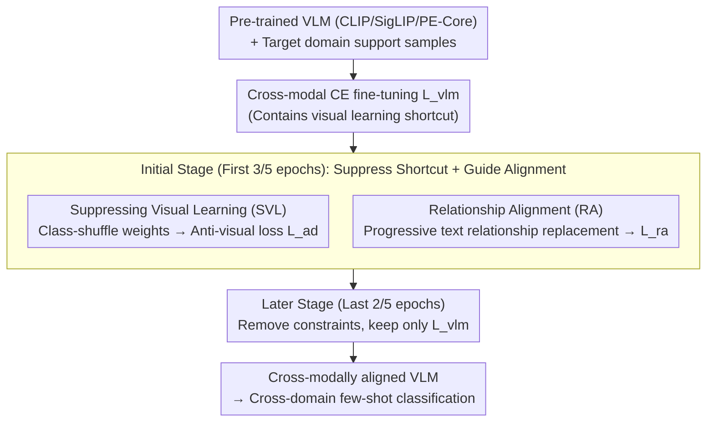

# Mind the Discriminability Trap in Source-Free Cross-domain Few-shot Learning

**Conference**: CVPR2026  
**arXiv**: [2603.13341](https://arxiv.org/abs/2603.13341)  
**Code**: [zhenyuZ-HUST/CVPR26-Mind-the-Discriminability-Trap](https://github.com/zhenyuZ-HUST/CVPR26-Mind-the-Discriminability-Trap)  
**Area**: Medical Imaging / Cross-domain Few-shot Learning  
**Keywords**: Source-Free CDFSL, Vision-Language Model, Cross-modal Alignment, Visual Discriminability Trap, CLIP Fine-tuning

## TL;DR

This paper reveals that in cross-domain few-shot fine-tuning of VLMs, enhancing visual discriminability actually harms cross-modal alignment (the "discriminability trap"). It proposes two plug-and-play modules, SVL and RA, to suppress visual learning shortcuts and guide cross-modal alignment, achieving SOTA on 4 CDFSL datasets and 11 FSL datasets.

## Background & Motivation

**Source-Free CDFSL Scenario**: The target domain (e.g., medical or remote sensing images) provides only a few labeled samples, and source domain data is inaccessible, requiring direct fine-tuning of pre-trained VLMs.

**Cross-modal Classification Paradigm in VLMs**: Models like CLIP and SigLIP classify by computing the cosine similarity between image and text features. Thus, the quality of cross-modal alignment directly determines performance.

**Traditional Cognition vs. Actual Phenomenon**: In traditional vision models, more discriminative visual features lead to better classification. However, in VLM-based SF-CDFSL, the authors found that enhancing visual discriminability can paradoxically reduce cross-modal classification accuracy.

**Severe Modal Misalignment in Cross-domain Scenarios**: Existing research indicates that the vision-text alignment of VLMs is severely compromised in cross-domain settings, and fine-tuning needs to repair this misalignment.

**Visual Learning as a "Shortcut" for the Loss Function**: The cross-entropy loss $\mathcal{L}_{\text{vlm}}$ encompasses both visual learning and cross-modal learning components. Visual learning acts as a "shortcut"—it can reduce the loss without improving cross-modal alignment, similar to a bypass valve in a "dual-valve drainage" system.

**Existing Methods Overlook This Issue**: Current approaches, including prompt learning (CoOp/Maple), adapters (LP++/LDC), and LoRA fine-tuning, do not account for the shortcut effect of visual learning.

## Method

### Overall Architecture

Ours aims to address the counter-intuitive phenomenon where enhancing visual discriminability harms cross-modal alignment ("discriminability trap") during VLM cross-domain few-shot fine-tuning. The root cause is that the cross-entropy loss $\mathcal{L}_{\text{vlm}}$ provides two paths: visual learning and cross-modal learning. Visual learning is a "shortcut" that reduces loss without improving alignment. Utilizing **two-stage training** with SVL and RA modules on architectures like CLIP/SigLIP/PE-Core: the initial stage (first 3/5 epochs) applies anti-visual loss $\mathcal{L}_{\text{ad}}$ and relationship alignment loss $\mathcal{L}_{\text{ra}}$ to resist the visual shortcut; the later stage (last 2/5 epochs) removes these constraints to allow standard visual learning via $\mathcal{L}_{\text{vlm}}$.

### Key Designs

**1. Suppressing Visual Learning (SVL): Blocking Shortcuts with "Class-shuffle Weights"**

Visual learning encourages intra-class clustering and inter-class separation. While this seems to improve discriminability, it bypasses cross-modal alignment and diverts optimization resources. SVL introduces an anti-visual loss $\mathcal{L}_{\text{ad}}$ to perturb this shortcut. Instead of matching features to their correct class weights, SVL uses "class-shuffled" weights $w'$ sampled from the support set to calculate cross-entropy. Since weights no longer correspond to the true labels, optimizing this loss **scatters** rather than clusters features, forcing the model to rely on the cross-modal path to minimize $\mathcal{L}_{\text{vlm}}$. 

**2. Relationship Alignment (RA): Guiding Internal Modality Relationships**

Resisting the visual shortcut is insufficient; the internal relationships within the visual modality must also be directed correctly. RA constructs a fused relationship matrix that progressively replaces visual modality relationships with text modality relationships:

$$A^{\text{fuse}} = \left(1 - \frac{e}{E}\right) A^v + \frac{e}{E} A^t[L,L]$$

The alignment is enforced via $\mathcal{L}_{\text{ra}} = D_{KL}(A^v \| A^{\text{fuse}})$. This progressive strategy is critical: in early stages, $A^{\text{fuse}} \approx A^v$ acts as a resistive term, while later stages introduce text semantic relationships to guide visual feature alignment.

### Loss & Training

A two-stage loss strategy is employed: early stage combines RA and SVL constraints, while the later stage reverts to standard fine-tuning:

$$\mathcal{L} = \begin{cases} \mathcal{L}_{\text{vlm}} + \beta \mathcal{L}_{\text{ra}} + \lambda \mathcal{L}_{\text{ad}} & \text{(Initial Stage)} \\ \mathcal{L}_{\text{vlm}} & \text{(Later Stage)} \end{cases}$$

Hyperparameters: $\lambda = 0.1$ (for vision branch) or $0.001$ (for text branch), $\beta = 3$.

## Experiments

### Main Results: 4 CDFSL Datasets (5-way 1-shot / 5-shot)

| Method | Backbone | ISIC | EuroSAT | CropDisease | ChestX | Avg |
|------|----------|------|---------|-------------|--------|-----|
| CLIP-LoRA-Vision | ViT/CLIP | 36.40 | 81.72 | 84.62 | 21.86 | 56.07 |
| **CLIP-LoRA + Ours** | ViT/CLIP | **38.12** | **85.02** | **87.20** | **22.68** | **58.26** |
| PE-Core-LoRA | ViT/PE-Core | 40.89 | 84.49 | 91.75 | 22.02 | 59.78 |
| **PE-Core-LoRA + Ours** | ViT/PE-Core | **45.01** | **86.83** | **93.03** | **23.66** | **62.14** |

In the 5-shot scenario, PE-Core-LoRA + Ours achieves an average accuracy of **70.29%** (vs. baseline 68.64%).

### Key Findings: Modal Alignment Analysis (Gap Shift)

| Method | CropDisease Gap↓ | EuroSAT Gap↓ | ISIC Gap↓ | ChestX Gap↓ |
|------|:-:|:-:|:-:|:-:|
| Fine-tune | 0.014 | 0.048 | 0.406 | 0.356 |
| FT + $\mathcal{L}_v$ | 0.022 | 0.072 | 0.626 | 0.742 |
| FT + $\mathcal{L}_{ad}$ | 0.012 | 0.024 | 0.191 | 0.249 |
| **FT + $\mathcal{L}_{ad}$ + $\mathcal{L}_{ra}$** | **0.009** | **0.027** | **0.171** | **0.238** |

A smaller Gap indicates better alignment. Enhancing visual learning worsens alignment, whereas SVL+RA improves it significantly.

### Ablation Study

| SVL | RA | CropDisease | EuroSAT | ISIC | ChestX | Avg |
|:---:|:--:|:-----------:|:-------:|:----:|:------:|:---:|
| ✗ | ✗ | 84.6 | 81.7 | 36.4 | 21.8 | 56.07 |
| ✓ | ✗ | 86.4 | 83.8 | 37.6 | 22.4 | 57.55 |
| ✗ | ✓ | 85.9 | 83.2 | 37.4 | 22.2 | 57.17 |
| ✓ | ✓ | **87.2** | **85.0** | **38.1** | **22.7** | **58.26** |

### Key Findings

- **Timing of Suppression**: Inhibiting visual learning is most effective during the early stages (Begin); late-stage inhibition is counterproductive.
- **Negligible Computational Overhead**: Increase in parameters is 0.0028%, FLOPs increase by 0.000021%, while accuracy improves by ~3.9%.
- **Strong Generalization**: Effective across CLIP, SigLIP2, and PE-Core backbones, and compatible with CoOp, Maple, and LoRA fine-tuning.
- Performance leads on **11 FSL datasets** across various shot settings.

## Highlights & Insights

- **Deep Insight**: First to reveal the contradiction between visual discriminative learning and cross-modal alignment in VLM fine-tuning, supported by theoretical derivation and experimental evidence.
- **Intuitive Analogy**: Compares loss optimization to drainage, where visual learning is a bypass valve that diverts resources intended for cross-modal alignment.
- **Extreme Simplicity**: SVL + RA require only a few lines of code and are plug-and-play for various tuning paradigms.
- **Zero Extra Cost**: Significant performance gains with virtually no change in parameters or computation.
- **Clever Gap Shift Design**: Quantifies alignment by manually adjusting modal distances, providing an intuitive metric.

## Limitations & Future Work

- Validated only on classification; downstream tasks like detection or segmentation remain unexplored.
- The two-stage switching point (3/5 epochs) is fixed and not adaptively adjusted.
- Discussion on hyperparameter ($\lambda, \beta$) sensitivity across different domain shifts is limited.
- "Anti-visual learning" might be unnecessary or harmful when domain shifts are minimal (e.g., in-domain FSL).
- Relies on simple text prompts ("a photo of [class]") without exploring richer descriptions.

## Related Work & Insights

- **SF-CDFSL**: Methods like StepSTP and FWT focus on source-free cross-domain tasks but do not analyze the negative impact of visual learning.
- **VLM Fine-tuning**: CoOp, CLIP-Adapter, and CLIP-LoRA all use cross-entropy fine-tuning and are susceptible to the discriminability trap.
- **Modality Gap**: Building on Liang et al.'s discovery of the gap, previous work assumed fine-tuning would naturally repair misalignment; Ours proves otherwise.
- **Shortcut Learning**: A known phenomenon in vision models, here first introduced into the context of VLM cross-modal fine-tuning.

## Rating

- Novelty: ⭐⭐⭐⭐⭐ — First to identify the conflict between visual discriminability and alignment.
- Experimental Thoroughness: ⭐⭐⭐⭐⭐ — Extensive backbones, tuning methods, and analysis over 15 datasets.
- Writing Quality: ⭐⭐⭐⭐⭐ — Excellent analogy and logical argumentation.
- Value: ⭐⭐⭐⭐ — Highly practical and general, though currently limited to classification.

<!-- RELATED:START -->

## Related Papers

- [\[CVPR 2026\] Reclaiming Lost Text Layers for Source-Free Cross-Domain Few-Shot Learning](reclaiming_lost_text_layers_for_source-free_cross-domain_few-shot_learning.md)
- [\[CVPR 2026\] Interpretable Cross-Domain Few-Shot Learning with Rectified Target-Domain Local Alignment](interpretable_cross-domain_few-shot_learning_with_rectified_target-domain_local_.md)
- [\[CVPR 2026\] Tell2Adapt: A Unified Framework for Source Free Unsupervised Domain Adaptation via Vision Foundation Model](tell2adapt_a_unified_framework_for_source_free_unsupervised_domain_adaptation_vi.md)
- [\[CVPR 2026\] MUSE: Harnessing Precise and Diverse Semantics for Few-Shot Whole Slide Image Classification](muse_harnessing_precise_and_diverse_semantics_for_few-shot_whole_slide_image_cla.md)
- [\[CVPR 2026\] Universal-to-Specific: Dynamic Knowledge-Guided Multiple Instance Learning for Few-Shot Whole Slide Image Classification](universal-to-specific_dynamic_knowledge-guided_multiple_instance_learning_for_fe.md)

<!-- RELATED:END -->
