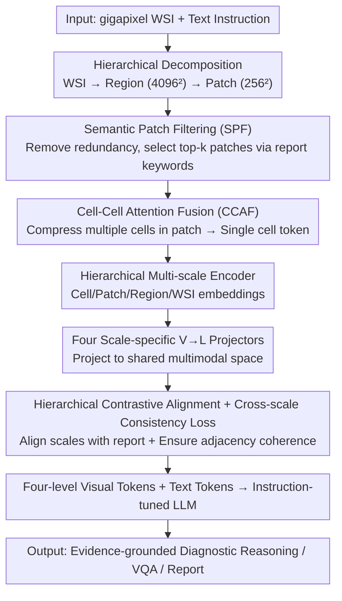

# MLLM-HWSI: A Multimodal Large Language Model for Hierarchical Whole Slide Image Understanding

**Conference**: CVPR 2026  
**Paper**: [CVF Open Access](https://openaccess.thecvf.com/content/CVPR2026/html/Alawode_MLLM-HWSI_A_Multimodal_Large_Language_Model_for_Hierarchical_Whole_Slide_CVPR_2026_paper.html)  
**Code**: Available (GitHub, full link not provided in paper)  
**Area**: Medical Imaging / Computational Pathology / Multimodal VLM  
**Keywords**: Whole Slide Images, Computational Pathology, Hierarchical Multi-scale Alignment, Cross-scale Consistency, Pathology MLLM

## TL;DR
To address the issue where existing computational pathology MLLMs compress entire Whole Slide Images (WSI) into a single vector—losing fine-grained spatial semantics—this paper proposes MLLM-HWSI. It decomposes the WSI into visual tokens across four scales: "cell = word, patch = phrase, region = sentence, WSI = paragraph." Using hierarchical contrastive alignment loss and cross-scale consistency loss, it aligns each scale with pathology reports before feeding them into an instruction-tuned LLM, achieving new SOTA results across 6 pathology tasks and 13 WSI-level benchmarks.

## Background & Motivation
**Background**: Whole Slide Images (WSI, often exceeding $100,000 \times 100,000$ pixels) are the gold standard for pathological diagnosis. Computational Pathology (CPath) MLLMs (e.g., Quilt-LLaVA, SlideChat, WSI-LLaVA, TITAN, PRISM, HistGen) connect visual encoders with LLMs for tasks like VQA, morphological reasoning, and report generation. Current SOTA approaches (SlideChat, WSI-LLaVA) typically aggregate patch-level embeddings into a **single WSI-level representation** to align with the entire pathology report.

**Limitations of Prior Work**: While "global single vector" aggregation captures coarse-grained context, it erases the inherent hierarchical structure of the WSI. Compressing the entire slide into one vector prevents the model from grounding local descriptions in reports (e.g., "pleomorphic nuclei," "stromal invasion") to specific visual evidence and contradicts the actual diagnostic workflow of pathologists.

**Key Challenge**: WSIs are **hierarchical** both biologically and structurally—cellular morphology (nuclear size, cytoplasmic texture, mitosis) forms the pathology "vocabulary," microstructures like glands/ducts/solid nests form the "syntax," and multi-regional integration into a global tissue architecture forms the "discourse." Pathologists' diagnosis is bidirectional: analyzing global context at low magnification, then moving to regions and cells, with local findings refining the global understanding. Single-vector models collapse this multi-scale, bidirectional reasoning into a one-time global comparison, resulting in information collapse.

**Goal**: Construct an MLLM that explicitly preserves a hierarchical structure of cell → patch → region → WSI, aligning each scale with the corresponding linguistic level of pathology reports to support interpretable, evidence-grounded diagnostic reasoning.

**Key Insight**: Decode "pathological reports" as a hierarchical language: single cells as words, small patches as phrases describing cellular neighborhoods, larger regions as sentences describing tissue architecture, and the whole WSI as a paragraph forming a coherent disease narrative. By aligning the four-level visual structure with the four-level language structure, the model replicates the "detail ↔ context" integration workflow of pathologists.

**Core Idea**: Use scale-specific encoders to decompose each WSI into cell/patch/region/WSI embeddings. Apply a combination of hierarchical contrastive alignment loss (aligning each scale with report text) and cross-scale consistency loss (ensuring smooth semantic transitions between adjacent scales). The resulting four levels of visual tokens are fused with text tokens and fed into an instruction-tuned LLM for multi-scale, evidence-driven pathological reasoning.

## Method

### Overall Architecture
MLLM-HWSI is a unified multi-scale vision-language alignment framework. It takes a gigapixel WSI and text instructions as input and outputs interpretable diagnostic answers supported by cross-scale evidence. Since end-to-end processing of a WSI is infeasible, it first performs **hierarchical decomposition**: sub-sampling at 20× into $4096 \times 4096$ regions $R_i$, each further divided into $256 \times 256$ patches $P_{ij}$ (extracted 0.356M regions and 91.33M patches from 9,642 WSIs). Five components follow: ① A hierarchical multi-scale encoder extracts features across cell/patch/region/WSI levels; ② Semantic Patch Filtering (SPF) removes redundant patches, retaining heterogeneous patches relevant to the report; ③ Cell-Cell Attention Fusion (CCAF) compresses thousands of cell embeddings within a patch into a single cell token; ④ Four scale-specific V→L projectors project features into a shared multimodal space aligned with text; ⑤ Projected visual tokens and text tokens are concatenated and fed into the LLM. Training is conducted in three stages, driven by hierarchical contrastive alignment and cross-scale consistency losses.

### Key Designs

**1. Four-scale Hierarchical Decomposition and Encoding: Explicit representations for "cell=word, patch=phrase, region=sentence, WSI=paragraph"**

To address the loss of hierarchical semantics in single-vector models, specific encoders are assigned to each scale. For the patch level, a CONCH encoder extracts texture and meso-structural cues $f_{ij}=F_{\text{CONCH}}(P_{ij})$. For the cell level, CellViT performs cell segmentation and encodes nuclear morphology, yielding cell embeddings $c_{ijk}$. For the region level, an HIPT hierarchical encoder $\mathrm{ViT}_r$ aggregates patch representations into region embeddings $r_i$ (modelling glandular tissue and stromal invasion). For the WSI level, $\mathrm{ViT}_{\text{WSI}}$ integrates region embeddings into a global representation $f_{\text{WSI}}$ (capturing macro patterns like tumor distribution). The final hierarchical representation of a WSI is $F_{\text{WSI}}=\{\{c_{ij},f_{ij}\}_{j=1}^{h_i},r_i\}_{i=1}^{n_r},f_{\text{WSI}}\}$. This structure allows the model to simultaneously model cell morphology, regional organization, and global architecture.

**2. Semantic Patch Filtering (SPF) + Cell-Cell Attention Fusion (CCAF): Balancing computational efficiency and diagnostic evidence at gigapixel scale**

Processing all patches and cells (often $>100,000$ per WSI) is computationally prohibitive and risks being overwhelmed by homogeneous backgrounds. SPF compresses data in two steps: first, calculating pairwise cosine similarity within each region to discard redundant patches using a threshold $\tau_i=\mu_i+\sigma_i$; second, decomposing pathology reports $D$ into $M$ semantic entities and selecting the top-k patches based on their cosine similarity $s_{ij,m}=\hat f_{ij}^\top\hat t_m$ with report keywords. CCAF handles the cell side: a lightweight ViT performs cross-attention over cell embeddings within each retained patch, using a $[\text{CLS}]_{ij}$ token to aggregate them into a single cell descriptor $c_{ij}=\mathrm{ViT}_{\text{cell-cell}}([\text{CLS}]_{ij},\{c_{ijk}\})$. This preserves nuclear diversity and morphological context while reducing the token count.

**3. Hierarchical Contrastive Alignment + Cross-scale Consistency Loss: Aligning scales with reports while preventing "semantic drift"**

Aligning each scale independently with the report is insufficient as scales may become decoupled (e.g., patch findings contradicting region findings). This paper employs two complementary losses. **Scale-specific Contrastive Loss** aligns projected features $z_s$ with corresponding report tokens: $L_s=-\frac{1}{n_s}\sum_i\log\frac{\exp(\mathrm{sim}(z_{s,i},t_i)/\tau)}{\sum_j\exp(\mathrm{sim}(z_{s,i},t_j)/\tau)}$ for $s\in\{c,p,r\}$, with a similar batch contrastive loss $L_{\text{WSI}}$ for the WSI level. **Cross-scale Consistency Loss** enforces smooth transitions: $L_c=\frac{1}{2n_r}\sum_{s\in\{c,p\}}\sum_k\|z_{r,k}-\frac{1}{n_s}\sum_i z_{s,k,i}\|_2^2+\frac{1}{n_p}\sum_j\|z_{cj}-z_{pj}\|_2^2$. This ensures region representations stay close to the mean of their internal cell/patch representations, and cell tokens remain coherent with their parent patch tokens.

### Loss & Training
Training consists of three stages: **Stage 1 (Hierarchical Cross-modal Alignment)** uses 9,642 WSI-report pairs to update all hierarchical encoders and the text encoder while freezing the projectors and LLM, optimizing $L_{\text{HCA}}$ (50 epochs, lr 1e-3, $n_b=64$, $\tau=0.02$). **Stage 2 (Feature Space Alignment)** freezes encoders and trains only the four V-L projection matrices on the same 9,642 pairs (batch 256). **Stage 3 (Task Instruction Tuning)** utilizes 175,450 WSI-level VQA pairs to jointly fine-tune the projection matrices and the LLM (lr 2e-5, batch 128, LoRA rank 128/α 256, DeepSpeed ZeRO-3). The backbone is Qwen2.5-7B-Instruct, trained on 4× A100 80GB.

## Key Experimental Results

### Main Results
Covering 6 CPath task categories across 13 public datasets, compared against 24 SOTA CPath models.

| Task | Metric | MLLM-HWSI | Second Best (Method) | Gain |
|------|------|-----------|-----------------------|------|
| Zero-shot WSI Classification (Avg. of 6) | Balanced Acc (BA) | **71.86** | 64.56 (TITAN) | +7.30 |
| Linear Probe Classification (Avg. of 6) | BA | **82.48** | 75.68 (TITAN) | +6.80 |
| Zero-shot WSI Retrieval (Avg. of 5) | top-1% Acc | **85.62** | 80.06 (TITAN) | +5.56 |
| WSI-Bench VQA | Accuracy | **97.90** | — | SOTA |
| WSI-VQA | Accuracy | **69.20** | — | SOTA |
| SlideBench-Caption | METEOR | **62.70** | WSI-LLaVA | Significant |

In VQA, the model outperformed previous SOTA across four benchmarks (SlideBench-VQA TCGA 89.60, BCNB 68.70, WSI-Bench 97.90, WSI-VQA 69.20). For captioning, BLEU-1/2/3/4 = 46.20/32.40/26.70/23.10 and ROUGE-L 36.70 were achieved. Report generation was optimal across all metrics on WSI-Bench and HistGen.

### Ablation Study
Reporting BA for PANDA/EBRAINS and Accuracy for WSI-VQA/SlideBench-VQA.

| Configuration | PANDA (BA) | EBRAINS (BA) | WSI-VQA (A) | SlideBench (A) | Description |
|---------------|------------|--------------|-------------|----------------|-------------|
| WSI-level only (HWSI₁) | 0.661 | 0.519 | 0.616 | 0.576 | Better than WSI-LLaVA |
| +region (HWSI₂) | 0.686 | 0.534 | 0.611 | 0.592 | Add region |
| +patch (HWSI₃) | 0.711 | 0.566 | 0.661 | 0.621 | Add patch |
| Full Four Scales | **0.748** | **0.612** | **0.692** | **0.687** | cell+patch+region+WSI |
| w/o $L_c$ & $L_s$ (Only $L_{\text{WSI}}$) | 0.661 | 0.519 | 0.616 | 0.576 | PANDA −8.70, EBRAINS −9.30 |
| w/o $L_{\text{WSI}}$ (Keep $L_s, L_c$) | 0.716 | 0.592 | 0.668 | 0.654 | ~3 point drop |
| w/o $L_c$ (Keep $L_s, L_{\text{WSI}}$)| 0.705 | 0.582 | 0.655 | 0.636 | Consistency drop |

### Key Findings
- **Every scale contributes value**: Progressively adding region/patch/cell levels resulted in monotonic improvements across all benchmarks. Removing scales consistently lowered performance, proving that fine-grained evidence at the cell and patch levels is critical for VQA.
- **Cross-scale consistency is vital**: With only WSI-level loss, performance dropped significantly (PANDA/EBRAINS down 8.70/9.30). Without forcing adjacency coherence, disparate scales suffer from semantic drift.
- **Consistent gains across tasks**: The model outperformed global vector models like TITAN and WSI-LLaVA across classification, retrieval, VQA, and report generation, validating the "explicit hierarchy + report alignment" as a robust paradigm.

## Highlights & Insights
- **Meta-mapping of report to hierarchy**: Mapping cell/patch/region/WSI to word/phrase/sentence/paragraph is not just a metaphor but is operationalized through "per-scale contrastive loss + cross-scale consistency loss." This translates domain intuition into a clean optimization objective.
- **Report-driven patch selection (SPF)**: Instead of uniform sampling, using semantic entities from pathology reports to guide top-k patch selection focuses the model on diagnostic evidence, a strategy applicable to other ultra-large image MLLMs.
- **CCAF handles the "cell ocean"**: Compressing 100,000+ cells using a lightweight ViT + CLS token ensures nuclear diversity is captured while keeping sequences computationally manageable for the LLM.

## Limitations & Future Work
- **High training cost**: The pipeline involving multiple encoders (CellViT, CONCH, HIPT), three-stage training, and large-scale pre-training requires significant computational resources (4×A100).
- **Dependency on pretrained encoders**: Performance relies heavily on the quality of base encoders like CONCH and CellViT; decoupling the gains of the hierarchical framework from the backbone strengths is challenging.
- **Segmentation error propagation**: Errors in CellViT segmentation in low-quality or artifact-heavy regions can propagate through the hierarchy (CCAF → region → WSI).
- **Metric comparability**: Report generation and VQA metrics across different official splits and benchmarks require careful interpretation of definition variations.

## Related Work & Insights
- **vs SlideChat / WSI-LLaVA (Global Vector)**: These models aggregate patches into a single WSI vector, losing fine-grained semantics. MLLM-HWSI outperforms WSI-LLaVA by +10.85 in zero-shot classification mean.
- **vs TITAN / PRISM (WSI-level VLM)**: While providing strong global representations, they lack explicit local evidence. MLLM-HWSI adds cell/patch/region levels, leading to superior retrieval and VQA results.
- **vs Quilt-LLaVA (Patch-level MLLM)**: Quilt-LLaVA focuses on patch-level dialogue without modeling the WSI hierarchy. MLLM-HWSI integrates patches into the full cell→WSI hierarchy for comprehensive reasoning.

## Rating
- Novelty: ⭐⭐⭐⭐ Explicitly aligns WSI hierarchical structure with report linguistic levels using cross-scale consistency; however, individual components are based on existing architectures.
- Experimental Thoroughness: ⭐⭐⭐⭐⭐ Extensive testing across 6 tasks and 13 datasets with 24 SOTA comparisons and robust ablation studies.
- Writing Quality: ⭐⭐⭐⭐ Motivations are well-illustrated and architecture is clearly defined, though notation is dense.
- Value: ⭐⭐⭐⭐ Significantly advances the SOTA in CPath tasks with an interpretable paradigm.

<!-- RELATED:START -->

## Related Papers

- [\[CVPR 2026\] MedMO: Grounding and Understanding Multimodal Large Language Model for Medical Images](medmo_grounding_and_understanding_multimodal_large_language_model_for_medical_im.md)
- [\[CVPR 2026\] OralGPT-Omni: A Versatile Dental Multimodal Large Language Model](oralgpt-omni_a_versatile_dental_multimodal_large_language_model.md)
- [\[CVPR 2026\] TopoSlide: Topologically-Informed Histopathology Whole Slide Image Representation Learning](toposlide_topologically-informed_histopathology_whole_slide_image_representation.md)
- [\[CVPR 2026\] LLaDA-MedV: Exploring Large Language Diffusion Models for Biomedical Image Understanding](llada-medv_exploring_large_language_diffusion_models_for_biomedical_image_unders.md)
- [\[CVPR 2026\] Turning Pre-Trained Vision Transformers into End-to-End Histopathology Whole Slide Image Models for Survival Prediction](turning_pre-trained_vision_transformers_into_end-to-end_histopathology_whole_sli.md)

<!-- RELATED:END -->
