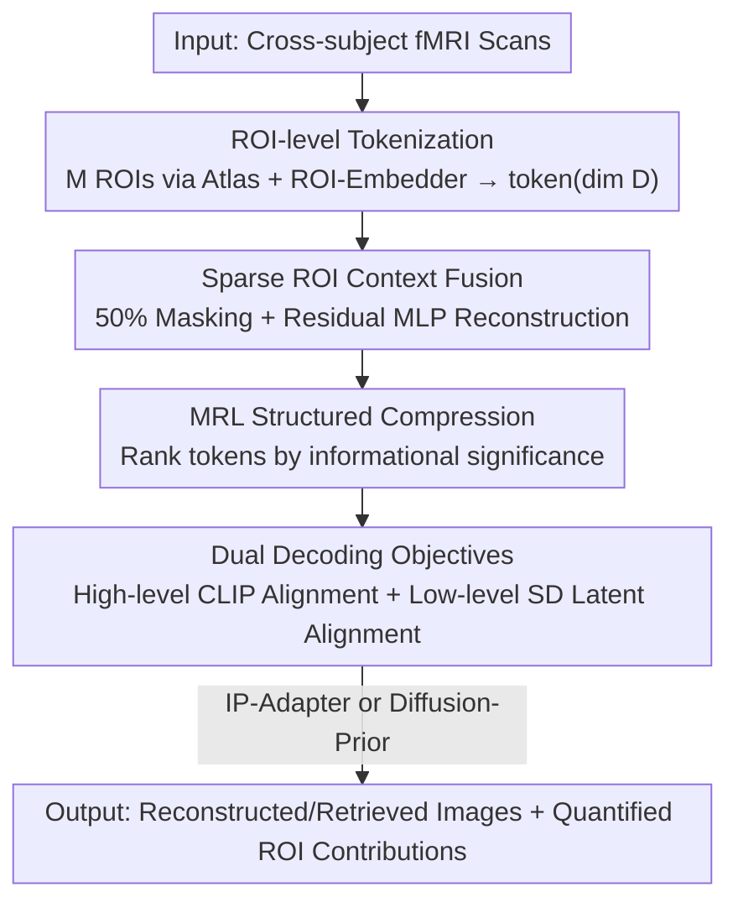

# Modeling the Brain's Grammar: ROI-Guided fMRI Pretraining for Transferable and Interpretable Vision Decoding

**Conference**: CVPR 2026  
**Paper**: [CVF Open Access](https://openaccess.thecvf.com/content/CVPR2026/html/Liu_Modeling_the_Brains_Grammar_ROI-Guided_fMRI_Pretraining_for_Transferable_and_CVPR_2026_paper.html)  
**Code**: To be confirmed  
**Area**: Medical Imaging / Brain Vision Decoding  
**Keywords**: fMRI Pretraining, Brain ROI, Vision Decoding, Matryoshka Representation, Cross-subject Transfer

## TL;DR
ROITok replaces the basic unit of cross-subject fMRI pretraining from "whole-brain features" to "ROI tokens." By utilizing sparse ROI context fusion to learn functional synergies between brain regions and Matryoshka-style compression to rank tokens by information content, it achieves superior low-level reconstruction fidelity and few-shot transfer capabilities on NSD/GOD. It also provides quantifiable contributions for each brain region, enhancing model interpretability.

## Background & Motivation
**Background**: The mainstream approach for decoding images from fMRI involves "pretraining a shared decoder on large-scale cross-subject data, followed by fine-tuning on a new subject." Two primary paths exist for aligning brain signals: 1) treating fMRI volumes as 1D/2D images for ViT-style patch division (e.g., fMRI-PTE, NeuroPictor); 2) matching each subject with a dedicated adapter to project neural responses into a shared latent space for a common decoder (e.g., MindEye2, STTM, MindTuner).

**Limitations of Prior Work**: The patch-based approach forces a grid-like division of the brain, ignoring the non-uniform spatial resolution of BOLD signals and functional topology. The adapter-based approach aligns whole-brain activity globally, failing to capture voxel-level redundancy or functional correlations within and between brain regions; the resulting shared features lack explicit structural constraints, leading to significant performance degradation in few-shot scenarios.

**Key Challenge**: Both paths ignore a fundamental neuroscience fact—the brain processes vision through a set of functionally specialized and topologically ordered Regions of Interest (ROIs, such as V1/V2 for edge orientation and FFA for selective face response). While voxel-level responses vary greatly between individuals, ROI-level representations are highly aligned across subjects anatomically and functionally. In other words, ROIs are the natural, biologically grounded basis for shared representation, yet existing methods do not treat them as modeling units.

**Goal**: To reorganize cross-subject pretraining around ROIs—tokenizing neural activity using ROIs as computational units to learn a cross-subject "representational grammar," thereby enhancing transferability and quantifying regional contributions.

**Key Insight**: Treat each ROI as a contextual token that encapsulates its distributed multi-voxel response patterns, aligning the model architecture with the modular organization of the brain.

**Core Idea**: Replace unstructured whole-brain adapter alignment with "ROI tokens + sparse inter-region context fusion + Matryoshka compression," transforming the unstructured shared space into a hierarchical, interpretable, and noise-resilient structured representation.

## Method

### Overall Architecture
ROITok is an ROI-guided fMRI pretraining framework. The input consists of fMRI scans from various subjects, which are divided into $M$ anatomically or functionally defined ROIs using standard brain atlases/functional localizers. Each ROI is projected into a unified dimension $D$ (set to 400) by a dedicated linear ROI-Embedder. These ROI tokens enter the pretraining core: half are randomly masked and reconstructed using an 8-layer residual MLP encoder to learn functional synergy (Sparse ROI Context Fusion). The encoder output undergoes Matryoshka-style compression, ensuring that the leading tokens prioritize the most significant visual information. Pretraining targets involve joint supervision by a high-level module (aligned with CLIP vision tokens) and a low-level module (aligned with Stable Diffusion VAE latents). After pretraining, the conditional image generation is decoupled from representation learning, comparing IP-Adapter and diffusion-prior routes to transform fMRI features into images. Transferring to a new subject only requires training a new set of ROI-Embedders followed by minimal joint fine-tuning.

### Key Designs

**1. ROI-level Tokenization: Shifting Modeling Units from Voxels to Regions**
The pain point is that voxel-level responses differ greatly across individuals, while whole-brain alignment loses regional structure. ROITok trains a dedicated linear ROI-Embedder $E_{i,j}$ for the $j$-th ROI of subject $S_i$, mapping the multi-voxel response $R_i^j \in \mathbb{R}^{N \times d_{i,j}}$ to a unified token of dimension $D$. Since most ROIs contain only hundreds of voxels and $D$ is set to 400, multi-embedders do not impose a heavy computational burden. This allows ROI-level representations to naturally align anatomically and functionally across subjects, enabling the model to learn a cross-subject "representational grammar" where different ROIs correspond to different stages of the visual hierarchy.

**2. Sparse ROI Context Fusion: Forcing Functional Synergy via Masked Reconstruction**
ROI token sequences provide an over-complete representation of decodable visual information, containing significant redundancy. To extract these correlations, 50% of the ROI tokens are randomly masked and replaced with a learnable `[MASK]` token during pretraining. The sequence is fed into an 8-layer residual MLP encoder $\mathcal{E}$ to produce contextualized embeddings $\mathbf{Z} \in \mathbb{R}^{M' \times D'}$. A residual MLP is chosen over an attention-based backbone due to its lower memory footprint and stable training. This self-supervised "reconstruction from masked ROIs" forces the model to infer missing content from other regions, explicitly modeling inter-region functional dependencies and mimicking the hierarchical organization of the human visual system.

**3. MRL Structured Compression: Ranking Tokens by Information Density**
Prior works (MindEye2/STTM/MindTuner) impose no structural constraints on the encoder output space. Inspired by Matryoshka Representation Learning (MRL), ROITok applies a truncation function to the embeddings $\mathbf{Z}=(\mathbf{Z}_1,\dots,\mathbf{Z}_{M'})$ during training:

$$F(\mathbf{Z}, m) = (\mathbf{Z}_1, \dots, \mathbf{Z}_m, \mathbf{Z}_{\emptyset}, \dots, \mathbf{Z}_{\emptyset})$$

where $m$ is sampled uniformly from $\mathcal{U}\{1,\dots,M'\}$, and $\mathbf{Z}_{\emptyset}$ is a learnable empty token. This forces the leading tokens $\mathbf{Z}_1,\dots, \mathbf{Z}_m$ to prioritize the most informative visual features, resulting in a hierarchy where earlier tokens capture dominant patterns and later tokens provide finer details. This improves pixel-level reconstruction, noise robustness, and interpretability.

**4. Dual Decoding Objectives + Two Conditional Generations**
Pretraining is supervised by two lightweight modules. The high-level module $\mathcal{D_H}$ aligns fMRI components with CLIP vision tokens $\mathbf{Z}_{clip}$ using a retrieval branch (SoftCLIP loss) and a semantic reconstruction branch (MSE). The low-level module $\mathcal{D_L}$ maps components to Stable Diffusion's VAE latents $\mathbf{Z}_{sd}$ using $L1$ loss. Post-pretraining, the generation module is decoupled: the diffusion-prior route (following MindEye2) trains a transformer diffusion model to map fMRI features to CLIP tokens, while the IP-Adapter route uses a linear projection and cross-attention. Inference uses image-to-image: the blurry reconstruction from the low-level module serves as the initial structure, refined by the diffusion model with an image-to-image strength of 0.75.

### Loss & Training
The pretraining objective calculates the expectation over random truncation $m \sim \mathcal{U}\{1,\dots,M'\}$ using high-level MSE, SoftCLIP retrieval, and low-level L1:

$$\mathcal{L} = \mathbb{E}_{m}\big[\,\|\mathcal{D_H}(F(\mathbf{Z},m)) - \mathbf{Z}_{clip}\|_2^2 + \mathrm{SoftCLIP}(\mathcal{D_H}(F(\mathbf{Z},m)), \mathbf{Z}_{clip}) + \|\mathcal{D_L}(F(\mathbf{Z},m)) - \mathbf{Z}_{sd}\|\,\big]$$

Pretraining runs for 80,000 steps on 7 subjects with a total batch size of 630; followed by diffusion prior (80k steps) or IP-Adapter (200k steps). NSD fine-tuning involves training the new ROI-Embedders for 5k steps, followed by 5k steps of full-parameter fine-tuning using AdamW and a OneCycle learning rate scheduler.

## Key Experimental Results

### Main Results
On the NSD dataset (approx. 9,000 training / 1,000 test images per subject) and zero-shot transfer to GOD, ROITok was evaluated on image reconstruction and 300-way retrieval. The following table represents the 40-hour full-data setting on NSD (↑ higher is better, ↓ lower is better):

| Method | PixCorr↑ | SSIM↑ | Alex(2)↑ | Incep↑ | CLIP↑ | Image Retrieval↑ |
|------|----------|-------|----------|--------|-------|-----------|
| MindEye2 | .285 | .389 | 96.3% | 95.4% | 93.0% | 91.7% |
| MindTuner | .322 | .421 | 95.8% | 95.6% | 93.8% | 98.9% |
| NeuroSwift | .335 | **.437** | 96.5% | 95.4% | **97.1%** | - |
| **ROITok (IP-Adapter)** | **.475** | .426 | 97.6% | 94.7% | 92.9% | 98.7% |
| **ROITok (Diffusion Prior)** | .470 | .351 | **98.0%** | 95.7% | 95.2% | 98.7% |

ROITok achieved the **highest low-level reconstruction fidelity** (PixCorr jumped from ~.335 to .475) while maintaining high-level semantics comparable to SOTA. Gains were even more significant in the 1-hour few-shot transfer setting:

| Method (1h Few-shot) | PixCorr↑ | Alex(2)↑ | Incep↑ | Image Retrieval↑ |
|------|----------|----------|--------|-----------|
| MindEye2 (1h) | .195 | 84.2% | 81.2% | 79.0% |
| MindTuner (1h) | .224 | 87.8% | 84.8% | 83.1% |
| NeuroSwift (1h) | .253 | 90.7% | 88.6% | - |
| **ROITok (1h, IP-Adapter)** | **.341** | 91.2% | 87.4% | **86.9%** |
| **ROITok (1h, Diffusion Prior)** | .303 | **92.0%** | **88.1%** | 86.9% |

### Ablation Study
| Configuration | Impact | Description |
|------|------|------|
| Full ROITok | Optimal | Includes sparse ROI fusion + MRL compression. |
| Masking Ratio | Moderate masking is best | Sparse ROI fusion utilizes inter-region redundancy; extreme masking degrades performance. |
| W/O MRL Compression| Pixel reconstruction drops | MRL structured representation significantly improves pixel-level fidelity and noise robustness. |

### Key Findings
- **Superior Low-level Fidelity**: ROITok's PixCorr leads by a wide margin in both full and 1h settings, proving that ROI-level modeling captures fine-grained visual features in fMRI.
- **Generation Trade-offs**: The IP-Adapter route excels at low-level details but suffers from limited paired data for high-level semantics compared to the diffusion-prior route.
- **Interpretability**: The model quantifies ROI contributions to decoding and captures functional hierarchy automatically, validated via RSA analysis.

## Highlights & Insights
- Shifting the modeling unit to ROIs provides a structural skeleton for the shared representation space using neuroscience priors—more effective than simply scaling data or adding adapters.
- Matryoshka truncation forces a ranking of tokens, making interpretability and robustness two sides of the same coin: earlier tokens represent dominant visual patterns.
- Decoupling representation learning from conditional generation saves massive compute (8×A100 → Single H800) and allows for flexible "plug-and-play" with different generators.

## Limitations & Future Work
- Dependency on atlases/localizers; quality of ROI definitions directly impacts token quality.
- The number of linear embedders scales linearly with the number of subjects and ROIs, requiring attention for large-scale deployments.
- IP-Adapter's high-level semantics are limited by paired data availability.
- Validation is focused on visual ROIs; generalization to non-visual tasks remains an open question.

## Related Work & Insights
- **vs. MindEye2 / STTM / MindTuner**: These use subject-specific adapters for whole-brain activity without structural constraints. ROITok improves low-level fidelity and few-shot transfer via ROI tokenization and MRL.
- **vs. fMRI-PTE / NeuroPictor**: These use grid-based ViT patches which ignore functional topology. ROITok uses functionally defined ROIs as tokens.
- **vs. MRL**: Borrowed the idea of ranking embedding dimensions by significance but applied it to fMRI component token sequences using truncation and learnable empty tokens.

## Rating
- Novelty: ⭐⭐⭐⭐⭐ Well-integrated neuroscience priors via tokenization, sparse fusion, and MRL.
- Experimental Thoroughness: ⭐⭐⭐⭐ Strong results on NSD/GOD, though sensitivity to atlas quality is less explored.
- Writing Quality: ⭐⭐⭐⭐ Clear logic and visualization.
- Value: ⭐⭐⭐⭐⭐ Breakthrough in low-level fidelity and few-shot transfer with actionable interpretability for BCI.

<!-- RELATED:START -->

## Related Papers

- [\[CVPR 2026\] PGR-Net: Prior-Guided ROI Reasoning Network for Brain Tumor MRI Segmentation](pgr-net_prior-guided_roi_reasoning_network_for_brain_tumor_mri_segmentation.md)
- [\[ICLR 2026\] Towards Interpretable Visual Decoding with Attention to Brain Representations](../../ICLR2026/medical_imaging/towards_interpretable_visual_decoding_with_attention_to_brain_representations.md)
- [\[NeurIPS 2025\] MoRE-Brain: Routed Mixture of Experts for Interpretable and Generalizable Cross-Subject fMRI Visual Decoding](../../NeurIPS2025/medical_imaging/more-brain_routed_mixture_of_experts_for_interpretable_and_generalizable_cross-s.md)
- [\[CVPR 2026\] From Panel to Pixel: Zoom-In Vision-Language Pretraining from Biomedical Scientific Literature](from_panel_to_pixel_zoom-in_vision-language_pretraining_from_biomedical_scientif.md)
- [\[CVPR 2026\] MedKCO: Medical Vision-Language Pretraining via Knowledge-Driven Cognitive Orchestration](medkco_medical_vision-language_pretraining_via_knowledge-driven_cognitive_orches.md)

<!-- RELATED:END -->
