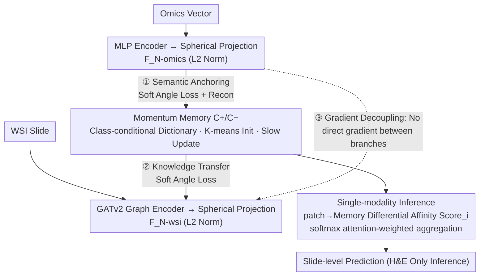

# Momentum Memory for Knowledge Distillation in Computational Pathology

**Conference**: CVPR 2026  
**arXiv**: [2602.21395](https://arxiv.org/abs/2602.21395)  
**Code**: [Available](https://github.com/CAIR-LAB-WFUSM/MoMKD)  
**Area**: Medical Imaging  
**Keywords**: Knowledge Distillation, Computational Pathology, Momentum Memory, Cross-modal Alignment, Multiple Instance Learning

## TL;DR

MoMKD is proposed to replace traditional batch-local feature alignment with a momentum-updated class-conditional memory bank, achieving genomics $\rightarrow$ pathology cross-modal knowledge distillation. This enables genome-level predictive capability using only H&E slides during inference.

## Background & Motivation

### 1. Background
Multimodal learning (genomics + pathology) performs excellently in cancer diagnosis, but paired omics-pathology data is scarce in clinical practice. Knowledge Distillation (KD) provides a practical solution: utilizing genomic supervision during training while requiring only pathology slides during inference.

### 2. Limitations of Prior Work
Existing pathology KD methods employ **batch-local alignment**—performing feature matching or regression distillation within the current mini-batch. This approach faces three issues: (1) supervision signals are transient and unstable, defined only by the current batch; (2) diversity of negative samples is limited; (3) in MIL scenarios for gigapixel WSIs, massive background noise patches overwhelm distillation signals, leading to poor generalization.

### 3. Key Challenge
Genomic data features high density (strong predictors), while WSI features are high-dimensional and sparse (dispersed signals). Direct joint training causes genomic gradients to overwhelm the WSI branch; batch-local alignment is unstable across heterogeneous modalities.

### 4. Key Insight
Drawing inspiration from the dynamic dictionary concept in self-supervised learning (MoCo), momentum memory is introduced as a distillation intermediary to replace direct batch-level matching.

## Method

### Overall Architecture

MoMKD addresses the clinical scarcity of paired genomics-pathology data by using genomics as a teacher during training to enable genome-level predictions from H&E slides alone during inference. Instead of direct cross-modal communication, it establishes a slowly evolving class-conditional momentum memory bank ($C^+$, $C^-$). WSIs are encoded via a GATv2 graph encoder and omics vectors via an MLP encoder. After projecting features into a shared spherical space, both align only with the memory bank: omics first "etches" genomic semantics into the memory (① Semantic Anchoring), and WSI then approximates this calibrated memory (② Knowledge Transfer). No direct gradients exist between the two branches (③ Gradient Decoupling). Alignment is scored using a Soft Angle loss. Once the memory accumulates global semantics across batches, the omics branch is discarded for inference, and slide-level predictions are aggregated using the differential affinity between WSI features and the memory.

### Key Designs

**1. Dual-branch Encoding & Spherical Projection: Forcing Cross-modal Similarity to Focus on Orientation**

WSIs are structured as spatial graphs with $k=8$ nearest neighbors, using two GATv2 layers to encode patch features $F_{\mathrm{wsi}} \in \mathbb{R}^{I \times D}$ ($D=256$), which are then projected and $L_2$ normalized to a spherical space $\mathbf{F}_{\mathrm{N\text{-}wsi}} \in \mathbb{R}^{D_N}$ ($D_N=128$). Omics vectors follow a similar MLP and spherical projection path. Normalization is crucial because genomics signals are dense while WSI features are high-dimensional and sparse, leading to vastly different norm magnitudes. By normalizing to a sphere, the inner product equals cosine similarity, ensuring cross-modal comparability by focusing solely on angular alignment.

**2. Momentum Memory as Distillation Intermediary: Replacing Jittery Batch Distributions with a Stable Global Dictionary**

Traditional pathology KD matches features within the current mini-batch, where signals are transient, negative samples are few, and background patches in gigapixel WSIs drown out useful information. MoMKD adopts the MoCo philosophy that "a large and stable dictionary is key to stable learning," treating the memory bank $\mathcal{C}$ (with $n$ components per class) as a distillation intermediary. Initialized via K-means on 10,000 random patches, it updates slowly via alignment and regularization losses. Rather than a simple instance cache, it acts as a highly compressed global semantic representation—the model aligns with stable, slowly evolving anchors rather than chasing noisy distributions in individual batches.

**3. Three-step Indirect Distillation Alignment: Calibrating Memory with Omics for WSI Transfer**

Distillation is decoupled into three steps revolving around the memory. First, **Omics Alignment** (Semantic Anchoring) aligns omics features with memory alongside a self-supervised reconstruction constraint to infuse visual initialization with true genomic semantics. Second, **WSI Alignment** (Knowledge Transfer) forces WSI features to align with this omics-calibrated memory, learning modality correlations defined by genomics. Third, **Gradient Decoupling** (Memory Evolution) ensures no direct gradient flow between omics and WSI branches; they interact only indirectly via memory, and classification head gradients do not propagate back to the memory. This triple isolation prevents genomic gradients from overwhelming the WSI branch and prevents classification targets from collapsing the memory.

**4. Soft Angle Alignment Loss: Leveraging LogSumExp to Distribute Gradients Across Memory Components**

The alignment loss aggregates similarity between a feature and all memory components of a class using LogSumExp to find a "soft maximum":

$$\phi(F, C) = \frac{1}{\tau_{\text{agg}}} \ln \sum_{j=1}^{n} \exp(\tau_{\text{agg}} F^T c_j)$$

The difference between positive and negative classes $\Delta(F; C^+, C^-) = \phi(F, C^+) - \phi(F, C^-)$ is then passed through a softplus function to pull positive samples toward $C^+$ and push them from $C^-$:

$$L_{\text{align}}(F, y=1) = \text{softplus}(\beta(\text{margin} - \Delta(F; C^+, C^-)))$$

Using LogSumExp instead of a hard max allows gradients to be distributed smoothly across all components of the class. A margin (=0.3) provides a safety buffer to prevent overfitting by not requiring perfect feature-memory matching.

**5. Memory-Guided Single-modality Inference: Using Memory as Global Genomic Anchors for Patch Selection**

The omics branch is discarded during inference. For each patch feature, the differential affinity $\text{Score}_i$ toward $C^+$ vs $C^-$ is calculated. These scores are passed through a softmax ($\tau=0.2$) to obtain attention weights for slide-level aggregation. Since the memory was calibrated by genomics during training, this scoring mechanism essentially identifies "which patches resemble positive patterns defined by genomics," recreating genomic knowledge through WSI features alone.

### Loss & Training

Total Loss: $L_{\text{total}} = \lambda_{\text{ce}} L_{\text{ce}} + \lambda_{\text{mse}} L_{\text{mse}} + \alpha_{\text{wsi}} L_{\text{align}}^{\text{wsi}} + \alpha_{\text{omics}} L_{\text{align}}^{\text{omics}} + \lambda_{\text{mem}} L_{\text{mem}}$

- $L_{\text{ce}}$: Classification cross-entropy ($\lambda_{\text{ce}}=0.5$), applied only to the WSI branch.
- $L_{\text{mse}}$: Omics self-supervised reconstruction ($\lambda_{\text{mse}}=0.01$) to maintain biological fidelity.
- $L_{\text{align}}$: Cross-modal alignment losses ($\alpha_{\text{wsi}}=0.2$, $\alpha_{\text{omics}}=0.05$).
- $L_{\text{mem}}$: Memory regularization ($\lambda_{\text{mem}}=0.1$), including VQ loss (patch-to-nearest-memory MSE) and an orthogonal constraint between memory components.

Feature backbone: UNI v2 (frozen), 5-fold cross-validation, TCGA-BRCA dataset.

## Key Experimental Results

### Main Results

**Table 1: Internal Comparison on TCGA-BRCA (AUC%)**

| Method | HER2 AUC | PR AUC | ODX AUC | Type |
|------|----------|--------|---------|------|
| ABMIL | 72.9±3.1 | 84.5±2.3 | 79.3±2.5 | WSI-only |
| WIKG | 75.5±5.0 | 84.9±3.0 | 78.3±3.7 | WSI-only |
| TDC | 76.2±2.1 | 84.7±5.3 | 81.0±2.2 | Multimodal KD |
| MKD | 77.1±2.3 | 85.1±1.2 | 80.1±1.5 | Multimodal KD |
| G-HANet | 76.1±5.6 | 85.0±2.3 | 80.5±1.3 | Multimodal KD |
| **MoMKD (Ours)** | **79.6±0.7** | **87.9±0.9** | **82.3±2.3**| Multimodal KD |

MoMKD leads across all three tasks, with gains of +4.1%, +3.0%, and +4.0% over the best WSI-only method (WIKG).

**Table 2: External Validation (In-house ODX)**

| Method | AUC | ACC | F1 |
|------|-----|-----|-----|
| DTFDMIL | 76.2±2.2 | 86.5±1.5 | 63.5±3.9 |
| TDC | 76.5±2.1 | 86.2±3.0 | 63.5±3.2 |
| **MoMKD (Ours)** | **79.4±0.8** | **87.1±1.7** | **68.0±3.0** |

Strong cross-domain generalization was observed, with AUC Gain of +2.9% and F1 Gain of +4.5%.

### Ablation Study

| Configuration | HER2 AUC(%) | Description |
|------|-------------|------|
| WSI baseline | 73.9±3.1 | No distillation |
| WSI + WSI Alignment only | 75.2±2.4 | Memory shaped only by WSI |
| WSI + Omics Alignment only | 75.7±2.5 | Memory calibrated only by Omics |
| No Omics Recon | 78.0±3.6 | Unstable omics encoding |
| **MoMKD (Full)** | **79.6±0.7** | Synergy of all components |

**Fixed vs. Momentum Memory**: Momentum memory provided a +4.4% gain on HER2 and +5.9% on in-house data. Performance for fixed memory collapsed during cross-domain testing (81.9% $\rightarrow$ 73.5%), while momentum memory remained robust (82.3% $\rightarrow$ 79.4%).

### Key Findings

1. **Momentum Update is Essential**: Fixed memory performs adequately on source domains but degrades severely in cross-domain settings, proving momentum updates are indispensable for resisting distribution shift.
2. **Complementary Bimodal Alignment**: Omics alignment injects semantics, while WSI alignment transfers knowledge; both are necessary.
3. **Adaptive Memory Capacity**: Harder tasks (HER2) maintain more active memory components, while easier tasks (PR/ODX) converge to fewer—memory automatically adapts to task complexity.
4. **Visualization Validation**: Positive memory activations correlate with tumor-rich and stroma-interaction areas, while negative activations correlate with adipose tissue and normal ducts, proving the memory captures biological significance.

## Highlights & Insights

1. **Migration of MoCo Dictionary Ideas to Cross-modal KD**: Elegantly solves the instability of batch-local alignment by using memory as an information bottleneck that serves as both a compressor and an intermediary.
2. **Sophisticated Gradient Decoupling**: Omics and WSI branches interact only indirectly via memory, with classification gradients isolated from the memory evolution—the triple isolation ensures slow, stable semantic convergence.
3. **Significant Variance Reduction**: MoMKD's standard deviation (0.7-2.3%) is significantly lower than other methods (2-5%), indicating that the momentum mechanism brings robust training stability.
4. **High Interpretability**: The mapping from memory components to patches can be visualized on WSIs, facilitating review by pathology experts.

## Limitations & Future Work

1. **Binary Classification Focus**: Only HER2/PR/ODX (binary) were validated; multi-class scenarios (e.g., molecular subtyping) remain unexplored.
2. **Manual Memory Size**: The selection of $n$ lacks an adaptive mechanism.
3. **Staining Limitation**: Only H&E slides were used; IHC-stained WSIs might provide additional information.
4. **Dataset Scale**: Sample sizes for TCGA-BRCA tasks (800-1000) are relatively small; larger-scale external validation is needed.
5. **Single Backbone**: Evaluated only with UNI v2 features; the impact of different patch encoders remains to be explored.

## Related Work & Insights

- **MoCo $\rightarrow$ MoMKD Migration**: The insight from self-supervised learning that "a large, stable dictionary is key to stable learning" was successfully migrated to cross-modal KD.
- **Evolution of Pathology KD**: Transition from TDC (gradient distillation) $\rightarrow$ MKD (online multi-teacher) $\rightarrow$ G-HANet (reconstruction distillation) $\rightarrow$ MoMKD (memory alignment) marks a shift from batch-local to global alignment.
- **VQ Mechanism Inspiration**: The VQ loss in memory regularization is consistent with VQ-VAE concepts; EMA could be considered as an alternative to stop-gradient.

## Rating

⭐⭐⭐⭐ (4/5)

Innovative introduction of MoCo dictionary concepts into cross-modal KD, with sophisticated gradient decoupling and indirect distillation designs. Experiments across three tasks plus external validation, ablation, and visualization are thorough, though limited by data scale. This provides a new paradigm for cross-modal distillation in computational pathology.

<!-- RELATED:START -->

## Related Papers

- [\[CVPR 2026\] From Infusion to Assimilation Distillation for Medical Image Segmentation](from_infusion_to_assimilation_distillation_for_medical_image_segmentation.md)
- [\[NeurIPS 2025\] Revisiting End-to-End Learning with Slide-level Supervision in Computational Pathology](../../NeurIPS2025/medical_imaging/revisiting_end-to-end_learning_with_slide-level_supervision_in_computational_pat.md)
- [\[CVPR 2026\] Forging a Dynamic Memory: Retrieval-Guided Continual Learning for Generalist Medical Foundation Models](forging_a_dynamic_memory_retrieval-guided_continual_learning_for_generalist_medi.md)
- [\[CVPR 2026\] KAMP: Knowledge-Anchored Multimodal Pretraining Framework for Medical Image Representation](kamp_knowledge-anchored_multimodal_pretraining_framework_for_medical_image_repre.md)
- [\[CVPR 2026\] PDD: Manifold-Prior Diverse Distillation for Medical Anomaly Detection](pdd_manifold-prior_diverse_distillation_for_medical_anomaly_detection.md)

<!-- RELATED:END -->
