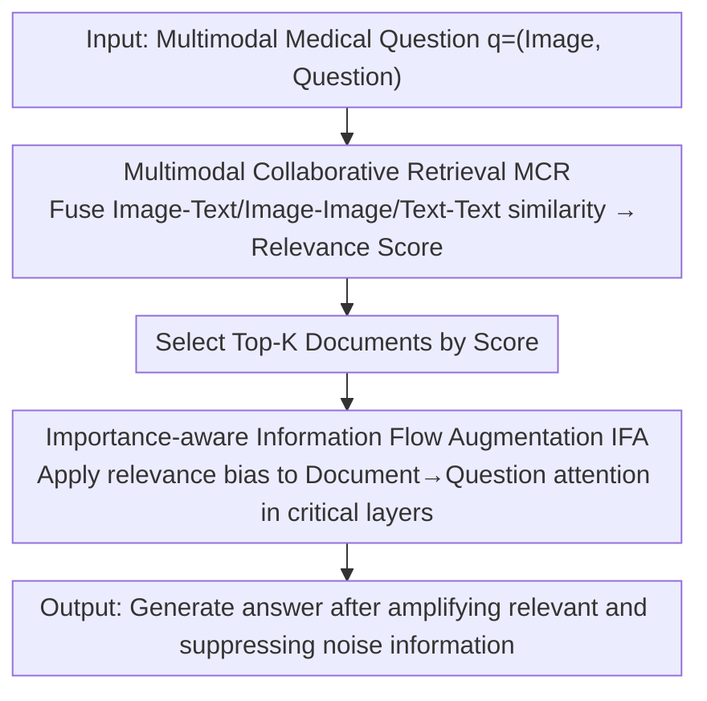

# MR-RAG: Multimodal Relevance-Aware Retrieval-Augmented Generation for Medical Visual Question Answering

**Conference**: CVPR 2026  
**Paper**: [CVF Open Access](https://openaccess.thecvf.com/content/CVPR2026/html/Li_MR-RAG_Multimodal_Relevance_Aware_Retrieval-Augmented_Generation_for_Medical_Visual_Question_Answering_CVPR_2026_paper.html)  
**Code**: To be confirmed  
**Area**: Medical Imaging / Medical VQA / Retrieval-Augmented Generation  
**Keywords**: Medical VQA, Retrieval-Augmented Generation, Multimodal Relevance, Attention Regulation, LVLM

## TL;DR
MR-RAG optimizes both retrieval and generation stages of the medical VQA RAG pipeline: the retrieval stage utilizes a lightweight adapter to fuse image-text, image-image, and text-text similarities for multimodal relevance scoring, while the generation stage injects these scores into the LVLM's attention mechanism to amplify information from highly relevant documents and suppress noise, achieving up to a 6.4% accuracy improvement across three medical datasets.

## Background & Motivation
**Background**: The standard approach for applying Large Vision-Language Models (LVLMs) to the medical domain is Retrieval-Augmented Generation (RAG). By retrieving external medical knowledge and prepending it to the input, RAG mitigates the domain gap between pre-training data and specialized medical expertise. Recent works (RULE, MMed-RAG, FactMM-RAG, etc.) have demonstrated the effectiveness of RAG in medical VQA and radiology report generation.

**Limitations of Prior Work**: Existing medical RAG methods suffer from significant flaws in both retrieval and generation. In retrieval, **single-similarity retrieval** is prevalent—most methods estimate document relevance using only "query image vs. knowledge base report" (image-to-text) similarity, ignoring image-to-image and text-to-text pairs which are equally informative, leading to inaccurate retrieval. In generation, **relevance-agnostic fusion** is common—retrieved documents are fed uniformly into the LVLM without distinction. Consequently, the model struggles to differentiate useful information from noise, diluting key information while amplifying irrelevant content.

**Key Challenge**: Retrieval and generation are treated in isolation, and the multimodal signal of "how relevant a document actually is" has not been explicitly modeled throughout the process. The authors conducted an experiment: as more irrelevant documents were introduced into the retrieval set, the ratio of noise-related attention increased, and accuracy dropped from 77.9% (no noise) to 68.1% (when half the documents were irrelevant). Standard RAG models are indeed easily misled by unreliable content, which is particularly dangerous in high-stakes medical decision-making.

**Goal**: To propose a unified two-stage framework that utilizes multimodal relevance signals to serve both retrieval (accuracy) and generation (fidelity).

**Key Insight**: RAG inherently provides a neglected supervisory signal—the semantic relevance of retrieved documents. By quantifying this relevance and injecting it into the attention mechanism, one can achieve controllable, relevance-aware information flow without retraining the model.

**Core Idea**: Replace "single-similarity retrieval + uniform fusion" with "Multimodal Collaborative Retrieval (MCR) to calculate relevance scores + Importance-aware Information Flow Augmentation (IFA) to inject scores into attention," bridging retrieval and generation via a consistent multimodal relevance signal.

## Method

### Overall Architecture
MR-RAG is a two-stage RAG enhancement framework using LLaVA-Med-1.5 as the backbone. The retriever uses a bi-tower structure with a ResNet-50 vision encoder and a BioClinicalBERT text encoder. Given a multimodal medical question $q=(q_i, q_t)$ (image $q_i$, text $q_t$) and a document database $D=\{d_k=(d_k^i, d_k^t)\}$, the process follows two steps. In the retrieval stage, the Multimodal Collaborative Retrieval (MCR) module uses a lightweight adapter to fuse image-text, image-image, and text-text similarities into a single relevance score to select Top-K documents. In the generation stage, Importance-aware Information Flow Augmentation (IFA) treats these scores as document-level importance signals, adding a relevance bias to the "Reports→Question" attention in critical LVLM layers to modulate the influence of each document.

### Key Designs

**1. Multimodal Collaborative Retrieval (MCR): Learning fusion for single-similarity replacement**

Medical RAG often relies solely on image-to-text similarity, missing complementary cues. MCR addresses this for query $q=(q_i,q_t)$ and candidate $d=(d_i,d_t)$ by fusing three cosine similarities:

$$f(q,d) = \alpha \cdot \mathrm{Sim}(q_i, d_t) + \beta \cdot \mathrm{Sim}(q_i, d_i) + \gamma \cdot \mathrm{Sim}(q_t, d_t)$$

where $\alpha,\beta,\gamma$ are **learnable parameters** that adaptively reflect the relative importance of each modality pair. They are trained using the InfoNCE loss: $\mathcal{L} = -\log \frac{e^{s^+/\tau}}{e^{s^+/\tau} + \sum_j e^{s_j^-/\tau}}$, where $s^+$ is the fusion score of positive samples and $s_j^-$ is that of negative samples. The training set $D_{train}$ is constructed by using an LVLM to assign "answer confidence" to documents, treating the top-1 as positive and bottom-m as negative. This approach utilizes cross-modal and intra-modal cues for more robust retrieval in clinical scenarios.

**2. Importance-aware Information Flow Augmentation (IFA): Soft-injection of scores into critical layer attention**

To prevent irrelevant documents from overshadowing key information, IFA intervenes in the attention flow. Through attention blocking experiments, the authors identified the "Reports→Question" direction in specific critical layers $L$ as decisive for information transfer. IFA modulates the attention logits $\tilde{A}$ only in these layers by adding a relevance bias:

$$\tilde{A}'_{ij} = \tilde{A}_{ij} + \lambda_{ij} \cdot |\tilde{A}_{ij}|$$

The modulation coefficient $\lambda_{ij}$ is non-zero only when $i$ belongs to the question token set $\mathcal{Q}$ and $j$ belongs to a document token set $\mathcal{D}_k$. It is defined by the Min-Max normalized value of the fusion score $\mathrm{Score}_k \in [0,1]$. Multiplying by $|\tilde{A}_{ij}|$ ensures the bias scales with the original attention magnitude. This soft modulation preserves model flexibility and prevents abrupt attention shifts while amplifying relevant information paths.

**3. Bridging Retrieval and Generation: Reuse of the multimodal relevance signal**

These modules are deeply integrated. IFA reuses the exact relevance scores calculated by MCR as importance signals. This ensures that "accurate retrieval" and "correct utilization" are synchronized by the same signal. The pipeline (Algorithm 2) computes scores $f(q,d)$ for the retrieval set, selects Top-K, concatenates tokens for input, and applies IFA in critical layers during inference. This directly addresses the disconnection between retrieval and generation.

### Loss & Training
The only trainable components are the lightweight MCR adapter weights $(\alpha,\beta,\gamma)$, optimized via the InfoNCE contrastive loss (Eq. 2) on the self-constructed dataset $D_{train}$. Parameters are updated via gradient descent: $(\alpha,\beta,\gamma) \leftarrow (\alpha,\beta,\gamma) - \eta \cdot \nabla \mathcal{L}$. IFA is an inference-time intervention requiring no training. The LVLM backbone remains frozen throughout.

## Key Experimental Results

### Main Results
Evaluated on three medical VQA datasets: Harvard-FairVLMed (Fundus, 4285 tests), IU-Xray (Chest X-ray, 2573), and MIMIC-CXR (Chest X-ray, 3460). Accuracy/F1 comparison (%):

| Method | FairVLMed Acc | FairVLMed F1 | IU-Xray Acc | IU-Xray F1 | MIMIC Acc | MIMIC F1 |
|------|---------------|--------------|-------------|------------|-----------|----------|
| LLaVA-Med-1.5 | 77.35 | 60.34 | 85.64 | 82.62 | 71.92 | 71.16 |
| +OPERA (Decoding) | 73.94 | 57.80 | 86.49 | 83.64 | 70.39 | 70.21 |
| +FactMM-RAG | 79.59 | 60.29 | 86.85 | 83.70 | 72.32 | 67.76 |
| +MMed-RAG | 70.57 | 56.39 | 84.57 | 81.63 | 70.36 | 69.81 |
| **MR-RAG (Ours)** | **84.47** | **66.78** | **88.13** | **85.19** | **79.35** | **78.61** |

MR-RAG leads across all metrics. Compared to the best baseline, it achieves accuracy gains of +4.9% / +1.3% / +6.4% on FairVLMed/IU-Xray/MIMIC, respectively. It also consistently outperforms specialized Med-LVLMs like Med-Flamingo and MiniGPT-Med.

### Ablation Study
Average results across three datasets (%):

| Configuration | Acc | Prec | Recall | F1 |
|------|-----|------|--------|-----|
| LLaVA-Med-1.5 (Baseline, Direct Concat) | 77.57 | 68.83 | 71.56 | 69.61 |
| +MCR | 81.95 | 73.78 | 73.72 | 73.34 |
| +MCR+IFA (Full MR-RAG) | **83.66** | **75.90** | **74.88** | **75.33** |

### Key Findings
- Both modules provide independent and cumulative gains. MCR improves F1 from 69.61 to 73.34 (benefits of multimodal retrieval), and IFA further increases it to 75.33 (benefits of attention refinement).
- Noise sensitivity experiments confirm the motivation for IFA: standard RAG accuracy drops from 77.9% to 68.1% as noise increases, validating the need for noise suppression.
- Soft modulation is superior to hard masking: IFA uses a relevance bias for soft amplification, avoiding the abrupt attention changes associated with masking.

## Highlights & Insights
- Quantifying "document relevance" from an implicit ranking in retrieval into an explicit learnable multimodal score for cross-stage reuse is a clean and effective design.
- IFA uses attention blocking experiments to target specific information paths (Reports→Question) rather than indiscriminately modifying all attention layers, which provides interpretability and reduces side effects.
- The framework is lightweight and training-free for the LVLM; only three scalar weights $(\alpha,\beta,\gamma)$ are trained, making it efficient for compute-constrained medical environments.

## Limitations & Future Work
- The learnable weights $\alpha,\beta,\gamma$ are global scalars; future research could explore fine-grained adaptation (e.g., per-sample or per-layer).
- IFA relies on manual selection of "critical layers $L$." Whether these layers are consistent across different backbones or datasets remains an open question.
- Evaluation is concentrated on chest X-rays and fundus images; generalization to more modalities (CT/MRI/Pathology) and open-ended generation tasks requires further validation.
- The quality of the relevance score is limited by the bi-tower encoders (ResNet-50 + BioClinicalBERT); representation deficiencies in rare diseases will propagate to retrieval and attention regulation.

## Related Work & Insights
- **vs RULE / MMed-RAG**: These methods improve RAG through retrieval volume calibration or preference alignment but do not explicitly model individual document importance or inject it into the internal reasoning process.
- **vs FactMM-RAG**: While using the same LLaVA-Med-1.5 backbone, FactMM-RAG uses a simpler retrieval strategy. MR-RAG's tripartite similarity fusion and attention regulation yield better performance.
- **vs PASTA / PAI / ITI (Attention Steering)**: These methods often target unimodal generation or require heavy supervision. MR-RAG utilizes RAG’s inherent retrieval relevance as free supervision to bridge attention steering with RAG.

## Rating
- Novelty: ⭐⭐⭐⭐ The combination of "relevance-aware cross-stage signals" and "attention injection" is clear, though both components have separate precedents.
- Experimental Thoroughness: ⭐⭐⭐⭐ Extensive testing on three datasets with noise sensitivity analysis, though task coverage is somewhat narrow.
- Writing Quality: ⭐⭐⭐⭐ Logical flow from motivation to method, with clear pseudocode and formulas.
- Value: ⭐⭐⭐⭐ A training-free, low-cost framework with significant gains for medical VQA RAG implementation.

<!-- RELATED:START -->

## Related Papers

- [\[CVPR 2026\] Dual-Level Confidence based Implicit Self-Refinement for Medical Visual Question Answering](dual-level_confidence_based_implicit_self-refinement_for_medical_visual_question.md)
- [\[CVPR 2026\] Attention Consistent Longitudinal Medical Visual Question Answering Guided by Vision Foundation Models](attention_consistent_longitudinal_medical_visual_question_answering_guided_by_vi.md)
- [\[ICLR 2026\] Q-FSRU: Quantum-Augmented Frequency-Spectral Fusion for Medical Visual Question Answering](../../ICLR2026/medical_imaging/q-fsru_quantum-augmented_frequency-spectral_for_medical_visual_question_answerin.md)
- [\[CVPR 2026\] Sketch2CT: Multimodal Diffusion for Structure-Aware 3D Medical Volume Generation](sketch2ct_multimodal_diffusion_for_structure-aware_3d_medical_volume_generation.md)
- [\[CVPR 2026\] Personalized Longitudinal Medical Report Generation via Temporally-Aware Federated Adaptation](personalized_longitudinal_medical_report_generation_via_temporally-aware_federat.md)

<!-- RELATED:END -->
