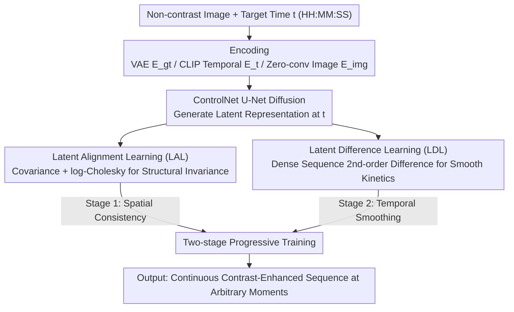

# MRI Contrast Enhancement Kinetics World Model

**Conference**: CVPR2026  
**arXiv**: [2602.19285](https://arxiv.org/abs/2602.19285)  
**Code**: [GitHub](https://github.com/DD0922/MRI-Contrast-Enhancement-Kinetics-World-Model)  
**Area**: Medical Imaging  
**Keywords**: MRI Contrast Enhancement, World Model, Spatiotemporal Consistency Learning, Latent Alignment, Diffusion Model, DCE-MRI

## TL;DR

The authors first propose the MRI Contrast Enhancement Kinetics World Model (MRI CEKWorld), which employs Spatiotemporal Consistency Learning (STCL) to achieve high-fidelity continuous contrast-enhanced sequence generation from non-contrast MRI using sparsely sampled data, resolving the dual challenges of content distortion and temporal discontinuity.

## Background & Motivation

1.  **Low information efficiency of clinical contrast MRI**: Contrast agent injections involve safety risks (deposition, allergies) and high economic costs. However, actual acquired sequences are sparse and fixed in time, creating a severe mismatch between information gain and cost.
2.  **World models can simulate contrast kinetics**: World models excel at learning the dynamic evolution of physical systems. Applying them to MRI contrast enhancement enables continuous dynamic imaging without agents, circumventing injection risks.
3.  **Extremely low temporal resolution of MRI**: Constrained by reconstruction time and patient respiratory cooperation, MRI sequences are extremely sparse (second-level intervals), far below the millisecond-level continuous frames in video domains, which significantly restricts model training.
4.  **Spatial content distortion from sparse training**: Missing timepoints lack ground-truth supervision, causing the model to overfit to irrelevant features, resulting in structural deformation and organ misalignment.
5.  **Temporal discontinuity from sparse training**: Lack of continuous sampling data prevents the model from learning smooth contrast kinetic laws, leading to temporal jumps and inter-frame inconsistencies in generated sequences.
6.  **Limitations of prior work**: Static generation methods only synthesize single-timepoint images; dynamic sequence methods remain limited to image-to-image mapping without truly simulating contrast kinetics; prior-based regularization and pixel-space smoothing fail to preserve patient-specific details and avoid blurring, respectively.

## Method

### Overall Architecture

MRI CEKWorld is based on the ControlNet architecture. The objective is to learn a continuous set of contrast kinetics from DCE-MRI data with only a few sparsely collected timepoints. Given a non-contrast image $\mathcal{I}_{p,0}$ and an arbitrary time $t$, the model generates the contrast-enhanced image $\hat{\mathcal{I}}_p(t)$ at that moment. The workflow involves: a VAE encoder $E_{gt}$ to compress ground-truth contrast images into latent space; a CLIP temporal encoder $E_t$ to convert "duration after injection" (HH:MM:SS text) into semantic features to guide time-specific enhancement; and a zero-convolution image encoder $E_{img}$ to inject non-contrast images into U-Net layers as generation prompts. Training is divided into two stages (spatial consistency followed by temporal smoothing). The core is Spatiotemporal Consistency Learning (STCL), which encodes physical priors into training via LAL and LDL regularizations.

### Key Designs

**1. Latent Alignment Learning (LAL): Combating Content Distortion with Anatomical Invariance**

Under sparse sampling, many missing timepoints lack ground-truth supervision, making it easy for models to overfit and misalign organ structures. LAL leverages the physical fact that anatomical structures (organ contours, tissue boundaries) remain invariant throughout the contrast process for a single patient. Latent representations $\hat{x}_0$ are extracted from the diffusion reverse process, flattened, and centered to calculate covariance matrices $\Sigma_t$ at each timepoint to encode spatial co-occurrence between anatomical regions. Shrinkage regularization $\tilde{\Sigma}_t = (1-\gamma)\Sigma_t + \gamma I + \varepsilon I$ is applied to ensure positive definiteness. Using log-Cholesky parameterization, the covariance is mapped to Euclidean vectors $z_t$. A patient-level template representing time-invariant structure is obtained by averaging timepoints: $\bar{z} = \frac{1}{T}\sum_{t=1}^T z_t$. Finally, an isometric constraint ensures the distance from each moment $z_t$ to the template is consistent:

$$\mathcal{L}_{Spatial} = \frac{1}{P}\sum_p \frac{1}{T_p}\sum_t \|z_t - \bar{z}\|_2^2$$

This anchors content consistency while allowing for reasonable dynamic changes in contrast by enforcing distance consistency rather than total equality.

**2. Latent Difference Learning (LDL): Forcing Continuous Kinetics via Second-order Differencing**

Spatial consistency alone is insufficient—sparse acquisition prevents learning smooth evolution, causing temporal jumps. LDL utilizes the prior that contrast enhancement should evolve smoothly. First, $K_i$ virtual timepoints are uniformly inserted between sparse points to form a dense sequence $T_{dense}$ (latent reps for acquired points are recovered from denoising; inserted points are predicted from Gaussian noise). Discrete second-order central differences $\mathbf{D}_2^k$ are calculated with non-equidistant adaptive weights $w^k = \frac{1}{1+h_0^k+h_1^k}$ to penalize large intervals less severely, finally constraining the differences toward zero:

$$\mathcal{L}_{Temporal} = \frac{1}{T-2}\sum_{k=1}^{T-2}\|\mathbf{D}_2^{(k)}\|_1$$

The L1 norm is used for robustness against outliers. Second-order differencing suppresses "curvature" rather than "velocity," thereby inhibiting sudden jumps without forcing kinetics into a straight line, matching the non-linear physiological process of contrast agent wash-in/wash-out.

### Loss & Training

A two-stage progressive training strategy is used to prevent the spatial and temporal objectives from conflicting:
-   **Stage 1** (Diffusion warmup + Spatial consistency): $\mathcal{L}_1 = \mathcal{L}_{Diffusion} + \lambda_{Spatial}\mathcal{L}_{Spatial}$
-   **Stage 2** (Temporal smoothing): $\mathcal{L}_2 = \mathcal{L}_{Diffusion} + \lambda_{Temporal}\mathcal{L}_{Temporal}$

## Key Experimental Results

### Datasets & Settings

-   **Abdominal DCE-MRI** (Private): 91 patients, 1 non-contrast + 15 contrast-enhanced (6 arterial, 6 venous, 3 delayed phases within 300s).
-   **Breast DCE-MRI** (Duke Public): 922 cases, 3-4 timepoints post-injection.
-   Preprocessing: Resized to 256×256, normalized to [-1,1], 3-channel input; trained on A100 40GB.
-   Metrics: Spatial (PSNR, SSIM, LPIPS, rMSE); Temporal (cSSIM - mean structural similarity of adjacent frames).
-   Baselines: CustomDiff, T2I Adapter, CCNet, EditAR, ControlNet baseline.
-   Hyperparameters: epoch=14, batch_size=4, Abdominal $\lambda_{Spatial}=6.0$, Breast $\lambda_{Spatial}=4.0$, $\lambda_{Temporal}=1.0$, $K_i=2$.

### Main Results

| Method | Abdo PSNR↑ | Abdo SSIM↑ | Abdo cSSIM↑ | Breast PSNR↑ | Breast SSIM↑ | Breast cSSIM↑ |
| :--- | :--- | :--- | :--- | :--- | :--- | :--- |
| ControlNet baseline | 23.61 | 0.7178 | 0.8286 | 19.79 | 0.5196 | 0.3370 |
| + LAL | 23.92 | 0.7227 | 0.8439 | 20.86 | 0.5442 | 0.3879 |
| + LDL | 24.05 | 0.7369 | 0.8411 | 20.21 | 0.5391 | 0.3392 |
| **MRI CEKWorld** | **24.06** | **0.7419** | **0.8451** | **21.09** | **0.5599** | **0.3900** |
| CCNet | 24.35 | 0.5794 | 0.7098 | 21.47 | 0.4043 | 0.3155 |
| EditAR | 22.65 | 0.5571 | 0.7536 | 19.85 | 0.4170 | 0.3886 |

MRI CEKWorld achieved the best performance on Avg.SSIM (0.6509) and Avg.cSSIM (0.6176). While CCNet has higher PSNR, inadequate convergence leads to over-smoothing and loss of structural detail. Visual results show that CEKWorld achieves high spatial realism and natural kinetics, aligning closely with ground-truth.

### Ablation Study

-   LAL alone: Breast SSIM increased by 2.46%, PSNR by 1.07.
-   LDL alone: Abdominal SSIM increased by 1.25%, Breast SSIM by 5.09%.
-   The combination is complementary; LAL establishes spatial consistency while LDL enhances temporal smoothness.
-   **Contrast Kinetic Curves**: ROI sampling of the kidney across phases shows CEKWorld’s mean grayscale curves are smooth and stable, matching wash-in/wash-out physiology, whereas CCNet and EditAR show abrupt fluctuations.
-   **Latent Space Visualization**: PCA shows CEKWorld's feature points are continuously distributed chronologically, whereas the baseline is disordered.

## Highlights & Insights

-   **Novelty**: First application of a world model to MRI contrast enhancement kinetics, enabling continuous dynamic imaging without contrast agents, providing clear clinical value.
-   **Physics-Prior Driven Design**: LAL utilizes anatomical invariance while LDL utilizes kinetic smoothness; the design is elegant and theoretically grounded.
-   **log-Cholesky Parameterization**: Maps positive definite covariance matrices to Euclidean space for optimization, ensuring numerical stability and positive definiteness.
-   **Non-equidistant Differencing**: Adaptive smoothing constraints for varied time intervals, catering to the uneven acquisition common in DCE-MRI.
-   **Two-stage Strategy**: Progressive learning avoids multi-objective conflicts; experiments prove two-stage results exceed either loss used in isolation.

## Limitations & Future Work

-   Validated only on MRI; not yet extended to CT or other contrast modalities.
-   Second-order central differences cannot constrain the start/end timepoints (t=0s, t=1s), leading to outliers in visualization; unilateral differencing could be explored.
-   Small private abdominal dataset (91 cases); requires validation on multi-center data.
-   Two-stage training requires manual switching of loss functions; end-to-end joint optimization or adaptive weighting was not explored.
-   High rMSE in the breast dataset (attributed to the 0-4000 intensity range); lacks deep analysis of improvements.

## Related Work & Insights

-   **Vs. Static Virtual Contrast Methods**: Static methods only synthesize single-timepoint images from multi-modal non-contrast sequences (T1w, T2w, ADC) and cannot simulate temporal kinetic evolution.
-   **Vs. Dynamic Sequence Methods**: These remain image-to-image mappings between sparse points; this work achieves continuous-time modeling.
-   **Vs. General World Models**: Action-based models (Dreamer) depend on external control signals, and observation-based models require dense video sampling; both are unfeasible for MRI. MRI CEKWorld solves this via STCL.
-   **Vs. Spatiotemporal Consistency Methods**: Methods like Slow Feature Analysis or contrastive learning are unsuitable for extremely sparse DCE-MRI data; this work redefines consistency via covariance statistics and difference smoothing.

## Rating

-   Novelty: ⭐⭐⭐⭐⭐ 
-   Experimental Thoroughness: ⭐⭐⭐⭐ 
-   Writing Quality: ⭐⭐⭐⭐ 
-   Value: ⭐⭐⭐⭐⭐ 

<!-- RELATED:START -->

## Related Papers

- [\[CVPR 2026\] X-WIN: Building Chest Radiograph World Model via Predictive Sensing](x-win_building_chest_radiograph_world_model_via_predictive_sensing.md)
- [\[CVPR 2026\] Adaptive Anisotropic Gaussian Splatting for Multi-contrast MRI Arbitrary-Scale Super-Resolution with Anatomy Guidance](adaptive_anisotropic_gaussian_splatting_for_multi-contrast_mri_arbitrary-scale_s.md)
- [\[AAAI 2026\] PulseMind: A Multi-Modal Medical Model for Real-World Clinical Diagnosis](../../AAAI2026/medical_imaging/pulsemind_a_multi-modal_medical_model_for_real-world_clinical_diagnosis.md)
- [\[AAAI 2026\] CD-DPE: Dual-Prompt Expert Network Based on Convolutional Dictionary Feature Decoupling for Multi-Contrast MRI Super-Resolution](../../AAAI2026/medical_imaging/cd-dpe_dual-prompt_expert_network_based_on_convolutional_dictionary_feature_deco.md)
- [\[CVPR 2026\] OSA: Echocardiography Video Segmentation via Orthogonalized State Update and Anatomical Prior-aware Feature Enhancement](osa_echocardiography_video_segmentation_via_orthogonalized_state_update_and_anat.md)

<!-- RELATED:END -->
