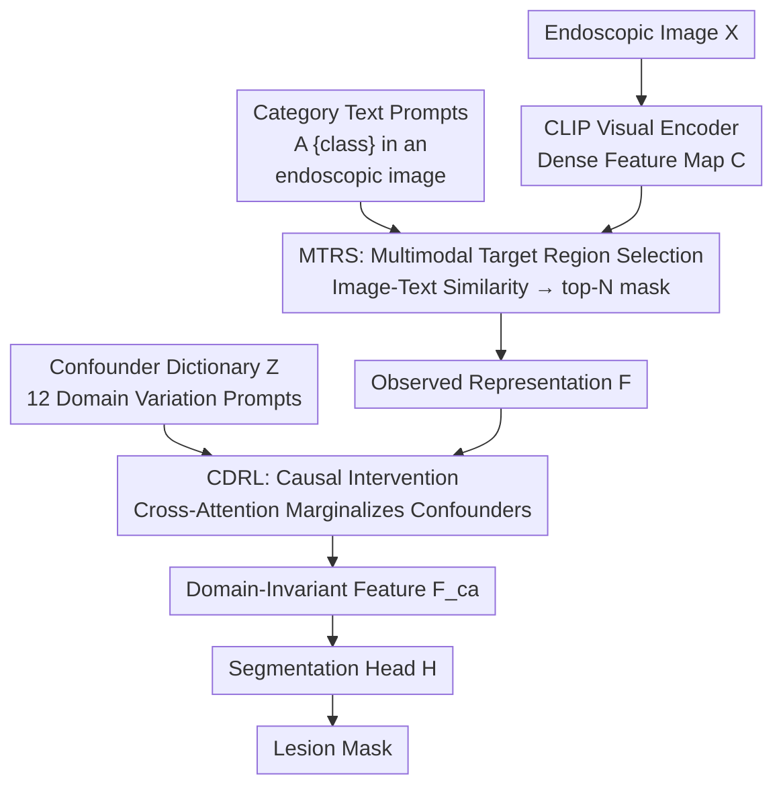

# Multimodal Causality-Driven Representation Learning for Generalizable Medical Image Segmentation

**Conference**: CVPR 2026  
**arXiv**: [2508.05008](https://arxiv.org/abs/2508.05008)  
**Code**: None  
**Area**: Medical Imaging / Domain Generalization / Multimodal VLM  
**Keywords**: Causal Intervention, Confounder Dictionary, Domain Generalization, CLIP, Endoscopic Segmentation

## TL;DR
To address domain drift caused by differences in equipment, lighting, and imaging modalities in medical images, this paper explicitly models these differences as "confounders." By constructing a confounder dictionary using CLIP text prompts and performing causal intervention through backdoor adjustment, the method improves the cross-domain average mDice by 2.0% over the strongest baseline in endoscopic segmentation.

## Background & Motivation

**Background**: Vision-Language Models (VLMs) like CLIP exhibit strong zero-shot capabilities in natural images and have recently been adopted as backbones for medical image segmentation. However, medical images face severe domain shift across different centers and devices; the same lesion can appear significantly different under various endoscopes, lighting conditions, and imaging protocols.

**Limitations of Prior Work**: Existing domain generalization (DG) methods—such as adversarial training to make features "domain-invariant," feature decoupling to separate anatomy from domain factors, or meta-learning to simulate domain drift—essentially focus on "suppressing" domain-related information. However, they **never explicitly remove the factors causing domain drift**. By tangling confounders with lesion features, these models are still misled by device artifacts or lighting in unseen target domains, leading to over-segmentation or irregular boundaries.

**Key Challenge**: The observed representation $F$ entangles **class-relevant information** $F_c$ and **domain-relevant confounders** $F_d$. The predictor learns $P(Y\mid F)$. Due to the presence of $F_d$, spurious correlations are introduced (similar to the "blue sky = airplane" fallacy), and the learned correlations fail in new domains. The objective is to obtain the intervention distribution $P(Y\mid do(F))$—cutting the influence of $F_d$ on $Y$.

**Goal**: To upgrade "domain drift removal" from empirical feature alignment to explicit intervention supported by causal theory—constructing a set of confounders representing various domain variations and marginalizing their effects.

**Key Insight**: The authors start from a Structural Causal Model (SCM). Since $F_c$ is not directly observable and $F$ cannot be explicitly split, they employ backdoor adjustment: introducing a confounder dictionary $Z$ to approximate the confounder distribution and marginalizing $Z$ to obtain invariant features that rely only on $F_c$. The confounder dictionary can be conveniently "spoken" by the CLIP text encoder—using natural language to describe various imaging variations.

**Core Idea**: Use CLIP text prompts to represent domain differences as a confounder dictionary $Z$, then use a causal intervention network to perform backdoor adjustment $\mathbb{E}_z[A(F,z)]$ on CLIP visual features, marginalizing out the confounders to obtain domain-invariant representations for the segmentation head.

## Method

### Overall Architecture
The input to MCDRL is an endoscopic image $X$ from a source domain, and the output is a pixel-level lesion mask. The pipeline consists of three stages: first, **MTRS** (Multimodal Target Region Selection) utilizes CLIP's image-text alignment to locate lesion-related regions and extract observed representations $F$; then, **CDRL** (Causality-Driven Representation Learning) models domain variations into a confounder dictionary, performs causal intervention on $F$, and marginalizes the confounders to obtain domain-invariant features $F_{\mathrm{ca}}$; finally, $F_{\mathrm{ca}}$ is fed into a segmentation head to generate the mask. The theoretical foundation is rewriting segmentation as an intervention distribution $P(Y\mid do(F))=\sum_{z\in Z}P(Y\mid F,z)P(z)$, approximated by the expectation over features $H(\mathbb{E}_z[A(F,z)])$.

### Key Designs

**1. MTRS Multimodal Target Region Selection: Localization before representation extraction via image-text similarity**

Medical images contain significant background information while lesions occupy small areas. Directly applying intervention to global CLIP features would dilute confounder modeling with irrelevant background. MTRS solves the problem of "where to focus first." Specifically, the CLIP visual encoder encodes the image into a dense feature map $C\in\mathbb{R}^{H\times W\times d}$. Simultaneously, text embeddings $\{e_k\}$ are generated for $K$ lesion categories using the template "A {$class_k$} in an endoscopic image." For each spatial location $(h,w)$, the cosine similarity between the visual feature and various category texts is calculated:

$$S[h,w,k]=\frac{C[h,w]\cdot e_k}{\|C[h,w]\|\,\|e_k\|}$$

A unified similarity map is obtained by taking the maximum along the category dimension $\hat{S}[h,w]=\max_k S[h,w,k]$. Positions corresponding to the top $N=\alpha\cdot H\cdot W$ scores ($\alpha\in[0,1]$ controls sparsity) are retained to form a binary mask $S^{\mathrm{mask}}$. This is element-wise multiplied with the original features $\tilde C[h,w]=C[h,w]\,S^{\mathrm{mask}}[h,w]$, and non-zero terms are rearranged into a compact representation $F\in\mathbb{R}^{N\times d}$. This $F$ carries both category and domain information, serving as the "observed representation" for intervention. The advantage is that no additional detector is required; weak localization is achieved purely through CLIP’s cross-modal priors.

**2. Confounder Dictionary: Articulating domain drift via natural language to form a marginalizable discrete confounder set**

Backdoor adjustment requires a set representing the confounder distribution, but $F_d$ is unobservable and cannot be sampled directly. The innovation here is that factors causing domain drift in endoscopic imaging are clinically understood and can be enumerated in text. The authors categorize confounders into five types: (i) field-of-view quality (blur, artifacts), (ii) lighting conditions (bright/dark/uneven), (iii) imaging technology (NBI, white light), (iv) distance factors (near/far view), and (v) surface interference (mucus, blood, reflection). Using the template "An endoscopy image with {$domain_n$}", $M=12$ representative prompts are written and processed by the CLIP text encoder to obtain the dictionary $Z=\{z_m\}_{m=1}^{M}\in\mathbb{R}^{M\times d}$. The choice of $M$ is design-driven, balancing domain coverage and computational cost. Thus, the confounder distribution is discretely approximated by a set of text embeddings—a key step for implementing the causal framework.

**3. Causal Intervention Network: Approximating the expectation over confounders via cross-attention**

With $Z$, theoretically, one should calculate $do(F)\approx\mathbb{E}_z[A(F,z)]$, which involves passing each confounder in the dictionary through the intervention network and averaging. Since direct calculation is infeasible, this paper uses cross-attention to approximate the entire marginalization in one pass:

$$F_{\mathrm{ca}}=A(F,Z)=\mathrm{Attn}(F,Z)$$

Where the query is the selected region features $F\in\mathbb{R}^{N\times d}$, and the key/value is the confounder dictionary $Z\in\mathbb{R}^{M\times d}$. The attention weights essentially measure "how relevant each confounder is to the current feature," and the influence of confounders is weighted and neutralized accordingly, outputting domain-invariant features $F_{\mathrm{ca}}\in\mathbb{R}^{N\times d}$. This step corresponds to the inner expectation in the formula $P(Y\mid do(F))\approx H(\mathbb{E}_z[A(F,z)])$—marginalizing the confounders at the feature level before the segmentation head $P=H(F_{\mathrm{ca}})$, rather than averaging predictions for each confounder, which would be far more computationally expensive. This reflects the fundamental difference from "feature decoupling/adversarial" methods: instead of suppressing an unknown direction, it explicitly enumerates confounders and integrates them out according to the causal formula.

### Loss & Training
The total loss is a weighted sum of three terms:

$$\mathcal{L}=\mathcal{L}_{\text{seg}}+\lambda_1\mathcal{L}_{\text{causal}}+\lambda_2\mathcal{L}_{\text{contrast}}$$

- $\mathcal{L}_{\text{seg}}$: Standard pixel-level cross-entropy segmentation loss.
- $\mathcal{L}_{\text{causal}}=\big\|\bar F_{\mathrm{ca}}-\frac{1}{M}\sum_{m=1}^{M}t_{k,m}\big\|^2$: Pulls the pooled intervened feature $\bar F_{\mathrm{ca}}=\mathrm{Pool}(F_{\mathrm{ca}})$ toward the "average text embedding of that category under all domain prompts," where $t_{k,m}$ is generated by the template "A [$class_k$] with [$domain_m$]". The intuition is that the semantic center of a lesion category should be consistent across various domains.
- $\mathcal{L}_{\text{contrast}}$: Contrastive fine-tuning of the CLIP visual encoder to pull image-level features $F_{\mathrm{vis}}$ closer to correct category texts $e_k$ and further from others, with temperature $\tau=0.5$.

Weights are $\lambda_1=0.5, \lambda_2=0.1$. A progressive training strategy is used: the causal intervention mechanism starts after the 10th epoch, with a total of 50 epochs; AdamW optimizer, initial learning rate 0.005, input $224\times224$, single A800 GPU. Warming up the segmentation backbone before starting intervention prevents noise from destabilizing early features.

## Key Experimental Results

Five datasets across three types of natural orifices: bronchoscopy BM-BronchoLC (Site A, 3057 frames), laryngoscopy Laryngoscope8 (Site B, 3533 images), and three laparoscopy/colonoscopy datasets: CVC-ClinicDB (Site C, 612), ETIS (Site D, 196), and Kvasir (Site E, 1000). Leave-one-site-out evaluation is adopted ("Site A" means training on B-E and testing on A). Metrics used are Dice, IoU, and Acc.

### Main Results
Average of five sites with ViT-L/14 backbone (in %):

| Method | Dice | IoU | Acc |
|------|------|-----|-----|
| Baseline | 75.1 | 68.3 | 90.9 |
| StyLIP | 78.3 | 71.2 | 92.5 |
| BiomedCoOp | 79.4 | 72.4 | 93.2 |
| **MCDRL** | **81.6** | **74.3** | **94.3** |

MCDRL achieves an average mDice of 81.6%, improving by 6.5% over the baseline and 2.0% over the strongest competitor, BiomedCoOp. Gains are more pronounced with larger backbones: the average mDice improves by 3.8% from ResNet-50 (78.6) to ViT-L/14 (81.6). Performance varies by site, with Site A being the highest and Site D the lowest.

By lesion type (ViT-L/14, mDice %):

| Method | Polyps | Tumors | Inflam. | Nodules | Cyst | Avg |
|------|--------|--------|---------|---------|------|-----|
| Baseline | 78.2 | 76.5 | 74.4 | 73.5 | 75.6 | 75.6 |
| BiomedCoOp | 81.5 | 79.8 | 77.3 | 78.5 | 75.6 | 78.5 |
| **MCDRL** | **83.9** | **82.2** | **80.1** | **84.9** | **80.8** | **82.4** |

The largest improvement is seen in nodules (+11.4%), attributed to the method's ability to capture subtle textures and boundaries crucial for nodule identification. The strong performance on inflammatory lesions (where visual patterns are more subtle and easily confused by domain factors) further validates the effect of de-confounding.

### Ablation Study

Module Ablation (mDice %, leave-one-site-out average):

| Configuration | Site A | Site C | Site D | Avg | Description |
|------|--------|--------|--------|-----|------|
| Baseline | 65.60 | 63.15 | 68.11 | 69.37 | Pure segmentation baseline |
| w/o MTRS | 77.09 | 80.50 | 78.32 | 80.47 | CDRL only |
| w/o CDRL | 79.51 | 77.40 | 77.29 | 78.71 | MTRS only |
| **MCDRL** | **82.53** | **88.73** | **90.25** | **88.46** | Full model |

> ⚠️ Note: The values in this ablation table (Table 3) are significantly higher than those in Main Results Table 1 (e.g., Site D reaches 90.25%), suggesting a different evaluation protocol. Focus on trends rather than direct comparison with Table 1.

Confounder dictionary size (Table 4, ViT-L/14, Avg Dice %): Average Dice increases from 76.7 to 81.6 as $N$ goes from 3 to 12. At $N=15$, it slightly drops to 81.4, indicating that excessive confounders introduce redundancy or noise. $N=12$ is the optimal trade-off.

Causal network depth (Table 5): As layers increase from 1 to 5, Average Dice goes from 78.7 to 82.0, but parameters rise from 12.4M to 37.5M and inference time from 142ms to 290ms. Performance saturates after 3-4 layers; 3 layers is the best point for accuracy-efficiency.

### Key Findings
- **Modules are complementary and crucial**: Removing either MTRS or CDRL results in 80.47 or 78.71 mDice respectively, but combining them jumps to 88.46 (+19.09% over baseline). CDRL removes domain confounders, while MTRS focuses attention on anatomically relevant regions.
- **Optimal capacity for the confounder dictionary**: 12 prompts covering five types of domain variations are sufficient; adding more leads to degradation—confirming that "explicit enumeration of confounders" is more important than "infinite capacity."
- **t-SNE evidence**: The baseline shows fragmented intra-class clusters under domain drift, while MCDRL's category distribution is more compactly aligned across domains, supporting the claim that the model learns category semantics rather than domain spurious correlations.

## Highlights & Insights
- **Translating "domain drift removal" into computable causal backdoor adjustment**: The most brilliant aspect is using the CLIP text encoder to write clinically identifiable confounders like "blur/lighting/NBI/reflection" into a text embedding dictionary. This makes an unobservable confounder distribution sampleable and marginalizable.
- **Approximating marginalization expectation with Cross-Attention in one step**: Instead of running intervention for every confounder in the dictionary, using the dictionary as Key/Value and features as Query allows $ \mathbb{E}_z[A(F,z)] $ to be completed in one attention pass. This "Dictionary as KV, Features as Q" paradigm is transferable to any task involving marginalizing out known interference factors.
- **Causal loss anchors invariance to cross-domain semantic centers**: $\mathcal{L}_{\text{causal}}$ pulls intervened features toward the cross-domain consistent semantics provided by the language model, which is more stable than pure adversarial image alignment.
- **Progressive Training**: Starting causal intervention at the 10th epoch is a practical trick to ensure the backbone learns basic segmentation before introducing intervention, preventing early noise from misguiding the causal module.

## Limitations & Future Work
- **Confounder dictionary relies on manual/clinical consensus**: The 12 prompts are manually designed for endoscopy. Adapting to other modalities (CT/MRI/Pathology) requires redesigning prompts, and the effectiveness of de-confounding depends on whether the enumeration is exhaustive.
- **Theoretical approximations**: Summation is approximated as expectation, and the "expectation over results" is approximated as the "result of the expectation" $\mathbb{E}_z[H(A)]\approx H(\mathbb{E}_z[A])$. This is only strictly true if $H$ is near-linear.
- **Inconsistent ablation data**: Table 3 values are much higher than Table 1, and the paper does not clarify the setting differences.
- **Notation conflicts**: Confounder count is $M=12$ in the text but $N$ in Table 4, where $N$ is also used for the number of selected regions in MTRS.
- Only validated on endoscopy; cross-modality generalization (e.g., across vastly different imaging techniques) remains unexplored.

## Related Work & Insights
- **vs. Adversarial DG (e.g., DANN [24])**: These use discriminators to force "domain-invariant" features, whereas this work explicitly enumerates confounders and integrates them via the backdoor formula; adversarial methods suppress unknown directions and can be unstable, while this is causally grounded and interpretation-friendly.
- **vs. Feature Decoupling [31]**: Decoupling attempts to split anatomy and domain factors into two paths, but $F_c$ is unobservable, making clean separation difficult; this work bypasses explicit splitting by directly marginalizing confounders.
- **vs. BiomedCoOp / StyLIP (VLM Prompt Learning)**: These also use CLIP for medical DG but lack the causal intervention layer. MCDRL's +2.0% mDice gain comes from explicit de-confounding.

## Rating
- Novelty: ⭐⭐⭐⭐ Combining backdoor adjustment with a CLIP text confounder dictionary for segmentation is novel, though similar paradigms exist in classification.
- Experimental Thoroughness: ⭐⭐⭐⭐ Leave-one-site-out across five sites and multi-dimensional ablations are solid, though some table data is confusing.
- Writing Quality: ⭐⭐⭐⭐ Clear causal derivation; well-motivated. Minor notation conflicts.
- Value: ⭐⭐⭐⭐ Provides an interpretable and transferable causal de-confounding route for medical cross-center domain generalization.

<!-- RELATED:START -->

## Related Papers

- [\[CVPR 2026\] KAMP: Knowledge-Anchored Multimodal Pretraining Framework for Medical Image Representation](kamp_knowledge-anchored_multimodal_pretraining_framework_for_medical_image_repre.md)
- [\[CVPR 2026\] Learning Generalizable 3D Medical Image Representations from Mask-Guided Self-Supervision](learning_generalizable_3d_medical_image_representations_from_mask-guided_self-su.md)
- [\[CVPR 2026\] H2-Surv: Hierarchical Hyperbolic Multimodal Representation Learning for Survival Prediction](h2-surv_hierarchical_hyperbolic_multimodal_representation_learning_for_survival_.md)
- [\[CVPR 2026\] GeoSemba: Reconstructing State Space Model for Cross Paradigm Representation in Medical Image Segmentation](geosemba_reconstructing_state_space_model_for_cross_paradigm_representation_in_m.md)
- [\[CVPR 2026\] InvCoSS: Inversion-driven Continual Self-supervised Learning in Medical Multi-modal Image Pre-training](invcoss_inversion-driven_continual_self-supervised_learning_in_medical_multi-mod.md)

<!-- RELATED:END -->
