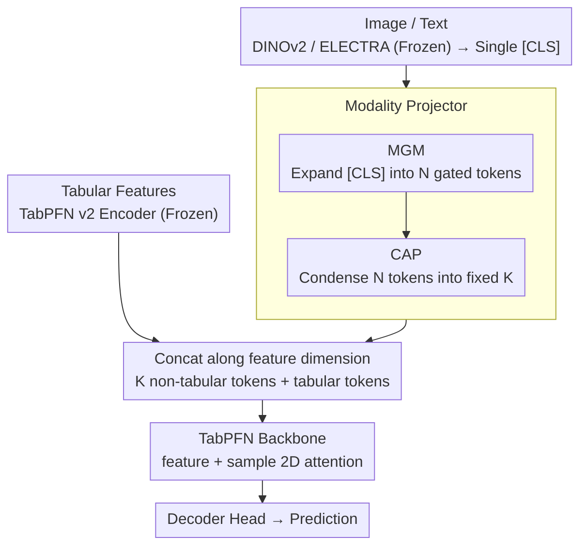

# MultiModalPFN: Extending Prior-Data Fitted Networks for Multimodal Tabular Learning

**Conference**: CVPR 2026  
**arXiv**: [2602.20223](https://arxiv.org/abs/2602.20223)  
**Code**: [Available](https://github.com/too-z/MultiModalPFN)  
**Area**: Medical Imaging  
**Keywords**: Tabular Learning, Multimodal Fusion, TabPFN, Attention Imbalance, Modality Projection

## TL;DR

MMPFN is proposed to extend the pretrained tabular foundation model TabPFN to multimodal (tabular + image/text) scenarios for the first time. It addresses non-tabular embedding over-compression and token count imbalance through a Multi-Head Gated MLP (MGM) and a Cross-Attention Pooler (CAP), outperforming SOTA on medical and general datasets.

## Background & Motivation

### 1. Background
As a tabular foundation model, TabPFN achieves Bayesian inference through pretraining on synthetic tabular data, enabling predictions in a single forward pass on small-to-medium datasets. However, TabPFN pretraining is limited to synthetic tabular data and cannot handle unstructured modalities such as images or text.

### 2. Limitations of Prior Work
(1) Real-world applications in medical and marketing fields often require merging structured and unstructured data (e.g., diagnostic results + medical imaging, sales records + product reviews); (2) The benefits of extending Gradient Boosted Decision Trees to heterogeneous data are limited; (3) Deep multimodal models exhibit poor performance and slow training in data-scarce scenarios.

### 3. Key Challenge
TabPFN possesses a strong tabular prior but cannot access unstructured modalities. Simple fusion leads to two failure modes: over-compression of non-tabular embeddings (insufficient information in a single [CLS] token) and attention imbalance caused by token count mismatch (attention is dominated by non-tabular modalities when non-tabular tokens $\gg$ tabular tokens).

### 4. Key Insight
A lightweight modality projector is designed to convert non-tabular embeddings into "tabular-compatible tokens," injecting multimodal information without destroying the tabular prior of TabPFN.

## Method

### Overall Architecture

MMPFN adds only a lightweight "bridge" layer outside the TabPFN backbone, organizing the entire pipeline into three stages:

1. **Per-Modality Encoders**: Tabular data uses the TabPFN v2 encoder, images use DINOv2 ViT-B/14 (taking [CLS]), and text uses ELECTRA (taking [CLS])—all three encoders are frozen.
2. **Modality Projector**: The core contribution, consisting of MGM and CAP sub-layers in series, converting a single image/text [CLS] embedding into $K$ $d$-dimensional, tabular-compatible tokens.
3. **TabPFN Backbone**: Joins the projected non-tabular tokens with tabular tokens along the feature dimension to form a unified table. The system reuses TabPFN’s 2D attention (feature attention + sample attention) for prediction, followed by a decoder head.

During training, all modality encoders are frozen. Only the modality projector, TabPFN backbone, and decoder head are trained, with the entire fine-tuning process taking only 100 iterations.

### Key Designs

Connecting non-tabular embeddings to TabPFN might seem to require only a linear projection. However, the authors found that simple approaches fail in two ways: a single [CLS] token compresses entire images/texts into one vector, causing severe information loss (over-compression); conversely, feeding all patch/word tokens from an encoder causes non-tabular tokens to overwhelm tabular tokens, monopolizing attention (imbalance). The following designs address these issues.

**1. Multi-Head Gated MLP (MGM): Expanding [CLS] into complementary tokens to solve over-compression**

A single [CLS] vector from DINOv2/ELECTRA represents the entire input. Directly projecting it to one tabular token provides only a "thumbnail" view to TabPFN. MGM feeds the same $h_{\text{CLS}}$ into $N$ independent MLP heads, each projecting the encoder dimension to $d$ dimensions to generate $N$ tokens:

$$\text{MGM}(h_{\text{CLS}}) = \{g_i \odot \text{MLP}_i(h_{\text{CLS}})\}_{i=1}^{N}$$

Each head is element-wise modulated by a GLU gate $g_i = \sigma(W_g^{(i)} h_{\text{CLS}} + b_g^{(i)})$. The gates force different heads to activate different subspaces within the [CLS], producing complementary rather than redundant representations. Ablations show Multi-head MGM (57.37) significantly outperforms Multi-head MLP without gates (55.81).

**2. Cross-Attention Pooler (CAP): Regulating tokens to a fixed $K$ to balance token counts**

While MGM solves the information density problem, it introduces a new one: too many tokens allow the non-tabular modality to dominate TabPFN’s feature attention. CAP uses a set of $K$ learnable query vectors to perform cross-attention, treating the $N$ MGM tokens as key/value pairs to extract information into $K$ compact tokens. These are refined by an MLP and concatenated with tabular tokens. This ensures that regardless of the encoder's output density, the number of non-tabular tokens entering TabPFN is fixed at a controllable $K$. The synergy between MGM's expansion and CAP's contraction eliminates the non-monotonic phenomenon where adding non-tabular tokens previously degraded performance.

**3. Theoretical Analysis of Attention Imbalance: Why $K$ must be fixed**

The authors provide a quantitative explanation for why token imbalance suppresses tabular signals under softmax attention. Let $N_I, N_T$ be the number of non-tabular and tabular tokens, and $c_I, c_T$ be their respective average attention quality per token. The total attention share for the non-tabular modality is approximately:

$$\mathbb{E}[a_I] \approx \frac{N_I c_I}{N_I c_I + N_T c_T}$$

When per-token quality is comparable ($c_I \approx c_T$) but $N_I \gg N_T$, $a_I \to 1$, and the tabular signal is almost entirely drowned out. This formula justifies the CAP design—forcing $N_I$ to a fixed $K$ brings the attention share back to a controllable range.

### Loss & Training

- **Loss**: Cross-entropy loss
- **Optimizer**: AdamW, $\text{lr}=1 \times 10^{-5}$, batch size=1
- **Training**: 100 iterations of fine-tuning
- **Freezing Strategy**: All modality encoders are frozen (TabPFN v2, DINOv2, ELECTRA); only MGM, CAP, TabPFN backbone, and decoder head are trained.
- **Inference**: Follows the standard TabPFN in-context inference protocol.

## Key Experimental Results

### Main Results

**Table 2: Image-Tabular Datasets (Accuracy)**

| Method | PU20 | Mass | Calc | PetFinder | Avg. Rank |
|------|------|------|------|-----------|-----------|
| TabPFN | 82.17 | 71.27 | 73.31 | 36.33 | 4.25 |
| CatBoost | 80.43 | **78.31** | 72.09 | 38.69 | 3.25 |
| AutoGluon | 81.09 | 76.28 | 71.04 | 38.81 | 3.50 |
| MMCL | 76.61 | 57.62 | 60.12 | 36.61 | 7.25 |
| TIP | 78.75 | 73.12 | 67.96 | 37.28 | 5.50 |
| HEALNet | 74.65 | 68.10 | 71.83 | 37.03 | 6.25 |
| **Ours (MMPFN)** | **85.22** | 74.53 | **75.40** | **40.74** | **1.50** |

**Table 3: Text-Tabular Datasets (Accuracy)**

| Method | Airbnb | Salary | Cloth | PetFinder | Avg. Rank |
|------|--------|--------|-------|-----------|-----------|
| TabPFN | 46.96 | 44.96 | 55.07 | 36.33 | 5.50 |
| AutoGluon | 44.60 | 45.24 | **72.07** | 37.96 | 3.00 |
| TTT | 38.3 | **47.2** | 65.5 | 38.9 | 3.00 |
| **Ours (MMPFN)** | **47.78** | 46.17 | 66.26 | **39.04** | **1.75** |

MMPFN achieves an average rank of 1.50 for Image-Tabular and 1.75 for Text-Tabular, leading overall. The largest gain is observed on the medical dataset PU20 (+3.05% vs TabPFN).

### Ablation Study

| Configuration | Avg. Accuracy | Description |
|------|---------------|------|
| Single-head Linear | 53.86 | Simplest projection, suffers from over-compression |
| Single-head MLP | 54.14 | Slightly better than linear |
| Multi-head MLP | 55.81 | Multi-head expansion is effective |
| Multi-head MoE | 53.23 | Sparse routing is unstable on small data |
| **Multi-head MGM** | **57.37** | GLU gating is optimal |

### Key Findings

1. **Attention Imbalance Exists**: With only non-tabular input, increasing MGM heads consistently improves performance. However, in mixed tabular/non-tabular settings, increasing non-tabular tokens beyond a point decreases performance (non-monotonicity), confirming the theoretical analysis.
2. **Synergy of MGM + CAP**: MGM performs full extraction while CAP compresses to a fixed token count; the combination eliminates non-monotonicity.
3. **Cross-modal Potential of TabPFN**: Using only image/text input (no table), MMPFN remains competitive with DINOv2+MLP, suggesting TabPFN's synthetic tabular prior generalizes to non-tabular features.
4. **Low-data Robustness**: Superior to TIP at 10% data levels despite TIP using full unlabeled data for self-supervised pretraining; PFN priors offer significant advantages in few-shot regimes.

## Highlights & Insights

1. **First Work Extending TabPFN to Multimodal**: A novel concept of "tabularizing" unstructured data to leverage powerful tabular priors.
2. **Theoretical Analysis of Attention Imbalance**: Provides a mathematical derivation for softmax attention behavior under token count mismatch, justifying the CAP design.
3. **Extremely Low Training Cost**: Only 100 iterations of fine-tuning with batch size 1. All encoders are frozen, making it suitable for resource-constrained medical scenarios.
4. **Cross-modal Correlation Analysis**: Cosine similarity visualizations show that MMPFN learns cross-modal interactions rather than just intra-modal structures.

## Limitations & Future Work

1. **Limited Medical Evaluation**: Results on CBIS-DDSM varied significantly between sub-splits (Mass ranked 3rd, Calc ranked 1st), suggesting stability concerns.
2. **Classification Focus**: Common medical tasks like regression or survival analysis were not verified.
3. **Fixed Encoders**: DINOv2/ELECTRA were frozen; the effects of end-to-end fine-tuning were not explored.
4. **Manual $K$ Setting**: The optimal $K$ value (e.g., 24 for PU20, 4 for Cloth) requires dataset-specific tuning.
5. **Comparison with Large Multimodal Models**: Lacks comparisons against GPT-4V or LLaVA in medical multimodal contexts.

## Related Work & Insights

- **TabPFN Prior Transfer**: The idea that "tabular distribution priors" learned on synthetic data can be repurposed for non-tabular data is highly inspiring.
- **Attention Imbalance**: This issue is not unique to Multimodal TabPFN; it exists widely in VLMs where long text sequences compete with image patches.
- **MGM and Q-Former**: The cross-attention pooling in CAP echoes the Q-Former in BLIP-2 but is optimized for lightweight execution.

## Rating

- Novelty: ⭐⭐⭐⭐ First to extend TabPFN to multimodal; MGM+CAP design is theoretically grounded.
- Experimental Thoroughness: ⭐⭐⭐ Six datasets across medical and general domains, though medical depth could be increased.
- Writing Quality: ⭐⭐⭐⭐ Clear theoretical analysis and systematic experimental organization.
- Value: ⭐⭐⭐⭐ Opens a new direction for multimodal extensions of tabular foundation models with high utility in small-data medical scenarios.

<!-- RELATED:START -->

## Related Papers

- [\[CVPR 2026\] Cross-Modal Guided Visual Synthesis for Data-Efficient Multimodal Depression Recognition](cross-modal_guided_visual_synthesis_for_data-efficient_multimodal_depression_rec.md)
- [\[ECCV 2024\] TIP: Tabular-Image Pre-training for Multimodal Classification with Incomplete Data](../../ECCV2024/medical_imaging/tip_tabular-image_pre-training_for_multimodal_classification_with_incomplete_dat.md)
- [\[CVPR 2026\] D-Convexity: A Unified Differentiable Convex Shape Prior via Quasi-Concavity for Data-driven Image Segmentation](d-convexity_a_unified_differentiable_convex_shape_prior_via_quasi-concavity_for_.md)
- [\[CVPR 2026\] OctoMed: Data Recipes for State-of-the-Art Multimodal Medical Reasoning](octomed_data_recipes_for_state-of-the-art_multimodal_medical_reasoning.md)
- [\[CVPR 2026\] TANGO: Learning Distribution-wise Foundation Prior Consistency and Instance-wise Style Calibration for Medical Image Generalization](tango_learning_distribution-wise_foundation_prior_consistency_and_instance-wise_.md)

<!-- RELATED:END -->
