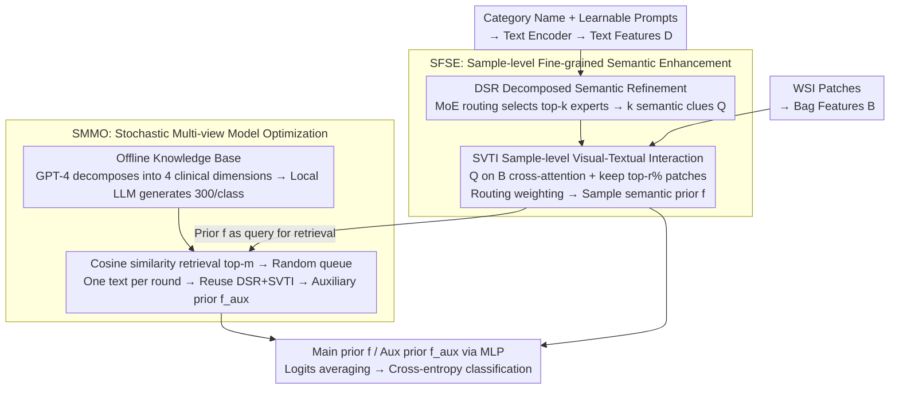

# MUSE: Harnessing Precise and Diverse Semantics for Few-Shot Whole Slide Image Classification

**Conference**: CVPR2026  
**arXiv**: [2602.20873](https://arxiv.org/abs/2602.20873)  
**Code**: [JiahaoXu-god/CVPR2026_MUSE](https://github.com/JiahaoXu-god/CVPR2026_MUSE)  
**Area**: Medical Imaging  
**Keywords**: Whole Slide Image Classification, Few-Shot Learning, Multiple Instance Learning, Vision-Language Models, Semantic Augmentation, MoE, Knowledge Base Retrieval

## TL;DR

This paper proposes the MUSE framework, which significantly enhances generalization performance in few-shot Whole Slide Image (WSI) classification through MoE-driven Sample-level Fine-grained Semantic Enhancement (SFSE) and LLM knowledge base-based Stochastic Multi-view Model Optimization (SMMO).

## Background & Motivation

1.  **Extreme Scarcity of WSI Annotations**: WSI labeling requires pathology experts and is restricted by privacy regulations. Consequently, each diagnostic category often has very few labeled samples, making the few-shot learning paradigm a necessity.
2.  **MIL as the Standard Framework for WSI Analysis**: Multiple Instance Learning (MIL) segments WSIs into patches and aggregates them at the bag level. However, in few-shot scenarios, pure visual features are insufficient to capture critical information for distinguishing pathological subtypes.
3.  **Vision-Language Models (VLMs) for Categorical Assistance**: Pre-trained pathology models like PLIP, CONCH, and MUSK provide cross-modal encoders. Existing methods utilize LLM-generated textual descriptions to assist classification.
4.  **Coarse Semantic Utilization**: Existing methods treat LLMs merely as description generators, producing static category-level priors where all samples share the same description, lacking sample-level adaptation.
5.  **Global Queries Fail to Decouple Fine-grained Diagnostic Attributes**: Complex concepts such as tumor grading and immune infiltration are collapsed into a single global query, leading to coarse visual-semantic alignment and failure to precisely locate diagnostic key regions.
6.  **Insufficient Textual Diversity Leading to Overfitting**: Reliance on unoptimized fixed prompts ignores structural diversity in clinical language—such as abstraction levels, contextual nuances, and syntactic expressions—leading to overfitting on specific phrasings in few-shot settings.

## Method

### Overall Architecture

MUSE aims to address the issue of "coarse semantic usage" in few-shot WSI classification. Existing methods treat LLMs as description generators where all samples share a static category-level text, which lacks both precision and diversity. The core idea is to push semantics towards both "precision" and "diversity": SFSE (Sample-level Fine-grained Semantic Enhancement) is responsible for tailoring precise semantic perception for each WSI, while SMMO (Stochastic Multi-view Model Optimization) injects rich semantic diversity. The priors produced by these two branches are fused at the classification head to enhance generalization.

### Key Designs

**1. SFSE: Decomposing Global Category Semantics into Expert Sub-concepts for Sample Customization**

Traditional methods collapse complex concepts (e.g., tumor grading, immune infiltration) into a single global query, resulting in coarse visual-semantic alignment. SFSE breaks this coarseness in two steps. The first is Decomposed Semantic Refinement (DSR): $M$ learnable prompt vectors are attached to each category name to obtain text features $D$, then an MoE paradigm is used to build $R$ expert query matrices. A routing network selects the top-$k$ experts for each category, with input-dependent Gaussian noise added to routing scores to encourage diversity. This produces $k$ fine-grained semantic clues encoding different diagnostic sub-concepts. The second step is Sample-level Visual-Textual Interaction (SVTI): these clues serve as queries for multi-head cross-attention with WSI patch features. Only the top-$r\%$ patches are retained to focus on relevant regions. The results are fused using routing weights to obtain a sample-specific semantic prior $f$.

**2. SMMO: Using LLM Knowledge Base + Random Sampling for Semantic Data Augmentation**

To prevent overfitting to specific phrasings in few-shot settings, SMMO builds an offline knowledge base. GPT-4 decomposes category names into four clinical dimensions: cell morphology, tissue structure, staining characteristics, and spatial-texture patterns. After randomly combining 10 example descriptions per dimension, a local Qwen2-7B generates 300 multi-view descriptions per category. During training, the sample prior $f$ retrieves the top-$m$ matching texts via cosine similarity. In each iteration, one text is randomly popped from the retrieval queue and processed through DSR+SVTI to obtain an auxiliary prior $f_{\text{aux}}$. Both priors are mapped to logits and averaged. This diversity acts as data augmentation in the semantic space.

### Loss & Training

Standard Cross-Entropy: $\mathcal{L}^{t} = \text{CE}(z^{t}_{\text{final}}, GT)$, where final logits are the mean of main and auxiliary priors: $z^{t}_{\text{final}} = (z + z^{t}_{\text{aux}}) / 2$.

## Key Experimental Results

### Main Results: Three Datasets × Three Few-shot Settings

Evaluated on CAMELYON, TCGA-NSCLC, and TCGA-BRCA under 4/8/16-shot settings (mean ± SD of 10 runs):

| Dataset | Setting | ACC | AUC | F1 |
|--------|------|-----|-----|-----|
| CAMELYON | 4-shot | **74.86** (vs FOCUS 68.13, +6.73) | **76.65** | **68.66** |
| CAMELYON | 8-shot | **84.01** (vs FOCUS 80.33, +3.68) | **88.32** | **82.42** |
| CAMELYON | 16-shot | **89.70** (vs FOCUS 88.62, +1.08) | **92.52** | **88.59** |
| NSCLC | 4-shot | **79.90** (vs FOCUS 79.14, +0.76) | **87.57** | **79.85** |
| NSCLC | 8-shot | **87.27** (vs FOCUS 86.04, +1.23) | **94.27** | **87.20** |
| NSCLC | 16-shot | **89.74** | **96.82** | **89.70** |
| BRCA | 4-shot | **84.14** (vs ViLa 81.80, +2.34) | **86.66** | **73.81** |
| BRCA | 8-shot | **84.37** | **88.39** | **76.29** |

**Key Findings**: Gains increase as annotations decrease; on CAMELYON 4-shot, ACC improvement reaches 6.73%.

### Ablation Study (CAMELYON)

| Configuration | 4-shot ACC | 8-shot ACC | 16-shot ACC |
|------|-----------|-----------|------------|
| Base MIL | 62.04 | 71.52 | 82.37 |
| +TI (Traditional Interaction) | 65.13 | 79.10 | 86.61 |
| +TI+SFSE | 65.16 | 80.85 | 86.72 |
| +TI+SMMO | 71.18 | 83.68 | 87.99 |
| +TI+SFSE+SMMO (Ours) | **74.86** | **84.01** | **89.70** |

- SMMO contributes most in low-data settings (approx. +6% at 4-shot); SFSE and SMMO show synergistic gains.
- Cosine similarity retrieval > L2 norm > Random retrieval.
- Stochastic optimization > Multi-text mean optimization (4-shot ACC 74.86 vs 70.33).
- Knowledge Base LLM Choice: Qwen2-7B > Deepseek-R1-7B > Llama-3.2-1B.

## Highlights & Insights

1.  **First to Improve Few-shot WSI Classification via Semantic Optimization**: Goes beyond mere semantic generation to actively optimize semantic precision and diversity.
2.  **MoE-driven Fine-grained Semantic Decomposition**: Decomposes global category semantics into multiple expert sub-concepts, achieving sample-level adaptation by selecting the most relevant experts.
3.  **Ingenious Stochastic Multi-view Training**: Through knowledge base retrieval and random sampling, the model sees different semantic perspectives in each iteration, acting as data augmentation in semantic space to combat overfitting.
4.  **Extensive Experiments with Significant Gains**: Validated across 3 datasets and 3 shot settings, with comprehensive ablations on retrieval, optimization, and LLM selection.

## Limitations & Future Work

1.  **Knowledge Base Dependency on GPT-4**: The concept decomposition and example generation phases require GPT-4 API calls, which are costly and difficult to implement fully offline.
2.  **Only Validated on Binary Classification**: CAMELYON (Normal/Metastasis), NSCLC (LUAD/LUSC), and BRCA (IDC/ILC) are all binary tasks; multi-class scalability remains unverified.
3.  **Knowledge Base Quality Linked to LLM Performance**: Ablations show LLM choice significantly impacts performance, but guidelines for selection are not yet clear.
4.  **Computational Overhead**: MoE routing, multi-head cross-attention, and SMMO retrieval increase complexity. While trained on a single 3090, inference speed was not reported.
5.  **Static Offline KB**: The knowledge base is built once and does not update dynamically during training, limiting textual diversity to 300 entries per class.

## Related Work & Insights

| Method | Semantic Source | Semantic Granularity | Semantic Diversity | Sample Adaptation |
|------|---------|---------|-----------|-----------|
| Top | Category name | Category-level | None | None |
| ViLa-MIL | LLM Description | Category-level | Limited | None |
| FOCUS | LLM Description + Knowledge Compression | Category-level | Limited | Partial (Visual) |
| **MUSE** | LLM KB + MoE Decomposition | **Sub-concept level** | **300/class + Random Sampling** | **MoE Routing + Cross-attention** |

MUSE’s core distinction lies in elevating semantics from "static category descriptions" to "dynamic sample-adaptive multi-view semantic optimization."

## Rating

- Novelty: ⭐⭐⭐⭐ — Combining MoE decomposition with stochastic multi-view optimization is a novel approach for few-shot WSI classification.
- Experimental Thoroughness: ⭐⭐⭐⭐ — Strong multi-dataset and multi-shot evaluation with rich ablations, though multi-class analysis is missing.
- Writing Quality: ⭐⭐⭐⭐ — Clear structure, intuitive diagrams, and complete mathematical formulations.
- Value: ⭐⭐⭐⭐ — High practical value for few-shot pathology; the semantic optimization approach is transferable to other medical VLM tasks.

<!-- RELATED:START -->

## Related Papers

- [\[CVPR 2026\] Universal-to-Specific: Dynamic Knowledge-Guided Multiple Instance Learning for Few-Shot Whole Slide Image Classification](universal-to-specific_dynamic_knowledge-guided_multiple_instance_learning_for_fe.md)
- [\[CVPR 2026\] Contrastive Cross-Bag Augmentation for Multiple Instance Learning-based Whole Slide Image Classification](contrastive_cross-bag_augmentation_for_multiple_instance_learning-based_whole_sl.md)
- [\[ECCV 2024\] Pathology-knowledge Enhanced Multi-instance Prompt Learning for Few-shot Whole Slide Image Classification](../../ECCV2024/medical_imaging/pathology-knowledge_enhanced_multi-instance_prompt_learning_for_few-shot_whole_s.md)
- [\[CVPR 2026\] Dual-Level Hypergraph Generation for Addressing Feature Scarcity in Whole-Slide Image Classification](dual-level_hypergraph_generation_for_addressing_feature_scarcity_in_whole-slide_.md)
- [\[CVPR 2026\] TopoSlide: Topologically-Informed Histopathology Whole Slide Image Representation Learning](toposlide_topologically-informed_histopathology_whole_slide_image_representation.md)

<!-- RELATED:END -->
