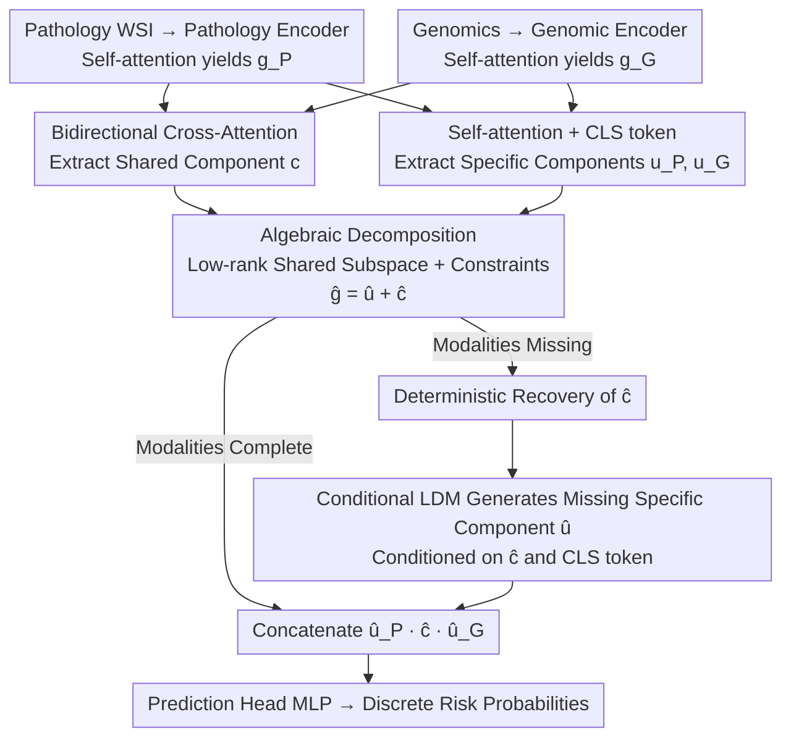

# MUST: Modality-Specific Representation-Aware Transformer for Diffusion-Enhanced Survival Prediction with Missing Modality

**Conference**: CVPR 2026  
**arXiv**: [2603.26071](https://arxiv.org/abs/2603.26071)  
**Code**: [Project Page](https://kylekwkim.github.io/MUST/)  
**Area**: Medical Imaging
**Keywords**: Survival Prediction, Missing Modality, Algebraic Decomposition, Latent Diffusion Models, Multimodal Fusion

## TL;DR

The MUST framework is proposed to explicitly decompose multimodal representations into modality-specific and cross-modal shared components via algebraic constraints. A conditional Latent Diffusion Model (LDM) is employed to generate specific information when modalities are missing. MUST achieves SOTA performance with a 0.742 C-index across five TCGA cancer datasets, with performance drops limited to approximately 0.4%-3.5% in missing modality scenarios.

## Background & Motivation

1. **Background**: Multimodal survival prediction (Pathology WSI + Genomics) significantly improves prognosis accuracy. Methods like SurvPath and CMTA achieve fusion through cross-attention.
2. **Limitations of Prior Work**: Modalities are frequently missing in clinical settings—genomic testing is expensive and time-consuming, and historical datasets often contain pathology without molecular data. Existing multimodal models assume complete data, leading to sharp performance degradation when modalities are absent.
3. **Key Challenge**: Existing methods for missing modalities fall into three categories: feature alignment (ignoring what is missing), interpolation (high noise in high-dimensional space), and joint distribution learning (failing to decouple specific vs. shared information). The fundamental issue is the **lack of explicit modeling for the unique contribution of each modality**.
4. **Goal**: To precisely identify "what information is lost" when a modality is missing and recover it specifically.
5. **Key Insight**: Project representations into a low-rank shared subspace using algebraic decomposition to split each modality into a "specific component" and a "shared component." The shared part is deterministically recoverable from any available modality, while the specific part is generated using a conditional diffusion model.
6. **Core Idea**: Implement a "precise reconstruction" strategy for missing components through algebraic invertibility constraints.

## Method

### Overall Architecture

This paper addresses the common clinical issue of missing modalities in survival prediction. The core strategy of MUST is to decompose each modality's representation into a "shared part" (inferable from other modalities) and a "specific part" (unique to the modality). When a modality is missing, the shared part is calculated directly via mathematical equations, and the generative model is only invoked for the specific part that cannot be reconstructed.

**Mechanism**: Patch features $P$ from pathology WSIs and token sets $G$ from genomics are passed through encoders to obtain global representations $g_P, g_G$. Bidirectional cross-attention extracts "information carried by the other modality" ($c_{P\leftarrow G}, c_{G\leftarrow P}$), while self-attention extracts modality-specific components $u_P, u_G$. These are projected into a low-rank shared subspace for algebraic decomposition: $g_P = \hat{u}_P + \hat{c}_{G\leftarrow P}$. With complete data, the concatenated vector $[\hat{u}_P; \hat{c}; \hat{u}_G]$ is fed to a prediction head for discrete risk probabilities. In missing modality scenarios, the shared component $\hat{c}$ is recovered deterministically, and the missing specific component is generated by a conditional LDM.

### Key Designs

**1. Algebraic Decomposition in Low-Rank Shared Subspace: Using Invertible Equations for Recovery**

Unlike prior methods that rely on implicit distribution alignment, MUST formulates decomposition as an algebraic operation. A learnable low-rank projection matrix $P_\cap = B_\cap B_\cap^T$ ($B_\cap \in \mathbb{R}^{D\times r}, r\ll D$) is constructed and constrained to be idempotent. This projects shared components into the subspace and specific components into its orthogonal complement. Three constraints are enforced: shared consistency across modalities, orthogonality between specific components ($\hat{u}_P \perp \hat{u}_G$), and orthogonality between shared and specific components within the same modality ($\hat{u}_m \perp \hat{c}_m$). This provides a "mathematical guarantee" that $\hat{c}$ can be deterministically recovered if at least one modality is present.

**2. Conditional Latent Diffusion Model: Generating Only "Irrecoverable" Residuals**

Since modality-specific information (e.g., molecular features unique to genomics) cannot be inferred from pathology, MUST utilizes a generative model but limits its scope to minimize error. A 4-layer Transformer denoising network is trained (with frozen main network parameters) to generate the missing $\hat{u}$ using DDIM sampling (50 steps). It is conditioned on the recovered $\hat{c}$ and a learned modality-specific $[\text{CLS}_{u}]$ token. By generating only the "modality-specific residual" rather than the entire representation, the generation space is reduced, decreasing variance and difficulty.

**3. Progressive Two-Stage Training: Semantic Establishment before Structural Decomposition**

Training the decomposition framework and survival loss end-to-end can lead to degenerate solutions (e.g., all information collapsing into the shared component). MUST employs a two-stage approach:
- **Stage 1**: Encoders are trained using survival loss with Gaussian noise injection ($\epsilon_P, \epsilon_G$) to ensure they learn meaningful, task-relevant features.
- **Stage 2**: Decomposition loss $\mathcal{L}_{\text{decomp}}$, shared consistency loss $\mathcal{L}_{\text{shared}}$, and orthogonality loss $\mathcal{L}_{\text{orth}}$ are introduced to perform structural splitting on top of the established semantics.

### Loss & Training

- Phase 1: $\mathcal{L}_{\text{warm}} = \mathcal{L}_{\text{surv}}(\phi([g_P; \epsilon_P])) + \mathcal{L}_{\text{surv}}(\phi([g_G; \epsilon_G]))$
- Phase 2: $\mathcal{L}_{\text{main}} = \mathcal{L}_{\text{surv}} + \lambda_{\text{dec}}\mathcal{L}_{\text{decomp}} + \lambda_{\text{sh}}\mathcal{L}_{\text{shared}} + \lambda_{\text{orth}}\mathcal{L}_{\text{orth}}$
- LDM Phase: Standard diffusion denoising loss $\mathcal{L}_{\text{LDM}} = \mathbb{E}[\|\epsilon - \epsilon_\theta(z_t, t, \text{cond})\|^2]$
- Hyperparameters: $\lambda_{\text{dec}}=1.0, \lambda_{\text{sh}}=1.0, \lambda_{\text{orth}}=0.5$, shared subspace rank $r=64$, feature dimension $D=256$.

## Key Experimental Results

### Main Results

Comparison of C-index across 5 TCGA datasets (BLCA/BRCA/GBMLGG/LUAD/UCEC):

| Method | Setting | BLCA | BRCA | GBMLGG | LUAD | UCEC | Overall |
|------|------|------|------|--------|------|------|---------|
| CMTA | Dual Modalities Complete | 0.691 | 0.648 | 0.857 | 0.667 | 0.755 | 0.724 |
| **Ours** | **Dual Modalities Complete** | **0.703** | **0.690** | **0.864** | **0.686** | **0.768** | **0.742** |
| LD-CVAE | Missing Genomics | 0.651 | 0.649 | 0.831 | 0.629 | 0.726 | 0.697 |
| **Ours** | **Missing Genomics** | **0.673** | **0.651** | **0.864** | **0.637** | **0.755** | **0.716** |
| ShaSpec | Missing Pathology | 0.636 | 0.629 | 0.823 | 0.610 | 0.682 | 0.676 |
| **Ours** | **Missing Pathology** | **0.702** | **0.692** | **0.865** | **0.690** | **0.748** | **0.739** |

### Ablation Study

| Configuration | C-index (Overall) | Description |
|------|-------------------|------|
| No Warm Start | Drop 0.6-3.5% | Variation across datasets; UCEC most affected |
| LDM with only $\hat{c}$ | Miss G: 0.712, Miss P: 0.732 | Lacking structural priors |
| LDM with $[\hat{c}; \text{CLS}]$ | Miss G: 0.716, Miss P: 0.739 | CLS token provides modality structural priors |

### Key Findings

- Performance drops only 0.4% (0.742→0.739) when pathology is missing, and 3.5% (0.742→0.716) when genomics is missing, suggesting LDM has a "denoising" effect on high-dimensional patch features.
- In BRCA/GBMLGG/LUAD, performance slightly improves when pathology is missing, as the diffusion process filters high-frequency noise from WSIs.
- Decomposition fidelity (cosine similarity) ranges from 0.75 to 0.94, validating the effectiveness of the algebraic decomposition.
- Inference latency on an A6000 is $\le 70$ms for complete data and 879ms for missing modalities (5 DDIM samples), which is clinically acceptable.

## Highlights & Insights

- **Algebraic Invertibility Design**: Unlike ShaSpec's distribution alignment, MUST ensures shared components are accurately recoverable through low-rank projection and orthogonality constraints. This converts missing modality handling into "deterministic recovery + limited stochastic generation."
- **"Missing as Enhancement" Phenomenon**: The observation that LDM-generated pathology components can outperform original noisy WSIs suggests that diffusion models can act as robust feature regularizers and denoisers.
- **Progressive Training + Noise Injection**: This combination ensures stable modality decomposition without collapsing into trivial solutions.

## Limitations & Future Work

- Currently limited to two modalities (Pathology + Genomics); complexity of pairwise cross-attention scales with $N$ modalities.
- LDM inference (879ms for 5 samples) is significantly slower than standard inference, though clinically feasible.
- Decomposition fidelity (0.75-0.94) is not perfect; errors in recovered shared components may propagate.
- Future work could explore lighter generative models (e.g., Flow Matching) to reduce sampling steps.

## Related Work & Insights

- **vs ShaSpec**: Both attempt shared/specific separation, but ShaSpec uses distribution alignment (head distillation) without algebraic invertibility, leading to larger performance drops (4.7% vs 3.5%).
- **vs LD-CVAE**: LD-CVAE uses joint distribution learning without contribution decoupling and lacks a bidirectional architecture, whereas MUST is symmetric.
- **vs CMTA**: While CMTA uses cross-attention, it lacks a missing modality mechanism. MUST demonstrates that cross-attention alone is insufficient to prevent modality collapse in incomplete settings.

## Rating

- Novelty: ⭐⭐⭐⭐ Creative combination of algebraic decomposition and conditional diffusion.
- Experimental Thoroughness: ⭐⭐⭐⭐⭐ Comprehensive evaluation across 5 datasets and 3 missingness settings.
- Writing Quality: ⭐⭐⭐⭐ Clear mathematical formulation, though notation-heavy.
- Value: ⭐⭐⭐⭐ Effectively addresses the real-world pain point of missing clinical modalities.

<!-- RELATED:START -->

[1] **CMTA**: Cross-Modal Transformer for Survival Prediction.  
[2] **ShaSpec**: Shared-Specific Feature Learning for Missing Modality.  
[3] **SurvPath**: Pathological Whole Slide Image Analysis via Genomics Informative.

<!-- RELATED:END -->

## Related Papers

- [\[CVPR 2026\] CLoE: Expert Consistency Learning for Missing Modality Segmentation](cloe_expert_consistency_learning_for_missing_modality_segmentation.md)
- [\[CVPR 2026\] H2-Surv: Hierarchical Hyperbolic Multimodal Representation Learning for Survival Prediction](h2-surv_hierarchical_hyperbolic_multimodal_representation_learning_for_survival_.md)
- [\[CVPR 2026\] Uni-Encoder Meets Multi-Encoders: Representation Before Fusion for Brain Tumor Segmentation with Missing Modalities](uni-encoder_meets_multi-encoders_representation_before_fusion_for_brain_tumor_se.md)
- [\[CVPR 2026\] Turning Pre-Trained Vision Transformers into End-to-End Histopathology Whole Slide Image Models for Survival Prediction](turning_pre-trained_vision_transformers_into_end-to-end_histopathology_whole_sli.md)
- [\[AAAI 2026\] GROVER: Graph-guided Representation of Omics and Vision with Expert Regulation for Cancer Survival Prediction](../../AAAI2026/medical_imaging/grover_graph-guided_representation_of_omics_and_vision_with_expert_regulation_fo.md)

<!-- RELATED:END -->
