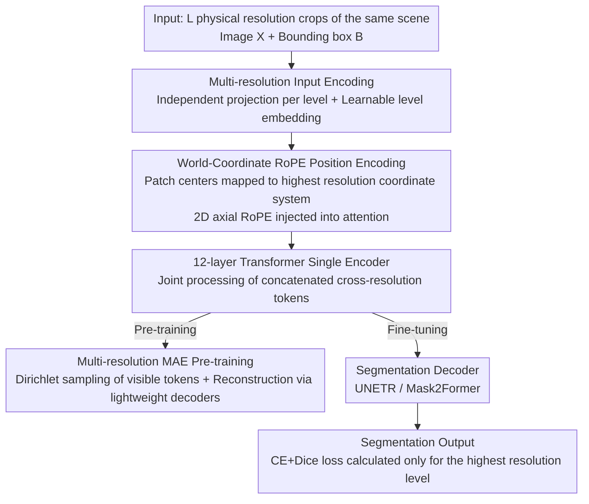

# MuViT: Multi-Resolution Vision Transformers for Learning Across Scales in Microscopy

**Conference**: CVPR 2026  
**arXiv**: [2602.24222](https://arxiv.org/abs/2602.24222)  
**Code**: [github.com/weigertlab/muvit](https://github.com/weigertlab/muvit)  
**Area**: Medical Imaging  
**Keywords**: Multi-resolution, Vision Transformer, RoPE, Microscopy images, Semantic segmentation

## TL;DR

Ours proposes MuViT, a multi-resolution Vision Transformer based on world-coordinate RoPE position encoding. It can jointly process crops of the same scene at different physical resolutions in a single encoder, significantly outperforming single-resolution baselines on microscopy image segmentation tasks.

## Background & Motivation

Modern microscopy imaging (light-sheet fluorescence microscopy, electron microscopy, digital pathology) often generates gigapixel images (>50K×50K pixels) containing structures spanning multiple spatial scales from cell morphology to tissue architecture. A large number of analysis tasks require utilizing multi-scale information simultaneously—for example, when performing semantic segmentation of cells, one needs both the tissue region where the cell is located (global context) and fine local details.

Key Challenge:
- **CNN/ViT based on tiled prediction**: Limited by GPU memory, these can only process fixed-size tiles (e.g., 512×512), leading to a trade-off between field-of-view and resolution.
- **Hierarchical architectures (Swin/PVT/HIPT)**: They build feature pyramids internally from a single-resolution input but do not utilize true multi-resolution observations.
- **Multi-path models (CrossViT/MPViT)**: They process artificially created scale variants and lack geometric consistency across scales.

Key Insight: Different spatial scales can serve as complementary input "modalities," provided they share a unified geometric reference frame.

## Method

### Overall Architecture

MuViT receives crops $\mathbf{X} \in \mathbb{R}^{L \times C \times H \times W}$ of the same image at $L$ different physical resolutions along with their spatial bounding boxes $\mathcal{B} \in \mathbb{R}^{L \times 2 \times 2}$. Each resolution level is first independently projected and added with level embeddings to obtain tokens. All patches are mapped to a unified world coordinate system, and cross-resolution information fusion is achieved through a RoPE-based attention mechanism within a single encoder (12-layer Transformer). The encoder output can either go to a multi-resolution MAE pre-training branch for self-supervised representation learning or be connected to a segmentation decoder (UNETR / Mask2Former) to output segmentation results. MuViT$_{[l_1, l_2, \ldots]}$ denotes an encoder using resolution levels $l_1, l_2, \ldots$ (where $l=1$ is the highest resolution and $l>1$ represents $l\times$ downsampling).

### Key Designs

**1. Multi-resolution Input Encoding: Independent projection per level + Joint processing after level embedding**

To treat different physical resolutions as complementary "modalities" fed into the same encoder, the model must distinguish which level a token comes from. Each resolution level $l$ is equipped with an independent linear projection layer $\text{PE}_l$ and a learnable level embedding $\mathbf{e}_l$:

$$\mathbf{z}_l = \text{PE}_l(\mathbf{X}_l) + \mathbf{e}_l$$

Tokens from all levels are concatenated and sent to a 12-layer Transformer for joint processing. The total parameter count is only approximately 25M—fusion is achieved through coordinate alignment and concatenation rather than complex hierarchical structures or cross-scale attention modules.

**2. World-Coordinate RoPE Position Encoding: Aligning patches of different resolutions in the same coordinate system**

The true difficulty of cross-scale fusion is geometric consistency—multi-path models processing artificial scale variants lack a common reference frame across scales. MuViT maps the center coordinates of each patch to the pixel coordinate system of the highest resolution (i.e., world coordinates), and then uses 2D axial RoPE to inject the coordinates into the attention mechanism:

$$\theta_k^{(a)} = \mathbf{p}_{l,i,j}^{(a)} / b^{2k/d_a}, \quad k=0,\ldots,d_a/2-1$$

Where $b$ is a learnable parameter (initialized to 10000). This ensures that patches representing the same spatial location receive the same position encoding regardless of the resolution they come from, allowing effective cross-scale information flow. In experiments, performance collapsed when world coordinates were replaced with naive centered coordinates, indicating that accurate world coordinates are the indispensable foundation of this mechanism.

**3. Multi-resolution MAE Pre-training (MuViT-MAE): Accelerating representation learning with cross-scale mask reconstruction**

Learning cross-scale representations from scratch alongside segmentation tasks can be slow. MuViT uses MAE pre-training with a high mask ratio $\rho=0.75$. The proportion of visible tokens for each level is sampled from a Dirichlet distribution $\text{Dir}(\alpha=0.5)$, forcing the model to complete information across various combinations of scale visibility. Each resolution level is paired with a lightweight decoder (2-layer Transformer) that accesses all visible encoded outputs via cross-attention. The loss is the mean MSE of masked patches across all levels. This pre-training allows the model to exceed the final performance of all single-resolution baselines in just 10 epochs.

### Loss & Training

- **Loss**: Cross-Entropy + Dice, both weighted at 1.0, calculated only on the highest resolution level.

$$\mathcal{L} = \lambda_{\text{CE}} \cdot \mathcal{L}_{\text{CE}}(\tilde{y}, y) + \lambda_{\text{Dice}} \cdot \mathcal{L}_{\text{Dice}}(\tilde{y}, y)$$

- **Segmentation Decoder**: Supports UNETR-style (skip connections + progressive upsampling) and Mask2Former-style (learnable mask query cross-attention).
- **Sampling**: Nested crops using random coordinate sampling to ensure coarse resolution crops contain fine resolution crops; data is stored in Zarr pyramid format for on-demand loading.

## Key Experimental Results

### Main Results

| Dataset | Method | Input Size | mDSC/DSC | Prev. SOTA | Gain |
|--------|------|----------|----------|----------|------|
| Synthetic | MuViT[1,4]+UNETR | 2×256² | **0.9538** | DeepLabV3: 0.4895 | +0.464 |
| Mouse (11 brain regions) | MuViT[1,8,32]+Mask2Former | 3×256² | **0.901** | DeepLabV3@1024²: 0.843 | +0.058 |
| KPIS (Kidney Path.) | MuViT[1,8]+UNETR | 2×512² | **0.8958** | HoloHisto-4K@3840×2160: 0.8454 | +0.050 |

### Ablation Study

| Configuration | Key Metrics | Description |
|------|---------|------|
| MuViT[1,8,32]+Mask2Former (naive bbox) | mDSC=0.820 (Mouse) | Using incorrect coordinates dropped 0.081 compared to the correct 0.901 |
| MuViT[1,4]+UNETR (naive bbox) | mDSC=0.386 (Synthetic) | Performance collapsed due to coordinate errors |
| MuViT[1] (Single Resolution) | mDSC=0.391 (Mouse) | Lacks global context |
| Linear probe: [1] → [1,8] → [1,8,32,64] | AUC: 0.958 → 0.963 → 0.988 | Representations become richer as more resolution levels are added |
| MAE Pre-training Acceleration | Reach mDSC=0.843 at Epoch 10 | Better than all baselines' performance at Epoch 50 |

### Key Findings

- World coordinate alignment is a prerequisite for effective cross-scale fusion in MuViT; naive coordinates lead to severe performance degradation even if the architecture and input remain unchanged.
- Multi-resolution MAE pre-training greatly accelerates convergence: 10 epochs exceed the final performance of all single-resolution baselines.
- Increasing the number of resolution levels brings monotonic improvements in representation (linear probe AUC increased from 0.958 to 0.988).
- Output is robust to coordinate noise (minimal performance drop under $\le 32$px offsets).

## Highlights & Insights

- **Simple yet powerful design**: Effective cross-resolution fusion is achieved through world-coordinate RoPE without introducing complex hierarchical structures or cross-scale attention modules.
- **True multi-resolution vs. pseudo multi-scale**: For the first time in microscopy imaging, a strict distinction is made between "multi-scale features" derived from a single input and "multi-resolution inputs" truly sampled from different physical resolutions.
- The Dirichlet sampling strategy allows the mask ratio of different levels to vary randomly, promoting complementary learning across scales.
- Lightweight architecture (~25M parameters) yet comprehensively surpasses SOTA on three different tasks.

## Limitations & Future Work

- The full attention mechanism causes computational and memory overhead to grow linearly with the number of resolution levels; sparse or cross-scale attention could be introduced in the future.
- Only semantic segmentation tasks were evaluated; downstream tasks like instance segmentation and object detection were not covered.
- Assumed that crops are nested (coarse contains fine); non-nested or arbitrary spatial arrangements of multi-resolution inputs were not explored.
- Generalization to 3D volumetric data and non-microscopy fields (e.g., remote sensing) remains to be verified.

## Related Work & Insights

- Similar to MultiMAE in treating different scales as "modalities," but achieves geometric consistency through world-coordinate constraints.
- A successful case of introducing RoPE from NLP to Vision with a unique usage: the rotation angle is determined by real spatial coordinates.
- HIPT also processes hierarchical microscopy images but does not support joint encoding and cross-resolution attention.
- Direct inspiration for multi-scale analysis of whole-slide images in digital pathology: different magnifications could be considered different resolution levels.

## Rating

- Novelty: ⭐⭐⭐⭐ Application of world-coordinate RoPE in multi-resolution ViT is simple and novel.
- Experimental Thoroughness: ⭐⭐⭐⭐ Three datasets + complete ablation + linear probing + convergence analysis.
- Writing Quality: ⭐⭐⭐⭐ Clear structure and precise conceptual distinctions.
- Value: ⭐⭐⭐⭐ Broad applicability for multi-scale processing in microscopy/pathology image analysis.

<!-- RELATED:START -->

## Related Papers

- [\[CVPR 2026\] EEGiT: Teaching Vision Transformers to Understand the EEG signal](eegit_teaching_vision_transformers_to_understand_the_eeg_signal.md)
- [\[CVPR 2026\] Keep It Frozen: Domain-Routed Conditional Residual Modulation for Multi-Domain Vision Transformers](keep_it_frozen_domain-routed_conditional_residual_modulation_for_multi-domain_vi.md)
- [\[CVPR 2026\] Building Robust Vision Encoders for Cross-Dataset Evaluation in Immunofluorescent Microscopy](building_robust_vision_encoders_for_cross-dataset_evaluation_in_immunofluorescen.md)
- [\[CVPR 2026\] OmniBrainBench: A Comprehensive Multimodal Benchmark for Brain Imaging Analysis Across Multi-stage Clinical Tasks](omnibrainbench_a_comprehensive_multimodal_benchmark_for_brain_imaging_analysis_a.md)
- [\[CVPR 2026\] Turning Pre-Trained Vision Transformers into End-to-End Histopathology Whole Slide Image Models for Survival Prediction](turning_pre-trained_vision_transformers_into_end-to-end_histopathology_whole_sli.md)

<!-- RELATED:END -->
