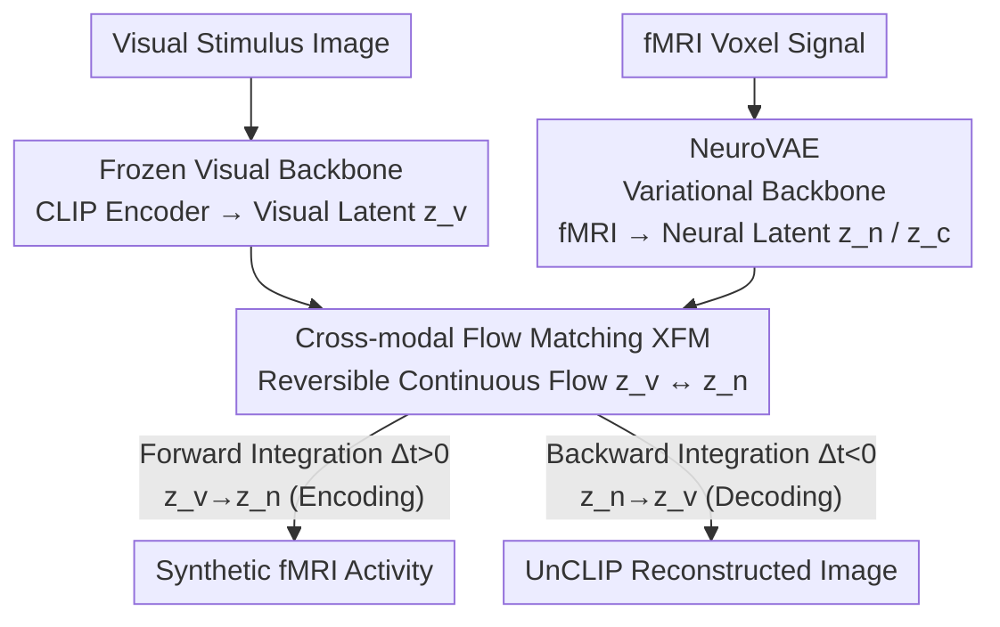

# NeuroFlow: Toward Unified Visual Encoding and Decoding from Neural Activity

**Conference**: CVPR 2026  
**arXiv**: [2604.09817](https://arxiv.org/abs/2604.09817)  
**Code**: https://michaelmaiii.github.io/NeuroFlow-S (Project Page)  
**Area**: Medical Imaging / Brain-Computer Interface / fMRI Visual Decoding  
**Keywords**: Visual Encoding & Decoding, fMRI, Flow Matching, Cross-modal Alignment, Variational Autoencoder

## TL;DR
NeuroFlow unifies "image-to-brain" (encoding) and "brain-to-image" (decoding) into a single flow model. It utilizes a variational backbone, NeuroVAE, to compress fMRI into a semantically structured latent space, followed by Cross-modal Flow Matching (XFM) to learn a reversible continuous flow between visual and neural latent distributions. By integrating forward (encoding) and backward (decoding) paths, it achieves SOTA or comparable performance on both tasks with only approximately 25% of the parameters of MindEye2.

## Background & Motivation
**Background**: Understanding neural encoding (external stimulus $\to$ neural activity) and decoding (neural activity $\to$ stimulus) is central to neuroscience and Brain-Computer Interfaces (BCI). fMRI is a mainstream measurement due to its high spatial resolution. Currently, encoding and decoding are treated as **two independent tasks**: encoding models (e.g., SynBrain, MindSimulator) use pretrained visual features and voxel regression to predict brain responses, while decoding models (e.g., MindEye, MindEye2, BrainDiffuser) map brain signals to visual-language embedding spaces like CLIP to reconstruct images via generative models.

**Limitations of Prior Work**: Even in efforts to bridge both directions, **two independent networks** are typically used. These either perform fine-grained mapping in pixel-voxel space (resulting in blurry reconstructions lacking semantics) or employ **two independent linear regressions** to handle encoding and decoding separately despite bridging neural/visual latent spaces. This lack of shared representation prevents the two complementary processes from being trained jointly and fails to model their consistency.

**Key Challenge**: Encoding and decoding are essentially **the forward and inverse directions of the same mapping** (in a Bayesian context, the neural distribution is the likelihood of the visual representation, and the visual posterior is derived from the neural distribution). Current paradigms decouple them. A deeper issue lies in the prevalent "conditional noise-to-data diffusion" strategy, which only establishes a stochastic mapping between an empirical distribution and Gaussian noise, suffering from a **training-inference distribution gap**.

**Goal**: To unify encoding and decoding within a single model satisfying two essential properties: (i) **Shared Latent Space**, where both processes are jointly optimized; and (ii) **Encoding-Decoding Consistency**, ensuring synthesized neural signals can be reversibly reconstructed into coherent images.

**Core Idea**: Rewrite encoding and decoding as **a time-dependent, reversible flow** within a shared latent space. Forward integration ($z_v \to z_n$) performs encoding, and backward integration ($z_n \to z_v$) performs decoding. The tasks are distinguished solely by the direction of time, abandoning the noise-started, conditional guidance paradigm of diffusion.

## Method

### Overall Architecture
NeuroFlow aims to use a single model to generate brain signals from images and reconstruct images from brain signals. It consists of three components: a **frozen visual backbone** (CLIP encoding + UnCLIP decoding) for transitions between images and semantic latents; a trainable **neural backbone (NeuroVAE)** that projects fMRI into a semantically aligned probabilistic latent space; and the **Cross-modal Flow Matching (XFM)**, which learns a reversible flow between the visual latent distribution $z_v$ and the neural latent distribution $z_n$.

Training occurs in two stages, followed by an inference stage: Stage-1 trains NeuroVAE to establish a structured neural latent space; Stage-2 freezes both backbones to train the XFM flow; Stage-3 uses the same XFM flow for inference—forward in time for encoding and backward for decoding.

### Key Designs

**1. NeuroVAE: Compressing fMRI into a Semantically Structured Neural Latent Space**
To share a latent space, fMRI must be represented in a "clean, semantically aligned, and sampleable" format rather than via voxel-level noise. NeuroVAE is a Variational Autoencoder where the neural encoder $E_n$ estimates a posterior $q(z_n \in \mathbb{R}^{m\times d} \mid x_{\text{fMRI}})$ from fMRI $x_{\text{fMRI}}$. A linear projection aggregates the channel dimension into a compact latent vector $z_c \in \mathbb{R}^{1\times d}$, while the decoder $D_n$ reconstructs $\hat{x}_{\text{fMRI}}$. This **dual latent vector division** decouples the encoding path from the decoding process. Probabilistic modeling captures the "one-to-many" relationship of brain responses to the same stimulus, while the Gaussian prior ensures the latent space is smooth for continuous flow matching.

**2. Cross-modal Flow Matching (XFM): Encoding and Decoding as a Reversible Flow**
This is the core innovation addressing the unidirectional nature and training-inference gap of diffusion. XFM learns a time-dependent vector field $v_\theta(z,t)$ directly **between the visual latent distribution $z_v$ and the neural latent distribution $z_n$**, satisfying the ODE:

$$\frac{dz(t)}{dt} = v_\theta(z_t, t), \quad z_0 = z_v,\ z_1 = z_n.$$

The vector field is parameterized by a Scalable Interpolant Transformer (SiT). Intermediate states are defined by cosine interpolation $z_t = \alpha_t z_0 + \sigma_t z_1$, with $\alpha_t = \cos^2(\frac{\pi}{2}t)$ and $\sigma_t = \sin^2(\frac{\pi}{2}t)$. Reversibility is guaranteed by the uniqueness of the ODE solution: forward integration ($\Delta t > 0$) implements $z_v \to z_n$ (encoding), and backward integration ($\Delta t < 0$) implements $z_n \to z_v$ (decoding).

**3. Contrastive + Cycle-consistency Alignment: Coarse Distribution Alignment**
XFM requires initial coarse alignment between distributions to learn a vector field efficiently. NeuroVAE employs two contrastive objectives: $\mathcal{L}_{\text{clip}} = \text{SoftCLIP}(z_n, z_v)$ to align neural latents with visual semantics, and $\mathcal{L}_{\text{cyc}} = \text{SoftCLIP}(\hat{z}_n, z_v)$ (where $\hat{z}_n = E_n(\hat{x}_{\text{fMRI}})$) to ensure reconstructed fMRI signals maintain semantic consistency. Ablations show that without these, retrieval accuracy drops from 86.4% to 0.3%, indicating that this coarse alignment is a prerequisite for XFM.

### Loss & Training
**Stage-1 (NeuroVAE)** uses a composite objective:

$$\mathcal{L}_{\text{VAE}} = \mathcal{L}_{\text{mse}} + \alpha \mathcal{L}_{\text{kl}} + \beta \mathcal{L}_{\text{clip}} + \lambda \mathcal{L}_{\text{cyc}}.$$

$\mathcal{L}_{\text{mse}}$ maintains voxel fidelity, $\mathcal{L}_{\text{kl}}$ regularizes the posterior toward $\mathcal{N}(0,I)$, while $\mathcal{L}_{\text{clip}}$/$\mathcal{L}_{\text{cyc}}$ handle semantic alignment. Weights are set to $\alpha=0.001$, $\beta=\lambda=1000$.

**Stage-2 (XFM)** minimizes the flow matching error under uniform time sampling:

$$\mathcal{L}_{\text{XFM}} = \mathbb{E}_{t\sim U(0,1)}\big[\|v_\theta(z_t,t) - v^*(z_t,t)\|_2^2\big].$$

Inference uses Euler integration: $z_{t+\Delta t} = z_t + \Delta t\, v_\theta(z_t,t)$. The model was trained handled on a single A100-40G within 5 hours.

## Key Experimental Results
The Natural Scenes Dataset (NSD) was used with 4 subjects. Evaluation metrics include Inception Score (Incep), CLIP similarity, and retrieval metrics (Raw fMRI vs. Synthetic/Syn fMRI).

### Main Results

| Method | Type | Decoding Incep↑ | Decoding CLIP↑ | Encoding Incep↑ | Encoding CLIP↑ | Retrieval Raw↑ | Retrieval Syn↑ |
|------|------|------|------|------|------|------|------|
| MindSimulator | E | - | - | 93.1% | 91.2% | - | - |
| SynBrain | E | - | - | 95.7% | 94.3% | 84.8% | 92.5% |
| BrainDiffuser | D | 91.3% | 90.9% | - | - | 18.8% | - |
| MindEye | D | 94.6% | 93.3% | - | - | 90.0% | - |
| MindEye2 | D | 95.4% | 93.0% | - | - | **98.8%** | - |
| **NeuroFlow** | **E&D** | **95.6%** | **94.2%** | **98.6%** | **98.7%** | 80.6% | **97.0%** |

NeuroFlow is the only unified E&D model. It achieves best-in-class performance in decoding (Incep/CLIP) and significantly outperforms specialized encoding models. Notably, **decoding from synthetic fMRI outperforms raw fMRI**, suggesting the model distills task-relevant semantics.

### Efficiency Comparison

| Method | Type | Pretrained | Architecture | Params |
|------|------|------|------|------|
| SynBrain | E | No | VAE+Transformer | 690M |
| MindEye2 | D | Yes | Linear+MLP+DP | 2.60B |
| **NeuroFlow** | **E&D** | No | VAE+XFM | **660M** |

### Ablation Study (Subject 1)

| Configuration | Decoding CLIP↑ | Encoding CLIP↑ | Retrieval Raw↑ | Retrieval Syn↑ |
|------|------|------|------|------|
| Full NeuroFlow | 95.0% | 98.7% | 86.4% | 96.4% |
| w/o $\mathcal{L}_{\text{XFM}}$ | 83.7% | 58.1% | 86.4% | 14.1% |
| w/o CLIP/Cyc | 58.8% | 51.3% | 0.3% | 0.5% |

### Key Findings
- **Alignment is foundational**: Without contrastive alignment, retrieval collapses, meaning XFM cannot learn a flow across distant distributions.
- **XFM is the unification engine**: Removing it causes a sharp drop in encoding CLIP (98.7% $\to$ 58.1%), proving it is the key module bridging the two directions.
- **Synthetic signals outperform raw signals**: NeuroVAE acts as a de-noiser and semantic distiller, producing neural signals that yield better decoding results than the original noisy fMRI.
- **Brain-consistent modeling**: Synthesized fMRI preserves cortical functional selectivity (e.g., activating FFA for faces), matching known cortical organization.

## Highlights & Insights
- **Reversible ODE Flow**: Unifying E&D via "time direction = task" is a mathematically elegant paradigm where consistency is intrinsically guaranteed by the uniqueness of ODE solutions.
- **Bypassing Noise-to-Data**: Creating a flow directly between two empirical distributions avoids the training-inference gap and allows decoding to start from a "semantic sketch" rather than pure noise.
- **Semantic Distillation**: The observation that synthetic signals are superior for decoding provides a useful insight for handling low-SNR biological data.

## Limitations & Future Work
- **Raw Retrieval Cost**: Unified modeling sacrifices some raw fMRI retrieval accuracy compared to MindEye2.
- **Semantic Focus**: Metrics are primarily semantic; explicit capture and evaluation of low-level visual structures remain limited.
- **Scaling**: Validation is currently restricted to the NSD dataset and fMRI modality.

## Related Work & Insights
- **vs. MindEye2**: NeuroFlow performs E&D with 25% of the parameters and no pretraining requirement, though it trails in raw retrieval.
- **vs. SynBrain**: NeuroFlow replaces conditional noise-to-data diffusion with XFM, improving encoding CLIP from 94.3% to 98.7%.

## Rating
- Novelty: ⭐⭐⭐⭐⭐ 
- Experimental Thoroughness: ⭐⭐⭐⭐ 
- Writing Quality: ⭐⭐⭐⭐⭐ 
- Value: ⭐⭐⭐⭐⭐ 

<!-- RELATED:START -->

## Related Papers

- [\[ICLR 2026\] Neuro-Symbolic Decoding of Neural Activity](../../ICLR2026/medical_imaging/neuro-symbolic_decoding_of_neural_activity.md)
- [\[CVPR 2026\] Decoding 3D Perception via BrainSSD: Synergistic Fusion of EEG Representations from Static and Dynamic Visual Streams](decoding_3d_perception_via_brainssd_synergistic_fusion_of_eeg_representations_fr.md)
- [\[ECCV 2024\] UMBRAE: Unified Multimodal Brain Decoding](../../ECCV2024/medical_imaging/umbrae_unified_multimodal_brain_decoding.md)
- [\[CVPR 2026\] Uni-Hema: Unified Model for Digital Hematopathology](uni-hema_unified_model_for_digital_hematopathology.md)
- [\[ICLR 2026\] SEED: Towards More Accurate Semantic Evaluation for Visual Brain Decoding](../../ICLR2026/medical_imaging/seed_towards_more_accurate_semantic_evaluation_for_visual_brain_decoding.md)

<!-- RELATED:END -->
