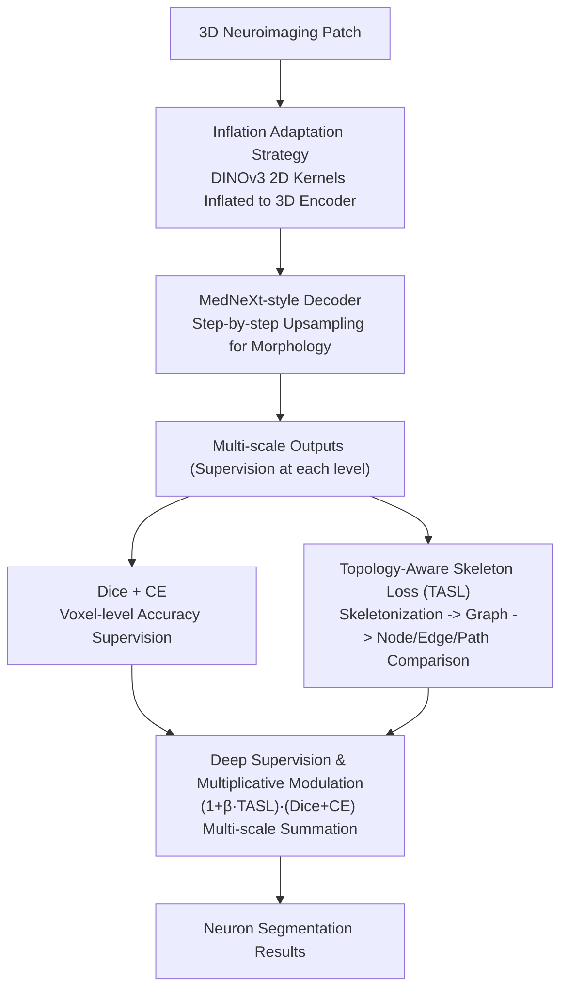

# NeuroSeg Meets DINOv3: Transferring 2D Self-Supervised Visual Priors to 3D Neuron Segmentation via DINOv3 Initialization

**Conference**: CVPR 2026  
**arXiv**: [2603.23104](https://arxiv.org/abs/2603.23104)  
**Code**: [https://github.com/yy0007/NeurINO](https://github.com/yy0007/NeurINO)  
**Area**: Medical Imaging / 3D Segmentation  
**Keywords**: Neuron Segmentation, DINOv3, 2D-3D Transfer, Topology-Aware Loss, Data-Efficient Learning

## TL;DR

NeurINO proposes to initialize 3D neuron segmentation models by inflating 2D kernels pre-trained by DINOv3 into 3D operators, while introducing a Topology-Aware Skeleton Loss (TASL) to explicitly supervise skeleton-level structural fidelity. It achieves average improvements of 2.9% in ESA, 2.8% in DSA, and 3.8% in PDS across four neuroimaging datasets.

## Background & Motivation

1. **Background**: Accurate reconstruction of neuronal morphology from volumetric optical microscopy images is vital for brain connectomics, requiring the tracing of long-distance projections of axons and dendrites across multiple brain regions. Deep learning methods (3D U-Net, V-Net, etc.) have significantly improved segmentation quality.

2. **Limitations of Prior Work**:
    - **Data Scarcity**: 3D neuroimaging data is difficult to acquire and extremely costly to annotate, limiting the performance of data-driven methods;
    - **Lack of Structural Supervision**: Existing methods typically optimize voxel-level accuracy (Dice/CE loss), lacking explicit supervision for branch topology and connection integrity. This leads to results that may perform well on voxel metrics but lack topological fidelity (e.g., breaks or merge errors);
    - **Lack of 3D Foundation Models**: 2D vision foundation models (DINO, SAM, etc.) perform exceptionally on natural images, but no similar general-purpose foundation models exist in the 3D biomedical field.

3. **Key Challenge**: 2D foundation models possess rich semantic priors but cannot be directly applied to 3D volumetric data, while 3D data is insufficient to train powerful feature representations from scratch.

4. **Goal**: To efficiently transfer visual priors from 2D foundation models to 3D neuron segmentation tasks while ensuring morphological topological fidelity.

5. **Key Insight**: Decompose 3D volumetric learning into intra-slice feature extraction (utilizing DINOv3 priors) and inter-slice aggregation (requiring additional learning), while guiding cross-slice structural learning with a topology-aware loss.

6. **Core Idea**: Use an inflation strategy to transfer DINOv3 2D weights to a 3D encoder, allowing the model to focus on learning inter-slice correlations, and ensure morphological fidelity using a skeleton-level topological loss.

## Method

### Overall Architecture

This paper addresses a practical dilemma: 3D neuroimaging data is scarce and expensive, preventing 3D segmentation models trained from scratch from learning strong features, while the "well-informed" DINOv3 is pre-trained only on 2D natural images and cannot be directly moved to volumetric data. The overall approach of NeurINO is to decouple this transfer—leaving intra-slice semantic extraction to the off-the-shelf DINOv3 priors and inter-slice structural continuity to be learned by the model.

Specifically, a 3D neuroimaging patch is fed into a 3D encoder to extract multi-scale features. The convolutional kernels in this encoder are not randomly initialized but are "inflated" from DINOv3's 2D ConvNeXt weights. Subsequently, a symmetric MedNeXt-style decoder performs step-by-step upsampling to recover fine neuronal morphology. Each level of output is supervised by Dice + CE for voxel accuracy, overlaid with a Topology-Aware Skeleton Loss (TASL) to monitor the fidelity of branch connections.

### Key Designs

**1. Inflation Adaptation Strategy: Lossless Elevation of DINOv3 2D Kernels to 3D**

The pain point of data scarcity makes it impossible to train a 3D model from scratch, but freezing the pre-trained encoder fails to adapt to the slender and sparse distribution of neurons. The inflation strategy strikes a compromise: preserve the intra-slice semantic priors (edges, textures, spatial patterns) learned by DINOv3, and focus the model on learning the unseen inter-slice structural relationships. This is done by expanding the 2D kernel $W_{2D} \in \mathbb{R}^{C_{out} \times C_{in} \times k_h \times k_w}$ along a new depth dimension to $W_{3D} \in \mathbb{R}^{C_{out} \times C_{in} \times k_d \times k_h \times k_w}$. The paper proposes two expansion methods: **Center Inflation** places the 2D kernel in the center depth slice of the 3D kernel and pads other slices with zeros ($W_{3D}[:,:,c,:,:] = W_{2D}$), while **Average Inflation** replicates the 2D weights across all depth slices and divides by $k_d$. In experiments, Center Inflation performed better because it strictly aligns the center of the 3D receptive field with the original 2D receptive field without diluting depth-wise semantics; Average Inflation thins weights across every depth, potentially blurring sharp 2D responses.

**2. Topology-Aware Skeleton Loss (TASL): Explicitly Penalizing Breaks and Misconnections on Skeleton Graphs**

Voxel-level losses like Dice and CE are "topology-unaware"—even if an axon is broken in the middle, the voxel overlap might decrease only slightly, but for connectomics, this is a fatal structural error. TASL uses a skeletonization operator $\mathcal{S}(\cdot)$ to extract centerline skeletons from both the prediction and the ground truth binary segmentations, converts them into graphs $G=(V,E)$, and compares them at three complementary granularities: Node-level $L_{node}$ calculates the symmetric nearest neighbor distance of skeleton node sets to penalize bifurcation displacement and missing endpoints; Edge-level $L_{edge}$ compares the ratio of edge count differences to capture over-connections (erroneously merging two neurons) and under-connections (missing branches); Path-level $L_{path}$ compares the average size difference of connected components to emphasize long-distance structural continuity. Combined, $\mathcal{L}_{TASL} = \lambda_{node}L_{node} + \lambda_{edge}L_{edge} + \lambda_{path}L_{path}$ transforms "morphological similarity of neuronal trees" into an optimizable regularizer.

**3. Deep Supervision and Multiplicative Modulation: Enabling Stable Optimization of Non-differentiable Skeleton Loss**

The skeletonization operation $\mathcal{S}(\cdot)$ is inherently non-differentiable; using TASL as a direct gradient source causes training instability. The paper treats it as a modulation factor rather than an independent loss term: at each scale's output branch, the total loss is formulated as:

$$\mathcal{L}_{total} = \sum_s \lambda_s \, (1 + \beta \mathcal{L}_{TASL}^s)\,(\mathcal{L}_{Dice}^s + \mathcal{L}_{CE}^s)$$

Thus, TASL does not backpropagate directly but multiplicatively amplifies the weights of Dice/CE at locations with large topological errors—wherever there is a break or misconnection, the voxel learning signal is strengthened. Multi-scale deep supervision also improves gradient flow and refines features at different resolutions. This strategy gains the benefits of topological supervision while bypassing the instability of non-differentiable skeletonization.

### Loss & Training

- TASL combined loss: $\mathcal{L}_{TASL} = \lambda_{node}L_{node} + \lambda_{edge}L_{edge} + \lambda_{path}L_{path}$
- Total loss is optimized jointly across multiple scales via deep supervision.
- Training: 110 epochs, AdamW optimizer, learning rate 0.001, AMP mixed-precision training.
- Inference: Sliding window strategy for large volumetric data.
- Decoder normalization layers replaced with Batch Renormalization to mitigate tiling artifacts.
- All experiments conducted on two NVIDIA RTX 4060 Ti (16GB) GPUs.

## Key Experimental Results

### Main Results

| Method | Drosophila F1/HD95 | Mouse F1/HD95 | NeuroFly F1/HD95 | CWMBS F1/HD95 |
|------|-------------------|---------------|------------------|---------------|
| nnUNet | 47.20/3.20 | 52.05/10.12 | 63.36/18.33 | 36.50/16.34 |
| MedNeXt | 47.74/3.15 | 50.61/13.77 | 62.50/19.23 | 33.46/18.37 |
| NeurINO-T | **50.06/3.07** | 52.50/9.50 | **65.23/16.38** | **36.77/16.10** |
| NeurINO-S | 50.19/**3.02** | **52.73/9.24** | 65.44/16.53 | 36.55/16.27 |

Reconstruction metrics (Drosophila + SmartTracing):

| Method | ESA↓ | DSA↓ | PDS↓ |
|------|------|------|------|
| nnUNet | 1.67 | 4.48 | 0.20 |
| MedNeXt | 1.68 | 4.44 | 0.20 |
| NeurINO-T | **1.62** | **4.29** | **0.20** |

### Ablation Study

| Configuration | F1(%) | SmartTracing ESA/DSA/PDS |
|------|-------|--------------------------|
| Average Inflation | 49.64 | 1.71/4.34/0.21 |
| Center Inflation (Default) | **50.06** | **1.62/4.29/0.20** |
| w/o TASL | 50.59 | 1.68/4.41/0.21 |
| with TASL | 50.06 | **1.62/4.29/0.20** |
| Frozen Encoder | 47.22 | 1.78/4.49/0.23 |
| Training From Scratch | 48.56 | 1.76/4.37/0.23 |
| Fine-tuning (Default) | **50.06** | **1.62/4.29/0.20** |

### Key Findings

- **Center Inflation outperforms Average Inflation**: Center inflation maintains the spatial anchoring of the 2D receptive field, whereas average inflation dilutes depth semantics.
- **TASL sacrifices minor F1 for significant reconstruction gains**: Removing TASL results in a slightly higher F1 (50.59 vs 50.06), but reconstruction metrics degrade significantly, indicating TASL guides the network to prioritize global connectivity.
- **Full fine-tuning is superior to freezing or training from scratch**: DINOv3 priors provide critical intra-slice semantics, but fine-tuning is necessary to adapt to the target distribution.
- NeurINO-T often outperforms NeurINO-S on reconstruction metrics, suggesting smaller encoders combined with inflation might generalize better.

## Highlights & Insights

- **2D→3D Transfer Strategy**: Decomposing volumetric learning into "2D intra-slice + 3D inter-slice" and obtaining intra-slice priors for free via inflation is a strategy transferable to other 3D medical tasks (e.g., organ segmentation, vessel tracking).
- **Multiplicative Modulation of TASL**: This design cleverly bypasses the non-differentiability of skeletonization—TASL acts as a weight modulator for Dice/CE rather than a direct gradient source.
- **The Trade-off between F1 and Topological Fidelity**: A key insight is that voxel-level optimality does not equate to structural optimality, which serves as a reference for all tubular or network-like structure segmentation tasks.
- Experiments were completed using only two 4060 Ti GPUs, demonstrating low hardware requirements.

## Limitations & Future Work

- The skeletonization operation in TASL is non-differentiable and currently only serves as an indirect regularizer, limiting the gradient flow of topological information.
- The inflation strategy is a static initialization method and cannot dynamically adapt to the anisotropic resolution of different modalities.
- Only the ConvNeXt architecture was validated; inflation transfer for ViT-like architectures has not been explored.
- The dataset size remains small (maximum 245 volumes); performance on large-scale data requires further validation.
- No comparison was made with recent 3D general segmentation methods like SAM3D or UniverSeg.

## Related Work & Insights

- **vs nnUNet**: nnUNet is an adaptive general segmentation framework trained from scratch, whereas NeurINO significantly outperforms it when data is scarce (2-3% F1 gain) by transferring 2D priors.
- **vs MedNeXt**: MedNeXt has more parameters (62M vs 39M) but performs worse, suggesting large models do not necessarily hold an advantage on small datasets.
- **vs Skeleton Recall Loss**: Prior skeleton losses focused only on centerline coverage; TASL models node, edge, and path consistency at the graph level, providing finer-grained topological supervision.
- The inflation strategy draws inspiration from I3D but is simplified and improved for segmentation tasks.

## Rating

- Novelty: ⭐⭐⭐⭐ Inflation transfer from DINOv3 to 3D is new in neuron segmentation; the three-level topological loss of TASL is creative.
- Experimental Thoroughness: ⭐⭐⭐⭐ Four datasets + two tracing algorithms + detailed ablations, though it lacks comparison with more 3D pre-training methods.
- Writing Quality: ⭐⭐⭐⭐ Clear structure, well-reasoned motivation, and intuitive illustrations.
- Value: ⭐⭐⭐⭐ Provides a practical, low-cost solution for resource-constrained 3D biomedical segmentation.

<!-- RELATED:START -->

## Related Papers

- [\[CVPR 2026\] Revisiting 2D Foundation Models for Scalable 3D Medical Image Classification](revisiting_2d_foundation_models_for_scalable_3d_medical_image_classification.md)
- [\[CVPR 2026\] Dual-Level Confidence based Implicit Self-Refinement for Medical Visual Question Answering](dual-level_confidence_based_implicit_self-refinement_for_medical_visual_question.md)
- [\[AAAI 2026\] NeuroBridge: Bio-Inspired Self-Supervised EEG-to-Image Decoding via Cognitive Priors and Bidirectional Semantic Alignment](../../AAAI2026/medical_imaging/neurobridge_bio-inspired_self-supervised_eeg-to-image_decoding_via_cognitive_pri.md)
- [\[CVPR 2026\] Learning Generalizable 3D Medical Image Representations from Mask-Guided Self-Supervision](learning_generalizable_3d_medical_image_representations_from_mask-guided_self-su.md)
- [\[CVPR 2026\] Uni-Encoder Meets Multi-Encoders: Representation Before Fusion for Brain Tumor Segmentation with Missing Modalities](uni-encoder_meets_multi-encoders_representation_before_fusion_for_brain_tumor_se.md)

<!-- RELATED:END -->
