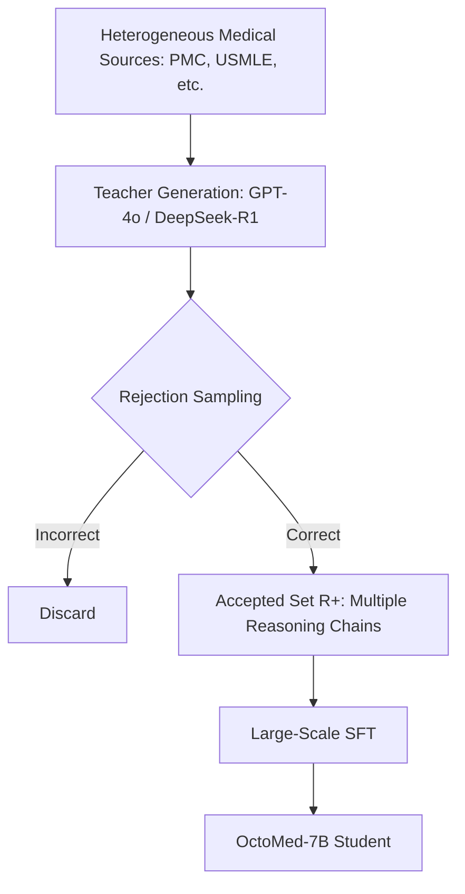

# OctoMed: Data Recipes for State-of-the-Art Multimodal Medical Reasoning

**Conference**: CVPR 2026  
**Paper**: [CVF Open Access](https://openaccess.thecvf.com/content/CVPR2026/html/Ossowski_OctoMed_Data_Recipes_for_State-of-the-Art_Multimodal_Medical_Reasoning_CVPR_2026_paper.html)  
**Code**: https://huggingface.co/OctoMed (Data and Models)  
**Area**: Medical Imaging / Multimodal VLM / LLM Reasoning  
**Keywords**: Data Recipes, Supervised Fine-Tuning, Knowledge Distillation, Rejection Sampling, Multimodal Medical Reasoning

## TL;DR
Instead of relying on new architectures or larger backbones, this work systematically investigates "how to mix training data." By utilizing strong teacher distillation and rejection sampling, the authors filtered 8 million medical samples with structured reasoning chains (6.8 billion tokens). This process fine-tuned a 7B student model (Qwen2.5-VL-7B) into OctoMed, achieving open-source SOTA on multiple out-of-distribution (OOD) medical benchmarks. Notably, the model adaptively adjusts reasoning chain lengths without explicit supervision.

## Background & Motivation
**Background**: The current mainstream approach for training medical reasoning models involves starting with general multimodal large language models (e.g., Qwen2.5-VL) and applying post-training via Supervised Fine-Tuning (SFT) or Reinforcement Learning (RL) to enable step-by-step reasoning. Most work focuses on new training objectives, architectural changes, or larger datasets.

**Limitations of Prior Work**: Medical reasoning differs fundamentally from open-domain reasoning—it requires integrating high-risk heterogeneous information across radiology, pathology, lab values, and clinical notes while maintaining reliability under severe distribution shifts. When training data mixtures are narrow or imbalanced, models easily overfit or collapse on OOD samples. However, the design of the "training data recipe" itself has been least studied.

**Key Challenge**: Recent research indicates that most current RL paradigms merely refine behaviors already acquired during the SFT stage rather than introducing fundamentally new reasoning patterns. This implies that **data sets the upper limit**: the extent of a model's reasoning capabilities is primarily shaped by the questions, modalities, and reasoning chain mixtures encountered during SFT, not the subsequent RL objectives.

**Goal**: Answer a data-centric question—what "recipe" (structuring, balancing, and scaling multimodal reasoning data) most effectively enhances medical reasoning? Specifically: how to select knowledge sources, whether to use CoT or direct answer formats, whether to apply difficulty filtering, how many reasoning chains to retain per question, and which teacher model to use.

**Key Insight**: Treat the data recipe as a first-class citizen through controlled variable experiments, ablate each component, and scale the optimal recipe to 8 million samples. The authors bet that a "high-quality, diverse mixture with varying reasoning chain lengths" leads to better generalization and self-calibration.

**Core Idea**: Replace "architecture/RL/epoch stacking" with a data recipe consisting of "Teacher Distillation + Rejection Sampling to filter incorrect chains + Multiple Diverse Reasoning Chains per problem + Multi-source Multimodal Mixture" to achieve SOTA medical reasoning in small models.

## Method

### Overall Architecture
OctoMed follows the classic SFT route of distilling from a strong teacher to a small student, focusing entirely on data. Formally, given a supervised dataset $D=\{(x_i, y_i)\}_{i=1}^N$ (where $x_i$ is a clinical question/image prompt and $y_i$ is the correct answer), a strong teacher $T$ (DeepSeek-R1 for text, GPT-4o for multimodal) generates intermediate reasoning steps $r_i = (r_i^{(1)}, \dots, r_i^{(T_i)})$ and a final answer $\hat{y}_i$.

The core is **rejection sampling**: a scoring function $S(x_i, r_i, y_i, \hat{y}_i)$ determines if the teacher's answer is correct. For multiple-choice questions, this is a binary check:

$$S(x_i, r_i, y_i, \hat{y}_i) = \begin{cases} 1, & \hat{y}_i = y_i \\ 0, & \text{otherwise} \end{cases}$$

Only correct chains are kept in the acceptance set $R^+ = \{(x_i, y_i, r_i)\mid S=1\}$, which is then used to fine-tune the student $\sigma$. This ensures both the reasoning process is sound and the conclusion is correct—a hard requirement in safety-critical medical scenarios.

### Key Designs

**1. Multi-source mixture is superior to single source: Complementary knowledge for stable generalization**

Medical tasks span three major knowledge sources: pure text (USMLE-style), multimodal reasoning (MMMU-PRO, MedXpertQA), and multimodal classification (Aptos, BCSS, Brain MRI). The authors found that training on a single source makes the model strong in that category but poor at generalizing; mixing multiple sources allows the student to integrate knowledge, resulting in **improved overall performance** due to complementary knowledge.

**2. CoT for reasoning, Direct for perception: Format selection by task type**

The authors compared CoT (Chain-of-Thought) prompts and Direct prompts. On the same 100k subset, CoT significantly outperformed Direct on reasoning-intensive tasks (Multimodal Reasoning: 38.15 vs. 23.08), while Direct was slightly better for simple perception/classification (Classification: 65.46 vs. 63.33). Classification tasks behave more like one-step perception where forced reasoning can introduce noise. Accordingly, the SFT phase adopts CoT for interpretability.

**3. Multiple chains per question + Rejection Sampling: Diversity as regularization**

To scale samples with limited data, the authors sampled the teacher 16 times per question and compared retaining 1, 4, or 16 valid chains. Two findings emerged: in early stages, "adding an extra chain" and "training an extra epoch" had similar effects. However, **peak performance** scales monotonically with the number of chains—from 75.16 with 1 chain to 85.01 with 16 chains in MedQA (a nearly 10% gain). Diverse reasoning paths act as regularization, enhancing generalization.

**4. Reasoning teachers outperform instruction teachers; filtering is optional**

Compared to GPT-4o (instruction-following, multimodal), DeepSeek-R1 (reasoning-oriented, detailed text explanations) provided larger gains in both in-domain and OOD text tasks. Consequently, reasoning-oriented models are preferred as medical knowledge teachers. Notably, difficulty filtering only improved early sample efficiency; the final peak performance converged with the unfiltered baseline. Thus, **no filtering** was used to maximize data coverage, leaving quality control to rejection sampling.

### Loss & Training
Full-parameter fine-tuning of Qwen2.5-VL-7B-Instruct was conducted on 8 million reasoning chains for 3 epochs. Hyperparameters: learning rate 5e-5, effective batch size 512, cosine schedule with 0.1 linear warmup. The framework used was llamafactory, and inference was handled via vllm (supporting up to 10 images of 262,144 pixels each). Classification tasks used stratified sampling to balance categories.

## Key Experimental Results

### Main Results
Dataset scale: 8,095,571 total samples (3,687,105 Vision-Language + 4,408,466 Text-only).

| Task Category | Metric/Benchmark | OctoMed-7B | Qwen2.5-VL-7B | MedGemma-27B | GPT-4o | DeepSeek-R1 |
|----------|-----------|------------|---------------|--------------|--------|-------------|
| Pure Text | MedQA | **90.81** | 57.99 | 85.17 | 90.72 | 93.16 |
| Pure Text | Overall | **67.83** | 48.10 | 66.56 | 72.77 | 76.05 |
| Multimodal Reas. | Overall | **50.36** | 37.19 | 44.25 | 58.07 | — |
| Multimodal Class.| Brain Tumor | **80.86** | 27.82 | 58.33 | 65.99 | — |

OctoMed-7B leads among similarly sized open-source models and outperforms the 4x larger MedGemma-27B across all categories. It even surpasses its teacher GPT-4o in multimodal classification (67.29 vs. 53.96).

### Ablation Study

| Dimension | Configuration | Results | Conclusion |
|----------|------|----------|------|
| Prompt Format | CoT vs. Direct (MM Reasoning) | 38.15 vs. 23.08 | Use CoT for reasoning |
| Prompt Format | CoT vs. Direct (MM Classify) | 63.33 vs. 65.46 | Direct is better for perception |
| Chain Count | 1 vs. 16 chains (MedQA Peak) | 75.16 → 85.01 | Diversity boosts peak performance |
| Filtering | Filter vs. No Filter | Converged peaks | Maximize coverage |
| Teacher Model | GPT-4o vs. DeepSeek-R1 (Text) | R1 outperformed | Reasoning teachers are stronger |

### Key Findings
- **Chain diversity is the highest leverage**: Adding diverse chains (1 to 16) provides a nearly 10% peak performance gain, making it the most critical recipe component.
- **Format is task-dependent**: CoT is not a silver bullet; direct prompting remains more accurate for one-step perceptual tasks like classification.
- **Emergent Task-Aware Reasoning**: OctoMed spontaneously generates longer, more detailed reasoning chains for harder/OOD tasks, providing an interpretable signal of task difficulty.

## Highlights & Insights
- **The science of "Data Recipes"**: By systematically ablating knowledge sources, formats, chains, and teachers, the authors provide a "cookbook" for medical multimodal SFT that is more methodologically valuable than just a large dataset.
- **Small models can beat large models**: The 7B OctoMed surpassing GPT-4o in classification and MedGemma-27B overall demonstrates that "scaling high-quality reasoning chains" can compensate for fewer parameters.
- **Diverse Reasoning = Implicit Regularization**: Providing multiple valid paths to the same conclusion teaches the model "legal paths" rather than rote memorization, acting as data augmentation for distillation.

## Limitations & Future Work
- The recipe relies heavily on "verifiable multiple-choice questions," where the scoring function reduces to binary values. Reliable rejection sampling for open-ended generation remains to be validated.
- The work focuses on SFT without RL. While RL is seen as refining SFT behavior, its potential for sample efficiency (when combined with filtering) was not explored.
- The "Task-Aware Reasoning" is an observed emergent phenomenon, but the underlying mechanism for its stability lacks a formal theoretical explanation.

## Related Work & Insights
- **vs. LLaVA-Med / HuatuoGPT-Vision**: While prior works focused on distilling from biomedical image-text pairs (e.g., PubMedVision), OctoMed focuses on the "mixture recipe" and scales to the largest medical reasoning dataset to date (8M).
- **vs. MedGemma / MedVLThinker**: These models stack RL on top of SFT. OctoMed demonstrates that Pure SFT with an optimized recipe can achieve SOTA, placing "data" rather than "objective functions" at the center.
- **vs. Honeybee / FineVision**: These investigate general-domain VL recipes; OctoMed adapts these principles specifically for the modality balancing and reasoning difficulty unique to medicine.

## Rating
- Novelty: ⭐⭐⭐⭐ Systematic ablation of recipes rather than architecture; solid perspective.
- Experimental Thoroughness: ⭐⭐⭐⭐⭐ 5D ablation, 8M scale, 24 benchmarks, comprehensive comparisons.
- Writing Quality: ⭐⭐⭐⭐ Clear logic with takeaways for each experiment.
- Value: ⭐⭐⭐⭐⭐ Open-source data and models with a reproducible recipe; highly practical for medical LLM post-training.

<!-- RELATED:START -->

<!-- RELATED:END -->

## Related Papers

- [\[CVPR 2026\] MedTVT-R1: A Multimodal LLM Empowering Medical Reasoning and Diagnosis](medtvt-r1_a_multimodal_llm_empowering_medical_reasoning_and_diagnosis.md)
- [\[CVPR 2026\] MultiModalPFN: Extending Prior-Data Fitted Networks for Multimodal Tabular Learning](multimodalpfn_extending_prior-data_fitted_networks_for_multimodal_tabular_learni.md)
- [\[CVPR 2026\] GeoSemba: Reconstructing State Space Model for Cross Paradigm Representation in Medical Image Segmentation](geosemba_reconstructing_state_space_model_for_cross_paradigm_representation_in_m.md)
- [\[CVPR 2026\] Cross-Modal Guided Visual Synthesis for Data-Efficient Multimodal Depression Recognition](cross-modal_guided_visual_synthesis_for_data-efficient_multimodal_depression_rec.md)
- [\[CVPR 2026\] Clinically-Grounded Counterfactual Reasoning for Medical Video Diagnosis](clinically-grounded_counterfactual_reasoning_for_medical_video_diagnosis.md)

<!-- RELATED:END -->
