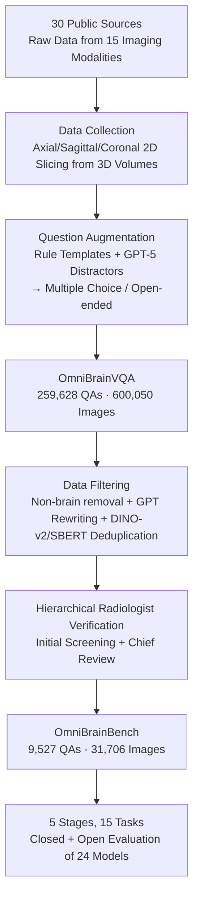

# OmniBrainBench: A Comprehensive Multimodal Benchmark for Brain Imaging Analysis Across Multi-stage Clinical Tasks

**Conference**: CVPR 2026  
**Paper**: [CVF Open Access](https://openaccess.thecvf.com/content/CVPR2026/html/Peng_OmniBrainBench_A_Comprehensive_Multimodal_Benchmark_for_Brain_Imaging_Analysis_Across_CVPR_2026_paper.html)  
**Code**: Released (The paper states release of benchmark and code)  
**Area**: Medical Imaging / Multimodal VLM / Benchmark  
**Keywords**: Brain Imaging, Multimodal VQA, Clinical Workflow, Benchmarking, MLLM Evaluation

## TL;DR
OmniBrainBench is the first multimodal VQA benchmark covering the complete clinical workflow of brain imaging analysis. It collects 15 imaging modalities from 30 validated data sources and constructs 9,527 radiologist-verified QA pairs (31,706 images). The benchmark is divided into 15 multi-stage tasks across five major clinical phases: "Anatomical Assessment → Lesion Localization → Diagnostic Reasoning → Prognostic Judgment → Treatment Management." Evaluating 24 SOTA models reveals that the strongest model, Gemini-2.5-Pro (66.58%), still lags significantly behind physicians (91.35%).

## Background & Motivation
**Background**: Brain imaging analysis is the cornerstone of modern diagnostic decision-making (visualizing structural/functional abnormalities, detecting early lesions, and longitudinal monitoring of neurological diseases). Traditionally, it relies heavily on subjective physician experience, which can lead to variability and delays. Multimodal Large Language Models (MLLMs) have shown potential in natural image perception, contextual understanding, and cross-modal reasoning, leading to expectations for their use in assisting brain imaging analysis. To deploy these models, a specialized benchmark is needed to align with multi-stage clinical workflows and evaluate MLLM understanding.

**Limitations of Prior Work**: Existing brain imaging benchmarks suffer from two major flaws. First is **narrow modality coverage**: most focus on limited modalities, failing to cover the common spectrum of structural/functional/molecular neuroimaging—for instance, Brain Tumor VQA only includes structural MRI, missing fMRI, diffusion, and PET; NOVA includes only anatomical MRI without nuclear medicine. Real-world clinical practice relies heavily on modality diversity, such as using non-contrast CT to rule out hemorrhage in stroke, followed by DWI/SWI/FLAIR to delineate damaged tissue. Second is **fragmented task coverage**: a complete clinical workflow spans from anatomical recognition to lesion localization, treatment planning, and prognostic evaluation, whereas existing benchmarks cover only small segments, such as VQA-RAD focusing on basic findings or NOVA favoring localization without prognosis, failing to evaluate end-to-end clinical competence.

**Key Challenge**: There exists a "vision-to-clinical" gap—existing benchmarks neither align with the clinical reality of neuroimaging modalities nor span the complete diagnostic and treatment chain, leading to systematic overestimation or fragmented assessment of MLLMs' actual brain imaging capabilities.

**Goal**: To construct a brain imaging benchmark that simultaneously satisfies "full modality coverage + full clinical stage coverage + rigorous clinical validation + closed and open-ended dual evaluation," and to use it to evaluate 24 mainstream MLLMs to quantify their gap with physicians and locate weaknesses in specific stages.

**Key Insight**: Structuring the benchmark to directly align with the five stages of a real clinical workflow, ensuring each task corresponds to questions physicians actually answer ("What is found? Where? What disease? What next? How to treat?"), thereby enabling accurate diagnosis of which link in the workflow the model fails.

**Core Idea**: Using "clinical workflow" as the backbone to organize modalities and tasks. First, a large-scale instruction set, OmniBrainVQA, containing 590,000 images and 260,000 QAs was built from 30 sources. This was then distilled through multiple rounds of radiologist review into OmniBrainBench, containing 9,527 high-quality evaluation pairs.

## Method

### Overall Architecture
OmniBrainBench is an evaluation benchmark rather than a model. Its core contribution is a rigorous "data construction pipeline" and a "multi-stage clinical-aligned evaluation system." The pipeline consists of three steps: **data collection** (30 public brain imaging sources, 15 modalities), **question augmentation** (rule-based templates + GPT generation of five-option questions) resulting in OmniBrainVQA with 259,628 QAs and 600,050 images, and finally **data filtering** (removing non-brain content + GPT rewriting + embedding deduplication + clinical verification) distilling 9,527 evaluation pairs and 31,706 images for OmniBrainBench. The evaluation performs closed (accuracy) and open-ended (ROUGE/BLEU/BERTScore + LLM-as-a-judge) assessments of 24 models across 15 sub-tasks under five clinical stages, using physician performance as a reference.

### Key Designs

**1. Clinical Workflow Aligned 5-Stage 15-Task System: End-to-End Diagnostic Chain**

To address "fragmented task coverage," OmniBrainBench aligns tasks strictly with the clinical decision chain: "Anatomical and Imaging Assessment (AIA) → Lesion Identification and Localization (LIL) → Diagnostic Synthesis and Causal Reasoning (DSCR) → Prognostic Judgment and Risk Factoring (PJRF) → Treatment Cycle Management (TCM)." Each stage includes specific sub-tasks, totaling 15: AIA includes Anatomical Structure Identification (ASI), Imaging Modality Identification (IMI), and Anatomical Function Understanding (AFU), answering "What do we see?"; LIL includes Abnormality Screening (AS), Lesion Feature Description (LFD), and Lesion Localization (LL), answering "Where is the abnormality and what does it look like?"; DSCR includes Disease Diagnostic Reasoning (DDR) and Pathological Mechanism Correlation (PMC), answering "What is the disease and why did it happen?"; PJRF includes Risk Stratification (RS), Prognostic Factor Analysis (PFA), Clinical Sign Prediction (CSP), and Drug Response Prediction (DRP), answering "What happens next?"; TCM includes Preoperative Assessment (PA), Treatment Plan Selection (TPS), and Postoperative Outcome Assessment (POA), forming a "decision-execution-evaluation" loop. This allows for pinpointing model weaknesses at specific stages.

**2. Full Modality Coverage + Anti-leakage Slice Sampling: Aligned with Neuroimaging Clinical Reality**

Addressing "narrow modality coverage," the benchmark includes 15 modalities with coarse/fine-grained hierarchical relationships: coarse-grained includes CT, MRI, PET, SPECT, Anatomical Diagrams (ADiag), and Histopathology (HI); fine-grained includes DWI, SWI, FLAIR, T1W, T1CE, T2W, MRA, PD, and fMRI (e.g., MRI is the parent of T1W/T2W/FLAIR/DWI/fMRI). Modalities are grouped into five categories based on clinical utility (structural, pathology-sensitive, functional/molecular, connectivity/metabolic, and multi-modal/sequential). For 3D raw volumes, the authors consulted radiologists to select 2D slices along axial/sagittal/coronal planes, **deliberately disrupting pixel-level retrieval relationships to mitigate data leakage**; NEJMIC, Radiopaedia, and StrokQD were specifically used as open-ended VQA sources (including expert reasoning).

**3. Rule + GPT Dual-Path Question Augmentation and Multi-level Deduplication: Quality and Memory Leakage Resistance**

To convert collected raw data into evaluation items, two augmentation paths were used: for disease/modality-specific samples, metadata was extracted from clinical documents to generate questions and options via standard templates (Rule path); for samples with multi-granular text descriptions, the GPT-5 API was used to create **plausible distractors**, forming five-option questions where all options appear reasonable to a professional (GPT path). Even if images are public, VQA pairs are **rewritten** via structured prompting to prevent MLLMs from retrieving answers from memory. Subsequently, Sentence Transformers (text) and DINO-v2 (images) were used for embedding, with K-center clustering selecting representative samples to ensure diversity and reduce redundancy.

**4. Hierarchical Radiologist Verification: Filtering Out "Visual Guessing"**

To ensure clinical accuracy, a hierarchical manual verification workflow was introduced during distillation: first, three junior physicians performed initial screening (removing low-quality images, ambiguous questions, and non-brain content), followed by random spot checks by a chief radiologist with over 13 years of experience. This ensured medical correctness and **strictly eliminated purely linguistic biases**, preventing models from guessing correctly without looking at the images. This step refined the 260,000 OmniBrainVQA samples into 9,527 trustworthy evaluation pairs.

## Key Experimental Results

### Benchmark Scale Comparison

| Benchmark | Images | QA Pairs | Modalities | Tasks | Open-ended |
|-----------|--------|----------|------------|-------|------------|
| Brain Tumor VQA | 750 | 14,015 | 1 | 3 | No |
| NOVA | 906 | 281 | 1 | 4 | Yes |
| PMC-VQA* | 10,799 | 12,591 | 12 | 7 | No |
| PubMedVision* | 34,929 | 53,554 | 3 | 2 | No |
| OmniBrainVQA (Instruction) | 600,050 | 259,628 | 15 | 15 | Yes |
| **OmniBrainBench (Eval)** | **31,706** | **9,527** | **15** | **15** | **Yes** |

(* denotes general benchmarks containing brain imaging; only the brain subsets are comparable.) Closed evaluation includes 6,823 multiple-choice items, and open-ended includes 2,704 free descriptions.

### Main Results for 24 Models (Closed VQA Overall Accuracy, Selected)

| Model | Type | Overall ACC |
|-------|------|-------------|
| Physician (Reference) | Human | **91.35** |
| Gemini-2.5-Pro | Proprietary | 66.58 |
| HuatuoGPT-V-34B | Domain-specific | 63.56 |
| InternVL3-8B | Open-source Generalist | 53.25 |
| Janus-Pro-7B | Open-source Generalist | 45.11 |
| MedGemma-4B | Domain-specific | 48.04 |
| Llava-Med-7B | Domain-specific | 38.84 |

### Key Findings
- **Enormous Human-AI Gap**: Physicians averaged 91.35%, while the strongest model, Gemini-2.5-Pro, achieved only 66.58%. This 24.77 percentage point gap highlights that brain imaging requires both precise visual interpretation and professional clinical knowledge.
- **Divergent Performance of Domain-Specific Models**: HuatuoGPT-V-34B (63.56%) competed with leading proprietary models (excelling in IMI at 69.55% and RS at 40.84%), but MedGemma-4B (48.04%) and Llava-Med-7B (38.84%) were significantly lower, suggesting in-domain fine-tuning must balance generalization with task adaptation.
- **Tasks Expose Visual-Clinical Gap**: All MLLMs generally underperformed in complex preoperative reasoning (PA in the TCM stage), reflecting a disconnect between "seeing" and "clinical decision-making"; model variance was higher in open-ended VQA.
- **Natural Long-tail Distribution**: In the evaluation set, CT (20.22%), MRI (18.11%), and DWI (14.03%) dominate. Sub-tasks like DRP (10 items) and RS (9 items) have very few samples—conclusions for these sub-tasks should be viewed with caution (⚠️ refer to the original paper for small-sample sub-tasks).

## Highlights & Insights
- **Clinical Workflow as Backbone**: Mapping evaluation tasks to the diagnostic chain ("What/Where/What is it/What next/How to treat") is the most ingenious design of this paper—it makes model failure at specific clinical links measurable rather than providing just a total score.
- **Robust Leakage Prevention**: Using 2D slices from 3D data to disrupt pixel retrieval + GPT rewriting of VQA pairs + embedding deduplication collectively lowers the risk of models "answering by memory" rather than "understanding." This approach is transferable to any benchmark based on public images.
- **True Physician Baseline**: Having radiologists answer questions using the **exact same 2D slices and text** provides a credible upper bound. The 91.35% vs 66.58% gap is highly impactful.
- **Dual Outputs**: The release of the 260,000-scale OmniBrainVQA instruction set serves as both a training resource and a larger evaluation pool, providing significant spillover value.

## Limitations & Future Work
- The evaluation primarily relies on 2D slices from 3D volumes, losing continuous spatial information across slices/3D space found in real clinical practice, which may underestimate or distort performance on tasks relying on volumetric structures.
- Sub-task sample distribution is highly imbalanced (DRP only 10, RS only 9, POA only 20); statistical noise in accuracy for these specific stages is high, and cross-model comparisons should be interpreted with care—⚠️ refer to the original paper.
- Distractors and some question surfaces were generated by GPT-5; although verified by physicians, they may still introduce LLM style bias or slight deviations from authentic clinical phrasing.
- The evaluation is limited to VQA and does not involve joint reasoning across multiple images or longitudinal sequences (only patient-level extensions are supplemented in the appendix), leaving a gap between the benchmark and complete clinical decision-making.

## Related Work & Insights
- **vs Brain Tumor VQA / NOVA**: These are limited to structural MRI or anatomical MRI localization and cover only small segments of the diagnostic chain. OmniBrainBench expands modalities to 15 and tasks across five clinical stages, representing a generational upgrade in breadth.
- **vs VQA-RAD / Slake / PMC-VQA**: In these general medical VQA benchmarks, brain imaging is a small subset and focuses on basic findings. This work focuses exclusively on neuroimaging, emphasizing end-to-end clinical reasoning and open-ended evaluation.
- **vs MedTrinity-25M / PubMedVision**: While they provide large-scale multimodal instruction data, they are not tailored for neuroimaging. OmniBrainVQA/OmniBrainBench provides both a large-scale instruction set and a finely verified evaluation set for brain imaging specifically.
- **vs MedSegBench / BraTS (Segmentation Suites)**: The latter focuses on pixel-level perception. This work focuses on end-to-end neuro-clinical reasoning from perception to diagnosis, prognosis, and treatment, targeting a higher level of evaluation.

## Rating
- Novelty: ⭐⭐⭐⭐ First full clinical workflow + full modality brain imaging benchmark; structural design is creative, though individual techniques (VQA augmentation/deduplication) are relatively standard.
- Experimental Thoroughness: ⭐⭐⭐⭐⭐ Evaluated 24 models with physician references, closed+open dual evaluation, and 15 sub-tasks across 5 stages; highly comprehensive assessment.
- Writing Quality: ⭐⭐⭐⭐ Clinical workflow mapping is well-explained; high information density in tables, though many sub-task abbreviations require cross-referencing.
- Value: ⭐⭐⭐⭐⭐ Public benchmark and code, quantification of the human-AI gap, and identification of model weaknesses across clinical stages provide standard-setting value for medical MLLM evaluation.

<!-- RELATED:START -->

## Related Papers

- [\[CVPR 2026\] Gastric-X: A Multimodal Multi-Phase Benchmark Dataset for Advancing Vision-Language Models in Gastric Cancer Analysis](gastric-x_a_multimodal_multi-phase_benchmark_dataset_for_advancing_vision-langua.md)
- [\[CVPR 2026\] X-PCR: A Benchmark for Cross-modality Progressive Clinical Reasoning in Ophthalmic Diagnosis](x-pcr_a_benchmark_for_cross-modality_progressive_clinical_reasoning_in_ophthalmi.md)
- [\[NeurIPS 2025\] EndoBench: A Comprehensive Evaluation of Multi-Modal Large Language Models for Endoscopy Analysis](../../NeurIPS2025/medical_imaging/endobench_a_comprehensive_evaluation_of_multi-modal_large_language_models_for_en.md)
- [\[CVPR 2026\] Med-CMR: A Fine-Grained Benchmark Integrating Visual Evidence and Clinical Logic for Medical Complex Multimodal Reasoning](med-cmr_a_fine-grained_benchmark_integrating_visual_evidence_and_clinical_logic_.md)
- [\[NeurIPS 2025\] 3D-RAD: A Comprehensive 3D Radiology Med-VQA Dataset with Multi-Temporal Analysis and Diverse Diagnostic Tasks](../../NeurIPS2025/medical_imaging/3drad_a_comprehensive_3d_radiology_medvqa_dataset_with_multi.md)

<!-- RELATED:END -->
