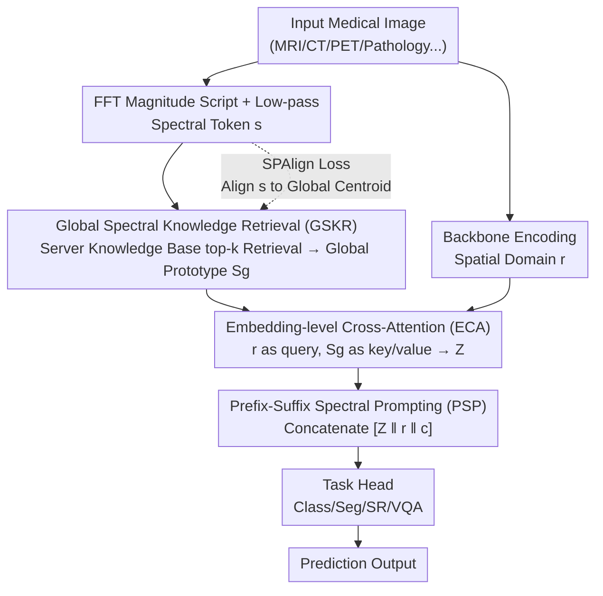

# OmniFM: Toward Modality-Robust and Task-Agnostic Federated Learning for Heterogeneous Medical Imaging

**Conference**: CVPR 2026  
**arXiv**: [2603.21660](https://arxiv.org/abs/2603.21660)  
**Code**: None  
**Area**: Medical Imaging / Federated Learning  
**Keywords**: Federated Learning, Modality Heterogeneity, Frequency Domain Analysis, Medical Imaging, Task-Agnostic

## TL;DR

OmniFM is proposed as a modality-robust and task-agnostic federated learning framework. Through three complementary components—Global Spectral Knowledge Retrieval (GSKR), Embedding-level Cross-Attention (ECA) fusion, and Prefix-Suffix Spectral Prompting (PSP)—it supports five medical imaging tasks (classification, segmentation, super-resolution, VQA, and multi-modal fusion) under a unified FL pipeline, significantly outperforming existing baselines in cross-modality heterogeneous scenarios.

## Background & Motivation

1.  **Background**: Federated Learning (FL) has become the mainstream paradigm for collaborative medical imaging training across institutions, enabling joint model training without sharing raw data. Existing FL methods are primarily designed for specific tasks (e.g., CNNs for classification, U-Nets for segmentation) and assume homogeneous imaging modalities.

2.  **Limitations of Prior Work**: (1) **Task-Binding**: Tasks like classification, segmentation, and VQA each require customized FL pipelines, necessitating re-engineering and optimization when switching tasks; (2) **Modality Fragility**: Different imaging modalities used across hospitals (MRI, CT, PET, pathology, etc.) lead to fundamental differences in local model loss landscapes. During aggregation, the global model is pulled toward contradictory local minima, causing slow convergence and oscillation.

3.  **Key Challenge**: Current FL frameworks deeply couple federated optimization design with model architectures/task types. This results in a "one pipeline per task" status quo, which entails high engineering costs and difficulty for deployment in real-world multi-modal scenarios.

4.  **Goal**: (1) Can a unified FL pipeline be constructed that is reusable across different tasks? (2) Can stable optimization behavior be maintained when tasks are fixed but modalities are heterogeneous?

5.  **Key Insight**: Frequency Domain Insights—low-frequency spectral components of different modalities exhibit strong cross-modal consistency, encoding modality-invariant anatomical structures. Utilizing this can bridge representation gaps between modalities.

6.  **Core Idea**: Use frequency domain spectral embeddings as cross-modality anchors. Inject modality-invariant knowledge into local representations through a global retrieval-fusion-prompting mechanism to achieve "single pipeline cross-task + cross-modality" federated learning.

## Method

### Overall Architecture

Each client in OmniFM extracts two types of representations: spatial domain representations $\mathbf{r} \in \mathbb{R}^{L \times d}$ via a backbone, and frequency domain spectral embeddings $\mathbf{s}$ via FFT. Spectral embeddings are uploaded to a server-side global knowledge base for top-k retrieval. The retrieved global spectral prototypes $\mathbf{S}_g$ are first fused with the local representation $\mathbf{r}$ via Embedding-level Cross-Attention (ECA) to obtain $\mathbf{Z}$. Then, Prefix-Suffix Spectral Prompting (PSP) concatenates these into an augmented sequence $[\mathbf{Z}\|\mathbf{r}\|\mathbf{c}]$ fed into task heads for prediction. This mechanism acts only on the embedding layer without modifying backbones, allowing the same pipeline to handle classification, segmentation, super-resolution, and VQA. The Spectral-Proximal Alignment (SPAlign) loss aligns local spectra with global prototypes to suppress modality-induced drift at the optimization level.

### Key Designs

**1. Global Spectral Knowledge Retrieval (GSKR): Finding common anchors in low-frequency spectra**

The root of modality heterogeneity lies in the vast differences in texture statistics between MRI, CT, and PET. Direct aggregation in the spatial domain pulls the global model toward contradictory minima. The authors' entry point is that low-frequency components of the magnitude spectrum encode coarse-grained anatomical structures, which have much higher cross-modality consistency than high-frequency textures. Clients perform FFT on inputs, apply low-pass filtering to remove modality-specific details, and use a spectral tokenization module (FreqMix + Projection + Pooling) to compress it into a normalized spectral token $\mathbf{s}$. The server maintains a global knowledge base $\mathcal{K}^{(r)}$. After clients upload $\mathbf{s}$, the server retrieves top-k global spectral prototypes $\mathbf{S}_g$ based on cosine similarity. The knowledge base is pruned by retrieval frequency to remain compact and balanced across modalities. This step effectively builds a cross-client shared "anatomical structure dictionary."

**2. Embedding-level Cross-Attention (ECA): Injecting global priors without modifying backbones**

$\mathbf{S}_g$ represents global knowledge, but it must be fused with the backbone's spatial representation $\mathbf{r}$ to affect local predictions. The authors intentionally place fusion in the embedding space rather than changing the backbone structure—this is the key to being "task-agnostic." The same mechanism can be attached to a ResNet for classification, a U-Net for segmentation, or an encoder for VQA. Standard cross-attention is used with $\mathbf{r}$ as query and $\mathbf{S}_g$ as key/value:

$$\mathbf{Z} = \text{Softmax}\!\left(\frac{\mathbf{Q}\mathbf{K}^\top}{\sqrt{d_h}}\right)\mathbf{V}$$

The output $\mathbf{Z}$ is a local token modulated by global low-frequency priors, naturally biasing toward modality-invariant anatomical features. Since it only operates on the representation layer, the entire fusion logic is reused when switching tasks.

**3. Prefix-Suffix Spectral Prompting (PSP): Balancing global consensus and local specialization**

FL must always balance "global consensus" and "local personalization." PSP uses both ends of the token sequence to address these goals—concatenating the fused spectral token $\mathbf{Z}$ as a prefix and a client-specific learnable CLS token $\mathbf{c}$ as a suffix:

$$\mathbf{r}' = [\,\mathbf{Z}\,\|\,\mathbf{r}\,\|\,\mathbf{c}\,]$$

The prefix carries global shared modality-invariant structures, pulling local features toward cross-client consistency. The suffix is a private parameter that is not aggregated, specialized for absorbing local distribution shifts. This sandwich structure maintains federated consensus while allowing local adaptation within the same sequence.

### Loss & Training

The total loss is: $\min_{\phi,\psi} \mathcal{L}_\text{task}(h_\psi([\mathbf{Z}\|\mathbf{r}\|\mathbf{c}]), y) + \lambda \mathcal{L}_\text{align}$

Where the **Spectral-Proximal Alignment (SPAlign)** loss $\mathcal{L}_\text{align} = \|\mathbf{s} - \bar{\mathbf{s}}_g\|_2^2$ forces local spectral embeddings toward the retrieved global prototype centroids, suppressing optimization drift in the frequency domain while retaining spatial flexibility.

## Key Experimental Results

### Main Results

Cross-modality classification (MedMNIST-v2, Scenario 1 Hard, ResNet-18 backbone):

| Method | Acc@20% | Acc@100% | F1@100% |
| :--- | :--- | :--- | :--- |
| FedAvg | 56.31 | 84.21 | 0.474 |
| FedPer | 84.47 | 92.57 | 0.665 |
| **Ours (OmniFM)** | **96.85** | **97.82** | **0.668** |

Super-Resolution (BreaKHis, ×2 scale, average PSNR):

| Method | Scenario 1 | Scenario 2 |
| :--- | :--- | :--- |
| FedAvg | 35.95 | 41.50 |
| FedPer | 39.52 | 40.87 |
| **Ours (OmniFM)** | **42.21** | **42.30** |

### Ablation Study

VQA Task 1 performance under different fine-tuning strategies:

| Configuration | F-C (IID) | F-CL (Non-IID) |
| :--- | :--- | :--- |
| FedAvg | 0.783 | 0.827 |
| FedPer | 0.799 | 0.833 |
| **Ours (OmniFM)** | **0.812** | **0.831** |

### Key Findings

-   Ours (OmniFM) achieves the best or second-best results across all tasks (Classification/Segmentation/SR/VQA) and all heterogeneous scenarios.
-   In cross-modality classification, OmniFM reaches 96.85% accuracy with only 20% participation, whereas FedAvg achieves only 56.31%, a gap of over 40 percentage points.
-   In super-resolution tasks, OmniFM maintains an advantage even at the difficult ×8 scale (30.02 vs. 29.36 PSNR).
-   In cross-modality VQA Task 2, the average performance across 8 completely heterogeneous modality clients was 79.27%, exceeding FedPer's 78.40%.

## Highlights & Insights

-   **Frequency Domain Invariance Insight**: The observation of cross-modality consistency in low-frequency spectra is simple yet powerful, providing an elegant theoretical basis for handling modality heterogeneity in FL. This insight is transferable to other cross-domain/cross-modal learning scenarios.
-   **True "One Pipeline, Multi-Task"**: A single federated optimization workflow supporting five tasks is very rare in the FL field.
-   **Retrieval-Augmented Federated Learning**: The idea of a global spectral knowledge base + top-k retrieval is similar to RAG but applied to the frequency domain of FL, representing a clever cross-disciplinary innovation.

## Limitations & Future Work

-   While spectral embedding uploads are lightweight, the potential for privacy leakage (spectra might contain recoverable patient information) needs further investigation.
-   The number of clients in experiments was relatively small (3-8); performance in large-scale federated scenarios (50+ clients) has not been verified.
-   The knowledge base pruning strategy (by retrieval frequency) might prematurely delete spectral prototypes of rare modalities.
-   Comparison with recent foundation model federated fine-tuning methods (e.g., FedPETuning) is absent.

## Related Work & Insights

-   **vs. FedPer**: FedPer achieves partial adaptation via personalized layers but does not handle modality heterogeneity; OmniFM fundamentally mitigates modality differences via frequency domain alignment.
-   **vs. FedProx**: FedProx’s proximal constraints operate in the spatial domain and have limited effect on modality heterogeneity; OmniFM’s SPAlign applies constraints in the frequency domain, more accurately decoupling modality-specific and modality-invariant components.
-   The idea of frequency domain priors + FL could inspire cross-institutional medical imaging pre-training.

## Rating

-   Novelty: ⭐⭐⭐⭐ Solving modality heterogeneity from a frequency domain perspective is a novel entry point, though sub-modules (Cross-Attention, prefix/suffix) are relatively standard.
-   Experimental Thoroughness: ⭐⭐⭐⭐ Covers five tasks and multiple heterogeneous scenarios, but lacks large-scale client experiments and privacy analysis.
-   Writing Quality: ⭐⭐⭐⭐ The framework description is clear and the diagrams are informative, though some formulas could be more concise.
-   Value: ⭐⭐⭐⭐ Significant practical value for federated medical image analysis; the concept of a unified pipeline has engineering merit.

<!-- RELATED:START -->

## Related Papers

- [\[CVPR 2026\] MedGRPO: Multi-Task Reinforcement Learning for Heterogeneous Medical Video Understanding](medgrpo_multi-task_reinforcement_learning_for_heterogeneous_medical_video_unders.md)
- [\[CVPR 2026\] TopoCL: Topological Contrastive Learning for Medical Imaging](topocl_topological_contrastive_learning_for_medical_imaging.md)
- [\[CVPR 2026\] Personalized Longitudinal Medical Report Generation via Temporally-Aware Federated Adaptation](personalized_longitudinal_medical_report_generation_via_temporally-aware_federat.md)
- [\[CVPR 2026\] CG-Reasoner: Centroid-Guided Positional Reasoning Segmentation for Medical Imaging with a Robust Visual-Text Consistency Metric](cg-reasoner_centroid-guided_positional_reasoning_segmentation_for_medical_imagin.md)
- [\[CVPR 2026\] FedVG: Gradient-Guided Aggregation for Enhanced Federated Learning](fedvg_gradient-guided_aggregation_for_enhanced_federated_learning.md)

<!-- RELATED:END -->
