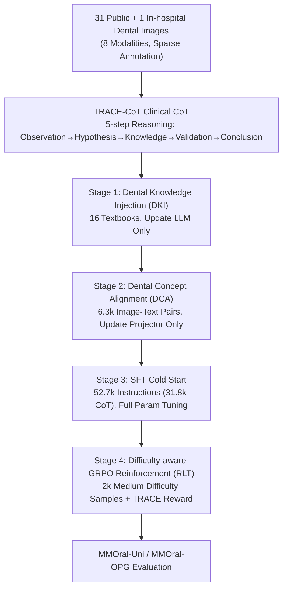

# OralGPT-Omni: A Versatile Dental Multimodal Large Language Model

**Conference**: CVPR 2026  
**Paper**: [CVF Open Access](https://openaccess.thecvf.com/content/CVPR2026/html/Hao_OralGPT-Omni_A_Versatile_Dental_Multimodal_Large_Language_Model_CVPR_2026_paper.html)  
**Code**: To be open-sourced (the paper states code/benchmark/models will be public)  
**Area**: Medical Imaging / Multimodal VLM  
**Keywords**: Dental MLLM, Clinical Chain-of-Thought, Four-stage Training, Unified Benchmark, GRPO

## TL;DR
OralGPT-Omni is the first dental-specific multimodal large language model. By constructing TRACE-CoT data that mimics the diagnostic workflow of radiologists and employing a four-stage progressive training regimen, it achieved a score of 51.84 on the MMOral-Uni unified benchmark (covering five modalities and five tasks), significantly outperforming GPT-5's 15.42.

## Background & Motivation
**Background**: Multimodal Large Language Models (MLLMs) have shown potential in medical subfields such as dermatology, ophthalmology, chest radiography, pathology, and pediatrics, but the dental field remains largely unexplored.

**Limitations of Prior Work**: Recent studies indicate that general and medical MLLMs lack consistency, completeness, and clarity in dental scenarios, often generating hallucinations that prevent real-world clinical application. Three factors contribute to this: highly heterogeneous dental imaging modalities (intraoral photos, panoramic radiographs, periapical films, lateral cephalometric radiographs, pathology images, 3D scans, intraoral videos, and interleaved data), the complexity of clinical diagnostic workflows, and the lack of interpretability and reliability in model responses.

**Key Challenge**: Progress is further hindered by data bottlenecks. Dental images are scarce and of varying quality due to strict privacy, limited data sharing, and expensive expert annotations. Simultaneously, medical scenarios demand "interpretability"—doctors and patients need to know the reasoning process, not just the conclusion—which is often overlooked in existing research.

**Goal**: To develop a dental-specific MLLM capable of robust analysis across multiple modalities and tasks, providing clinician-like reasoning chains when identifying abnormalities.

**Key Insight**: The authors argue that dental MLLMs require three components: diverse dental imaging data, reasoning supervision that replicates clinical thinking, and a progressive training paradigm. A key observation is that black-box predictions are untrustworthy in healthcare; explicit clinical reasoning chains can enhance transparency and, in turn, diagnostic accuracy.

**Core Idea**: Inject dental expert diagnostic reasoning into a Qwen2.5-VL-7B backbone using "TRACE-CoT clinical chain-of-thought data + four-stage training," and release the first unified dental multimodal benchmark, MMOral-Uni, for systematic evaluation.

## Method

### Overall Architecture
OralGPT-Omni uses Qwen2.5-VL-7B-Instruct as its backbone. The pipeline consists of two main parts: the **Data side** aggregates multimodal images from 31 public datasets + 1 Hong Kong dental hospital, and transcribes sparse annotations into TRACE-CoT five-step reasoning chains (for abnormality diagnosis); the **Training side** progressively builds capabilities through four stages: "Dental Knowledge → Visual Alignment → Instruction + Reasoning → Reinforced Reasoning." Evaluation is performed on the MMOral-Uni and MMOral-OPG benchmarks.

### Key Designs

**1. TRACE-CoT: Explicitly Formalizing Radiologists' Diagnostic Process into Five Steps**

Dental diagnosis lacks interpretability, and existing methods for chain generation are insufficient: pure CoT prompting relies on the backbone's inherent reasoning, while manual expert annotation is difficult to scale. The authors propose TRACE-CoT (Transparent Radiologic Analysis with Clinical Evidence), decomposing a radiologist's decision-making into five steps: (1) Image Observation (describing significant structures and abnormalities), (2) Hypothesis Generation (proposing potential lesions based on observations), (3) Medical Knowledge Reference (consulting clinical guidelines/Wikipedia for typical radiographic signs), (4) Feature Validation (comparing observed features against knowledge standards to identify and resolve contradictions), and (5) Evidence Summarization and Conclusion. To construct the chains, GPT-5-mini first generates visual descriptions, using sparse annotations as initial hypotheses, then retrieves characteristic imaging patterns, and finally organizes them into full five-step chains via GPT-5-mini. A total of 36,777 chains were generated. Two dentists evaluated 300 samples across seven dimensions, confirming high quality and reliability. This explicit reasoning improves transparency, and ablation studies prove it directly boosts diagnostic accuracy.

**2. Four-stage Progressive Training: Layering Capabilities from Knowledge to Reinforcement**

Dental adaptation cannot be solved by a single SFT phase. The authors implement a "foundation first, fine-tuning second" sequence. Stage 1: **Dental Knowledge Injection (DKI)**: Trained for 1 epoch on 16 dental textbooks (~3.21M tokens), **updating only the language model** to embed basic dental knowledge. Stage 2: **Dental Concept Alignment (DCA)**: Trained for 1 epoch on 6,318 image-text pairs extracted from textbooks, **updating only the vision-language projector** to align dental concepts with visual representations. Stage 3: **SFT Cold Start**: **Full-parameter fine-tuning** for 2 epochs on 52,725 high-quality instructions (including 31,777 CoT pairs), covering 8 modalities to strengthen instruction following, multimodal understanding, and explicit reasoning. Stage 4 involves reinforcement (see Design 3). Notably, only the first stage is unimodal.

**3. Difficulty-aware GRPO Reinforcement + TRACE Reward: Triggering Reasoning on "Medium Difficulty" Samples**

The final stage uses the GRPO framework for Reinforcement Learning from feedback (RLT), featuring two core components. First, **Difficulty-aware Data Selection**: For each instruction, $N=5$ rollouts are performed using the "SFT model without TRACE-CoT," resulting in a score set $\mathcal{S}=\{S_1,\dots,S_N\}$. Only samples satisfying $0.2 \le \mathcal{S}_{avg} \le 0.8$ and $\max(\mathcal{S})-\min(\mathcal{S}) \ge 0.4$ are retained (selecting 2,000 medium-difficulty samples from 5,000)—as trivial or overly difficult samples provide limited learning signals. Using the "non-CoT model" to gauge difficulty aims to stimulate the TRACE-CoT reasoning pattern during RLT on these specific samples. Second, the **TRACE Reward** $\mathcal{R}_{trace}$: An LLM judge (GPT-5-nano) scores outputs based on factual reliability, logical coherence, and answer consistency. The total reward is:

$$\mathcal{R}_{total} = \alpha\cdot\mathcal{R}_{answer} + \beta\cdot\mathbb{I}_{\mathcal{R}_{answer}>0}\cdot\mathcal{R}_{trace} + \gamma\cdot\mathcal{R}_{format},\quad \alpha+\beta+\gamma=1.$$

The indicator function $\mathbb{I}$ ensures that if the answer is completely wrong, $\mathcal{R}_{trace}$ is nullified, preventing the model from being rewarded for "wrong answers with plausible reasoning" and forcing consistency between reasoning and the correct result.

**4. MMOral-Uni: The First Unified Dental Benchmark Covering Five Modalities and Five Tasks**

Previous dental evaluation relied primarily on MMOral-OPG (panoramic only), which lacks systematicity. The authors constructed MMOral-Uni, containing 2,809 open-ended Q&A pairs across five modalities (intraoral, periapical, lateral cephalometric, pathology, and intraoral video, plus interleaved inputs) and five tasks (abnormality diagnosis, Cervical Vertebral Maturation (CVM) staging, treatment planning, tooth localization/counting, and dental procedure video understanding). Images were sourced from public datasets rated as "low risk of applicability" by systematic reviews. Answers were transcribed by GPT-5-mini from sparse labels and verified/revised by two senior dentists. Evaluation uses GPT-5-mini for few-shot open-ended scoring (0-1 per sample) and is integrated into the VLMEvalKit framework.

### Loss & Training
The four-stage training updates different parameters progressively (DKI: LLM only; DCA: Projector only; SFT: Full; RLT: GRPO). The first three stages used LLaMA-Factory, while the RLT stage used ms-swift. Training took approximately 90 hours on 2×A100 80G. In the RLT stage, 6 candidate rationales were generated per sample with a sampling temperature of $\tau=0.8$.

## Key Experimental Results

### Main Results
Comparing 27 representative MLLMs (7 closed-source APIs, 12 general open-source, 8 medical-specific) on MMOral-Uni, OralGPT-Omni achieved an overall score of 51.84, far exceeding GPT-5's 15.42 and medical-specific models.

| Model | Category | Overall |
|------|------|---------|
| GPT-5 | Closed-source | 15.42 ⚠️ |
| o3 | Closed-source | — |
| Qwen2.5-VL-7B | Open-source Backbone | 22.88 |
| Lingshu-7B | Medical-specific | 27.08 |
| MedGemma-27B | Medical-specific | 21.56 |
| **OralGPT-Omni** | **Ours** | **51.84** |

> ⚠️ Based on OCR text, the 15.42 overall score for GPT-5 comes from the main text comparison, despite higher specific modality scores in Table 1 (e.g., II 44.60, IV 40.52). External factors or weighting might explain this discrepancy; **refer to the original paper**. OralGPT-Omni's per-modality scores: II 66.80 / PA 56.60 / CE 39.99 / PI 48.11 / TP 65.90 / IV 56.01. It performed slightly worse than closed-source models on "Treatment Planning," which the authors attribute to TP data comprising only 0.006% of the training set and the task's heavy reliance on specialized surgical knowledge.

OralGPT-Omni also scored 45.31 on the MMOral-OPG (panoramic) benchmark, surpassing GPT-5.

### Ablation Study
Ablation of the four-stage training and TRACE-CoT (MMOral-Uni Overall):

| Configuration | Overall | Description |
|------|---------|------|
| Baseline (Qwen2.5-VL-7B) | 22.88 | Backbone |
| + Stage 1 DKI | 23.66 | Knowledge injection, slight gain |
| + Stage 2 DCA | 24.00 | Concept alignment, slight gain |
| + Stage 3 SFT | 48.67 | Instruction+CoT full-param tuning, **Qualitative shift** |
| + Stage 4 RLT | **51.84** | GRPO reinforcement, +3.17 |
| SFT w/o TRACE-CoT | 44.31 | Answer only, no reasoning chain |
| SFT w/ TRACE-CoT | 48.67 | With reasoning chain, **+4.36** |

### Key Findings
- The SFT stage provided the largest contribution, moving the total score from 24.00 to 48.67; the first two stages (DKI/DCA) provided only moderate gains (22.88→24.00).
- TRACE-CoT reasoning data provided a net gain of +4.36 in the SFT stage, primarily in modalities with CoT labels (II-Dx-I, II-Dx-R, PI), confirming that explicit reasoning directly improves diagnostic accuracy.
- The RLT stage added +3.17, indicating that the reinforcement phase successfully stimulated stronger reasoning in medium-difficulty samples.
- A radiologist with 10+ years of experience evaluated three leading MLLMs, ranking OralGPT-Omni highest in accuracy and potential clinical utility.

## Highlights & Insights
- **Engineering Clinical Thought into a Five-step Chain**: TRACE-CoT strictly aligns with the radiology diagnostic workflow (observation→hypothesis→knowledge→validation→conclusion). This provides interpretability and, as proven by ablation, performance gains—strong evidence of "interpretability feeding back into performance" in medical MLLMs.
- **Clever Difficulty-aware Data Selection**: Using an intermediate "non-CoT" model to filter samples (retaining $0.2 \sim 0.8$ score range with high variance) focuses the reinforcement budget on teachable yet challenging samples. This approach is highly transferable to any GRPO/RLT scenario.
- **Reward Indicator Function**: The $\mathbb{I}_{\mathcal{R}_{answer}>0}$ term ensures reasoning rewards only apply when the answer is at least partially correct, mechanically preventing reward hacking where a model provides "flashy reasoning for a wrong answer."
- **Benchmark Contribution**: MMOral-Uni expands the field from a single panoramic radiograph benchmark to five modalities and five tasks, integrated into VLMEvalKit to lower the barrier for future research.

## Limitations & Future Work
- **Treatment Planning Deficiency**: Due to the scarcity of data (0.006%), OralGPT-Omni underperforms compared to closed-source models in treatment planning. Expanding surgical and post-operative knowledge is a priority.
- **Heavy Reliance on GPT-series for Data and Evaluation**: TRACE-CoT is generated by GPT-5-mini, rewards are scored by GPT-5-nano, and evaluation uses GPT-5-mini as a judge. This dependence may introduce systematic bias, despite dental verification.
- **Uneven CoT Supervision**: TRACE-CoT only covers abnormality diagnosis for three modalities. Tasks like CVM staging, video understanding, and tooth counting lack explicit reasoning supervision.
- The backbone is fixed at 7B; the effects of larger backbones or different visual encoders on fine-grained dental signs were not explored.

## Related Work & Insights
- **vs. General/Medical MLLMs (GPT-5, Lingshu-7B, MedGemma, etc.)**: These models lack deep domain modeling and modality specialization for dentistry, showing poor consistency and hallucinations. This work injects specific knowledge through dental corpora, four-stage training, and clinical CoT.
- **vs. Pure CoT Prompting / Pure Manual Annotation**: The former depends on inherent reasoning, while the latter is hard to scale. TRACE-CoT balances both via GPT generation, clinical knowledge retrieval, and dentist verification.
- **vs. MMOral-OPG Only**: MMOral-Uni fills the gap in systematic multimodal dental evaluation.

## Rating
- Novelty: ⭐⭐⭐⭐ First dental MLLM + clinical CoT + unified benchmark. Solid combination, though core techniques (GRPO, CoT distillation) are domain transfers of existing paradigms.
- Experimental Thoroughness: ⭐⭐⭐⭐⭐ Comprehensive comparison with 27 models, two benchmarks, stage-wise ablation, CoT ablation, and human expert evaluation.
- Writing Quality: ⭐⭐⭐⭐ Logical flow across motivation, data, training, and benchmarks is clear.
- Value: ⭐⭐⭐⭐⭐ Commitment to open-sourcing data, benchmarks, and models provides direct value to digital dentistry and medical MLLM research.

<!-- RELATED:START -->

## Related Papers

- [\[CVPR 2026\] MedMO: Grounding and Understanding Multimodal Large Language Model for Medical Images](medmo_grounding_and_understanding_multimodal_large_language_model_for_medical_im.md)
- [\[CVPR 2026\] MLLM-HWSI: A Multimodal Large Language Model for Hierarchical Whole Slide Image Understanding](mllm-hwsi_a_multimodal_large_language_model_for_hierarchical_whole_slide_image_u.md)
- [\[CVPR 2026\] LLaDA-MedV: Exploring Large Language Diffusion Models for Biomedical Image Understanding](llada-medv_exploring_large_language_diffusion_models_for_biomedical_image_unders.md)
- [\[CVPR 2026\] LEMON: A Large Endoscopic MONocular Dataset and Foundation Model for Perception in Surgical Settings](lemon_a_large_endoscopic_monocular_dataset_and_foundation_model_for_perception_in.md)
- [\[CVPR 2026\] fMRI-LM: Towards a Universal Foundation Model for Language-Aligned fMRI Understanding](fmri-lm_towards_a_universal_foundation_model_for_language-aligned_fmri_understan.md)

<!-- RELATED:END -->
