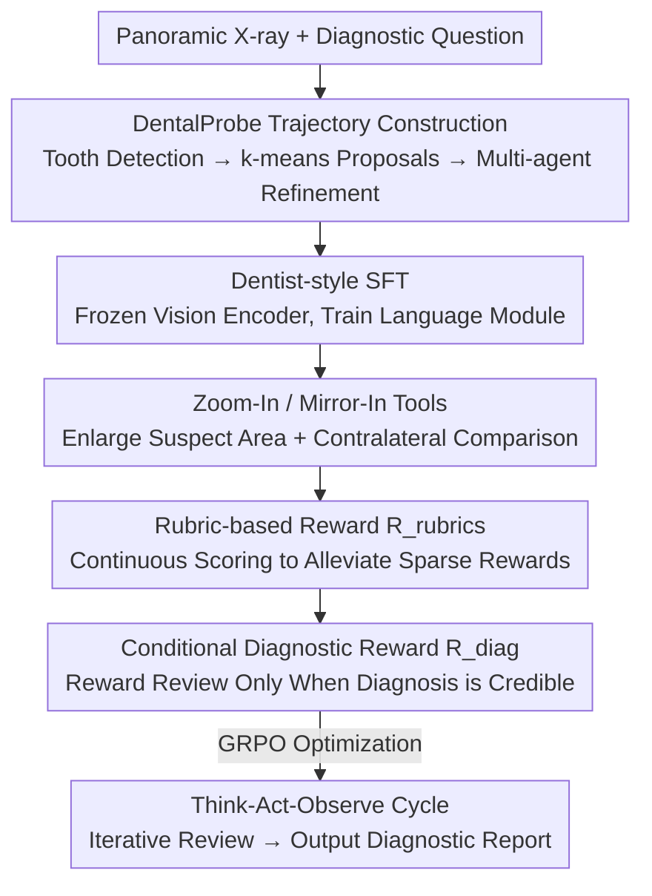

# OralGPT-Plus: Learning to Use Visual Tools via Reinforcement Learning for Panoramic X-ray Analysis

**Conference**: CVPR 2026  
**Paper**: [CVF Open Access](https://openaccess.thecvf.com/content/CVPR2026/html/Fan_OralGPT-Plus_Learning_to_Use_Visual_Tools_via_Reinforcement_Learning_for_CVPR_2026_paper.html)  
**Code**: https://github.com/isbrycee/OralGPT  
**Area**: Medical Imaging / Multimodal VLM / Agent  
**Keywords**: Panoramic X-ray, Agentic VLM, Visual Tools, Reinforcement Learning, Symmetry Reasoning

## TL;DR
OralGPT-Plus transforms dental panoramic X-ray diagnosis from a "single-forward" VLM into an agent capable of autonomously invoking "Zoom-In" and "Mirror-In" tools for iterative review like a dentist. Powered by expert trajectory instruction tuning and review-driven reinforcement learning, it consistently outperforms strong baselines such as GPT-5 on the self-constructed MMOral-X benchmark.

## Background & Motivation

**Background**: Panoramic Radiographs (OPG) are fundamental imaging tools for oral diagnosis, covering teeth, alveolar bone, and surrounding structures in a single view. Existing automation follows two paths: traditional object detectors (e.g., YOLO, DETR) that output only categories, boxes, and confidence; and Vision-Language Models (VLM, such as LLaVA, Qwen2.5-VL) which offer stronger semantic expression but follow a **single-forward** paradigm—generating answers after a single glance at the image.

**Limitations of Prior Work**: Detectors provide boxes without diagnostic reasoning; single-forward VLMs cannot revisit blurred areas or capture subtle lesions. In clinical practice, given the high resolution of OPGs, dentists repeatedly enlarge suspicious areas and **compare them against the contralateral tooth in the opposite quadrant** (leveraging dental symmetry) to determine if subtle shadows are genuine lesions (e.g., caries, apical periodontitis). These clinical behaviors are structurally impossible for the single-forward paradigm.

**Key Challenge**: Reliable diagnosis requires a multi-step interactive reasoning process involving "iterative review + symmetrical comparison." However, the static single-pass nature of current VLMs limits their clinical reliability.

**Goal**: (1) Equip VLMs with diagnostic tools that mimic dentists (focused enlargement, contralateral mirroring); (2) enable the model to learn **when** to review and **how** to use tools; (3) achieve stable, long-range reasoning in complex multi-lesion scenarios.

**Key Insight**: Mimic the "Think-Act-Observe" diagnostic cycle of a human dentist. Since models like Qwen2.5-VL do not spontaneously learn tool invocation through simple prompt engineering due to a lack of tool-interaction data in pre-training, they must be explicitly taught via expert trajectories and refined through RL.

**Core Idea**: Transform dental symmetry from an implicit prior into an explicit "Mirror-In" tool action. Combined with "Zoom-In," this replaces the single-forward pass with an agentic VLM's "Think-Act-Observe" cycle. A review-driven hybrid reward is designed to encourage reinforcement learning to trigger reviews only when a diagnosis is credible but potentially incomplete.

## Method

### Overall Architecture
OralGPT-Plus is an agentic VLM that iterates through diagnosis via a "Think $T_i$ → Act $A_i$ → Observe $O_i$" loop. At each step, the policy produces a thought and selects an action (Zoom-In / Mirror-In / Finalize). The environment executes the image action and returns a new view. The history $H_i = H_{i-1}\cup\{T_i,A_i,O_i\}$ accumulates until a "Finalize" command is issued or $K$ steps are reached, at which point the final report $y^* = \pi_{\text{answer}}(q, I_0, H_K)$ is generated. Training comprises two stages: "dentist-style instruction tuning" using DentalProbe expert trajectories to teach basic tool behaviors, followed by "review-driven reinforcement learning" (utilizing rubric-based continuous rewards and conditional diagnostic incentives unified by a hybrid reward system) to stabilize long-range optimization.

### Key Designs

**1. Dental-Aware Tool Design: Converting oral symmetry into an explicit Mirror-In action**

Previous agentic VLMs primarily relied on "Zoom-In" to enlarge suspicious areas, but panoramic X-rays possess strong anatomical symmetry. Clinical dentists utilize contralateral comparison to verify if subtle shadows are pathological. This work introduces the **Mirror-In** tool: once the model identifies a potential lesion, the tool retrieves the horizontal mirror of the contralateral corresponding area, creating a "original + mirror" dual-view pair for comparative reasoning. Formally, for an image $I(x,y)$ of width $W$ and a selected region $[x_1,x_2]\times[y_1,y_2]$, the symmetry view is defined as $I_{\text{mirror}}(x,y) = I(W-x, y)$. Implementation includes 1.5× padding to account for slight misalignments. This embeds clinical comparative habits into the reasoning loop, allowing low-contrast anomalies to be verified against contralateral references.

**2. DentalProbe Expert Trajectory Construction: Creating "dentist-style" supervision data**

The lack of tool-interaction data in pre-training prevents VLMs from learning tool usage spontaneously. The authors integrated 4 public panoramic datasets (covering 50+ pathologies) with 2,500 curated images from MMOral-OPG and 2,562 self-collected images to build the 5k-image DentalProbe. Trajectory construction is multi-stage: first, a tooth detection model localizes teeth and aligns them with lesion labels (categorized as obvious, subtle, or bony). For subtle and bony cases, k-means clustering on tooth-level boxes generates region proposals for focused inspection. Multi-round trajectories are then generated based on explicit rules (global inspection followed by focused views). Quality is refined via a multi-agent module: a judge agent decides if tool invocation is appropriate, and a visual description agent generates region-level summaries for each view. Finally, expert dentists perform sampling evaluations. Full-parameter SFT is applied to the language module with a frozen vision encoder, targeting $L_{\text{SFT}} = -\sum_{t=1}^{T}\log\pi_\theta(y^*_t\mid x, I, y^*_{<t})$.

**3. Review-Driven Reinforcement Learning: Solving sparse rewards and tool abuse**

Post-SFT, models may use tools but struggle with reliability. Standard binary $\{0,1\}$ rewards are unsuitable for clinical OPG diagnosis because dispersed multiple lesions cause sparse signals. Three components are designed: **(a) Rubric-based Reward $R_{\text{rubrics}}$**—a few-shot scorer (GPT-5-mini) provides a continuous score $R_{\text{rubrics}}(\tau)\in[0,1]$ based on clinical significance and accuracy, providing dense gradients for partially correct diagnoses. **(b) Conditional Diagnostic Reward $R_{\text{diag}}$**—inspired by the fact that dentists only perform extra reviews when an initial finding is credible but incomplete, exploration is incentivized only when confidence is high: $R_{\text{diag}}(\tau) = \mathbb{I}\big(R_{\text{rubrics}}(\tau)>\eta\big)\cdot\alpha\cdot(H - C_u(x))_+ \cdot \mathbb{1}_{\text{tool}}(\tau)$, where curiosity decays as exploration saturates. **(c) Hybrid Reward System** unifies these: $R(\tau) = R_{\text{rubrics}}(\tau) + R_{\text{format}}(\tau) + R_{\text{diag}}(\tau)$, optimizing for accuracy, formatting, and exploration efficiency via GRPO.

### Mechanism Example
For a specific X-ray: The first round performs a global scan and identifies a suspicious low-contrast shadow in a quadrant → The policy selects "Zoom-In" to inspect the area → Uncertainty remains, triggering "Mirror-In" to retrieve the mirrored view of the contralateral tooth for comparison → The lesion (e.g., caries) is confirmed → Given high confidence, conditional rewards encourage a subsequent review of a bony finding → Finally, a "Finalize" command is issued to output a structured diagnostic report.

## Key Experimental Results

### Main Results
Evaluated on MMOral-X (300 open Q&A across Simple/Moderate/Complex difficulties) and MMOral-OPG. OralGPT-Plus-7B achieved the highest scores:

| Model | Params | MMOral-X Simple | Moderate | Complex | MMOral-OPG Overall |
|------|------|------|------|------|------|
| GPT-5 (Closed-source) | N/A | 32.90 | 8.30 | 9.30 | 42.34 |
| Claude-sonnet-4-5 | N/A | 27.72 | 8.14 | 9.78 | 37.68 |
| MedDr (Medical-specific) | 40B | 6.14 | 4.26 | 3.08 | 26.20 |
| Qwen2.5-VL-7B (Base) | 7B | 7.22 | 4.58 | 3.70 | 15.92 |
| **OralGPT-Plus-7B** | 7B | **43.16** | **20.60** | **24.96** | **45.35** |

Ours-7B significantly outperforms GPT-5, MedDr, and HuatuoGPT-V, particularly in the teeth, pathology, and jaw dimensions of MMOral-OPG.

### Ablation Study
Ablations on MMOral-X:

| Configuration | Simple | Moderate | Complex | Description |
|------|--------|----------|---------|------|
| w/o SFT | 8.02 | 4.64 | 4.98 | Almost no tool use behavior |
| w/o $R_{\text{rubrics}}$ & $R_{\text{cond}}$ | 20.82 | 9.24 | 9.82 | Reverted to binary rewards |
| w/o $R_{\text{rubrics}}$ | 21.48 | 12.08 | 13.42 | Lacks continuous rubric scoring |
| w/o $R_{\text{cond}}$ | 24.62 | 14.14 | 15.96 | Lacks conditional reward → Reward hacking |
| w/o Mirror-In | 34.68 | 14.26 | 14.30 | Removes symmetry tool |
| OralGPT-Plus (Full) | 43.16 | 20.60 | 24.96 | Full model |

### Key Findings
- **Instruction tuning is essential**: Without SFT, even RL cannot activate tool-use behavior (dropping to 8.02), indicating that tool-based reasoning does not emerge spontaneously from rewards alone.
- **Model capacity determines RL Gain**: 7B models show much higher gains from RL than 3B models, suggesting that mastering tool-driven diagnostic workflows requires sufficient capacity.
- **Conditional rewards prevent reward hacking**: Removing $R_{\text{cond}}$ leads to "reward hacking" where the agent invokes tools superficially without actual verification to gain exploration rewards.

## Highlights & Insights
- **Explicit Symmetrization of Tool Actions**: Mirror-In transforms the implicit anatomical prior of dental symmetry into an active, controllable retrieval action. This is more interpretable than hoping the model "implicitly learns" symmetry.
- **Condition-Triggered Curiosity Rewards**: By only rewarding exploration when the initial diagnosis is credible, the model avoids meaningless tool use, effectively embedding the clinical workflow of "confirming then reviewing" into the reward function.
- **Rubric-Based continuous scoring**: Utilizing a few-shot GPT-5-mini as a rubric-based scorer provides dense feedback, which is crucial for medical tasks where "partially correct" is far more valuable than a binary "wrong."

## Limitations & Future Work
- The rubric-based reward system relies on GPT-5-mini as a judge, which introduces potential "LLM-as-a-judge" bias.
- Performance on highly complex panoramic X-rays with multiple ambiguous paths still needs improvement.
- Tool use and RL gains are strongly dependent on model size, limiting deployment for smaller ($<$3B) models.

## Related Work & Insights
- **vs Traditional Detectors**: While YOLO/DETR provide boxes, they lack reasoning; OralGPT-Plus provides interactive diagnosis with explainable steps.
- **vs Single-forward VLMs**: Single-pass models cannot revisit details; ours utilizes a Think-Act-Observe loop for iterative refinement.
- **vs General Agentic VLMs**: Unlike general agents that rely solely on Zoom-In, ours incorporates a domain-specific Mirror-In tool and clinical-style exploration rewards.

## Rating
- Novelty: ⭐⭐⭐⭐ First agentic VLM for dental diagnosis; Mirror-In is a significant domain-specific contribution.
- Experimental Thoroughness: ⭐⭐⭐⭐ Strong baselines and multidimensional ablation, though MMOral-X sample size is modest.
- Writing Quality: ⭐⭐⭐⭐ Clear explanation of reward design and paradigm evolution.
- Value: ⭐⭐⭐⭐ High; establishes a blueprint for embedding clinical workflows into medical agentic VLMs via RL.

<!-- RELATED:START -->

## Related Papers

- [\[CVPR 2026\] MedGRPO: Multi-Task Reinforcement Learning for Heterogeneous Medical Video Understanding](medgrpo_multi-task_reinforcement_learning_for_heterogeneous_medical_video_unders.md)
- [\[CVPR 2026\] OraPO: Oracle-educated Reinforcement Learning for Data-efficient and Factual Radiology Report Generation](orapo_oracle-educated_reinforcement_learning_for_data-efficient_and_factual_radi.md)
- [\[NeurIPS 2025\] FairGRPO: Fair Reinforcement Learning for Equitable Clinical Reasoning](../../NeurIPS2025/medical_imaging/fairgrpo_fair_reinforcement_learning_for_equitable_clinical_reasoning.md)
- [\[CVPR 2026\] Focus-to-Perceive Representation Learning: A Cognition-Inspired Hierarchical Framework for Endoscopic Video Analysis](focus-to-perceive_representation_learning_a_cognition-inspired_hierarchical_fram.md)
- [\[CVPR 2026\] OralGPT-Omni: A Versatile Dental Multimodal Large Language Model](oralgpt-omni_a_versatile_dental_multimodal_large_language_model.md)

<!-- RELATED:END -->
