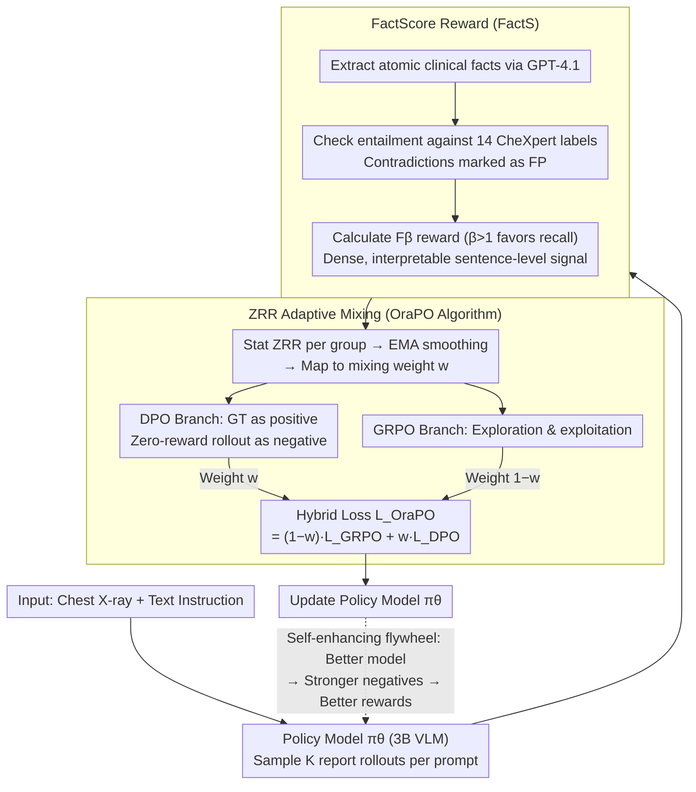

# OraPO: Oracle-educated Reinforcement Learning for Data-efficient and Factual Radiology Report Generation

**Conference**: CVPR2026  
**arXiv**: [2509.18600](https://arxiv.org/abs/2509.18600)  
**Code**: To be confirmed  
**Area**: Medical Imaging  
**Keywords**: Radiology Report Generation, GRPO, DPO, Reinforcement Learning, Data Efficiency, Clinical Fact Scoring

## TL;DR

Ours proposes OraPO (Oracle-educated GRPO), which injects lightweight DPO supervision to transform failed rollouts into preference pairs when GRPO exploration fails. Combined with FactScore rewards, it achieves SOTA on CheXpert Plus and MIMIC-CXR (F1=0.341/0.357) using only 1K samples and a 3B model, reducing training data by 2-3 orders of magnitude compared to Prev. SOTA.

## Background & Motivation

**Clinical Necessity**: Radiology backlogs are severe, with a 29% shortage of consultants in the UK and approximately 14,000 vacancies in the US against only 1,150 annual graduates. AI-assisted drafting has been proven to reduce report turnaround time by 24%.

**High Cost of Mainstream Methods**: Existing RRG methods rely on multi-stage training (domain pre-training → image-text alignment → task fine-tuning) and large-scale paired corpora (≥223K samples). Some methods utilize models with >13B parameters, demanding substantial GPU budgets.

**Exploration Failure in GRPO**: When applying GRPO to RRG, the base VLM lacks domain knowledge in radiology. In the first 50 steps, approximately 30% of groups generate zero rewards, leading to gradient vanishing and wasted rollouts.

**Suboptimal Existing Solutions**: Methods like resampling until non-zero rewards appear (DAPO) or increasing group size both increase computational costs. Alternating SFT and RL still discards low-quality rollouts.

**Challenges in Reward Design**: Unlike binary verification in mathematics or programming, radiology reports are long-text narratives of multiple facts. Metrics like BLEU/CIDEr only capture surface fluency and fail to penalize sentence-level factual errors and cross-sentence contradictions.

**Data Efficiency Gap**: Prior work focused on optimizing stability rather than data efficiency; the training set size and number of epochs remained largely unchanged.

## Method

### Overall Architecture

OraPO is a single-stage, pure RL radiology report generation framework that eliminates the need for domain pre-training, image-text alignment, or SFT. It addresses two core issues: first, long-text reports cannot be binarily verified like math problems, and BLEU/CIDEr fail to capture factual errors; second, when GRPO is applied to RRG, the base VLM's lack of domain knowledge leads to ~30% zero-reward groups in early stages, resulting in gradient vanishing. Accordingly, OraPO consists of two components: the FactScore reward (FactS), which extracts atomic clinical facts from each report and performs entailment checks against ground-truth labels to provide dense, interpretable sentence-level rewards; and the OraPO algorithm, which uses these rewards to monitor zero-reward rates and dynamically injects DPO supervision when exploration fails. Ground-truth reports are used as positive samples and zero-reward rollouts as negative samples, adaptively mixing GRPO and DPO losses based on the zero-reward rate. This creates a self-enhancing flywheel: better models lead to stronger negative samples and more accurate rewards.

### Key Designs

**1. FactScore Reward (FactS): Anchoring Report Quality to Atomic Clinical Fact Entailment**

Reward design for RRG is difficult because surface fluency metrics rarely penalize sentence-level factual errors. FactS provides clinically relevant rewards in three steps: first, extracting atomic clinical statements $\mathcal{F}(\hat{y}_i)$ using GPT-4.1; second, checking if the fact set entails each of the 14 CheXpert labels (contradictions are marked as false positives); finally, calculating $F_\beta$ as the reward based on per-instance precision/recall. Using $\beta > 1$ weights the reward toward recall, as missed diagnoses are more consequential than false positives in clinical practice. This provides dense, interpretable signals that penalize factual errors rather than disfluency, and provides a reliable signal for monitoring zero-reward rates.

**2. ZRR Adaptive Mixing (OraPO Algorithm): Recycling Failed Rollouts as Free Negative Samples**

When GRPO encounters zero-reward groups, it fails to learn and wastes computation. OraPO recycles these: for each prompt $x_i$, the ratio of zero-reward rollouts $z_i$ among $K$ samples is calculated, smoothed via Exponential Moving Average (EMA, $\alpha=0.5$) to $\tilde{z}_i^{(t)}$, and mapped to a mixing weight:

$$w_i^{(t)} = \text{clip}(w_{\min} + (w_{\max} - w_{\min})[\tilde{z}_i^{(t)}]^\gamma, w_{\min}, w_{\max})$$

where $w_{\min}=0.05$, $w_{\max}=0.15$, and $\gamma=2.0$. The final objective is a weighted sum of GRPO and DPO:

$$\mathcal{L}_{\text{OraPO}} = \frac{1}{B}\sum_{i=1}^{B}[(1 - w_i^{(t)})\mathcal{L}_{\text{GRPO}} + w_i^{(t)}\mathcal{L}_{\text{DPO}}]$$

When ZRR is high, DPO dominates (oracle education to stabilize gradients); when ZRR is low, GRPO dominates (exploration). The novelty lies in using zero-reward rollouts as negative samples and ground-truth reports as positive samples for DPO, requiring zero additional annotation cost and turning failed exploration into supervision.

### Loss & Training

- **GRPO Loss**: Standard clipped PPO ratio + KL regularization, using DR.GRPO to mitigate length bias.
- **DPO Loss**: Standard DPO + LN-DPO to normalize preference margins by sequence length.
- The dynamic mixing via ZRR weights forms a self-enhancing data flywheel: as the model improves, zero-reward rollouts (negative samples) increase in quality, strengthening the reward signal and further improving the model.

## Experimental Results

### Main Results

| Dataset | Method | Precision | Recall | F1 | Training Samples |
|:------|:-----|:---------|:-------|:---|:--------|
| CheXpert Plus | MambaXray-L (CVPR25) | 0.377 | 0.319 | 0.335 | 1.27M |
| CheXpert Plus | **OraPO (Ours)** | **0.237** | **0.832** | **0.341** | **1K** |
| MIMIC-CXR | MambaXray-L (CVPR25) | 0.371 | 0.321 | 0.340 | 1.27M |
| MIMIC-CXR | **OraPO (Ours)** | **0.242** | **0.891** | **0.357** | **1K** |

- Achieved F1 SOTA (0.341) on CheXpert Plus, with Recall Gain of **+160.8%** over Prev. SOTA.
- On MIMIC-CXR, F1=0.357 (Gain: +5.0% vs MambaXray-L) and Recall Gain: +153.8%.
- Used only 1K samples (roughly 1270x reduction vs MambaXray-L's 1.27M).

### Ablation Study

| FactS | GRPO | DPO | Training Vol. | Precision | Recall | F1 |
|:------|:-----|:----|:------|:---------|:-------|:---|
| ✗ | ✗ | ✗ | 0 | 0.097 | 0.104 | 0.034 |
| ✗ | ✓ | ✗ | 1K | 0.026 | 0.162 | 0.089 |
| ✓ | ✓ | ✗ | 1K | 0.204 | 0.605 | 0.291 |
| ✓ | ✓ | ✓ | 400 | 0.217 | 0.732 | 0.296 |
| ✓ | ✓ | ✗ (SFT) | 1K | 0.171 | 0.176 | 0.106 |
| ✓ | ✓ | ✓ | 1K | **0.237** | **0.832** | **0.341** |

### Key Findings

- **FactS is Core**: Adding FactS increased F1 from 0.089 to 0.291 (+227%), indicating standard accuracy rewards are insufficient for RRG.
- **OraPO further improves F1 by 17.2%** over FactS, and OraPO with only 400 samples outperforms FactS-only with 1K samples.
- **SFT replacement of DPO leads to collapse**: GRPO+SFT achieved only 0.176 Recall and 0.106 F1, as SFT learns "how to say things right" but not "how to avoid saying things wrong."
- **Gold Label Validation**: On radiologist-annotated CheXpert validation sets, OraPO outperformed MambaXray-L (F1 0.288 vs 0.280) and GPT-4.1 (F1 0.288 vs 0.253).
- **Inference Efficiency**: The 3B model takes 3.3s/image, compared to 25.2s/image for GPT-5 Thinking.

## Highlights

- **Extreme Data Efficiency**: Surpasses SOTA trained on millions of samples using only 1K, reducing training volume by 2-3 orders of magnitude with just 4×A10 GPUs.
- **First Fusion of GRPO+DPO**: Elegantly recycles failed exploration as preference negatives with near-zero overhead.
- **ZRR Adaptive Mechanism**: Automatically balances oracle education and RL exploration to form a positive feedback loop.
- **FactScore Reward**: Anchors report evaluation to atomic clinical facts, aligning better with clinical significance than BLEU/CIDEr.
- **Recall-Oriented Design**: High sensitivity (0.832/0.891) matches clinical needs where missed diagnoses are more critical than false positives.

## Limitations

- **Lower Precision** (0.237/0.242): High recall comes at the cost of some false positives, necessitating final review by radiologists.
- **FactS Dependency**: Relies on GPT-4.1 for fact extraction and entailment, introducing external API costs and potential instability.
- **Task Scope**: Validated only on chest X-ray RRG; not yet extended to other modalities (CT, MRI) or clinical tasks.
- **Model Scaling**: Experiments limited to 3B models; scaling behavior for larger or smaller models is unexplored.
- **Hyperparameter Tuning**: Hyperparameters like $w_{\min}$/$w_{\max}$ require tuning, and the current search space was narrow.

## Related Work

- **RRG Evolution**: From CNN-RNN/Transformer seq2seq → knowledge-guided generation → multi-stage pre-training → LLM-driven instruction tuning. Common limitation: data/compute intensity.
- **GRPO Variants**: DeepSeekMath (original), DR.GRPO (length bias), DAPO (non-zero reward resampling). None focus specifically on data efficiency.
- **DPO Variants**: SimPO (length normalization), ORPO (reference-free), KTO (unary signal). OraPO uses DPO as an oracle step for GRPO failures.
- **Strongest Baselines**: MambaXray-L (CVPR25, 1.27M samples, F1=0.335/0.340), CheXagent (8.5M samples).

## Rating

- Novelty: ⭐⭐⭐⭐ — The GRPO+DPO fusion is innovative; the ZRR adaptive mixing is simple yet effective.
- Experimental Thoroughness: ⭐⭐⭐⭐ — Two large datasets, 28+ baselines, detailed ablations, gold label validation, and commercial API comparisons.
- Writing Quality: ⭐⭐⭐⭐ — Clear motivation, complete methodology derivation, and deep experimental analysis.
- Value: ⭐⭐⭐⭐⭐ — Extreme data efficiency is highly practical for healthcare; recall-oriented design aligns with clinical utility.

<!-- RELATED:START -->

## Related Papers

- [\[CVPR 2026\] BiOTPrompt: Bidirectional Optimal Transport Guided Prompting for Disease Evolution-aware Radiology Report Generation](biotprompt_bidirectional_optimal_transport_guided_prompting_for_disease_evolutio.md)
- [\[ICLR 2026\] Rethinking Radiology Report Generation: From Narrative Flow to Topic-Guided Findings](../../ICLR2026/medical_imaging/rethinking_radiology_report_generation_from_narrative_flow_to_topic-guided_findi.md)
- [\[CVPR 2026\] TIM: Temporal Decoupling with Iterative Mutual-Refinement Model for Longitudinal Radiology Report Generation](tim_temporal_decoupling_with_iterative_mutual-refinement_model_for_longitudinal_.md)
- [\[CVPR 2026\] SAT-RRG: LLM-Guided Self-Adaptive Training for Radiology Report Generation with Token-Level Push–Pull Optimization](sat-rrg_llm-guided_self-adaptive_training_for_radiology_report_generation_with_t.md)
- [\[ICML 2026\] CAME-Grad: The Double Dilemma in Multi-Task Radiology Report Generation — A Gradient Dynamics Analysis and Solution](../../ICML2026/medical_imaging/the_double_dilemma_in_multi-task_radiology_report_generation_a_gradient_dynamics.md)

<!-- RELATED:END -->
